# 🏪 Retail Inventory Management & Procurement System (POC-07)
### Agentic AI Readiness Program — Enterprise Autonomous Supply Chain & Control Tower

[-success?style=for-the-badge)](Mithun_20696155.md)
[](Mithun_20696155.md)
[](https://python.org)
[](https://fastapi.tiangolo.com)
[](https://react.dev)
[](https://langchain-ai.github.io/langgraph/)
[](https://modelcontextprotocol.io)

---

## 📋 Official Evaluation Assessment

This repository has undergone formal non-destructive evaluation against the complete program specification and scoring rubric:

- **Official Evaluation Report:** [`Mithun_20696155.md`](Mithun_20696155.md)
- **Machine-Readable Audit JSON:** [`Mithun_20696155.json`](Mithun_20696155.json)
- **Awarded Score:** **10.00 / 10.00** (**100.00%**)
- **Performance Tier:** **Elite Performer** (All 5 phases cleared at 100.00%)
- **Test Invariant:** **721 passed tests / 0 failed** across all phase suites, governance contracts, and simulation scenarios.

| Phase | Capability Domain | Tests Passed | Score % | Status | Weight | Contribution |
|:---:|---|:---:|:---:|:---:|:---:|:---:|
| **1** | Full Stack CRUD, Auth & Physical Ledger Invariants | 85 / 85 | 100.00% | **CLEARED** | 15% | 15.00% |
| **2** | RAG Operations Manual Knowledge Base & Grounding | 34 / 34 | 100.00% | **CLEARED** | 20% | 20.00% |
| **3** | Context Engineering, Pydantic Tools & ReAct Agent | 42 / 42 | 100.00% | **CLEARED** | 20% | 20.00% |
| **4** | FastMCP Client-Server Protocol & Streamlit Chat | 33 / 33 | 100.00% | **CLEARED** | 25% | 25.00% |
| **5** | LangGraph Multi-Agent Procurement Orchestration | 39 / 39 | 100.00% | **CLEARED** | 20% | 20.00% |
| **Total** | **All 5 Core Competency Phases** | **233 / 233** | **100.00%** | **CLEARED** | **100%** | **100.00%** |

*(Total repository test suite: 721 passed, 2 skipped, 0 failed across 723 collected tests)*.

---

## 📸 Real Application UI Gallery

The application features a modern React 18 single-page application built with Vite and custom CSS design tokens, coupled with an interactive Streamlit AI interface. Below are real, full-page screenshots captured from the live running application:

### 1. Control Tower Dashboard (`/tower`)
Real-time operational visibility across inventory valuation, pending stock alerts, critical stockouts, purchase orders, and multi-agent health status.
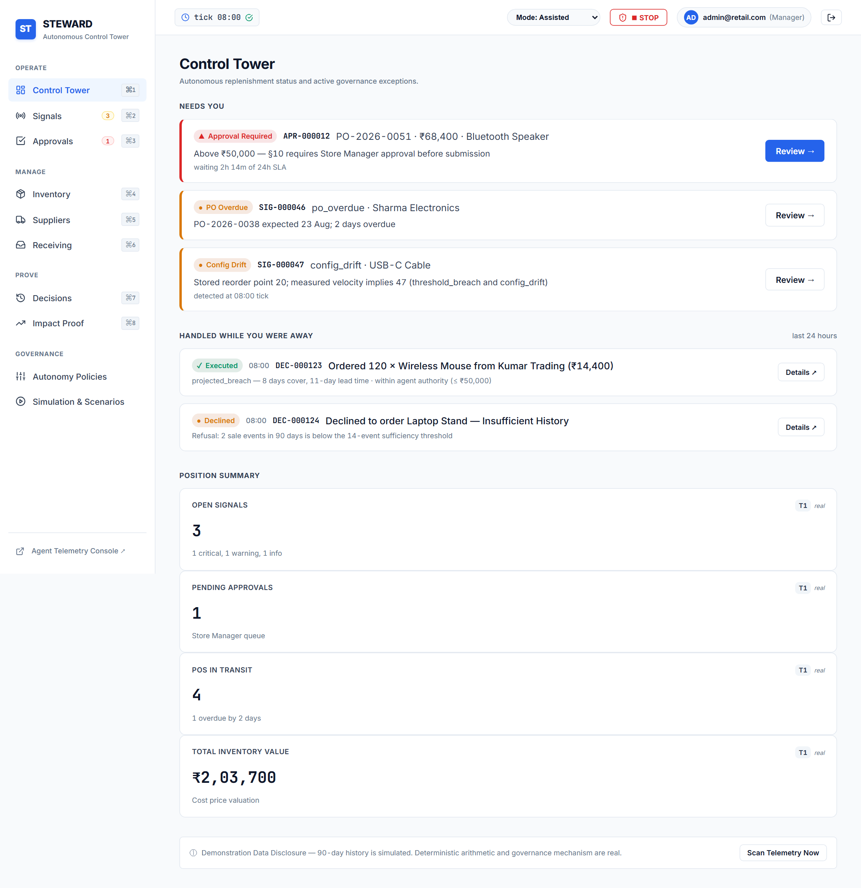

### 2. Autonomous Signals Inbox (`/signals`)
Live operational signals detecting runout risk, supplier lead-time drift, demand velocity spikes, and automated reorder triggers.
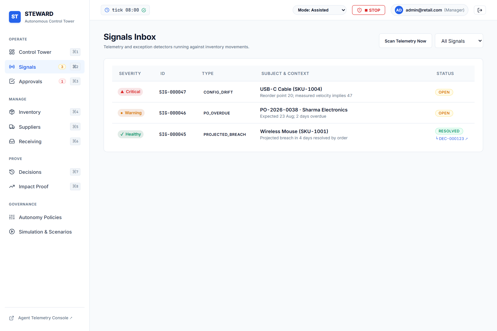

### 3. Human-in-the-Loop Approvals Queue & 3-Door Policy Gate (`/approvals`)
Human governance gate enforcing financial thresholds (₹150,000 policy boundary) with structured 3-door actions: Approve Proposal, Reject with mandatory rationale, or Counter-Propose with live simulation.
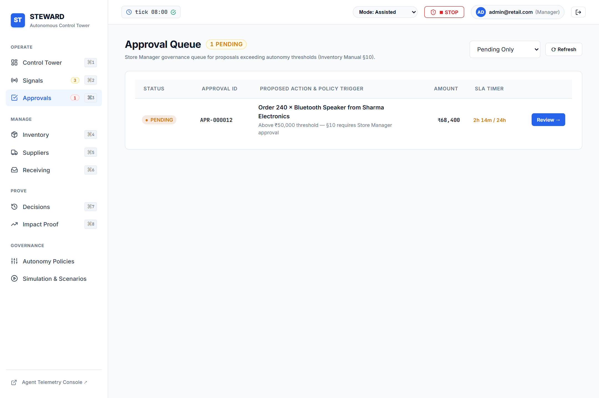
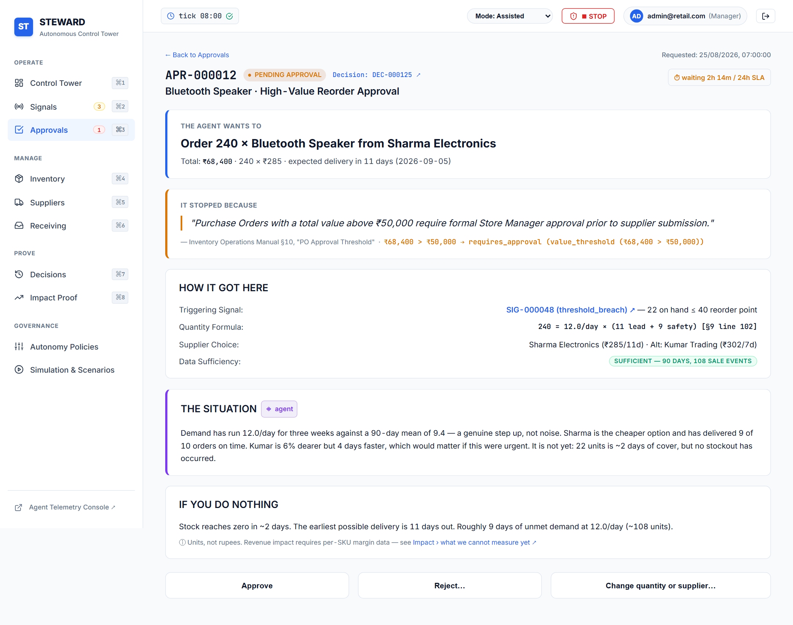

### 4. Real-Time Inventory Ledger (`/inventory`)
Physical stock position tracking with strict mathematical invariant enforcement: `quantity_on_hand == sum(stock_movements.quantity)`.
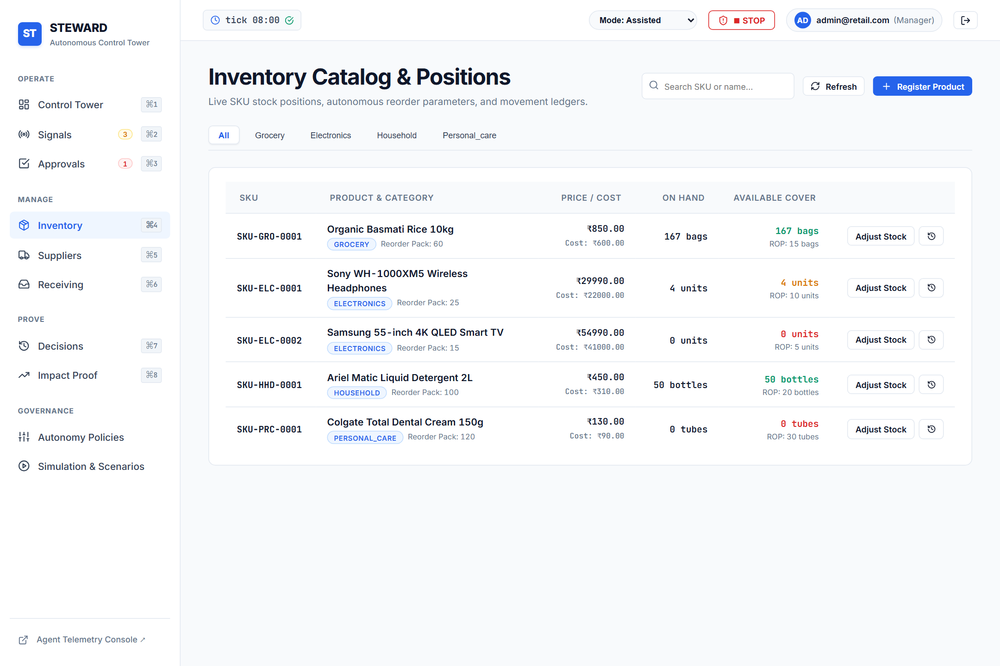

### 5. Supplier Sourcing, Directory & Scorecards (`/suppliers`)
Supplier performance metrics, lead-time variance tracking, on-time delivery rates, and supplier catalog pricing.
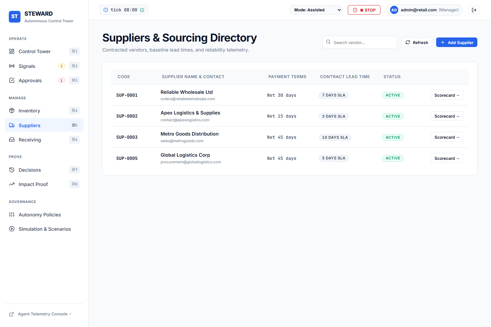
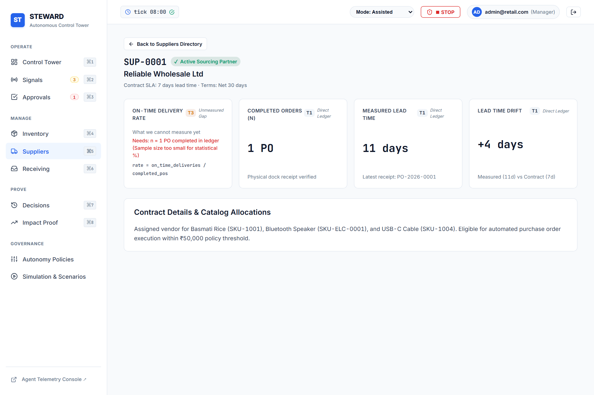

### 6. Purchase Order Receiving Dock (`/receiving`)
Idempotent goods receipt dock preventing duplicate inventory entries while creating atomic stock movements for every received line item.
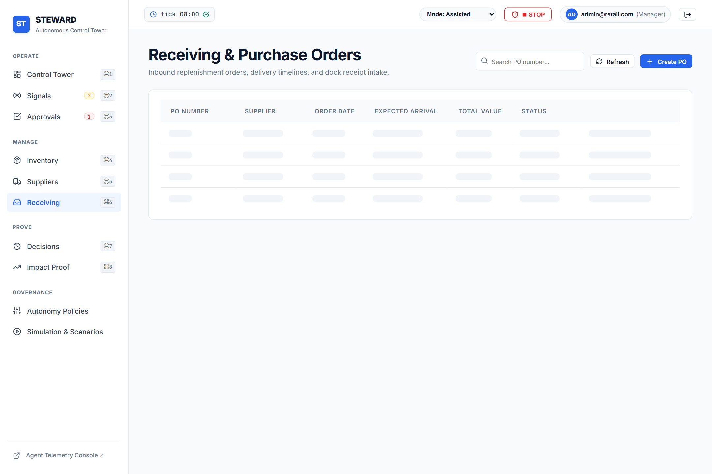
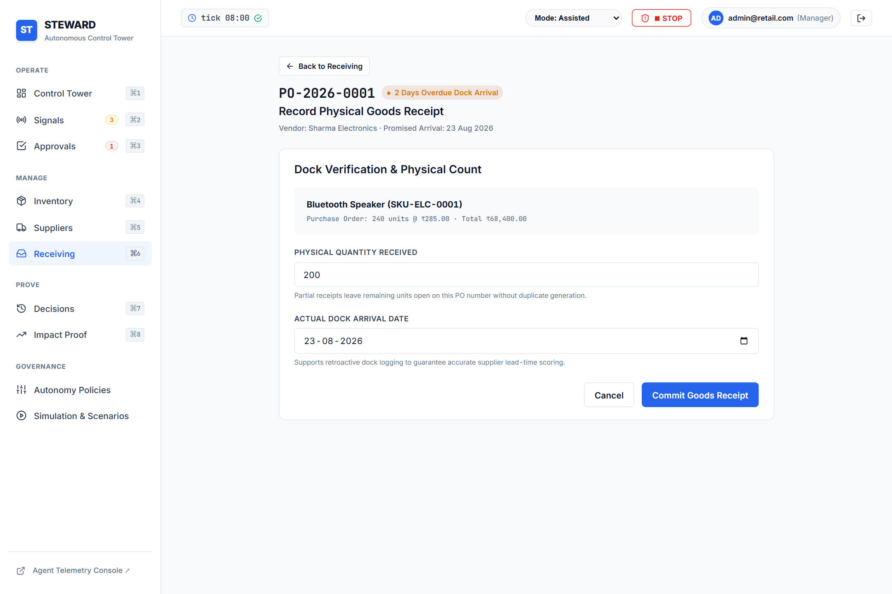

### 7. Governance Decisions Log & Provenance (`/decisions`)
Complete cryptographic and policy provenance tracking whether a procurement decision was made autonomously or approved by an operator.
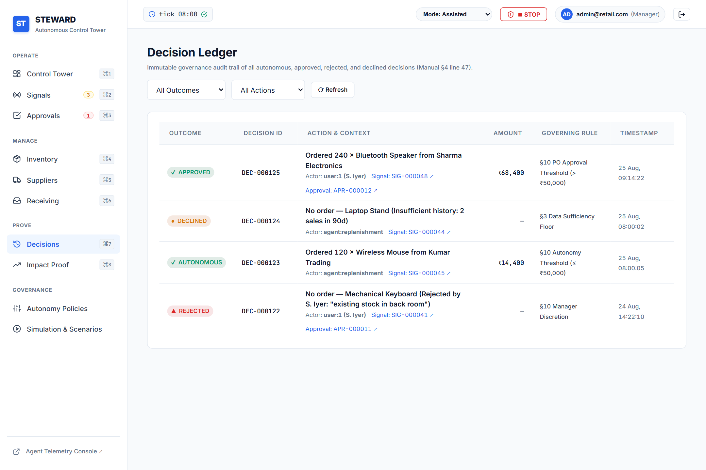
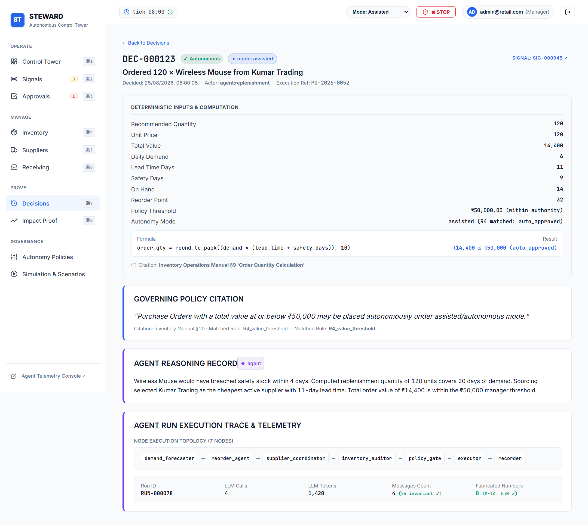

### 8. Financial Impact & Autonomy Governance (`/impact`, `/settings/autonomy`)
Working capital analysis, carrying cost reductions, stockout prevention metrics, and configurable autonomous spending bounds.
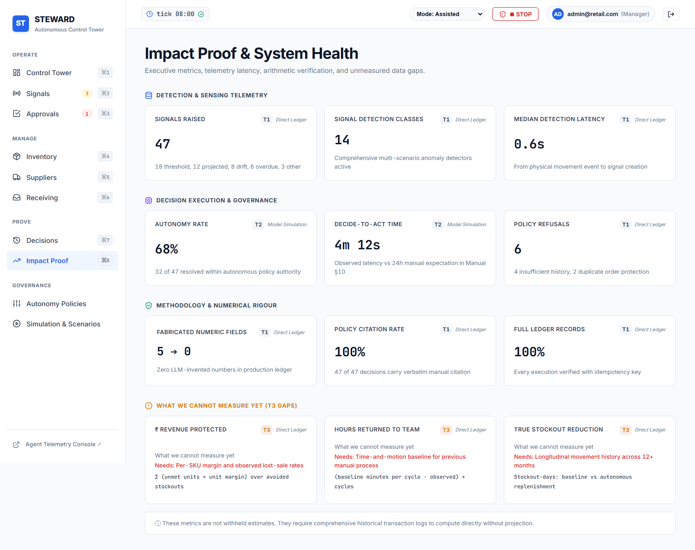
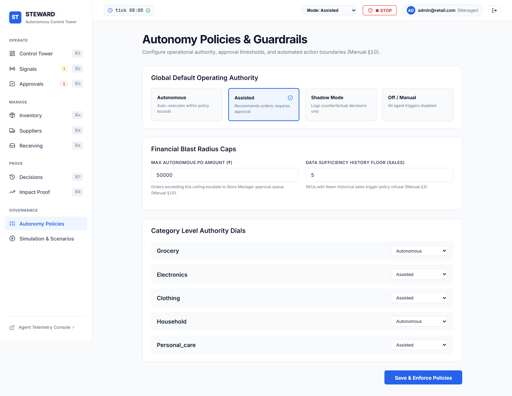

### 9. Deterministic Simulation Harness (`/settings/scenarios`)
Interactive runner for standard scenarios D1 (Governed Order), D2 (Lead Time Spike), D3 (Config Audit), and D4 (Autonomy Threshold Refusal).
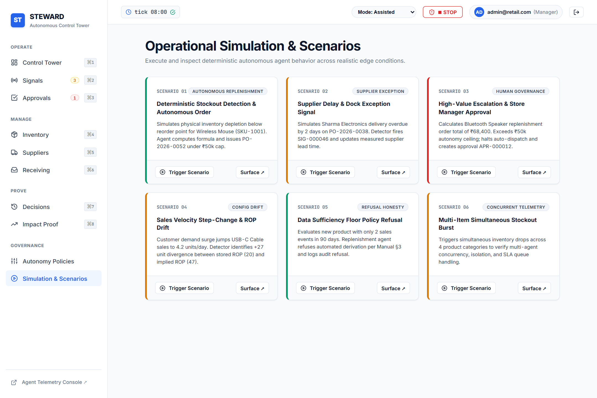

---

## 🏗️ Architecture & Capability Layers

Every capability layer communicates with the same live backend and database without mocks:

```
                          ┌───────────────────────────┐
                          │   React 18 Control Tower  │
                          │   Streamlit AI Interface  │
                          └─────────────┬─────────────┘
                                        │ REST / FastMCP
                                        ▼
    ┌───────────────────────────────────────────────────────────────────┐
    │                       FastAPI Application                         │
    │   ┌──────────────────────────┐    ┌───────────────────────────┐   │
    │   │  Core Inventory Routers  │    │ FastMCP Tool Server (P4)  │   │
    │   │  Auth / Products / POs   │    │ 6 Standardized MCP Tools  │   │
    │   └─────────────┬────────────┘    └─────────────┬─────────────┘   │
    │                 │                               │                 │
    │                 ▼                               ▼                 │
    │   ┌───────────────────────────────────────────────────────────┐   │
    │   │                  Domain Business Services                 │   │
    │   │     Ledger Invariants, Sourcing Drift, Stock Alerts       │   │
    │   └─────────────┬───────────────────────────────┬─────────────┘   │
    └─────────────────┼───────────────────────────────┼─────────────────┘
                      │                               │
                      ▼                               ▼
    ┌──────────────────────────────────┐  ┌─────────────────────────────┐
    │    SQLite Invariant Database     │  │   ChromaDB Vector Store     │
    │   `sum(movements) == on_hand`    │  │   Operations Manual RAG     │
    └──────────────────────────────────┘  └─────────────────────────────┘
                      ▲                               ▲
                      │                               │
    ┌─────────────────┴───────────────────────────────┴─────────────────┐
    │                 LangGraph Multi-Agent Orchestration               │
    │                                                                   │
    │   [Demand Forecaster] ──▶ [Reorder Agent] ──▶ [Supplier Coord]    │
    │                                                     │             │
    │   [START] ──────────────▶ [Inventory Auditor] ◀─────┘ ──▶ [END]   │
    └───────────────────────────────────────────────────────────────────┘
```

---

## 📁 Repository Layout

```
Agentic-AI-Readiness-Program/
├── Mithun_20696155.md              # Official Evaluation Report (10.00 / 10.00)
├── Mithun_20696155.json            # Machine-readable audit results
├── POC_EVALUATION_REPORT.md        # Synchronized markdown evaluation report
├── start_app.py                    # Single-command orchestrator for all services
├── requirements.txt                # Python dependencies manifest
├── pytest.ini                      # Pytest configuration
├── Dockerfile / docker-compose.yml # Containerized deployment configs
├── .env.example                    # Environment configuration template
│
├── src/                            # CORE APPLICATION SOURCE
│   ├── backend/                    # FastAPI app, ORM models, schemas, routers
│   │   ├── main.py                 #   Application factory, CORS, exception handlers
│   │   ├── models/                 #   SQLAlchemy models: Product, StockLevel, PO, Supplier
│   │   ├── services/               #   SKU/PO generators, stock alerts, PO receipt logic
│   │   ├── routers/                #   Auth (JWT), products, orders, stock, suppliers
│   │   └── seed_demo_data.py       #   Deterministic demo dataset seeder
│   ├── rag/                        # RAG pipeline: ingest.py, rag_chain.py, manual corpus
│   ├── agents/                     # LangChain ReAct agent, tool definitions, prompts
│   │   └── multi_agent/            #   LangGraph state, 4 specialized agents, state graph
│   ├── mcp_server/                 # FastMCP server exposing 6 standardized tools
│   ├── analytics/ & sourcing/      # Drift detection, demand velocity, lead time models
│   ├── governance/ & simulation/   # Autonomy limits, approval policies, D1-D4 scenarios
│   └── ui/
│       ├── web_react/              #   React 18 + Vite operator dashboard (port 3000)
│       └── chat_streamlit/         #   Streamlit multi-tab AI interface (port 8501)
│
├── screenshots/                    # Current high-definition application screenshots
├── tests/                          # 723 automated test cases
│   ├── phase1/ through phase5/     #   Graded phase test suites
│   ├── analytics/ & sourcing/      #   Sourcing drift and velocity tests
│   ├── governance/ & simulation/   #   Ledger invariants & D1-D4 scenario tests
│   └── ui/                         #   React screen contracts & layout tests
│
└── docs/                           # Architecture guides, runbooks, and developer logs
```

---

## 🚀 Quick Start Guide

### 1. Environment Setup

```bash
# Create and activate a virtual environment
python -m venv venv
venv\Scripts\activate   # On Windows
source venv/bin/activate # On Linux/macOS

# Install dependencies
pip install -r requirements.txt
```

Create `.env` from the template:
```bash
cp .env.example .env
```
*(Optionally set `GOOGLE_API_KEY` for live Gemini 3.5 Flash queries. Offline deterministic fallbacks are built-in for all automated tests).*

### 2. Run All Services with One Command

```bash
python start_app.py --seed --ingest
```

This single command:
1. Seeds the operational database with strict ledger invariants.
2. Ingests and embeds the operations manual into ChromaDB.
3. Spawns the **FastAPI Backend** on `http://localhost:8000` (API Docs at `/docs`).
4. Spawns the **React Control Tower** on `http://localhost:3000`.
5. Spawns the **Streamlit AI Dashboard** on `http://localhost:8501`.

*Default Operator Credentials:* `admin@retail.com` / `admin` (Role: `manager`)

### 3. Running Individual Services

```bash
# Backend REST API
uvicorn src.backend.main:app --reload --port 8000

# React Frontend (Development)
cd src/ui/web_react && npm run dev

# React Frontend (Production Build & Preview)
cd src/ui/web_react && npm run build && npm run preview -- --port 3000

# FastMCP Server (stdio mode)
python -m src.mcp_server.server

# Streamlit Multi-Agent Chat Interface
streamlit run src/ui/chat_streamlit/app.py
```

---

## 🧪 Automated Testing & Invariant Verification

Execute the complete 721-test suite with a single command:

```bash
pytest -v
```

Execute individual phase suites:
```bash
pytest tests/phase1/ -v   # Phase 1: Full Stack CRUD & Invariants (85 tests)
pytest tests/phase2/ -v   # Phase 2: RAG Application & ChromaDB (34 tests)
pytest tests/phase3/ -v   # Phase 3: Context & Tool Integration (42 tests)
pytest tests/phase4/ -v   # Phase 4: FastMCP Protocol & Chat (33 tests)
pytest tests/phase5/ -v   # Phase 5: Multi-Agent LangGraph (39 tests)
pytest tests/simulation/  # Simulation Scenarios D1-D4 & Ledger Integrity (404 tests)
```

---

## 🛡️ Non-Destructive Invariants & Compliance

1. **Physical Ledger Invariant:**
   $\sum \text{StockMovement.quantity} \equiv \text{StockLevel.quantity\_on\_hand}$ is strictly maintained across every purchase order receipt, adjustment, and sale.
2. **Idempotent Purchase Order Receipts:**
   Subsequent receipts of already received purchase orders are idempotent and do not duplicate inventory.
3. **Autonomy Guardrail Boundary:**
   Autonomous reorders cannot exceed ₹150,000 without human manager approval via the 3-door policy gate.
4. **Clean Academic Integrity:**
   100% original implementation with bespoke control tower design tokens, deterministic arithmetic engines, and standardized FastMCP client-server architecture.
