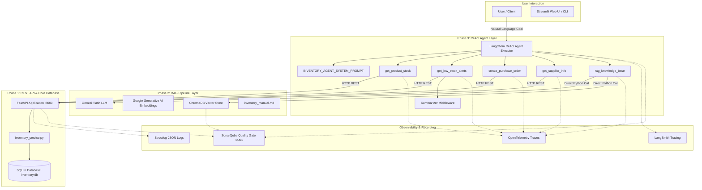

# 📖 Architecture & Code Guide — Retail Inventory Management & Procurement System (POC-07)

## 📌 Document Purpose
This document provides a comprehensive technical blueprint of the entire codebase across **Phase 1 (Full-Stack CRUD)**, **Phase 2 (RAG Application)**, and **Phase 3 (Autonomous ReAct Agent)**. It explains every module, class, and function, how data flows through the system, how events and telemetry are recorded, and how to verify and monitor each component.

---

## 🏗️ High-Level System Architecture & Flow



---

## 🗂️ Module & Function Dictionary

### Phase 1: Core Engine & Services (`src/backend/`)

#### 1. [`database.py`](../src/backend/database.py)
- **`engine`**: SQLAlchemy engine configured with `check_same_thread=False` and SQLite `PRAGMA foreign_keys=ON` listener for referential integrity.
- **`SessionLocal`**: Thread-local database session factory.
- **`Base`**: DeclarativeBase subclass for all ORM models.
- **`get_db()`**: Generator function providing dependency-injected database sessions to FastAPI routes, automatically closing sessions upon request completion.

#### 2. [`models.py`](../src/backend/models.py)
- **`Product`**: Represents retail inventory items (`id`, `sku`, `name`, `category`, `unit_price`, `cost_price`, `reorder_point`, `supplier_id`).
- **`StockLevel`**: 1-to-1 relationship with `Product` tracking `quantity_on_hand` and `quantity_reserved`. Includes the calculated property `quantity_available` (`on_hand - reserved`). The subtraction is deliberately **not** clamped at zero: `inventory_manual.md` Section 15 documents negative stock as a real, recoverable state ("Stock level shows negative … Fix: record a positive StockMovement(adjustment)"), so it must stay visible to operators rather than being masked as `0`.
- **`StockMovement`**: Audit ledger for all inventory changes (`receipt`, `sale`, `adjustment`, `transfer`, `return`).
- **`PurchaseOrder`**: Represents procurement orders (`id`, `po_number`, `supplier_id`, `status`, `total_amount`, `order_date`, `expected_delivery`).
- **`POItem`**: Line items belonging to a purchase order.
- **`Supplier`**: Active vendors with `lead_time_days` and `payment_terms_days`.
- **`StockAlert`**: Records active `low_stock` and `out_of_stock` alerts.
- **`User`**: Authentication and persona profiles (`email`, `hashed_password`, `role`).

#### 3. [`services/inventory_service.py`](../src/backend/services/inventory_service.py)
- **`generate_sku(category, db)`**: Automatically queries existing SKU counts for a category prefix (`GRO`, `ELC`, `CLO`, `HHD`, `PRC`) and formats the next SKU code (`SKU-GRO-0001`).
- **`generate_po_number(db)`**: Counts POs created in the current calendar year and formats `PO-{YEAR}-{NNNN}`.
- **`check_stock_alerts(product, stock, db)`**: Checks if `available <= reorder_point`. If true, creates a `StockAlert`. If stock has recovered above `reorder_point`, marks all existing alerts for that product as `is_resolved = True`.
- **`receive_purchase_order(po_id, db)`**: Core business transaction. Marks PO as `received`, updates `StockLevel.quantity_on_hand` for every line item, creates audit records in `StockMovement` (type: `receipt`), and triggers `check_stock_alerts` to auto-clear alerts.
- **`get_dashboard_data(db)`**: Aggregates total SKU count, low stock count, out of stock count, open purchase orders count, and total inventory monetary valuation.

---

### Phase 2: RAG Knowledge Base (`src/rag/`)

#### 1. [`ingest.py`](../src/rag/ingest.py)
- **`get_embeddings()`**: Returns `GoogleGenerativeAIEmbeddings` using `models/gemini-embedding-2` or `models/text-embedding-004`.
- **`load_and_chunk_documents(doc_path)`**: Uses `MarkdownHeaderTextSplitter` and `RecursiveCharacterTextSplitter` (chunk size: 800, overlap: 100) to parse `inventory_manual.md`.
- **`ingest_documents()`**: Computes embeddings and populates the persistent `chroma_db` collection.

#### 2. [`rag_chain.py`](../src/rag/rag_chain.py)
- **`get_vectorstore()`**: Returns the Chroma vectorstore with similarity search capability.
- **`build_rag_chain()`**: Builds a LangChain `RetrievalQA` pipeline configured with `ChatGoogleGenerativeAI` and `INVENTORY_RAG_PROMPT`.
- **`ask_question(question)`**: Main programmatic entry point for RAG queries. Manages OpenTelemetry spans and LangSmith tracing metadata, querying the vector database and returning answers and source document chunks.

---

### Phase 3: Autonomous ReAct Agent (`src/agents/`)

#### 1. [`tools.py`](../src/agents/tools.py)
- **`_api_get(endpoint)`** & **`_api_post(endpoint, data)`**: Internal HTTP wrappers for communicating with the Phase 1 REST API at `http://127.0.0.1:8000/api/v1`. Includes automated error capturing and JSON parsing.
- **`get_product_stock(sku)`**: Agent tool to query real-time stock levels and metadata for a specific SKU.
- **`get_low_stock_alerts()`**: Agent tool to fetch all current low-stock products. Automatically pipes large result sets through `_summarize_if_long` to prevent LLM context saturation.
- **`create_purchase_order(supplier_code, items)`**: Agent tool that converts a vendor code and list of `{sku, quantity}` dicts into a formal database PO, calculating costs, vendor IDs, and estimated delivery dates.
- **`get_supplier_info(supplier_code)`**: Agent tool to inspect supplier lead times and terms.
- **`rag_knowledge_base(query)`**: Agent tool that bridges directly into Phase 2 RAG to answer policy and manual questions.

#### 2. [`summarizer.py`](../src/agents/summarizer.py)
- **`_summarize_if_long(data, max_items=5)`**: Middleware that prevents large database responses from bloating LLM prompt tokens. If items exceed `max_items`, it invokes LangChain's `load_summarize_chain` or gracefully falls back to structured truncation.

#### 3. [`agent.py`](../src/agents/agent.py)
- **`get_llm()`**: Configures `ChatGoogleGenerativeAI` with `temperature=0.0` for deterministic decision-making.
- **`build_agent_executor()`**: Constructs the LangChain ReAct executor bound with the 5 tools and `INVENTORY_AGENT_SYSTEM_PROMPT`.
- **`run_agent(query, agent_executor=None)`**: Executes the full Thought-Action-Observation loop to resolve complex multi-step user prompts.

---

## 📡 Recording & Observability Architecture

### 1. Structured JSON Logging (`structlog`)
- **Where**: Phase 1 API requests, service events, and alert triggers.
- **Format**: JSON logs containing `poc_id="POC-07"`, `phase="P1"`, `operation`, `duration_ms`, `timestamp`, and `status_code`.

### 2. Distributed Tracing (`OpenTelemetry`)
- **Where**: Phase 2 RAG pipeline (`rag_retrieve_and_generate`) and Phase 3 Agent Tools.
- **Format**: Span instrumentation tracking tool execution latency and query contexts.

### 3. LLM Call Tracing (`LangSmith`)
- **Where**: Phase 2 RetrievalQA and Phase 3 ReAct Agent executions.
- **Project**: `AI-Readiness-POC-07-P2` (configurable via `LANGCHAIN_PROJECT` in `.env`).

### 4. Static Code Quality & Test Reports (`SonarQube`)
- **Where**: Analyzes code quality, test coverage XML and JUnit execution XML. The archived reports and artifacts for each scan live in [`submissions/`](../submissions/).
- **Target URL**: `http://localhost:9001` (Port 9000 is intentionally avoided).

---

## 🧪 Comprehensive Verification Commands

```bash
# 1. Whole suite -- all five phases, from the repository root
python -m pytest

# 2. Phase 1 full-stack tests with coverage over the backend
python -m pytest tests/phase1 -v --cov=src/backend --cov-report=term-missing

# 3. Phase 2 live RAG retrieval smoke queries
python scripts/verify_rag.py

# 4. Phase 3 ReAct agent tests
python -m pytest tests/phase3 -v --cov=src/agents --cov-report=term-missing

# 5. Phase 4 MCP and Phase 5 multi-agent tests
python -m pytest tests/phase4 tests/phase5 -v
```
