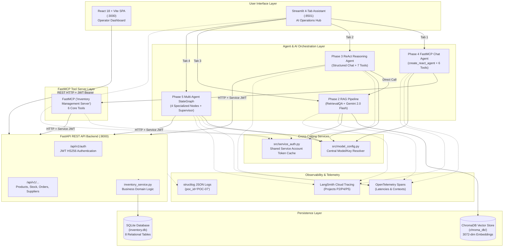

# 📦 Master Technical Handover Guide
## Retail Domain: Inventory Management & Procurement System (POC-07)

---

## 📌 1. Executive Summary

This document is the authoritative technical reference and master handover manual for the **Retail Inventory Management & Procurement System (POC-07)**. It represents the verified, hardened, and consolidated state of the codebase following the completion of Phases 1 through 5, post-Phase-5 functional hardening, and repository consolidation.

### Purpose of this Reference
This document explains:
**What exists → Why it exists → How it connects → How it works → How to run it → How to test it → How to modify it.**

### System Capabilities Overview
1. **Core Retail ERP Engine (Phase 1)**: FastAPI REST API, SQLAlchemy 2.0 ORM, Pydantic v2 validation models, JWT (HS256) role-based authentication (`manager`, `staff`), SQLite relational storage with enabled foreign key enforcement (`PRAGMA foreign_keys=ON`), collision-free auto-sequencing for SKUs (`SKU-{PREFIX}-{NNNN}`) and POs (`PO-{YEAR}-{NNNN}`), and multi-channel stock movement auditing (`receipt`, `sale`, `adjustment`, `transfer`, `return`).
2. **Retrieval-Augmented Generation / RAG (Phase 2)**: ChromaDB vector store indexing the 15-section domain operations manual (`src/rag/data/inventory_manual.md`) via Google Generative AI embeddings (`models/gemini-embedding-2`, 3072 dimensions) and a LangChain `RetrievalQA` pipeline powered by Google Gemini 2.0 Flash (`gemini-3.1-flash-lite`).
3. **Autonomous ReAct Agent (Phase 3)**: LangChain Structured Chat ReAct agent combining 7 REST API tools, context summarization middleware, OpenTelemetry spans, and direct RAG policy retrieval to reason across live operational data and business rules.
4. **Model Context Protocol / FastMCP Server (Phase 4)**: FastMCP server (`"Inventory Management Server"`) exposing 6 core inventory management tools to LLMs, integrated with a multi-turn ReAct chat interface maintaining conversation state.
5. **Multi-Agent StateGraph Pipeline (Phase 5)**: LangGraph stateful multi-agent system coordinating 4 specialized worker agents (`demand_forecaster`, `reorder_agent`, `supplier_coordinator`, `inventory_auditor`) with dynamic supervisor short-circuiting on error thresholds.
6. **Dual User Interfaces**:
   - **React 18 + Vite SPA** (`http://localhost:3000`): Full-featured store operator dashboard for products, stock levels, stock movement ledgers, supplier registers, and purchase orders.
   - **Streamlit AI Assistant** (`http://localhost:8501`): 4-tab conversational and analytical workstation supporting FastMCP operations chat, ReAct reasoning, RAG manual lookups, and multi-agent audit execution.

---

## 🗺️ 2. Project Structure & File Map

The codebase is consolidated under the canonical `src/` package root. All legacy `phaseN/` source directories and facade bridge packages have been removed; all imports resolve directly against `src.*`.

```text
Agentic-AI-Readiness-Program/
├── src/                               # Canonical application source code
│   ├── model_config.py               # Single source of truth for Gemini model & API keys
│   ├── service_auth.py               # Centralized service account login for API clients
│   ├── backend/                      # Core REST API, ORM, schemas, & business services
│   │   ├── database.py               # SQLAlchemy engine, sessionmaker, and get_db dependency
│   │   ├── logging_config.py         # Structlog JSON structured logging configuration
│   │   ├── main.py                   # FastAPI app entrypoint, lifespan, CORS, and middleware
│   │   ├── models.py                 # SQLAlchemy 2.0 declarative database models & enums
│   │   ├── schemas.py                # Pydantic v2 request/response validation models
│   │   ├── seed_demo_data.py         # Idempotent demo dataset seeder
│   │   ├── routers/
│   │   │   ├── auth.py               # JWT login, registration, & user security dependencies
│   │   │   └── inventory.py          # Products, stock, suppliers, orders, and dashboard routes
│   │   └── services/
│   │       └── inventory_service.py  # SKU/PO sequence generation, alert checks, & PO receiving
│   ├── rag/                          # RAG document ingestion & RetrievalQA pipeline
│   │   ├── ingest.py                 # Markdown parsing, recursive chunking, & ChromaDB indexing
│   │   ├── rag_chain.py              # LangChain RetrievalQA chain & ask_question wrapper
│   │   └── data/
│   │       └── inventory_manual.md   # 15-section domain policy & operations manual
│   ├── agents/                       # Phase 3 ReAct Agent & tools
│   │   ├── agent.py                  # LangChain Structured Chat ReAct executor & CLI
│   │   ├── prompts.py                # System prompt and tool instructions
│   │   ├── summarizer.py             # Context summarization middleware for large payloads
│   │   ├── tools.py                  # 7 LangChain tools bound to backend REST API & RAG
│   │   └── multi_agent/              # Phase 5 LangGraph Multi-Agent system
│   │       ├── state.py              # InventoryAnalysisState TypedDict schema & factory
│   │       ├── agents.py             # 4 specialized worker agents & helper functions
│   │       └── graph.py              # StateGraph compilation, supervisor routing, & runner
│   ├── mcp_server/                   # Phase 4 FastMCP server & chat interface
│   │   ├── server.py                 # FastMCP runner entrypoint
│   │   ├── mcp_app.py                # FastMCP app definition & 6 inventory tools
│   │   └── chat_interface.py         # Multi-turn LangChain chat agent wrapping FastMCP tools
│   └── ui/                           # User interfaces
│       ├── chat_streamlit/
│       │   └── app.py                # 4-tab Streamlit AI operator workstation
│       └── web_react/                # React 18 + Vite frontend SPA
│           ├── index.html            # HTML shell
│           ├── package.json          # NPM dependencies & scripts
│           ├── vite.config.js        # Vite build & dev server config
│           └── src/
│               ├── App.jsx           # Main React component, auth state, & dashboard tabs
│               ├── index.css         # Modern design system stylesheet
│               └── main.jsx          # React DOM root entrypoint
├── tests/                            # Automated test suites (234 collected tests)
│   ├── conftest.py                   # Global root test configuration & sys.path setup
│   ├── phase1/                       # Backend, auth, database, & unit tests (85 tests)
│   ├── phase2/                       # Vector store, chunking, & RAG chain tests (34 tests)
│   ├── phase3/                       # ReAct agent, tools, summarizer, & UI tests (42 tests)
│   ├── phase4/                       # FastMCP server, chat agent, & tracing tests (33 tests)
│   └── phase5/                       # State schema, multi-agent nodes, & graph tests (40 tests)
├── submissions/                      # Graded phase reports, scores, & XML results
├── docs/                             # Documentation & program specifications
│   ├── DEVLOG.md                     # Comprehensive development history & bug fix ledger
│   ├── ARCHITECTURE_AND_CODE_GUIDE.md# Architecture overview
│   ├── RUN_GUIDE.md                  # Quick run guide
│   ├── TECHNICAL_HANDOVER_GUIDE.md   # This master handover manual
│   └── program/                      # Original program specs, rubrics, & user stories
├── scripts/                          # Operational & verification scripts
│   ├── agent_cli.py                  # Interactive terminal interface for ReAct agent
│   └── verify_rag.py                 # Smoke test script for live RAG retrieval
├── start_app.py                      # Single-command unified application orchestrator
├── Dockerfile                        # Multi-stage production container image
├── docker-compose.yml                # Multi-service container orchestration
├── pytest.ini                        # Pytest configuration (--import-mode=importlib)
├── requirements.txt                  # Complete pinned Python dependencies
├── .env.example                      # Fully documented environment variable template
└── README.md                         # Project overview and high-level instructions
```

### Detailed File Metadata Table

| Path | Purpose | Key Classes / Functions / Exports | Key Dependencies | Primary Consumers |
|---|---|---|---|---|
| `src/model_config.py` | Centralized LLM & embedding model/key configuration. | `chat_model()`, `embedding_model()`, `api_key()`, `DEFAULT_CHAT_MODEL`, `DEFAULT_EMBEDDING_MODEL` | `os` | `agent.py`, `summarizer.py`, `agents.py`, `rag_chain.py`, `ingest.py`, `chat_interface.py` |
| `src/service_auth.py` | Shared service-account token manager for non-browser API clients. | `get_token()`, `auth_headers()`, `invalidate()` | `requests`, `threading`, `time` | `tools.py`, `mcp_app.py`, `agents.py`, `app.py` |
| `src/backend/database.py` | SQLAlchemy engine, session maker, and DB dependency. | `engine`, `SessionLocal`, `Base`, `get_db()`, `DATABASE_URL` | `sqlalchemy`, `dotenv`, `pathlib` | `main.py`, `models.py`, `inventory.py`, `auth.py`, `seed_demo_data.py` |
| `src/backend/models.py` | SQLAlchemy ORM database models and enums. | `Supplier`, `Product`, `StockLevel`, `StockMovement`, `PurchaseOrder`, `POItem`, `StockAlert`, `User`, `Category`, `MovementType`, `POStatus` | `sqlalchemy`, `database.Base` | `inventory.py`, `auth.py`, `inventory_service.py`, `seed_demo_data.py` |
| `src/backend/schemas.py` | Pydantic v2 request/response validation schemas. | `ProductCreate`, `ProductResponse`, `ProductListResponse`, `StockMovementCreate`, `PurchaseOrderCreate`, `UserCreate`, `UserResponse`, `Token`, `DashboardResponse` | `pydantic`, `models` | `main.py`, `inventory.py`, `auth.py` |
| `src/backend/logging_config.py` | Structured JSON logging setup using `structlog`. | `configure_logging()`, `logger` | `structlog`, `logging` | `main.py`, `inventory.py`, `auth.py`, `inventory_service.py` |
| `src/backend/main.py` | FastAPI application factory, lifespan, CORS, error handling. | `app`, `lifespan()`, `seed_default_admin()`, `seed_default_suppliers()` | `fastapi`, `structlog`, `database`, `routers` | `start_app.py`, Uvicorn, Docker |
| `src/backend/routers/auth.py` | User registration, JWT login, and bearer authentication dependency. | `login()`, `register()`, `get_current_user()`, `ensure_default_user()`, `create_access_token()` | `jose.jwt`, `passlib`, `fastapi.security` | `main.py`, `inventory.py`, `App.jsx`, `service_auth.py` |
| `src/backend/routers/inventory.py` | Protected CRUD endpoints for products, stock, orders, suppliers, dashboard. | `create_product()`, `list_products()`, `get_product()`, `update_stock()`, `create_purchase_order()`, `receive_order()`, `get_dashboard()` | `fastapi`, `sqlalchemy.orm`, `models`, `schemas`, `inventory_service` | `main.py`, `App.jsx`, `tools.py`, `mcp_app.py`, `agents.py` |
| `src/backend/services/inventory_service.py` | Business domain services and transaction helpers. | `generate_sku()`, `generate_po_number()`, `check_stock_alerts()`, `receive_purchase_order()`, `get_dashboard_data()`, `_next_sequence()` | `sqlalchemy`, `models`, `structlog` | `inventory.py`, `seed_demo_data.py` |
| `src/backend/seed_demo_data.py` | Idempotent seeder generating 5 products, 4 suppliers, 4 POs, and movements. | `seed_all()`, `TODAY`, `SUPPLIERS`, `PRODUCTS`, `PURCHASE_ORDERS`, `MOVEMENTS` | `sqlalchemy`, `models`, `inventory_service` | `start_app.py`, CLI |
| `src/rag/ingest.py` | Ingests and splits markdown manual into ChromaDB vectors. | `load_documents()`, `split_documents()`, `get_embeddings()`, `drop_collection()`, `build_vectorstore()` | `langchain_community`, `langchain_text_splitters`, `chromadb`, `model_config` | `start_app.py`, `rag_chain.py`, CLI |
| `src/rag/rag_chain.py` | LangChain `RetrievalQA` pipeline with OTel and LangSmith tracing. | `build_rag_chain()`, `ask_question()`, `get_vectorstore()`, `INVENTORY_RAG_PROMPT` | `langchain_google_genai`, `langchain_classic`, `chromadb`, `opentelemetry` | `tools.py`, `app.py`, `verify_rag.py` |
| `src/rag/data/inventory_manual.md` | Ground truth operations manual covering 15 policy sections. | 15 Markdown sections (SKU rules, PO thresholds, safety stock, troubleshooting). | N/A | `ingest.py` |
| `src/agents/prompts.py` | System prompt template for Phase 3 ReAct agent. | `INVENTORY_AGENT_SYSTEM_PROMPT` | N/A | `agent.py` |
| `src/agents/tools.py` | 7 LangChain tools bound to backend REST API and RAG. | `get_product_stock`, `get_low_stock_alerts`, `create_purchase_order`, `get_supplier_info`, `get_supplier_catalog`, `get_dashboard_stats`, `rag_knowledge_base` | `langchain_core.tools`, `requests`, `service_auth`, `rag_chain`, `opentelemetry` | `agent.py`, `tests/phase3/` |
| `src/agents/summarizer.py` | Middleware preventing LLM context window overflow on large data lists. | `_summarize_if_long()` | `langchain_google_genai`, `langchain_classic.chains.summarize`, `model_config` | `tools.py` |
| `src/agents/agent.py` | Phase 3 Structured Chat ReAct executor and runner. | `build_agent_executor()`, `run_agent()`, `get_llm()`, `AGENT_ERROR_PREFIX` | `langchain_google_genai`, `langchain_classic.agents`, `tools`, `prompts` | `app.py`, `agent_cli.py`, `tests/phase3/` |
| `src/agents/multi_agent/state.py` | LangGraph state TypedDict definition and default state factory. | `InventoryAnalysisState`, `initial_state()` | `typing.TypedDict` | `agents.py`, `graph.py`, `app.py`, `tests/phase5/` |
| `src/agents/multi_agent/agents.py` | 4 specialized multi-agent graph nodes and JSON parsing utilities. | `demand_forecaster()`, `reorder_agent()`, `supplier_coordinator()`, `inventory_auditor()`, `_safe_json()`, `_authed_get()` | `langchain_google_genai`, `langsmith`, `requests`, `service_auth`, `opentelemetry` | `graph.py`, `tests/phase5/` |
| `src/agents/multi_agent/graph.py` | LangGraph StateGraph assembly, supervisor routing, and runner. | `build_inventory_graph()`, `analyze_product()`, `should_skip_to_audit()` | `langgraph.graph`, `agents`, `state`, `opentelemetry` | `app.py`, `tests/phase5/` |
| `src/mcp_server/mcp_app.py` | FastMCP server definition exposing 6 inventory tools. | `mcp`, `update_stock`, `create_purchase_order`, `get_low_stock_products`, `get_supplier_catalog`, `get_purchase_orders`, `get_inventory_dashboard` | `fastmcp`, `requests`, `service_auth`, `opentelemetry` | `server.py`, `chat_interface.py`, `tests/phase4/` |
| `src/mcp_server/server.py` | FastMCP executable server entrypoint. | `get_server_status()`, `main` | `mcp_app` | MCP Clients |
| `src/mcp_server/chat_interface.py` | LangChain ReAct agent wrapping FastMCP tools with conversation state. | `ChatSession`, `build_chat_executor()`, `process_message()`, `DEFAULT_REACT_PROMPT_TEMPLATE` | `langchain_google_genai`, `langchain_classic.agents`, `mcp_app`, `model_config` | `app.py`, `tests/phase4/` |
| `src/ui/chat_streamlit/app.py` | 4-tab Streamlit dashboard for AI-assisted inventory operations. | Streamlit application code for Tabs 1-4, session reset, and PO generation. | `streamlit`, `rag_chain`, `chat_interface`, `agent`, `graph`, `service_auth` | `start_app.py`, Streamlit CLI, Docker |
| `src/ui/web_react/src/App.jsx` | Full React frontend SPA with login, products, stock, movements, POs. | `App`, `LoginScreen`, `MovementModal`, `MovementHistoryModal`, `POModal`, `SupplierModal` | `react`, `axios`, `lucide-react` | Vite dev/build, Browser |
| `start_app.py` | Master launcher starting FastAPI, Streamlit, and React Vite servers. | `main()`, `preflight()`, `start_backend()`, `start_react()`, `start_streamlit()`, `run_seed()`, `run_ingestion()` | `subprocess`, `requests`, `dotenv`, `shutil` | Developer CLI |

---

## 🏛️ 3. Architecture & Component Flow



---

## 🔄 4. End-to-End Workflows

### Workflow 1: Stock Movement & Real-Time Alert Recomputation (React SPA)
1. **Operator Action**: In the React SPA, the user clicks "Record Stock Movement" for a product and submits: `{ quantity: 10, movement_type: "receipt", notes: "Supplier Delivery" }`.
2. **Client Dispatch**: `src/ui/web_react/src/App.jsx` sends `PATCH /api/v1/products/{id}/stock` with the user's Bearer JWT.
3. **Validation**: `src/backend/schemas.py` validates that `quantity != 0` and enforces sign rules (`receipt` > 0, `sale` < 0).
4. **Persistence & Auditing**: `src/backend/routers/inventory.py` updates `StockLevel.quantity_on_hand` and appends a record to `StockMovement` stamped with `recorded_by=current_user.full_name`.
5. **Alert State Evaluation**: `check_stock_alerts()` evaluates `quantity_available`. If stock recovered above `reorder_point`, existing alerts are marked `is_resolved = True`. If `<= 0` or `<= reorder_point`, an `out_of_stock` or `low_stock` alert is created.
6. **Logging**: Structured JSON log event `"stock_updated"` is emitted via `structlog`.

### Workflow 2: Multi-Agent Audit & Replenishment Pipeline (Streamlit Tab 4)
1. **Execution**: The user selects Product ID 1 and clicks "Execute Multi-Agent Graph".
2. **Entry & State Init**: `src/agents/multi_agent/graph.py` initializes `InventoryAnalysisState(product_id=1)`.
3. **Demand Forecasting**: `demand_forecaster` fetches live product data via authenticated `GET /api/v1/products/1` and calls Gemini LLM for velocity, runway, and risk JSON.
4. **Supervisor Routing**: `should_skip_to_audit(state)` checks `state["errors"]` count and `state["analysis_status"]`. Normal execution proceeds to `reorder_agent`. If `errors >= 3`, it short-circuits directly to `inventory_auditor`.
5. **Reorder Analysis**: `reorder_agent` computes required quantity and updates `analysis_status="reorder_required"`.
6. **Supplier Quotation**: `supplier_coordinator` queries the vendor register and computes grounded total cost (`unit_cost * recommended_quantity`), forbidding hallucinated vendor IDs.
7. **Executive Audit Synthesis**: `inventory_auditor` synthesizes upstream outputs into a 3–4 sentence executive report and sets `analysis_status="complete"`.
8. **Action**: The UI displays results and provides a one-click "Generate Purchase Order" button.

---

## 🤖 5. Agents & Tools Architecture

### Agent Specifications

| Agent System | Location | Model & Settings | Tool Registry | Primary Surface |
|---|---|---|---|---|
| **ReAct Reasoning Agent (Phase 3)** | `src/agents/agent.py` | `gemini-3.1-flash-lite`<br>(temp=0.0) | 7 LangChain tools: `get_product_stock`, `get_low_stock_alerts`, `get_dashboard_stats`, `create_purchase_order`, `get_supplier_info`, `get_supplier_catalog`, `rag_knowledge_base` | Streamlit Tab 2 & CLI (`scripts/agent_cli.py`) |
| **FastMCP Chat Agent (Phase 4)** | `src/mcp_server/chat_interface.py` | `gemini-3.1-flash-lite`<br>(temp=0.1) | 6 FastMCP tools: `update_stock`, `create_purchase_order`, `get_low_stock_products`, `get_supplier_catalog`, `get_purchase_orders`, `get_inventory_dashboard` | Streamlit Tab 1 |
| **Multi-Agent Pipeline (Phase 5)** | `src/agents/multi_agent/graph.py` | `gemini-3.1-flash-lite`<br>(temp=0.2) | 4 Specialized Graph Nodes: `demand_forecaster`, `reorder_agent`, `supplier_coordinator`, `inventory_auditor` | Streamlit Tab 4 & Python API `analyze_product()` |

### Tool Definitions & Grounding Matrix

| Tool Name | Tool Source | Purpose | Data Accessed | Safeguards & Error Behavior |
|---|---|---|---|---|
| `get_product_stock` | Phase 3 Tools | Query stock levels and price by SKU. | `GET /api/v1/products` | Uses service account auth; returns clear not found message if SKU missing. |
| `get_low_stock_alerts` | Phase 3 Tools | Query products at or below reorder point. | `GET /api/v1/stock/low-alerts` | Automatically pipes payloads >5 items to `_summarize_if_long` to prevent LLM context saturation. |
| `get_dashboard_stats` | Phase 3 Tools | Overall store KPIs & total stock valuation. | `GET /api/v1/dashboard` | Formats metrics into rupee (₹) figures with clear label strings. |
| `create_purchase_order` | Phase 3 Tools | Auto-generate draft PO with line items. | `POST /api/v1/orders` | Resolves supplier codes to IDs and validates product SKUs prior to submission. |
| `get_supplier_info` | Phase 3 Tools | Inspect supplier terms and lead times. | `GET /api/v1/suppliers` | Matches vendor codes (`SUP-0001`..`SUP-0005`). |
| `get_supplier_catalog` | Phase 3 Tools | List products supplied by a specific vendor. | `GET /api/v1/suppliers/{id}/catalog` | Accepts either vendor code or numeric ID. |
| `rag_knowledge_base` | Phase 3 Tools | Query policy manual for SOP guidelines. | ChromaDB vector store | Isolates API quota exhaustion to structured error message without crashing. |
| `update_stock` | Phase 4 FastMCP | Record inventory adjustments & recompute alerts. | `PATCH /api/v1/products/{id}/stock` | Parses ID formats safely (`_parse_id()`); falls back to POST if 405 occurs. |
| `get_low_stock_products` | Phase 4 FastMCP | Retrieve low-stock products. | `GET /api/v1/stock/low-alerts` | Sorted by urgency (out-of-stock first). |
| `get_purchase_orders` | Phase 4 FastMCP | List orders filtered by status or supplier. | `GET /api/v1/orders` | Accepts optional status and supplier ID filters. |
| `get_inventory_dashboard` | Phase 4 FastMCP | Overall health and valuation summary. | `GET /api/v1/dashboard` | Returns KPIs dictionary. |

---

## 🌐 6. REST API Specifications

All business endpoints require JWT Bearer authentication (`Authorization: Bearer <token>`).

| Method | Endpoint | Purpose | Caller(s) | Request Body / Parameters | Response Structure / Status |
|---|---|---|---|---|---|
| `POST` | `/api/v1/auth/login` | Authenticate and issue JWT. | React SPA, `service_auth.py` | Form: `username`, `password` | `{"access_token": "...", "token_type": "bearer"}` (200 OK) |
| `POST` | `/api/v1/auth/register` | Register new user. | Operators | `UserCreate` (`email`, `password`, `full_name`, `role`) | `UserResponse` (201 Created) |
| `GET` | `/health` | Unauthenticated liveness probe. | Docker, `start_app.py` | None | `{"status": "ok", "poc_id": "POC-07", "phase": "P1"}` (200 OK) |
| `GET` | `/api/v1/products` | List all products (lean list). | React SPA, Agent tools | Query: `category`, `low_stock` | `List[ProductListResponse]` (200 OK) |
| `POST` | `/api/v1/products` | Create product and init stock. | React SPA, seed scripts | `ProductCreate` | `ProductResponse` (201 Created) |
| `GET` | `/api/v1/products/{id}` | Get product with recent movements. | React SPA, Multi-Agent | Path: `id`, Query: `movement_limit=50` | `ProductResponse` (200 OK) |
| `PATCH` | `/api/v1/products/{id}/stock` | Record stock movement. | React SPA, MCP `update_stock` | `StockMovementCreate` | `StockMovementResponse` (200 OK) |
| `GET` | `/api/v1/stock/low-alerts` | List products needing reorder. | React SPA, Agent tools | None | `List[ProductListResponse]` (200 OK) |
| `GET` | `/api/v1/suppliers` | List all registered suppliers. | React SPA, Agent tools | None | `List[SupplierResponse]` (200 OK) |
| `POST` | `/api/v1/suppliers` | Register new vendor. | React SPA | `SupplierCreate` | `SupplierResponse` (201 Created) |
| `GET` | `/api/v1/suppliers/{id}/catalog`| List products supplied by vendor. | React SPA, Agent tools | Path: `id` | `List[ProductListResponse]` (200 OK) |
| `GET` | `/api/v1/orders` | List purchase orders. | React SPA, MCP tools | Query: `status`, `supplier_id` | `List[PurchaseOrderResponse]` (200 OK) |
| `POST` | `/api/v1/orders` | Create draft purchase order. | React SPA, Agent tools | `PurchaseOrderCreate` | `PurchaseOrderResponse` (201 Created) |
| `GET` | `/api/v1/orders/{id}` | Get purchase order details. | React SPA | Path: `id` | `PurchaseOrderResponse` (200 OK) |
| `PATCH` | `/api/v1/orders/{id}/receive` | Receive order and update stock. | React SPA | Path: `id` | `PurchaseOrderResponse` (200 OK) |
| `GET` | `/api/v1/dashboard` | Aggregate inventory KPIs. | React SPA, Agent tools | None | `DashboardResponse` (200 OK) |

---

## 🗄️ 7. Database Schema & Invariants

* **Database Engine**: SQLite 3 (`inventory.db`) with `PRAGMA foreign_keys=ON` listener.
* **Tables**: `users`, `suppliers`, `products`, `stock_levels`, `stock_movements`, `purchase_orders`, `po_items`, `stock_alerts`.
* **Key Invariants**:
  - `quantity_available = quantity_on_hand - quantity_reserved` is **not** clamped at 0. Negative stock is visible as a recoverable physical state in compliance with Section 15 of `inventory_manual.md`.
  - `receipt` movement quantities must be positive (`> 0`).
  - `sale` movement quantities must be negative (`< 0`).
  - Movement quantities of zero (`== 0`) are rejected.
  - Deleting an order or SKU does not corrupt sequential numbering; `_next_sequence()` scans the actual maximum integer suffix.

---

## 🔐 8. Security, Configuration & Credential Management

### Critical Security Warnings

> [!WARNING]
> **Change Default Passwords and Secret Keys Before Production**
> The values `SECRET_KEY="secret-key-poc-07-inventory-management-2026"` and `DEFAULT_ADMIN_PASSWORD="admin"` (along with `SERVICE_ACCOUNT_PASSWORD="admin"`) are built-in fallbacks intended **only for local development and demonstration**. In any production or publicly accessible deployment, you **must** set strong, unique values via the environment.

### Security & Credential History (Known Issue)

> [!CAUTION]
> **Historical Credential Exposure & Rotation Advisory**
> During earlier development phases, a live `GOOGLE_API_KEY` was committed inside a tracked `.env` file (`phase3/.env`), and live SonarQube user tokens were present in older commit history.
>
> While these credentials have been **completely removed from the current working tree and actively tracked repository files**, removing them from the working tree **does not invalidate historical credentials** in Git history.
>
> **Action Required**: The repository owner/administrator must revoke and rotate all historical API keys in:
> 1. **Google AI Studio** (Generative Language API keys).
> 2. **SonarQube Server** (User analysis tokens).

---

## 🚀 9. Running the Application

### 1. Prerequisites & Setup
```bash
# 1. Activate Python virtual environment (Python 3.11 - 3.14)
python -m venv .venv
.venv\Scripts\Activate.ps1   # Windows PowerShell (or 'source .venv/bin/activate' on Linux/macOS)

# 2. Install dependencies
pip install -r requirements.txt

# 3. Create .env from template
cp .env.example .env
# Edit .env and configure GOOGLE_API_KEY
```

### 2. Single-Command Launch
```bash
# First launch: seed demo database and build RAG vector store
python start_app.py --seed --ingest
```

Subsequent launches:
```bash
python start_app.py
```

### 3. Service Endpoints
* **React Operator SPA**: [http://localhost:3000](http://localhost:3000) (Default login: `admin@retail.com` / `admin`)
* **Streamlit AI Assistant**: [http://localhost:8501](http://localhost:8501)
* **FastAPI Swagger UI**: [http://localhost:8000/docs](http://localhost:8000/docs)
* **Backend Health Check**: [http://localhost:8000/health](http://localhost:8000/health)

---

## 🧪 10. Testing Reference & Verification Results

### Master Test Suite Status
Running the complete test suite from the repository root:
```bash
python -m pytest
```

```text
======================================================================
=== Pytest Verification Matrix — All 5 Phases ===
======================================================================
Phase 1 (Backend CRUD, Auth, Database, Invariants)       85 collected
Phase 2 (RAG Ingestion, ChromaDB, RetrievalQA)           34 collected
Phase 3 (ReAct Agent, Tools, Summarizer, UI Integration) 42 collected
Phase 4 (FastMCP Server, Chat Interface, Tracing)        33 collected
Phase 5 (Multi-Agent StateGraph, Nodes, Supervisor, E2E) 40 collected
----------------------------------------------------------------------
Total: 234 collected / 232 passed / 2 skipped / 0 failed
======================================================================
```
*(Note: The 2 skipped tests are optional cloud-tracing checks in `tests/phase4/test_observability.py` and `tests/phase5/test_e2e.py` that gracefully skip when no external `LANGCHAIN_API_KEY` is configured).*

### Per-Phase Test Commands

```bash
# Phase 1: Backend & Auth
python -m pytest tests/phase1 -v --cov=src/backend --cov-report=term-missing

# Phase 2: RAG Pipeline
python -m pytest tests/phase2 -v --cov=src/rag --cov-report=term-missing

# Phase 3: ReAct Agent
python -m pytest tests/phase3 -v --cov=src/agents --cov-report=term-missing

# Phase 4: FastMCP Server
python -m pytest tests/phase4 -v --cov=src/mcp_server --cov-report=term-missing

# Phase 5: Multi-Agent System
python -m pytest tests/phase5 -v --cov=src/agents/multi_agent --cov-report=term-missing
```

---

## 🔧 11. Troubleshooting Guide

| Issue | Cause | Solution |
|---|---|---|
| `HTTP 401 Unauthorized` on API calls | Missing or invalid JWT token. | Sign in via the React login screen, or verify that `src/service_auth.py` credentials match `DEFAULT_ADMIN_EMAIL`/`PASSWORD`. |
| `HTTP 429 RESOURCE_EXHAUSTED` | Google Generative AI daily quota limit reached. | RAG and multi-agent error handlers capture this gracefully. Do not re-run `python -m src.rag.ingest` repeatedly; wait for quota reset. |
| React UI displays `[object Object]` | Unhandled Pydantic validation error array. | `src/ui/web_react/src/App.jsx` uses `describeApiError()` to cleanly extract and display validation messages. |
| Pytest collection error (`Interrupted: 1 error`) | Duplicate filename collision under default import mode. | `pytest.ini` sets `--import-mode=importlib` to support distinct files with matching names across phase folders. |
| React dev server not starting via launcher | Node.js / `npm` not available on system PATH. | Ensure Node.js 18+ is installed. `start_app.py` uses `shutil.which("npm")` to correctly find `npm.cmd` on Windows. |
| Stale vector embeddings in RAG | Accumulated chunk duplicates from repeated ingest runs. | `src/rag/ingest.py` uses `drop_collection()` before indexing to maintain an exact, idempotent 21-chunk collection. |

---

## 🛠️ 12. Extending the Project: Developer Guide

* **Adding an Agent Tool (Phase 3)**:
  1. Add function in `src/agents/tools.py` decorated with `@tool` and wrapped in `_tool_span("tool_name")`.
  2. Document in `INVENTORY_AGENT_SYSTEM_PROMPT` in `src/agents/prompts.py`.
  3. Register in `tools` array inside `build_agent_executor()` in `src/agents/agent.py`.
* **Adding a FastMCP Tool (Phase 4)**:
  1. Define function with `@mcp.tool()` in `src/mcp_server/mcp_app.py`.
  2. Expose via `StructuredTool.from_function()` in `src/mcp_server/chat_interface.py`.
* **Modifying the Multi-Agent Pipeline (Phase 5)**:
  1. Update `InventoryAnalysisState` in `src/agents/multi_agent/state.py`.
  2. Implement the agent node function in `src/agents/multi_agent/agents.py`.
  3. Wire the node and conditional edges in `build_inventory_graph()` in `src/agents/multi_agent/graph.py`.
* **Adding an API Endpoint / Model Field**:
  1. Update SQLAlchemy model in `src/backend/models.py`.
  2. Update Pydantic schemas in `src/backend/schemas.py`.
  3. Implement route in `src/backend/routers/inventory.py` with `Depends(get_current_user)`.

---

## 📜 13. Development History & Evolution

As detailed in `docs/DEVLOG.md`, the system evolved through:

```text
Phase 1: Full-Stack CRUD (FastAPI, SQLite, React 18, JWT Auth)
   │
   ▼
Phase 2: RAG Pipeline (ChromaDB, Gemini Embeddings, RetrievalQA)
   │
   ▼
Phase 3: Context Engineering & LangChain ReAct Agent (7 Tools + Summarizer)
   │
   ▼
Phase 4: Model Context Protocol (FastMCP Server + ReAct Chat Interface)
   │
   ▼
Phase 5: Multi-Agent System (LangGraph StateGraph + 4 Specialized Worker Agents)
   │
   ▼
Functional Hardening Pass (Takeover Review):
   • Closed auth bypasses across all routes; created secure seed_default_admin().
   • Fixed SQLite ID sequence collisions by replacing count()+1 with _next_sequence().
   • Enforced strict stock movement sign conventions (receipt > 0, sale < 0).
   • Restored negative stock visibility to preserve manual §15 compliance.
   • Integrated Phase 3 ReAct agent as Tab 2 in Streamlit dashboard.
   • Grounded supplier quotes to prevent hallucinated vendor IDs and prices.
   • Made RAG ingestion idempotent (drop_collection before re-indexing).
   • Centralized model resolution in src/model_config.py.
   │
   ▼
Repository Consolidation:
   • Removed legacy phaseN/ bridge directories; pointed all imports to canonical src.*.
   • Relocated test suites to tests/phaseN/ and graded outputs to submissions/phaseN/.
   • Result: 234 collected / 232 passed / 2 skipped / 0 failed.
```

---

## ✅ 14. Authoritative Verification Sign-Off

* **Repository Integrity**: Clean working tree; no dangling legacy facades; single canonical import root under `src/`.
* **Security & Auth**: All business endpoints strictly enforce JWT Bearer authentication; anonymous access is rejected with HTTP 401.
* **Test Suite Status**: **234 collected / 232 passed / 2 skipped / 0 failed** across all 5 phases.
* **Service Runtime**: FastAPI backend (`:8000`), React SPA (`:3000`), and Streamlit dashboard (`:8501`) launch concurrently via `python start_app.py`.
