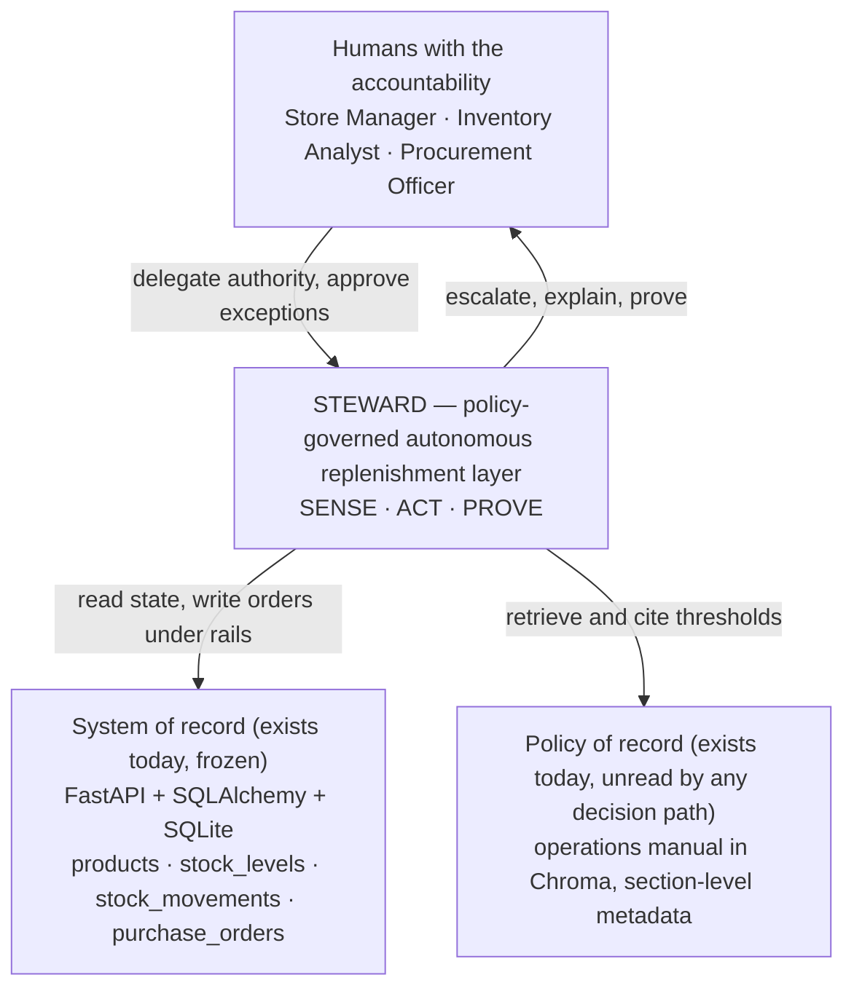
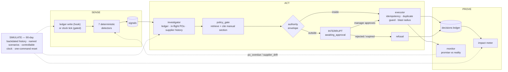

# 02 — Product Vision

> **Status:** PROPOSAL. Expands [00-EXECUTIVE-SUMMARY.md](00-EXECUTIVE-SUMMARY.md) §2 — it does not amend it. Nothing here is user-approved.
> **Purpose:** Fix the product's identity precisely enough that seventeen parallel workstreams build the same thing. Every claim about current state is sourced to [01-GROUNDING-BRIEF.md](01-GROUNDING-BRIEF.md).
> **Audience:** Engineers implementing WS-0…WS-17, and whoever has to defend this in a four-minute demo.

---

## 1. Vision statement (canonical)

Quoted verbatim from the spine, §2. **This is the only wording. Do not paraphrase it in decks, READMEs, or docstrings.**

> **Steward is a policy-governed autonomous replenishment layer for retail inventory.**
>
> It watches stock continuously instead of waiting to be asked. When a product breaches — or is projected to breach — its reorder point, Steward investigates on its own: real consumption from the movement ledger, purchase orders already in flight, supplier lead time and delivery reliability. It reasons over the company's own operations manual to decide what to do. Low-risk replenishment it executes itself, in seconds. High-value decisions it prepares, explains, and hands to a Store Manager with the policy it is obeying attached. It then tracks each order to delivery and escalates when reality diverges from the promise. Every decision it makes — **and every one it declines to make** — is recorded and attributable.

Tagline:

> **"Inventory that runs itself — within the limits you set."**

**One clarification an implementer needs before reading "continuously" literally.** Per AD-8 there are two entry points into the same `SignalEngine.scan()`: a **post-commit hook on stock writes** (always on — this is what gives a sub-second response to a human action in the demo) and an **APScheduler tick that is env-gated and defaults to OFF** (because an always-on scheduler starts during the Phase 1 API test suite — `01-GROUNDING-BRIEF.md` §11). So "continuously" is honest with the sweep enabled, which the demo runbook does. It is not a licence to build an unconditional background loop. This is a reconciliation, not a contradiction — the spine resolves it in AD-8.

### The one-sentence version, for the top of a slide

Steward finds the problem before a human does, decides inside the store's own written policy, executes what it is permitted to execute, refuses what it is not — and can prove both.

---

## 2. Name decision

| | |
|---|---|
| **Primary** | **Steward** |
| **Subtitle** | Autonomous Replenishment Control Tower |
| **Rationale** | A steward manages resources on an owner's behalf, *within delegated authority*. Delegated-authority-with-limits is the entire product thesis; the name carries it for free. |
| **Alternates** | `Sentinel` (over-indexes on detection — drops ACT and PROVE), `Control Tower` (accurate, generic, unownable), `Replenish` (describes the domain, not the differentiator) |
| **Status** | **Reversible taste call. The user may override it at any time, including after implementation starts.** |

### The engineering consequence of "reversible"

**Nothing may depend on the string.** A rename must be a find-and-replace across UI copy and documents only — never a schema change, migration, or route change.

| Surface | Rule |
|---|---|
| Python packages / modules | Named by capability: `src/signals/`, `src/governance/`, `src/policy/`, `src/analytics/`, `src/sourcing/`, `src/simulation/`. **Never `src/steward/`.** |
| API paths | Already name-free in the spine's namespace allocation (§5): `/signals/*`, `/decisions/*`, `/policy/*`. Keep it that way. |
| Table and column names | `signals`, `decisions`, `approvals`, `autonomy_policies` — capability nouns (AD-3). |
| Enum / DB **values** | No product name in any persisted value. `recorded_by` is the `agent` identity from AD-12, not `"steward"`. |
| Env vars | Prefix by concern (`SCHEDULER_ENABLED`, `CLOCK_OFFSET_DAYS`), not by product. |
| Where the name *may* appear | UI chrome, page titles, deck, docs, README, log `service` field. That is the complete list. |

---

## 3. Positioning — the category, and the three things this is not

### Category

Steward is an **agentic operations layer over an existing system of record** — narrow domain (retail replenishment), governed autonomy, auditable by construction. It does not replace the inventory application; it sits above it, holds delegated authority over it, and is accountable for what it does with that authority.

The three layers all exist today. What does not exist is anything in the middle box, and any wire between the policy layer and a decision: the ₹50,000 approval threshold sits in `src/rag/data/inventory_manual.md` §10 line 113 and **is never read by any code path that decides anything** (`01-GROUNDING-BRIEF.md` §7, §16.4).

### What Steward is explicitly not

Each of these is not a strawman. Each is a *thing the current POC already is*, and a thing ~100 cohort POCs will be.

| Not a… | Because the current POC already is one | Steward's inversion | Falsifiable test |
|---|---|---|---|
| **Chatbot** | 100% of AI in the repo lives behind a text box in Streamlit; React has **zero AI** (`§9`). The product *is* the chat. | The co-pilot (C14) is a right-side drawer scoped to the current screen, added in Wave 2 — the **last** surface, not the first. The primary loop runs with nobody typing. | Delete the co-pilot: the product still detects, decides, executes, and proves. Delete the loop: there is no product. |
| **Dashboard** | `GET /dashboard` (`inventory.py:330`) plus four stat cards in `App.jsx`. It reports state and leaves the decision to the reader. | Exception-first control tower (spine §6): what needs a human comes first, totals second. | A dashboard's success metric is *"was it viewed."* Steward's is *"how many breaches were resolved without being viewed."* |
| **Recommendation engine** | This is literally the terminal behaviour of the graph: `inventory_auditor` emits 3–4 sentences of prose and sets `analysis_status="complete"` (`§5`). The **only** human-in-the-loop write gate in the entire system is one Streamlit button (`§9`). | Every run terminates in a state change **and** a ledger row — including runs that decide to do nothing. | Does a completed run produce a row with a `po_id` and an outcome, or only text? |

Two further non-goals, stated so they are not re-proposed (spine §3 REJECT):

- **Not a forecasting product.** No ARIMA, no Prophet, no ML. The manual gives the reorder-point formula in §2 and the EOQ formula in §8 — Steward uses *theirs*, because a formula from the client's own manual is defensible in one sentence and an unexplainable dependency is a liability under a rubric that requires explaining every part of the implementation (`§12`).
- **Not an integration play.** No supplier email, no portal, no webhook. There is no SMTP or outbound channel anywhere in the stack; building one would be theatre.

**The intelligence in this product is in the governance, not in the model.** That sentence is the positioning.

---

## 4. Pillar 1 — SENSE

> Continuous multi-signal detection, not a single "low stock" check.

### What belongs in SENSE

| In | Detail |
|---|---|
| **C1 Signal Engine** | Seven deterministic detectors: `threshold_breach` · `projected_breach` · `po_overdue` · `config_drift` · `supplier_drift` · `capital_drag` · `data_insufficient` |
| **AD-8 triggers** | In-process event bus (`src/core/events.py`), post-commit hook on stock writes, env-gated scheduler tick, run records persisted to `agent_runs` |
| **AD-9 clock** | `src/core/clock.py` — every date comparison in new code goes through it |
| Persistence | A `signals` table **with a read path** |

### What is banned from SENSE

The LLM (AD-2). Detection is arithmetic over the movement ledger. A detector that needs a model call is a detector that stops working at 15 RPM.

### Why it differentiates

Today's detection has three defects, all inherited by anyone following the phase-1 reference implementation:

1. **It only runs when written to.** `check_stock_alerts` (`inventory_service.py:64`) fires as a synchronous side effect of a stock movement. Nothing in the system runs unattended.
2. **It has two types.** Only `"out_of_stock"` and `"low_stock"` are ever generated. `overstock` and `reorder_suggested` are spec'd in the programme docs and never emitted (`§14`).
3. **It is write-only.** `stock_alerts` **has no read path** — no endpoint queries it, `StockAlertResponse` is dead code, and `/stock/low-alerts` recomputes from `products` in Python instead (`§4`). The table also resolves-then-reinserts on every movement below the reorder point, so `is_resolved` means **"superseded," not "remediated"** — unbounded row growth, no dedup, no idempotency.

So the honest baseline metric is the one in spine §7: **0% of breaches detected unattended.** That number is not rhetoric; it is a property of the architecture.

**The four signals a spec-follower will not have** are `projected_breach`, `po_overdue`, `config_drift`, and `data_insufficient`. Three of them require a controllable clock — and `expected_delivery` is **never compared to today anywhere in the codebase** (`§16.3`), despite `expected_delivery`, `received_date`, and `lead_time_days` all already existing. The fourth requires being willing to emit a signal whose content is *"I cannot answer this."*

SENSE is what converts slide 7's *"reactive → proactive"* from an assertion into a timestamp.

---

## 5. Pillar 2 — ACT

> Governed autonomy — investigate, reason over retrieved policy, decide, execute or escalate.

### What belongs in ACT

| In | Detail |
|---|---|
| **C3 Governed Autonomy Loop** | LangGraph: `investigate → policy → decide → durable interrupt → execute → record → monitor` |
| **C4 Policy Engine** | Thresholds and SLAs **retrieved and cited** from the operations manual, plus a manager-controlled Autonomy Policy |
| **C5 Approval Workspace** | Approval inbox, counter-proposal, enforced RBAC, kill switch, blast-radius limits |
| **C11 / C12** | Supplier sourcing with an explicit price-vs-reliability tradeoff; same-supplier PO consolidation |
| Autonomy modes | `off` · `shadow` · `assisted` · `autonomous` (four, per spine §5) |

### The load-bearing mechanism: the authority envelope

Decision-making splits cleanly along the AD-2 boundary:

| Deterministic code | LLM |
|---|---|
| Compute the order quantity and its value | Synthesise the investigation across sources |
| Evaluate it against the authority envelope | Narrate the policy interpretation |
| Choose `execute` or `escalate` | Write the human-readable rationale |
| Write the order | Write the escalation narrative |

**The model never decides whether it is allowed to act.** It writes the paragraph explaining a decision that deterministic code already made. This is the whole answer to *"how do you stop it hallucinating a purchase order?"* — and it is not a hypothetical risk in this repo. The code comment at `src/agents/multi_agent/agents.py:389-406` records the model returning `supplier_id: 101` (the register holds ids 1–5), a unit cost of ₹580.0 against a real ₹600.0, and the caption *"Bulk discount applied for order of 60 bags. Price valid for 30 days"* — **three runs out of three, with `errors: []` and `analysis_status: "complete"`.** That dict was rendered to an operator via `st.json` as a procurement quote.

### Why LangGraph is not gratuitous here

Today's graph is a 104-line serial chain whose only branch is `should_skip_to_audit()`, firing on `len(errors) >= 3` — **an error escape hatch, not a business decision** (`§5`). AD-6 gives it a real reason to exist:

> The approval gate means the run must **suspend and resume**. `interrupt_before=["executor"]` with a checkpointer. When a decision exceeds the authority envelope the graph literally pauses; when a manager approves, it resumes *from the interrupt* and executes.

A recommendation engine never needs this. An approval workflow cannot be built without it.

### Why it differentiates

- Moves the product from **Insight → Recommendation** to **Insight → Decision → Action → Outcome**.
- Policy is *retrieved*, not hardcoded. `if total > 50000` is a magic number an SME can argue with; **"manual §10: Purchase Orders with a total value above ₹50,000 require formal Store Manager approval prior to supplier submission"** attached to a decision record is not.
- **The refusal is an action.** D1's entire beat is the agent declining — and a refusal produces a ledger row, an approval request, and a 403 for the wrong actor.
- Autonomy arrives with brakes (AD-15): idempotency keys on every agent-initiated write, an in-flight duplicate-order guard, blast-radius limits (max POs/hour, max ₹/day, circuit breaker), a global kill switch with a recorded reason, and serialised PO-number allocation because `_next_sequence` is documented in-code as not concurrency-safe (`§4`). **A read-only recommender needs none of this, which is exactly why nobody else will build it.**
- The agent acts as itself. Today `src/service_auth.py` logs in as `admin@retail.com` / `admin`, so **every agent action runs with full manager privilege attributed to "Admin"** (`§15`). AD-12 gives it `agent@retail.com`, role `agent` — free-text column, zero migration — and least-privilege becomes a database row instead of a bullet point.

---

## 6. Pillar 3 — PROVE

> Decision ledger, policy citations, enforced RBAC, shadow-mode backtest, live impact meter.

### What belongs in PROVE

| In | Detail |
|---|---|
| **C6 Decision Ledger & Impact Meter** | Append-only record of every decision **and every refusal**; metrics computed *from* it, never asserted alongside it |
| **C10 Reorder Point Auditor** | Proof about configuration: which reorder points contradict the manual's own §2 formula, and what that costs |
| **C13 Shadow Mode & Backtest** | Deterministic 90-day replay — *"here is what Steward would have done"* — LLM-free, so it is immune to quota |
| Enforced RBAC | The 403 in D1 |
| Human-readable IDs | `SIG-000045` · `DEC-000123` · `APR-000012` · `RUN-000078` |

### Why it differentiates

**Nothing in the system currently records what it did.** Observability is instrumented and inert: structlog is real but **stdout only, no sink**; OpenTelemetry span names are everywhere but **no `TracerProvider` or exporter is configured anywhere under `src/`**, so at runtime `trace.get_tracer()` returns no-op spans; LangSmith is the only real sink and **has no P3 project**, so the best agent in the repo is the one with no tracing (`§8`).

**And nothing currently enforces who may do what.** The only role check in the entire backend is at `auth.py:234`, guarding account creation. The `role` claim is present in the JWT and **is never read for any authorization decision**. All 11 authenticated inventory routes are role-blind — a `staff` token can create and receive purchase orders (`§3`). `App.jsx` decodes the role *"for display only… not used for any access decision"* (`§9`). So the staff 403 in D1 is a genuinely new capability, and it is demonstrable in the room in five seconds.

Three properties fall out of the ledger that cannot be retrofitted:

1. **Refusals are first-class rows.** A system that only records successes cannot be audited, because the interesting question is always *"what did it decline, and why."*
2. **Metrics are derived, not declared.** The impact meter reads the ledger. If the number is wrong, the ledger is wrong, and the ledger is inspectable.
3. **Attribution is honest.** `RUN-000078` was executed by `agent`, approved by `APR-000012`, citing manual §10.

### The honesty boundary is part of PROVE, not a caveat to it

Spine §7 is locked. Restated because implementers will be asked to blur it:

| Computable from this application | Requires real client data — **say so; do not invent it** |
|---|---|
| Detection→action latency vs the manual's documented 24h SLA | ₹ revenue protected by avoided stockouts |
| % of breaches detected unattended (today: **0%**) | FTE hours or headcount saved in absolute terms |
| Manual interaction count (today ≈ 8 UI interactions + 1 hand calculation → 1 approval click) | Human error-rate reduction |
| Days-of-cover at detection; PO cycle time; supplier on-time % | **Anything shaped like "14 days → 3 days" or "95% time saved"** |
| Count and ₹ exposure of reorder points contradicting the manual's formula | |
| Duplicate POs avoided; autonomy rate; policy-compliance rate | |
| Shadow-mode counterfactual: stockout-days avoided across a 90-day replay | |

Note specifically: **"14 days → 3 days, −79%" belongs to the Supply Chain Optimizer / ICD Pilot** cited on slide 10 (`§13`). It is internal precedent, not a Steward result. Reusing it as ours would be the exact credibility failure this document exists to prevent.

Two disclosures to make **voluntarily**, before anyone asks: the 90-day demand history is synthetic; supplier reliability derives from seeded PO history. The math is real; the volumes are illustrative.

---

## 7. Cross-cutting — SIMULATE

> A deterministic demo/simulation harness (C8). Not a pillar, because it produces no user-facing value on its own. Elevated anyway, because without it half the differentiators have no data to run on and the demo does not survive being run twice.

### The problem it solves, stated precisely

From the live database probe (`§10`):

- **All 13 stock movements fall between `2026-08-23 08:50:18` and `2026-08-23 15:56:44` — one calendar day.**
- **Only 3 sale movements exist in the entire database** (−83 units, all product 1).
- Product 1 has 11 movements; products 2 and 4 have one each; **products 3 and 5 have zero.**

There is no demand history. **This is why `demand_forecaster` fabricates** — it is asked for `avg_daily_demand` from a single product snapshot with no sales history in the input (`§5`). Critically: **the cause is a code choice, not a schema limit.**

### Why it is cheap

| Lever | Evidence |
|---|---|
| `StockMovement.recorded_at = Column(DateTime, server_default=func.now())` — a plain column with a server default, so an explicit value overrides it | `src/backend/models.py:132` |
| `PurchaseOrder.order_date` / `received_date` are plain `Date` columns, fully settable | `§2` |
| The seeder already enforces `sum(stock_movements.quantity) == stock_levels.quantity_on_hand` via `verify(db)` | `§10` |

**Backdating 90 days of realistic history requires zero schema changes** — only seeder code — and the existing invariant check makes the backfilled history arithmetically trustworthy rather than merely plausible.

### What SIMULATE must deliver

90-day backdated movement and PO history · named deterministic scenarios (one per demo D1–D4) · a controllable clock (AD-9) so `po_overdue` can be demonstrated without waiting days · one-command reset to a known state · the synthetic-data disclosure surfaced **in the UI**, not only on a slide.

### The inversion worth noting

D4 turns SIMULATE's biggest weakness into the product's strongest credibility moment. Two products in the live DB genuinely have zero movements. Rather than hide that behind a fabricated forecast, the agent **names it**: emits `data_insufficient`, refuses to auto-order, states exactly what data it needs, and offers a conservative option for a human. No baseline POC will do this, because every other demo pretends to certainty.

### The whole loop

---

## 8. Current POC → Steward

Every "Current POC" cell is sourced to `01-GROUNDING-BRIEF.md` or a verified file:line. Nothing in this column is a characterisation; it is all observed behaviour.

| # | Dimension | Current POC (verified) | Steward |
|---|---|---|---|
| 1 | **Trigger** | A human opens a Streamlit tab, types a product id into a `number_input` 1–100, and clicks *"🚀 Run Multi-Agent Audit"* (`§9`) | Post-commit hook on stock writes (sub-second) plus an env-gated scheduler sweep; every run persisted to `agent_runs` (AD-8) |
| 2 | **Detection** | `check_stock_alerts` (`inventory_service.py:64`) as a synchronous side effect of a write; **two** types only; resolves-then-reinserts, so `is_resolved` = "superseded"; **`stock_alerts` has no read path** (`§4`) | Seven deterministic detectors writing to a readable `signals` table with severity and time-remaining (C1) |
| 3 | **Demand numbers** | The LLM is asked for `avg_daily_demand`, `days_of_stock_remaining`, `stockout_risk` **from a product snapshot with no sales history in the input**, then the result is rendered to the operator via `st.json` (`§5`) | Deterministic trailing average over the movement ledger, plus days-of-cover, reorder point, EOQ, supplier reliability — **and a data-sufficiency score** (C2, AD-2) |
| 4 | **Policy handling** | None. The ₹50,000 threshold exists in the corpus at manual §10 line 113 and no decision path reads it. RAG chunks carry **no section metadata**, so a "source" is an anonymous 600-character window (`§7`) | Retrieved from a **separate** Chroma collection with section-level metadata; the cited sentence is attached to the decision record. The graded 21-chunk collection stays byte-identical (C4, AD-13) |
| 5 | **Decision** | None. `inventory_auditor` emits 3–4 sentences of prose and sets `analysis_status="complete"` (`§5`) | Authority-envelope evaluation in deterministic code → `execute` or `escalate`, under one of four autonomy modes, recorded either way (C3) |
| 6 | **Action** | One Streamlit button — *"📝 Create draft purchase order"* — is **the only human-in-the-loop write gate in the entire system** (`§9`). PO status is hard-coded `status=POStatus.draft` at `inventory.py:281`; `submitted` / `acknowledged` / `cancelled` have no code path | `executor` node with idempotency keys, in-flight duplicate guard, blast-radius limits, kill switch, serialised PO numbering (AD-15). The unreachable statuses are reached by **new** endpoints, not schema change (AD-3) |
| 7 | **Human role** | Operator *and* calculator: read `st.json`, do the arithmetic, judge it, click | Approver of exceptions only. The request reads *what I want to do → why → the policy I am obeying → expected impact → **what happens if you do nothing*** (spine §6) |
| 8 | **Post-action monitoring** | None. `expected_delivery` is **never compared to today anywhere in the codebase** (`§16.3`), although one seeded PO already arrived 2 days late | `monitor` node plus `po_overdue` / `supplier_drift` detectors against a controllable clock; escalation when reality diverges from the promise (AD-9) |
| 9 | **Audit** | structlog to **stdout only, no sink**; OTel spans are **no-ops** (no `TracerProvider` under `src/`); LangSmith has **no P3 project** (`§8`) | Append-only `decisions` ledger with human-readable IDs, recording **refusals as first-class rows** (C6) |
| 10 | **Authorization** | The only role check in the whole backend is `auth.py:234` (account creation). The JWT `role` claim is never read for any authz decision. **All 11 authenticated inventory routes are role-blind** — a `staff` token can create and receive POs (`§3`) | Enforced RBAC on the approval action; a `staff` token gets a real 403; managers approve (C5) |
| 11 | **Agent identity** | `src/service_auth.py` logs in as `admin@retail.com` / `admin`, so **every agent action runs with full manager privilege attributed to "Admin"** (`§15`) | `agent@retail.com`, role `agent`, least privilege — free-text column, zero migration. The ledger attributes honestly (AD-12) |
| 12 | **Agent topology** | 4-node serial prompt chain; `graph.py` is 104 lines; **one** conditional edge `should_skip_to_audit()` firing on `len(errors) >= 3` — an error escape hatch, not a business decision (`§5`) | Same four node names (test constraint) **plus** `investigator`, `policy_gate`, `executor`, `monitor`. Separation by **authority and data source, never by prompt**, and a **durable interrupt** so the run suspends and resumes (AD-6, AD-7) |
| 13 | **Supplier reasoning** | `supplier_coordinator` fetches the real catalog then **overwrites every LLM-supplied fact**, because there is no supplier-price entity to quote from; `cost_basis` honestly reads *"product.cost_price (standard cost) × recommended_quantity"* (`§5`) | `supplier_products` catalog, reliability scoring from delivery history, sourcing choice with an explicit price-vs-reliability tradeoff (C11) |
| 14 | **UI surface** | **Two apps, two URLs.** All AI in Streamlit (600 lines, 4 tabs); all business UX in React (**1136-line single file, zero AI**) (`§9`) | One React product: Control Tower → Signals → Approvals → Decisions → Inventory → Suppliers → Impact, plus ⌘K and a context-scoped co-pilot drawer. Streamlit demoted to internal Agent Console (AD-10) |
| 15 | **Data foundation** | 13 movements inside **one calendar day**; **3** sale movements total; 2 of 5 products have **zero** movements (`§10`) | 90-day backdated deterministic history, named scenarios, controllable clock, one-command reset — **zero schema change** (C8, `§16.1`) |
| 16 | **Cold-start SKU** | Forecast fabricated with confidence and no error flag | `data_insufficient` signal; refuses to auto-order; states exactly what data it needs; offers a conservative human option (D4) |
| 17 | **One-line pitch** | *"I built an inventory chatbot with a RAG manual, and four agents that produce a recommendation."* | *"I built an inventory system that watches itself, decides inside the store's own written policy, executes what it's allowed to, refuses what it isn't — and can prove both."* |

---

## 9. Why this wins against ~100 near-identical baseline POCs

### The baseline is not a guess. It is a published artifact.

The programme's phase user-story documents ship near-complete reference implementations — full models, full agent code, full prompt strings, the full manual text (`§12`). Measured:

| Phase doc | Total lines | Lines inside code fences | Share of doc that is code |
|---|---|---|---|
| `phase1-fullstack-crud.md` | 289 | 184 | 64% |
| `phase2-rag-application.md` | 261 | 210 | 80% |
| `phase3-context-engineering.md` | 169 | 133 | 79% |
| `phase4-mcp-chat-interface.md` | 212 | 161 | 76% |
| `phase5-multi-agent.md` | 253 | 209 | 83% |
| **Total** | **1,184** | **897** | **~76%** |

`phase5-multi-agent.md`'s section headings are literally *"2. State Schema (multi_agent/state.py)"*, *"3. Agents (multi_agent/agents.py)"*, *"4. Graph (multi_agent/graph.py)"* — a reference implementation delivered file by file. The spec pins **exactly 5 tools** in P3, **exactly 6 MCP tools** in P4, and a **9-field state with 4 fixed-order agents and `should_skip_to_audit`** in P5.

Two consequences:

1. **Anyone following the docs lands on materially identical code.** That is why `SCORING_RUBRIC.md` §6 runs code-similarity checks against the same cohort.
2. **Doing the mandated things *better* cannot differentiate.** `Phase_Score = (Tests_Passed / Total_Tests) × 100`, and *"Tier is determined solely by number of phases cleared."* There is **no stand-out, bonus, or stretch-goal rubric anywhere in the corpus** (`§12`). **No feature added here can raise the graded score.** Differentiation is therefore entirely a presentation-layer bet — which means it must be in the *shape* of the system, because the substance is mandated.

### What a spec-follower structurally cannot have

Not "will probably not build" — *cannot*, because the reference implementation forecloses it.

| A spec-follower cannot have | Why the reference implementation forecloses it | Steward's mechanism |
|---|---|---|
| **A timestamp proving unattended detection** | There is no trigger in the reference design. Detection is a side effect of an inbound request; nothing runs on its own. | AD-8 event bus + post-commit hook + gated sweep. Turns "0% unattended" into a measurable delta |
| **A demand figure that survives *"where did that number come from?"*** | The reference `demand_forecaster` prompt asks the LLM for the number from a snapshot with no history. Everyone inherits the same fabrication — and the same `supplier_id: 101` failure mode at `agents.py:389-406` | C2 deterministic analytics behind the AD-2 boundary |
| **A cited policy sentence attached to a decision** | The reference RAG uses `chunk_size=600` with no metadata, `k=4`, plain similarity, no MMR, no threshold. A citation is an anonymous 600-char window (`§7`) | AD-13 separate collection with section-level metadata; C4 attaches the sentence to the decision |
| **A run that suspends and resumes** | The reference graph has one conditional edge and it is an error handler. No checkpointer, no interrupt, nothing to suspend for | AD-6 `interrupt_before=["executor"]`, with a documented state-JSON fallback so no stream can be blocked by it |
| **A 403** | One role check exists, at account creation. The `role` claim is decoded for display only. Enforcing RBAC is not in any user story | C5 enforced RBAC on approval |
| **A record of a decision *not* taken** | Nothing records anything the agent did, let alone declined. `stock_alerts` — the closest thing to a record — has no read path | C6 ledger, refusals as first-class rows |
| **A demo that runs identically twice** | No backdated seed, no clock abstraction, no named scenarios. `received_date = date.today()` is hard-coded in `receive_purchase_order` (`inventory_service.py:137`) † | C8 + AD-9 |
| **An answer to *"what about bad data?"* that is a feature rather than an apology** | The reference design's only response to missing history is to ask the model anyway | D4 + the `data_insufficient` signal |
| **A safety-rail story** | A read-only recommender has no need for idempotency, duplicate guards, blast radius, or a kill switch, so none are specified | AD-15 |
| **A single-app product experience** | The reference architecture *is* two apps: phase-1 CRUD UI plus a phase-3/4/5 Streamlit surface | AD-10 |
| **A counterfactual** | Nothing replays history, because there is no history to replay | C13 shadow mode / 90-day LLM-free backtest |

† **Citation correction, flagged rather than applied silently.** `01-GROUNDING-BRIEF.md` §4 cites `received_date = date.today()` at `inventory_service.py:133`. Re-verified against source: `receive_purchase_order` is defined at `:125`, `po.status = POStatus.received` is at `:136` (as the brief states), and `po.received_date = date.today()` is at **`:137`**. Line `:133` is the unreachable `if po.status == POStatus.cancelled:` guard. The behavioural claim in the brief — receipts cannot be backdated — is correct and unaffected; only the line number is off by four. Owner of `01-GROUNDING-BRIEF.md` to reconcile.

### Why it is affordable

The differentiators are cheap because the current codebase happens to be unusually well-positioned for them (`§16`): `recorded_at`, `order_date`, and `received_date` are all settable → realistic history costs **zero migrations**; the movement-ledger invariant makes backfilled history trustworthy; the **₹50,000 threshold and 24h SLA are already in the RAG corpus** → policy can be retrieved rather than hardcoded; `User.role` and `StockAlert.alert_type` are free-text `String` columns → an `agent` identity and seven new signal types need **no migration**; `create_all` is additive → **new tables are free**; the action rail already works end-to-end (agent → `create_purchase_order` → `POST /orders` → DB), so **agents can already act — they lack something worth doing**; and `rag_knowledge_base` already sits alongside the live API tools, so the policy-plus-data reasoning pattern is proven in-repo.

### What does not differentiate — do not spend time here

More tools (P3 is hard-locked at `assert len(agent.tools) == 7`). More agents. More LLM calls. A prettier chat. ARIMA or Prophet. Voice. Multi-warehouse. ABC analysis — **it is not in the manual, so a properly grounded agent will correctly refuse to discuss it**, and grounding a feature in policy you do not have is precisely the credibility trap this design exists to escape. See spine §3 REJECT.

### The honest counter-position

A reviewer scoring the graded rubric will see **zero** benefit from any of this. That is accepted and deliberate. The graded reviewers and the presentation judges are different people, and `docs/program/` never mentions the presentation at all (`§13`). Steward is built for the second audience — Account Delivery Heads and SMEs, business-outcome focused (slide 2) — while the frozen `tests/phase*` suites and the untouched Phase 3 executor protect the first.

---

## 10. The five product principles

An implementer should be able to recite these from memory and apply them without reading anything else.

| # | Principle | Derived from | One-line rationale | Tripwire — what a reviewer checks |
|---|---|---|---|---|
| **P1** | **Code decides. The model explains.** | AD-2 | Every number a human can challenge must be reproducible without a model call — and when Gemini's 15 RPM / 1,500 RPD free tier throttles mid-demo, the loop still detects, computes, and executes; you only lose the prose. | Grep the analytics, detector, envelope-evaluation, and executor paths for any LLM invocation. There must be none. |
| **P2** | **Never a new column on an old table.** | AD-3, AD-4, AD-5 | There is no Alembic and no migrations directory; `create_all` is additive, so new tables are free while a new column means dropping the database — therefore all new relationships point new → old. | `decisions` holds `po_id`; `purchase_orders` gains nothing. New models live in `models_governance.py` / `models_analytics.py` / `models_simulation.py`, never in `models.py`. |
| **P3** | **If a human must approve it, the run must be able to sleep.** | AD-6 | An approval gate that blocks a thread or fires-and-forgets is not a workflow; durable suspend-and-resume is the only honest implementation, and it is the entire answer to *"why LangGraph?"* | Kill the process between escalation and approval. On restart, approving must resume the same run at `executor` — not start a new one. |
| **P4** | **The agent is a user, with a name and less power than you.** | AD-12 | Today every agent write executes with full manager privilege attributed to "Admin," which makes both the audit trail and the least-privilege claim false. | No agent code path authenticates as `admin@retail.com`. Ledger rows for autonomous actions show actor `agent`, and approval attribution lives in `approvals`. |
| **P5** | **Autonomy ships with brakes — and says what it cannot know.** | AD-15 + spine §7 | A background process that writes to the business needs idempotency, a duplicate guard, blast-radius limits, and a kill switch to be a product rather than an incident; and any figure that would require real client data is named as such rather than invented. | Replay an agent write twice → one PO. Order a SKU with an in-flight PO → refusal. Trip the circuit breaker → autonomy pauses with a recorded reason. Search every artifact for an ROI percentage; there should be none. |

**The compressed form, for a whiteboard:** *code decides, the model explains · new tables only · the run must sleep · the agent is a user · brakes and honesty are features.*

---

## 11. The four-minute test

### The three sentences

If a judge or SME can repeat these three sentences back unprompted, the demo worked. If they can only repeat one, it must be the second.

1. **"It found the problem itself, before anyone asked — and it showed me the timestamp."**
2. **"It refused to place the order on its own, because the store's own manual says anything over ₹50,000 needs a manager — and it showed me that sentence."**
3. **"Every decision it made, and the one it wouldn't make, is on a record I can look up by number."**

Sentence 1 is SENSE. Sentence 2 is ACT — and it is the one that lands, because a machine declining to act is counter-intuitive and therefore memorable. Sentence 3 is PROVE, and it is what makes the first two believable a week later.

### What earns each sentence

| Time | On screen | Earns |
|---|---|---|
| 0:00–0:45 | Control Tower home. Signals with timestamps and time-remaining, generated with nobody logged in. State out loud: *today this number is zero, because nothing runs without an inbound request.* | Sentence 1 |
| 0:45–2:30 | **D1 The Refusal.** Breach → investigation over real ledger consumption and in-flight POs → value computed above ₹50,000 → **refusal**, citing manual §10 → approval inbox → a staff login gets a **403** → manager approves → **the graph resumes from its interrupt** → PO created → ledger row | Sentence 2 |
| 2:30–3:30 | The decision record `DEC-000123`: numbers used, policy sentence cited, action taken. Then scroll to the refusal row directly above it. | Sentence 3 |
| 3:30–4:00 | Impact meter, computed from the ledger — **and the honesty split said out loud**: this is arithmetic on our data; ₹ revenue protected needs yours | Credibility |

### What they must not be able to say

| Anti-goal | Why it means the demo failed |
|---|---|
| *"It's a chatbot for inventory."* | The co-pilot was shown before the loop, or at all. |
| *"It gave me a recommendation."* | The refusal and the ledger row were not visible as outcomes. |
| *"It cut procurement from 14 days to 3."* | That is the ICD Pilot's number from slide 10, not ours. Repeating it is invented ROI. |
| *"I'm not clear what's real versus generated."* | The synthetic-history disclosure was buried instead of volunteered. |

### The failure mode to guard

Slide 6 is explicit: *"Avoid deep technical layers — show the flow, not the plumbing,"* and *"narrate the 'so what' at every step."* **If forty seconds go on explaining LangGraph, checkpointers, or node topology, all three sentences are lost.** The correct phrasing of the architecture, for this audience, is one line: *code decides, the model explains.* Keep D4 in reserve — it is the answer to *"what about bad data?"*, not part of the run.

---

## 12. Where this vision becomes concrete

| This document establishes | Made buildable in |
|---|---|
| Locked decisions AD-1…AD-15, C1…C20, D1…D4, WS-0…WS-17 | [00-EXECUTIVE-SUMMARY.md](00-EXECUTIVE-SUMMARY.md) |
| Every current-state fact cited above | [01-GROUNDING-BRIEF.md](01-GROUNDING-BRIEF.md) |
| The seven missing layers, the LangGraph redesign, the AD-2 boundary in code | [11-TARGET-ARCHITECTURE.md](11-TARGET-ARCHITECTURE.md) |
| Signal types, decision lifecycle, autonomy modes, ID conventions, API namespace allocation | [15-SHARED-CONTRACTS.md](15-SHARED-CONTRACTS.md) |
| Wave structure and stream ownership behind P2's conflict rules | [14-PARALLEL-WORKSTREAMS.md](14-PARALLEL-WORKSTREAMS.md) |
| What blocks what, and why WS-0 must finish first | [16-DEPENDENCY-GRAPH.md](16-DEPENDENCY-GRAPH.md) |
| Execution order and the cut line after step 5 | [17-CLAUDE-CODE-EXECUTION-PLAN.md](17-CLAUDE-CODE-EXECUTION-PLAN.md) |
