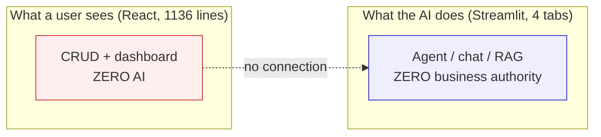

# 03 — Current-State Weaknesses

> **Status:** Proposal input. Nothing here is approved.
> **Purpose:** An honest, evidence-backed account of what POC-07 actually does today, so that every capability in [05-DIFFERENTIATING-CAPABILITIES.md](05-DIFFERENTIATING-CAPABILITIES.md) is answering a real deficiency rather than a hypothetical one.
> **Authority:** Facts here derive from [01-GROUNDING-BRIEF.md](01-GROUNDING-BRIEF.md). Where documentation and code disagreed, the code won.

---

## 1. The one-sentence assessment

POC-07 is a **competently built read-only advisory system wearing the vocabulary of an autonomous one**. It has five phases of working software, a real RAG pipeline, a real tool-using agent, and a real multi-node graph — and across all of it there is exactly **one** code path where a human decision causes the system to write a business record, and exactly **one** of seven agent tools that mutates state.

That is not a criticism of the engineering. It is a description of the shape.

---

## 2. Capability split: agentic vs AI-assisted vs conventional

The word "agentic" is doing a lot of unearned work in the current system. Here is the honest partition.

### 2.1 Genuinely agentic

| What | Why it qualifies | Evidence |
|---|---|---|
| Phase 3 ReAct executor | The model chooses **which** tools to call, in what order, and when to stop. Control flow is genuinely model-determined. | `AgentType.STRUCTURED_CHAT_ZERO_SHOT_REACT_DESCRIPTION`, `max_iterations=10` |
| `rag_knowledge_base` sitting beside live API tools | The agent decides at runtime whether a question is a *policy* question or a *data* question. That is real routing over heterogeneous sources, and it is the single best architectural idea in the repository. | 7-tool registry in `src/agents/agent.py` |

**That is the complete list.** Two items.

### 2.2 AI-assisted, not agentic

| What | Why it does not qualify |
|---|---|
| Phase 4 MCP chat | The tool surface is real, but the loop is a single request/response with **no memory**. `get_history_for_llm()` exists and is **never called** — so it cannot even reason across two turns of the same conversation. |
| Phase 5 "multi-agent" graph | Four nodes execute in a **fixed serial order**. The only conditional edge is an error escape hatch. No node chooses what happens next; no node calls a tool; no node writes anything. The LLM writes prose at four points along a hardcoded rail. |
| Phase 2 RAG | A retrieval chain. Valuable, but `RetrievalQA` with `chain_type="stuff"` and `k=4` is a lookup, not an agent. |

### 2.3 Conventional CRUD with no AI involvement whatsoever

| What | Scale |
|---|---|
| The entire React application | 1,136 lines, 5 nav destinations, 5 modals, **zero** AI features. The primary user-facing product surface has no contact with any agent. |
| 11 of 13 inventory API routes | Create/read/list over products, suppliers, stock, orders. |

### 2.4 The structural consequence

**The intelligence and the product are in two different applications that do not talk to each other.** This is the single biggest structural fact about the current system, and it is why no amount of polishing either half produces a coherent product.

---

## 3. Ranked weakness register

Ordered by *how much it costs you in front of an evaluator*, not by how hard it is to fix.

| # | Weakness | Evidence | What it costs you | Addressed by |
|---|---|---|---|---|
| **W1** | **The pipeline terminates in prose.** Five phases of analysis produce a paragraph. No node in the Phase 5 graph takes any action; the graph is read-only and ends in text. | `src/agents/multi_agent/graph.py` — no node performs a write | The obvious question — *"and then what happens?"* — has no answer. Every reviewer asks it. | C3, C6 |
| **W2** | **The demand numbers are fabricated.** `demand_forecaster` asks an LLM to produce a forecast from a **current stock snapshot** with no sales history attached. The model returns confident numbers with no basis. | `agents.py:194-262`; only 3 sale movements exist in the DB, all within one calendar day | An SME who asks "where did 45 units/week come from?" gets no defensible answer. This is a credibility kill-shot. | C2, C8 |
| **W3** | **Zero autonomy.** There is no scheduler, no background task, no cron, no queue, no polling loop anywhere in the codebase. Every "agentic" action requires a human to press a button first. | No APScheduler, Celery, or `asyncio` task in `requirements.txt` or `src/` | The system cannot be described as agentic in any operational sense. It is a very good assistant that only speaks when spoken to. | C1, WS-10 |
| **W4** | **No approval workflow — despite every ingredient being present.** The RAG corpus contains a **₹50,000 Store Manager approval threshold** (§10). `User.role` exists with manager/staff values. Neither is ever consulted before a write. | Corpus §10 line 113; `models.py:186`; the only role check in the entire backend is `auth.py:234` | The governance story — the thing enterprise buyers actually care about — is entirely absent while its raw materials sit unused in the repo. | C4, C5 |
| **W5** | **No audit record of anything.** There is no table, log sink, or file recording that the agent analysed anything, recommended anything, or why. structlog writes to stdout with no configured sink. | No audit/decision/event table among the 8 models | "Show me what the agent did last week" is unanswerable. Accountability is the precondition for autonomy, and it does not exist. | C6 |
| **W6** | **Alerts are inert, write-only rows.** `check_stock_alerts` **resolves the existing alert and reinserts a new one** on every call — so `is_resolved` means "superseded", not "remediated". There is **no read path**: no endpoint, no UI, nothing consumes `stock_alerts`. | `stock_alerts` table has no `GET` route among the 13 verified endpoints | The system generates a signal and then discards it. This is the clearest example of the "looks like a feature, does nothing" pattern. | C1 |
| **W7** | **`expected_delivery` is never compared to today.** The column exists. `lead_time_days` exists. `received_date` exists. Nowhere in the codebase is a delivery date checked against the current date. | Live DB contains a PO that arrived **2 days late** against a promised 5-day lead time — and nothing noticed | The most obvious operational exception in inventory management — *the truck is late* — is invisible to the system despite all three required fields being populated. | C1, C11 |
| **W8** | **`supplier_coordinator` has nothing to coordinate, and hallucinates when asked to.** `Product.supplier_id` is a single FK; there is **no supplier-price entity**. So multi-supplier comparison is structurally impossible. When the node asks the LLM anyway, the code **overwrites the model's output with real values** — because in 3/3 recorded runs the model invented `supplier_id: 101`, a price of ₹580.0 against a real ₹600.0, and a fabricated caption *"Bulk discount… Price valid for 30 days."* | `agents.py:318` overwrite; the incident recorded in the comment at `agents.py:389-406` | A node named for a capability the data model cannot support. The fix in place (overwrite the LLM) is correct but proves the node contributes nothing. | C11, C2 |
| **W9** | **A reorder point cannot be changed.** There is no product-update endpoint. `POST /products` exists; `PATCH`/`PUT` do not. | 13 verified routes, none of them a product update | The system's most important tuning parameter is immutable through the API. Any capability that involves *correcting configuration* is blocked. | C10 |
| **W10** | **3 of 5 PO statuses are unreachable.** `POStatus` declares five values; `create_purchase_order` hard-codes `POStatus.draft` and `receive_purchase_order` sets `received`. `submitted`, `acknowledged`, `cancelled` are never written. `open_po_count` counts two statuses that can never exist. | `inventory.py:281`; `inventory_service.py:193`; the `cancelled` guard at `inventory_service.py:133` reads a value nothing writes | A dashboard metric that is structurally always zero. The procurement lifecycle is two states wide. | C3, WS-9 |
| **W11** | **The action surface is role-blind.** All 11 authenticated inventory routes accept any valid token. The JWT carries a `role` claim that is **never read**. A warehouse staff account can create a purchase order of unlimited value. | `role` claim minted but never checked outside `auth.py:234` | The RBAC story is a claim, not a control. This is the fastest thing for a technical reviewer to disprove live. | C5 |
| **W12** | **Partial receipt is impossible and receipts cannot be backdated.** `receive_purchase_order` sets `received_date = date.today()` unconditionally and computes `qty = item.quantity_received or item.quantity_ordered` — so a supplier who ships 80 of 100 units cannot be recorded. | `inventory_service.py:137`, `:140` | Blocks realistic supplier-reliability scoring, and blocks seeding believable history through the service layer. | C8, C11 |
| **W13** | **MCP is imported, not spoken.** FastMCP declares 6 tools over stdio, but `chat_interface.py:34-41` **imports the functions directly** and rewraps them at `:80-142`. The protocol is never exercised. | In-process import bypass | "We use MCP" is true of the dependency list and false of the runtime. A reviewer who knows MCP will notice. | C19 (optional) |
| **W14** | **Phase 4 chat is stateless.** Session history is stored and `get_history_for_llm()` is defined — and never invoked. | Never called anywhere | A chat that cannot remember the previous sentence is not a conversation. | C14 |
| **W15** | **OpenTelemetry is instrumented but inert.** Spans are created; **no `TracerProvider` is configured anywhere under `src/`**, so every span is a no-op. LangSmith is the only real sink, and there is **no P3 project** configured. | No provider registration | Observability exists as a dependency and an import, not as a signal. | WS-17 |
| **W16** | **`quantity_reserved` is dead.** `quantity_available` is computed as `quantity_on_hand - quantity_reserved`, and `quantity_reserved` is **never written by any code path**. So available always equals on-hand. | `models.py:107-121` | The one piece of allocation semantics in the model is decorative. | C17 (optional) |
| **W17** | **Two-app UI split.** See §2.4. The AI lives in Streamlit; the product lives in React; neither knows the other exists. | Two separate applications | Forces a demo to tab between two products and explain that they are one. | C7, AD-10 |
| **W18** | **The history is one calendar day deep.** All 13 stock movements fall between `2026-08-23 08:50:18` and `2026-08-23 15:56:44`. Two of five products (IDs 3 and 5) have **zero** movements. Only 3 movements are sales. | Live DB probe | Every trend, average, velocity, or seasonality claim is unsupportable. This is the root cause of W2. | C8 |

---

## 4. The weakness behind the weaknesses

W2, W7, W8, W11, and W18 share one root: **the system was built to satisfy per-phase acceptance tests, and the tests do not require a coherent operational world.** A forecast node passes its test by returning a dict with the right keys. A supplier node passes by returning a quote shape. Nothing in the graded surface asks whether the numbers mean anything.

This is worth stating plainly because it defines the opportunity: **the differentiator is not more features. It is a system whose numbers survive being questioned.**

---

## 5. What is genuinely good and must be preserved

An honest register cuts both ways. These are real assets, and [00-EXECUTIVE-SUMMARY.md](00-EXECUTIVE-SUMMARY.md) AD-11 exists specifically to protect them.

| Asset | Why it matters | Protection |
|---|---|---|
| **The 7-tool ReAct agent with RAG alongside live API tools** | Genuinely the best idea in the repo — runtime routing between policy knowledge and live data. Also the single hardest test lock: `assert len(agent.tools) == 7`. | Frozen. New tools go to MCP. (AD-11) |
| **The movement-ledger invariant** — `sum(stock_movements.quantity) == stock_levels.quantity_on_hand`, enforced by `verify(db)` in the seeder | This is what makes every derived metric defensible. It is the foundation the entire impact story rests on. | Extended, never broken. Backfill must preserve it. |
| **The idempotent seeder with a verification step** | Rare in a POC. Makes deterministic demos possible at all. | Extended into the simulation harness (C8). |
| **1,136 lines of working React CRUD** | Real forms, real modals, real validation, real error handling. Rewriting this from scratch would be vandalism. | Decomposed and re-skinned, not replaced. (AD-10, WS-6) |
| **Reusable service-layer functions** | `inventory_service.py` separates business logic from routing, so new endpoints can reuse it rather than duplicate it. | Called by new routers. |
| **A 5-value `POStatus` enum and free-text `alert_type`/`role` columns** | Headroom that costs zero migrations. Three PO states and any number of signal types are reachable without touching the schema. | Exploited. (AD-3) |
| **Settable `recorded_at` / `order_date` / `received_date`** | Plain columns, not server-managed. Realistic 90-day history costs **zero migrations**. | The basis of C8. |
| **Existing structlog + OTel + LangSmith instrumentation** | The wiring is present; only the sinks are missing. Cheap to activate. | WS-17. |

---

## 6. Weakness → capability coverage check

Every weakness above maps to at least one locked capability. Nothing in the register is unaddressed, and nothing in the capability set exists without a weakness behind it.

| Weakness | C1 | C2 | C3 | C4 | C5 | C6 | C7 | C8 | C10 | C11 | C14 |
|---|---|---|---|---|---|---|---|---|---|---|---|
| W1 pipeline ends in prose | | | ● | | | ● | | | | | |
| W2 fabricated demand | | ● | | | | | | ● | | | |
| W3 zero autonomy | ● | | ● | | | | | | | | |
| W4 no approval workflow | | | ● | ● | ● | | | | | | |
| W5 no audit record | | | | | | ● | | | | | |
| W6 inert alerts | ● | | | | | | ● | | | | |
| W7 `expected_delivery` unused | ● | | | | | | | | | ● | |
| W8 supplier node hallucinates | | ● | | | | | | | | ● | |
| W9 reorder point immutable | | | | | | | | | ● | | |
| W10 unreachable PO states | | | ● | | | | | | | | |
| W11 role-blind actions | | | | | ● | | | | | | |
| W12 no partial receipt | | | | | | | | ● | | ● | |
| W13 MCP not spoken | | | | | | | | | | | |
| W14 stateless chat | | | | | | | | | | | ● |
| W15 inert OTel | | | | | | ● | | | | | |
| W16 dead `quantity_reserved` | | | | | | | | | | | |
| W17 two-app split | | | | | | | ● | | | | |
| W18 one-day history | | ● | | | | | | ● | | | |

**Deliberately uncovered:** W13 (MCP protocol) and W16 (`quantity_reserved`) map only to OPTIONAL capabilities C19 and C17. Both are honest-to-leave: neither changes what the product *does*, and both are defensible in Q&A as known, scoped-out items.

---

## 7. What a reviewer will attack first

Ranked by how quickly it can be disproved live, because this is the order in which the current system fails an adversarial demo.

1. **"Create a PO as the warehouse staff account."** → It succeeds. RBAC disproved in 15 seconds. *(W11)*
2. **"Where did that forecast number come from?"** → No answer exists. *(W2, W18)*
3. **"Show me the audit trail."** → Nothing to show. *(W5)*
4. **"What happens after the agent finishes?"** → Nothing. *(W1)*
5. **"Does it run when nobody is watching?"** → No. *(W3)*
6. **"This PO is 2 days late — did the system notice?"** → No. *(W7)*

Each of these is a locked capability in the proposed build. That is not a coincidence — the capability set was derived from this list.

---

**Next:** [04-OPPORTUNITY-SPACE.md](04-OPPORTUNITY-SPACE.md) enumerates the full space of responses before pruning it to the locked set.
