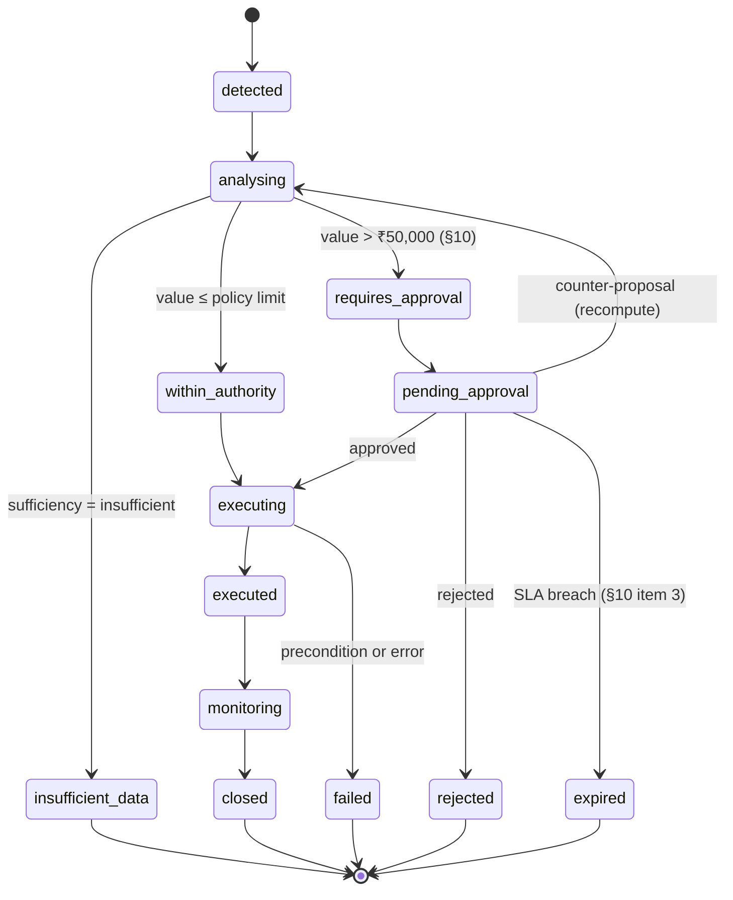
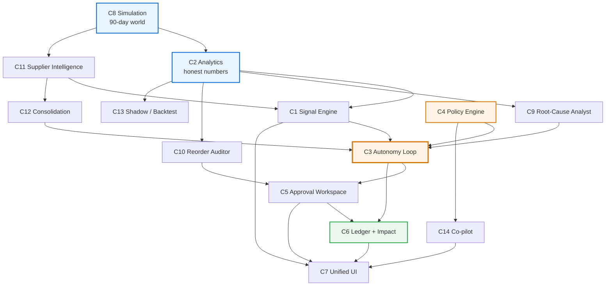

# 05 — Differentiating Capabilities

> **Status:** Proposal. Nothing here is approved.
> **Purpose:** Specify every MUST BUILD and HIGH VALUE capability (C1–C14) in the mandated seven-part format, so each one can be judged on business merit before a line of code is written.
> **Format:** Business problem → System behaviour → Agent reasoning → Action → Human involvement → Outcome → Measurable impact.
> **Rule applied throughout:** per **AD-2**, every subsection states which parts are **deterministic code** and which the **LLM** contributes. No ROI figure is invented; where a stakeholder would want ₹ or hours, the required client data is named instead.

---

## 0. The grounding audit — what the manual actually authorises

Before the capabilities, the receipts. Everything below is quoted from `src/rag/data/inventory_manual.md`, the corpus the RAG pipeline already indexes. **This is what makes Steward's policies retrieved rather than invented.**

| Manual reference | Verbatim | Authorises |
|---|---|---|
| §3, line 33 | `reorder_point = (average daily demand × supplier lead time) + safety stock` | C2 reorder-point maths, C10 audit |
| §3, line 35 | *"A product selling 10 units per day with a 5-day supplier lead time and 2 days of safety stock requires a reorder point of `(10 × 5) + (10 × 2) = 70 units`"* | Safety stock is **days of demand** — the formula is fully determined |
| §4, line 41 | *"Triggered when `quantity_available ≤ reorder_point`… action should be taken within **24-48 hours**"* | C1 `threshold_breach` + its SLA |
| §4, line 43 | *"Triggered when `quantity_available = 0`. This is a **critical** alert requiring immediate action. **Lost sales occur** with every customer request while stock remains at zero."* | C1 severity model; the business cost framing |
| §4, line 45 | *"The system **may also suggest reorder quantities based on historical consumption patterns**."* | **C2 in its entirety.** The manual asks for exactly the velocity-based analytics the current code fakes |
| §4, line 47 | *"All stock alerts can be resolved once a purchase order is **submitted** and received. Resolved alerts remain stored in the **audit log** for historical reporting."* | **C6 Decision Ledger is named in the manual.** Also: resolution belongs on *submit*, which the current resolve-then-reinsert logic violates |
| §5, lines 53-57 | The five PO statuses, each defined | C3's PO lifecycle; makes `submitted`/`acknowledged`/`cancelled` *required*, not optional |
| §5, line 59 | `PO-{YEAR}-{NNNN}` | Existing `_next_sequence` format is correct |
| §6, line 74 | *"Supplier selection criteria include price competitiveness, lead time reliability, quality compliance, and payment terms. Procurement staff must **verify a supplier is active before raising a PO**."* | C11 scoring dimensions **and** an execution precondition |
| §9, line 98 | `EOQ = √( (2 × annual_demand × ordering_cost) / holding_cost_per_unit )` | C12 consolidation — the `ordering_cost` term is why consolidating is worth anything |
| §9, line 102 | `reorder_quantity = (5 × 7) + (5 × 14) = 35 + 70 = 105 units` | C2 order-quantity rule: cover lead time + safety period |
| §10, item 1 | *"Monitoring low_stock and out_of_stock alerts **daily**."* | C1's scheduled tick cadence |
| §10, item 2 | *"**Reviewing supplier catalogs for optimal pricing and delivery lead times**."* | **C11 multi-supplier comparison is a documented staff duty**, not a feature I invented |
| §10, item 3 | *"Raising POs within **24 hours** of a low_stock alert trigger."* | C6's only *documented* baseline metric |
| §10, item 4 | *"Confirming supplier acknowledgement and **expected delivery dates**."* | C11 overdue detection |
| §10, line 113 | *"**PO Approval Threshold:** Purchase Orders with a total value above **₹50,000** require formal **Store Manager** approval prior to supplier submission."* | **C4 and C5 in one sentence** |
| §13, line 136 | *"Slow-moving stock: Products with no stock movement in **30+ days**."* | C15 dead-stock (optional) |
| §13, lines 137-139 | stock turn = COGS / avg inventory value; fill rate; days on hand = `quantity_on_hand / average daily sales` | C6 Impact Meter definitions |

**The significance:** fourteen of the capabilities below are implementations of duties the manual already assigns to humans. Steward is not inventing a job. It is taking over a documented one — and citing the document while it does.

> **Note on the graded corpus.** AD-13 stands: the 21-chunk collection is not edited. Everything above is *already* in it. The separate policy collection exists to add **section-level metadata** so a citation reads "§10, PO Approval Threshold" instead of an anonymous 600-character window.

---

## C1 — Signal Engine `MUST BUILD`

### 1. Business problem
Nothing in the current system initiates. `check_stock_alerts` writes rows to `stock_alerts` that **no endpoint reads and no screen displays**, and it resolves-then-reinserts on every call so `is_resolved` means "superseded" rather than "remediated". Meanwhile the manual instructs the Procurement Officer to monitor alerts *daily* (§10) — a human polling task the system leaves entirely to the human. And the most common real exception in inventory management, *the delivery is late*, is invisible: `expected_delivery`, `lead_time_days` and `received_date` all exist and are never compared to the current date. The live database contains a PO that arrived **two days late** and nothing noticed.

### 2. System behaviour
A detection layer with two entry points (AD-8): a **post-commit hook** on any stock write, and a **scheduled tick** (env-gated, default OFF) whose daily cadence is grounded in §10 item 1. Each run evaluates seven detectors and writes to a new `signals` table with severity, evidence, and a stable dedup key. Signals are **read** — by the Control Tower, the Signals inbox, and the autonomy loop.

Seven detectors, every one deterministic:

| Signal type | Detection condition | Grounding |
|---|---|---|
| `threshold_breach` | `quantity_available ≤ reorder_point` | §4 line 41 verbatim |
| `projected_breach` | `quantity_available − (velocity × lead_time_days) ≤ safety_stock` — will cross before replenishment can arrive | §3 line 33 rearranged; §4 line 45 authorises consumption-based suggestion |
| `po_overdue` | `expected_delivery < clock.today()` AND `received_date IS NULL` AND status ∉ (`received`, `cancelled`) | §10 item 4 |
| `config_drift` | `abs(configured_reorder_point − computed_reorder_point) / computed > tolerance` | §3 line 33 vs. measured velocity |
| `supplier_drift` | Rolling on-time rate below a floor, or mean lateness trending up | §6 line 74 "lead time reliability" |
| `capital_drag` | `days_on_hand > threshold` with no offsetting demand | §13 line 139 |
| `data_insufficient` | Movement history below the minimum C2 requires to compute a defensible velocity | §4 line 45 — the manual conditions suggestions on *historical* patterns; absent history, the condition fails |

### 3. Agent reasoning
- **Deterministic code:** all seven detection conditions, severity assignment, dedup, and suppression. There is no LLM anywhere in C1.
- **LLM:** nothing.

This is deliberate and worth defending out loud. An LLM-based detector would be non-reproducible, slower, and would consume the 15 RPM quota on work that is a SQL comparison. **Determinism in detection is what makes the demo repeatable and the metrics trustworthy.**

### 4. Action
Insert a row into `signals` (`SIG-000045`) with `signal_type`, `severity`, `product_id`/`supplier_id`/`po_id`, a JSON `evidence` blob capturing the exact inputs, `detected_at` from `clock.now()`, and `dedup_key`. Publish a `SignalRaised` event on the in-process bus. An existing open signal with the same dedup key is **updated, not duplicated** — which is the fix for W6.

### 5. Human involvement
None at detection. Humans consume signals in the Signals inbox and may **mute** a signal type per product with a recorded reason. Muting is itself a ledger entry — a suppressed signal is a decision, and decisions are recorded.

### 6. Outcome
The system notices things without being asked, including two classes of problem it previously could not see at all (`po_overdue`, `config_drift`) and one it needs in order to be honest (`data_insufficient`).

### 7. Measurable impact
Computable here:
- Signals by type and severity per tick — including **overdue POs surfaced that the previous system could not detect at all**. The live DB already holds one such case, so the count is demonstrable from real seeded state rather than asserted.
- Detection latency: `signals.detected_at` minus the causing `stock_movements.recorded_at`. Event-driven detection makes this sub-second; the previous system's latency was *unbounded*, because detection only happened when a human clicked.
- Count of `config_drift` signals — the number of reorder points that disagree with measured demand. This is a direct measure of latent misconfiguration.

Requires client data: the ₹ value of a stockout avoided by earlier detection. Needs per-SKU margin and observed lost-sale rates. See [10-IMPACT-METRICS.md](10-IMPACT-METRICS.md) §2.

---

## C2 — Grounded Analytics Core `MUST BUILD`

### 1. Business problem
The most damaging weakness in the system. `demand_forecaster` (`agents.py:194-262`) asks an LLM to produce a demand forecast from a **current stock snapshot with no sales history attached**, and the model obliges with confident numbers that have no basis. The database makes this worse: all 13 stock movements fall within a single calendar day, only 3 are sales, and two of five products have zero movements. Every average, trend, and velocity claim in the current system is unsupportable — and the first question any SME asks is *"where did that number come from?"*

### 2. System behaviour
A pure-Python analytics module. Given a product, it computes from the `stock_movements` ledger:

| Quantity | Computation | Grounding |
|---|---|---|
| `average_daily_demand` | Sum of sale-type movement quantities over the window ÷ days in window | §3 line 33 requires it; §4 line 45 authorises the historical basis |
| `demand_variance` / stddev | Standard deviation of daily sale totals | Needed for the confidence band |
| `safety_stock` | `average_daily_demand × safety_stock_days` | Derived from §3 line 35's worked example, where 2 days of safety stock at 10 units/day yields 20 |
| `reorder_point` | `(average_daily_demand × lead_time_days) + safety_stock` | §3 line 33, verbatim |
| `reorder_quantity` | `average_daily_demand × (lead_time_days + safety_stock_days)` | §9 line 102, verbatim structure |
| `eoq` | `√((2 × annual_demand × ordering_cost) / holding_cost_per_unit)` | §9 line 98, verbatim |
| `days_on_hand` | `quantity_on_hand / average_daily_sales` | §13 line 139, verbatim |
| `data_sufficiency` | See below | §4 line 45's precondition |

**The data-sufficiency score** — the piece that makes the rest honest:

| Input | Rule |
|---|---|
| History depth | Days between the earliest and latest movement for this product |
| Sale-event count | Number of sale-type movements |
| Coverage | Proportion of days in the window with any recorded movement |
| Verdict | `sufficient` / `thin` / `insufficient`, with the failing condition named |

`insufficient` is not an error state. It is a **decision input**: it forces the autonomy loop to escalate regardless of order value (see C4).

### 3. Agent reasoning
- **Deterministic code:** *every number above.* No LLM touches arithmetic. This is AD-2's hard boundary, and C2 is where it is enforced.
- **LLM:** nothing in C2 itself. The LLM's role is downstream — C9 *explains* these numbers; it never produces them.

The contrast with the current implementation is the point. Today an LLM invents `45 units/week`. Under C2 the number comes from a `SUM` over a ledger whose invariant is machine-verified, and the query that produced it can be shown on screen.

### 4. Action
C2 writes no business records. It returns a `DemandProfile` and a `ReorderRecommendation` (see [15-SHARED-CONTRACTS.md](15-SHARED-CONTRACTS.md)) consumed by C1, C3, C9, C10, and C11. Computed profiles are snapshotted into `metric_snapshots` for trend display.

### 5. Human involvement
None in computation — that is the guarantee. Humans see the numbers *with their derivation*: the window, the sale count, the formula, and the manual section it came from. Every figure on an approval screen is traceable to a formula and a citation.

### 6. Outcome
Every downstream number is defensible. "Where did that come from?" has a complete answer: this formula, from this manual section, over these ledger rows, with this sufficiency verdict.

### 7. Measurable impact
Computable here:
- **Fabricated-figure count: 5 → 0.** The current graph produces five LLM-originated numeric fields (`forecast_units`, `confidence`, `recommended_qty`, `unit_price`, `estimated_lead_time_days`); under C2 all five are computed. This is a real, countable, verifiable before/after — and it is the single most persuasive metric in the package because it is a statement about *method*, not outcome.
- Products with `data_sufficiency = insufficient` — currently **2 of 5** in the live DB, and the system does not know it. After C2 it knows and says so.
- Divergence between configured and computed reorder points, per product.

Requires client data: forecast accuracy (MAPE) against realised demand. Needs a real sales history with a holdout period. Explicitly **not** claimed on synthetic data.

---

## C3 — Governed Autonomy Loop `MUST BUILD`

### 1. Business problem
Five phases of analysis terminate in a paragraph. No node in the Phase 5 graph performs a write; the graph is read-only and ends in prose. The obvious question — *"and then what?"* — has no answer. Separately, the procurement lifecycle is two states wide: `create_purchase_order` hard-codes `POStatus.draft` and `receive_purchase_order` sets `received`, leaving three of the manual's five documented statuses (§5) unreachable, and `open_po_count` counting states that can never exist.

### 2. System behaviour
The loop that closes. A signal invokes a LangGraph run that senses, investigates, computes, consults policy, and then either **executes** or **suspends for approval**. Suspension is durable: `interrupt_before=["executor"]` plus a checkpointer means the run genuinely pauses and resumes days later at the same node with the same state (AD-6). This is the first thing in this project that gives LangGraph a job a plain function chain could not do.

The decision lifecycle:

### 3. Agent reasoning
- **Deterministic code:** the state machine, the authority comparison against the policy limit, idempotency, the in-flight duplicate guard, blast-radius caps, and the execution itself. Nothing about *whether to act* is delegated to a language model.
- **LLM:** the investigation narrative (C9), the plain-language justification attached to the decision, and the human-readable framing of the approval request. The model explains; it does not authorise and it does not execute.

Stated plainly, because it is the strongest architectural claim in the package: **the LLM cannot cause a purchase order to exist.** It can only describe one that deterministic code has already decided is permissible. That is why a model hallucination — of the exact kind already recorded at `agents.py:389-406`, where it invented `supplier_id: 101` and a fictitious "bulk discount" — cannot spend money.

### 4. Action
On the autonomous path: create a PO via the existing service layer, advance it `draft → submitted` (§5 #2), resolve the originating signal (§4 line 47 places resolution at *submit*, correcting today's behaviour), write a `decisions` row, and publish `ActionExecuted`. On the approval path: write `decisions` + `approvals` rows, persist graph state, and suspend. Every execution carries an **idempotency key**; replay returns the original result rather than ordering twice.

Preconditions enforced before any write, all deterministic:
1. Supplier is active — §6 line 74, verbatim requirement.
2. No in-flight PO already covering this SKU (AD-15).
3. Blast-radius caps not exceeded.
4. Kill switch not engaged.
5. Autonomy mode for this category permits execution.

### 5. Human involvement
Governed by the autonomy mode (C4) and the policy limit. Four modes: `off` (detect only), `shadow` (decide, record, do not execute), `assisted` (every action needs approval), `autonomous` (act below the limit, escalate above it). A manager sets the mode; the mode change is itself a ledger entry.

### 6. Outcome
The pipeline terminates in a purchase order or in an explicit, recorded refusal — never in prose. Three previously unreachable PO statuses become reachable with **no schema change**, because `POStatus` already declares five values.

### 7. Measurable impact
Computable here:
- **Decision latency:** `signals.detected_at` → `decisions.executed_at`. Compared against the manual's own documented expectation of *within 24 hours* (§10 item 3) — a **documented baseline, not an invented one**. This distinction matters and should be said aloud.
- **Autonomy rate:** decisions resolved without a human, as a proportion.
- **Actions taken:** count of POs created by the agent, versus zero under the current system. A trivially verifiable before/after.
- **Refusals:** count and reason distribution. A system that never declines is not governed.

Requires client data: cost per manual procurement cycle, needed to convert latency reduction into money. Naming the gap is the honest move.

---

## C4 — Policy Engine `MUST BUILD`

### 1. Business problem
The RAG corpus contains a **₹50,000 Store Manager approval threshold** (§10 line 113) and the `User.role` column already carries manager/staff values. Neither is ever consulted before a write. The governance story — the thing an enterprise buyer actually cares about — is entirely absent while its raw materials sit unused in the repository.

### 2. System behaviour
Two distinct sources of limits, deliberately separated:

| Source | Contents | Mechanism | Why this source |
|---|---|---|---|
| **Retrieved policy** | ₹50,000 approval threshold (§10); 24h PO-raising SLA (§10 item 3); 24-48h low-stock action window (§4); supplier-active precondition (§6) | Semantic retrieval over the policy collection, returning the **quoted sentence and its section** | The rule lives in the operating manual, so the system reads the manual. Change the manual, the behaviour changes — no redeploy |
| **Configured policy** | Autonomy mode per category; blast-radius caps; safety-stock days; kill switch | `autonomy_policies` table, manager-editable in the UI | Operational risk appetite is the manager's to set, not the manual's to dictate |

**Why retrieval rather than a constant is the differentiating detail.** `if value > 50000` is a hardcoded number a reviewer cannot audit and a manager cannot change. Steward instead *reads* its authority limit from the operating manual and **quotes the sentence on the approval screen**. When asked "why did you stop?", the answer is not "because I was programmed to" — it is *"because §10 of your operations manual says purchase orders above ₹50,000 require formal Store Manager approval prior to supplier submission, and this order is ₹68,400."*

That is the same RAG pipeline every other associate built, doing something none of them will use it for: **constraining an action rather than answering a question.**

### 3. Agent reasoning
- **Deterministic code:** parsing the retrieved threshold, the numeric comparison, the authority verdict, and mode enforcement. The *comparison* is never delegated.
- **LLM:** extracting a structured limit from retrieved prose, and phrasing the citation for a human. Guarded: if extraction fails to yield a parseable value, the engine falls back to the most restrictive interpretation — **escalate** — and records that it did. Failing safe is a design requirement, not an afterthought.

### 4. Action
Return a `PolicyLimits` object: the limit value, the verbatim citation, the section reference, the autonomy mode, and the resulting verdict (`within_authority` / `requires_approval` / `forbidden`). Persisted onto the `decisions` row so the ledger records **which policy text governed the decision at the moment it was made** — later manual edits cannot retroactively rewrite history.

### 5. Human involvement
Managers set autonomy mode and caps (RBAC-enforced; staff cannot). Nobody can edit the retrieved threshold from the UI — it lives in the manual, which is the point. Every policy change writes a ledger entry.

### 6. Outcome
Authority limits are auditable, quotable, and changeable by editing a document rather than shipping code.

### 7. Measurable impact
Computable here:
- Proportion of decisions correctly routed by value band — verifiable by construction, since the threshold and the order values are both known.
- Policy citation coverage: proportion of decisions carrying a resolved citation. Target 100%; anything less is a bug and is visible.
- Escalations caused by insufficient data rather than by value — evidence the confidence gate is live.

Requires client data: nothing. **C4's impact is fully demonstrable in-room**, which is why it anchors demo D1.

---

## C5 — Approval & Governance Workspace `MUST BUILD`

### 1. Business problem
All 11 authenticated inventory routes are **role-blind**. The JWT carries a `role` claim that is never read — the only role check in the entire backend is at `auth.py:234`. A warehouse-staff account can create a purchase order of unlimited value. The RBAC story is a claim, not a control, and it is the fastest thing a technical reviewer can disprove live.

### 2. System behaviour
The surface where human authority is exercised, and where RBAC becomes real:

- **Approval inbox** — pending decisions, oldest first, with value, product, signal, and time-in-queue against the §10 24h SLA.
- **Approval detail** — the full case, ordered *what I want to do → why → the policy I am obeying → expected impact → **what happens if you do nothing***. That last element is what turns an approval from a chore into a judgment.
- **Counter-proposal** — the manager edits quantity or supplier; the system **recomputes** impact and re-derives the policy verdict rather than silently accepting the edit.
- **Autonomy control panel** — the mode dial per category, blast-radius caps, and current headroom.
- **Kill switch** — one control, always reachable, halting all autonomous action.
- **`require_role` dependency** — applied to every consequential new endpoint.

### 3. Agent reasoning
- **Deterministic code:** role enforcement, threshold routing, SLA timers, recomputation on counter-proposal, kill-switch state.
- **LLM:** composing the human-readable case, and — on a counter-proposal — explaining the consequence of the manager's edit ("ordering 60 instead of 120 covers 9 days against an 11-day lead time").

### 4. Action
Writes `approvals` rows (`APR-000012`) with approver identity, verdict, optional modified parameters, and reason. On approval, **resumes the suspended graph run at `executor`**. On rejection, closes the decision with the reason recorded — a rejection is a first-class recorded outcome, not an absence of one.

### 5. Human involvement
This capability *is* the human involvement. Authority matrix:

| Action | Staff | Manager | Agent |
|---|---|---|---|
| View signals / decisions | ✅ | ✅ | ✅ |
| Create PO ≤ policy limit | ❌ | ✅ | ✅ |
| Create PO > policy limit | ❌ | ✅ | ❌ *(must escalate)* |
| Approve / reject a decision | ❌ | ✅ | ❌ |
| Change a reorder point | ❌ | ✅ | ❌ *(proposes only)* |
| Set autonomy mode / caps | ❌ | ✅ | ❌ |
| Engage kill switch | ✅ | ✅ | ❌ |
| Record a goods receipt | ✅ | ✅ | ❌ |

Two rows deserve attention. **The agent cannot approve its own escalation** — structurally, not by policy. And **staff can engage the kill switch**: whoever is closest to the floor should be able to stop the machine.

### 6. Outcome
RBAC is enforced rather than described. A staff account attempting a PO receives a genuine `403` with the policy reason attached — which is what makes demo D1's staff-403 moment a demonstration rather than a claim.

### 7. Measurable impact
Computable here:
- Approval outcome distribution: approved / rejected / modified. The **modified** rate is the most interesting — it measures whether the agent's proposals are actually good.
- Time-in-queue per approval, against the §10 24h documented expectation.
- Count of role-based denials — a live, non-zero count of RBAC doing work.

Requires client data: manager time per approval, to value the workflow. Measurable in-room only as the timing race (see [10-IMPACT-METRICS.md](10-IMPACT-METRICS.md) §3).

---

## C6 — Decision Ledger & Impact Meter `MUST BUILD`

### 1. Business problem
There is no table, log sink, or file recording that the agent analysed anything, recommended anything, or why. structlog writes to stdout with no configured sink; OpenTelemetry creates spans with **no `TracerProvider` registered anywhere under `src/`**, so every span is a no-op. "Show me what the agent did last week" is unanswerable. Accountability is the precondition for autonomy, and it does not exist — while the manual itself refers to an **audit log** (§4 line 47).

### 2. System behaviour
An append-only `decisions` table capturing, per decision: the triggering signal, the computed inputs, the policy citation that governed it, the LLM's reasoning text, the verdict, the authority path, the human involved (if any), the action taken, the idempotency key, and the outcome once monitored. Never updated in place — corrections are new rows.

On top of it, the **Impact Meter**: a small set of metrics computed from the ledger and `metric_snapshots`, shown on the Impact screen with explicit provenance labels.

### 3. Agent reasoning
- **Deterministic code:** all persistence and all metric computation.
- **LLM:** the reasoning narrative *stored as evidence* — captured verbatim as the record of what the model said, never re-consulted as a source of truth.

### 4. Action
One `decisions` row per decision (`DEC-000123`); one `agent_runs` row per graph execution (`RUN-000078`) with node timings, token usage, and errors; periodic `metric_snapshots`. Activates the dormant instrumentation: a real structlog sink and a real OTel provider.

### 5. Human involvement
Read-only consumption: the Decisions timeline for operators, the Impact view for executives. Nobody can edit or delete a ledger row through the API — that is the property that makes it worth having.

### 6. Outcome
Every action is attributable and explicable after the fact. This is what makes autonomy defensible rather than alarming, and it is the answer to *"who is accountable when it is wrong?"*

### 7. Measurable impact
Computable here:
- Decision latency distribution (detect → decide → execute).
- Autonomy rate; approval outcome rates; refusal rate.
- Signals detected by class, including the classes previously undetectable.
- Reorder points corrected (from C10).
- Overdue POs surfaced (from C11).
- Ledger completeness: proportion of actions with a full decision record. Target 100%, and a shortfall is visible rather than hidden.

Requires client data: every ₹ and hours figure. The Impact view **labels these as requiring client data rather than estimating them** — see [10-IMPACT-METRICS.md](10-IMPACT-METRICS.md) §6. Declining to fill those boxes is the most credible thing on the screen.

---

## C7 — Unified Product UI `MUST BUILD`

### 1. Business problem
The intelligence and the product are two different applications that do not talk to each other. The React app is 1,136 lines with 5 nav destinations, 5 modals, and **zero AI features**; the Streamlit app has the agent, the chat, and the RAG, and **zero business authority**. A demo must tab between two products and explain that they are one. Additionally the React app has no router at all — it navigates by `useState('dashboard')` at `App.jsx:160`.

### 2. System behaviour
One React application that is the product. Streamlit is demoted to an internal Agent Console for technical inspection (AD-10). Navigation: Control Tower → Signals → Approvals → Decisions → Inventory → Suppliers → Impact → Agent Console. The Control Tower is **exception-first**: what needs a human comes before totals. Full specification in [07-UX-ARCHITECTURE.md](07-UX-ARCHITECTURE.md).

### 3. Agent reasoning
- **Deterministic code:** all of it. C7 is a presentation layer.
- **LLM:** none directly; it *renders* LLM output produced elsewhere, always labelled as agent-generated.

### 4. Action
No business writes originate in C7 — it invokes the APIs the other capabilities expose. It does own one thing critically: **honest presentation.** Synthetic data is disclosed in the UI. Absent metrics are labelled as needing client data rather than filled with estimates.

### 5. Human involvement
Total. This is the product surface.

### 6. Outcome
One coherent product. A demo never leaves the browser tab.

### 7. Measurable impact
Not directly measurable, and it would be dishonest to invent a number for it. What is verifiable: the demo requires **one** application instead of two, and the human click path for the timing race in [10-IMPACT-METRICS.md](10-IMPACT-METRICS.md) §3 is measured against this UI.

Requires client data: task-completion time and error rates, from a usability study. Out of scope, stated as such.

---

## C8 — Simulation & Demo Harness `MUST BUILD`

### 1. Business problem
All 13 stock movements fall between `2026-08-23 08:50:18` and `2026-08-23 15:56:44` — **one calendar day**. Two of five products have zero movements. Only three movements are sales. Every trend, average, and velocity claim is unsupportable, which is the root cause of the fabricated-forecast problem. And `receive_purchase_order` hard-codes `received_date = date.today()` at `inventory_service.py:137` with `qty = item.quantity_received or item.quantity_ordered` at `:140`, so partial receipt is impossible and receipts cannot be backdated.

### 2. System behaviour
A seeder extension producing a realistic **90-day** world:
- Per-product demand profiles with distinct velocity and variance, and weekday/weekend shape.
- Supplier delivery variance seeded so reliability scoring has real signal — one dependable supplier, one drifting, one erratic.
- `supplier_products` rows giving multiple suppliers per product with differing price and lead time, which is what makes sourcing possible at all.
- Named, deterministic scenarios in `demo_scenarios` (`baseline`, `stockout_imminent`, `overdue_delivery`, `above_threshold`, `cold_start`).
- A controllable clock (AD-9) to advance time and demonstrate overdue detection without waiting.

**This costs zero migrations.** `stock_movements.recorded_at` (`models.py:132`), `purchase_orders.order_date`, and `received_date` are plain settable columns — not server-managed timestamps. The seeder writes history directly via the ORM, bypassing `receive_purchase_order`'s hard-coded `date.today()`.

### 3. Agent reasoning
- **Deterministic code:** all generation, seeded for reproducibility. Same seed, same world, every time.
- **LLM:** nothing. A model-generated world would be non-reproducible and would burn quota — precisely the wrong tool.

### 4. Action
Writes `stock_movements`, `purchase_orders`, `purchase_order_items`, `supplier_products`, and `demo_scenarios`. **Preserves the ledger invariant** `sum(stock_movements.quantity) == stock_levels.quantity_on_hand`, already enforced by `verify(db)` in the existing seeder. That invariant is what makes every derived metric defensible; breaking it would invalidate the entire impact story.

### 5. Human involvement
An operator resets and loads a scenario before a demo. Scenario loading is manager-gated and ledger-recorded — a reset is a consequential act.

### 6. Outcome
A world in which analytics mean something and demos are repeatable. This capability is the precondition for C2, C10, C11, C12, and C13 producing anything believable.

### 7. Measurable impact
Computable here:
- History depth: **1 day → 90 days**. Products with sufficient history: **3 of 5 → 5 of 5**. Sale events: **3 → hundreds**. Verifiable by query.
- Demo determinism: the same scenario produces byte-identical starting state across runs, testable.

**Mandatory disclosure.** This data is synthetic and must be labelled as such in the UI and stated aloud in the demo. Presenting seeded history as client outcomes would be dishonest, and the disclosure is cheap: *"this is a simulated 90-day history so you can see the mechanism; the mechanism is what we're showing you, not the numbers."* Volunteering it is stronger than being caught by it — and it directly sets up D4.

---

## C9 — Root-Cause Analyst `HIGH VALUE`

### 1. Business problem
"Stock is low" is not actionable. A human then asks: is this normal demand, a demand spike, a late delivery, or a misconfigured reorder point? Today that investigation is entirely manual, and the current `demand_forecaster` skips it — it produces a number with no diagnosis.

### 2. System behaviour
When a signal fires, the investigator gathers structured evidence — recent movement pattern, velocity versus the trailing baseline, open PO status and lateness, configured versus computed reorder point, supplier reliability — and the LLM produces a **ranked causal hypothesis with the evidence it rests on**.

### 3. Agent reasoning
- **Deterministic code:** all evidence gathering and every comparison. The LLM receives a structured evidence packet, never raw table access.
- **LLM:** genuinely valuable here — pattern interpretation across heterogeneous evidence and plain-language explanation. **This is the clearest case in the product for language-model value**, precisely because the task is interpretation rather than arithmetic.

Constrained hard: the model may reference only numbers present in the evidence packet, must rank hypotheses, must state its confidence, and **must say "insufficient evidence" when the packet does not support a conclusion**. It is forbidden from emitting new numeric values or identifiers — the guard that prevents a repeat of the recorded `supplier_id: 101` fabrication.

### 4. Action
Writes the narrative and evidence onto the `decisions` row. Influences no authority decision — the diagnosis explains, it does not authorise.

### 5. Human involvement
Read. The narrative appears on the signal and approval screens as the *why* behind the *what*.

### 6. Outcome
A manager approving an order understands the situation rather than merely the request.

### 7. Measurable impact
Computable here: proportion of signals carrying a root-cause narrative; distribution of identified causes, which is itself operationally interesting (how many low-stock events are actually *late deliveries* rather than demand?).

Requires client data: diagnostic accuracy, which needs expert-labelled ground truth. Not claimed. This is the capability where honesty about measurement matters most, because a plausible narrative is easy to produce and hard to validate.

---

## C10 — Reorder Point Auditor `HIGH VALUE`

### 1. Business problem
A reorder point **cannot be changed** — there is no product-update endpoint. `POST /products` exists; `PATCH`/`PUT` do not. So the system's most important tuning parameter is immutable through the API, and nothing ever checks whether the configured values still match reality. The live data shows reorder points that were set once and never revisited.

### 2. System behaviour
A batch audit re-deriving every product's reorder point from measured demand via §3 line 33, comparing it to the configured value, and proposing corrections where divergence exceeds tolerance and data sufficiency permits. Each proposal is a decision subject to the same governance as an order.

### 3. Agent reasoning
- **Deterministic code:** the recomputation, the divergence test, the sufficiency gate.
- **LLM:** explaining the *consequence* of each divergence in business terms — "set at 20, demand implies 47; at current velocity you would run out roughly 5 days before a replacement arrives."

### 4. Action
Requires the new `PATCH /products/{id}`, restricted to `reorder_point` and `safety_stock_days`, manager-gated. **Always escalates** — the agent proposes, a human decides. Rationale: changing a threshold alters *all future autonomous behaviour*, which is a larger blast radius than any single order.

### 5. Human involvement
Mandatory approval, with a batch review: accept all, accept selectively, or reject with reason.

### 6. Outcome
The agent improves the *configuration it operates within*, not merely its behaviour inside it. This is a qualitatively different and more sophisticated kind of agency than placing an order, and it reads that way to a technical audience.

### 7. Measurable impact
Computable here: count and magnitude of divergences found; corrections accepted versus rejected; post-correction reduction in `threshold_breach` signals — the same detector measures whether the fix worked, which is a genuinely closed loop.

Requires client data: stockouts avoided in reality. Needs post-change operational history.

---

## C11 — Supplier Intelligence `HIGH VALUE`

### 1. Business problem
`supplier_coordinator` is named for a capability the data model cannot support. `Product.supplier_id` is a single FK and there is **no supplier-price entity**, so multi-supplier comparison is structurally impossible. When the node asks the LLM anyway, the code overwrites the model's output at `agents.py:318` — because in 3 of 3 recorded runs the model invented `supplier_id: 101`, a price of ₹580.0 against a real ₹600.0, and a fabricated *"Bulk discount… Price valid for 30 days"*. Separately, `expected_delivery` is never compared to today, so late deliveries are invisible — and the manual makes catalog comparison (§10 item 2) and delivery-date confirmation (§10 item 4) *documented duties*.

### 2. System behaviour
- A `supplier_products` table: price, lead time, minimum order quantity, per supplier per product. **The missing entity.**
- A reliability score computed from delivery history: on-time rate, mean lateness, variance — dimensions taken from §6 line 74's own criteria.
- Overdue detection comparing `expected_delivery` to `clock.today()`.
- Sourcing recommendations weighing price against reliability, with the trade-off stated explicitly.

### 3. Agent reasoning
- **Deterministic code:** every price, lead time, and reliability figure. This is the direct structural fix for the recorded hallucination — the model is **never asked for a price again**, because prices now come from a table.
- **LLM:** articulating the trade-off when the cheapest supplier is not the most reliable. Genuine judgment, zero arithmetic.

### 4. Action
Selects a supplier for a proposed PO, enforcing §6 line 74's active-supplier precondition. Raises `po_overdue` and `supplier_drift` signals. A choice of a costlier-but-more-reliable supplier **always escalates** — spending more money for a qualitative reason is exactly the class of judgment a human should own.

### 5. Human involvement
Approval on any non-cheapest choice; read-only supplier scorecards otherwise.

### 6. Outcome
`supplier_coordinator` becomes a node with something to coordinate. The system sees late deliveries — including the two-days-late PO already sitting in the live database, unnoticed.

### 7. Measurable impact
Computable here:
- Overdue POs detected — from **0 detectable** to a real count. The existing late PO makes this demonstrable from seeded state.
- Price delta between selected and cheapest supplier, with the reliability rationale recorded.
- Supplier on-time rate trends.
- **Hallucinated supplier facts: eliminated by construction**, because the field no longer has an LLM in its provenance chain.

Requires client data: realised savings from supplier switching. Needs actual negotiated pricing and delivery outcomes.

---

## C12 — PO Consolidation `HIGH VALUE`

### 1. Business problem
Several SKUs from the same supplier breaching threshold in the same window generate several separate orders, each incurring an ordering cost. The manual's own EOQ formula (§9 line 98) contains an explicit `ordering_cost` term — so the cost of ordering is a quantity the manual says matters.

### 2. System behaviour
Within a batching window, group pending reorder decisions by supplier and propose a single consolidated PO, respecting minimum order quantities from `supplier_products`. Consolidation raises total value, which may push the order across the ₹50,000 threshold and *into* approval — a consequence the system must surface rather than obscure.

### 3. Agent reasoning
- **Deterministic code:** grouping, quantity aggregation, MOQ checks, ordering-cost saving, and the re-evaluated policy verdict.
- **LLM:** explaining the consolidation and flagging that it changed the authority path.

### 4. Action
Creates one PO with multiple line items instead of several single-item POs. Links all contributing signals to one decision.

### 5. Human involvement
Approval whenever consolidation crosses the threshold — the interesting case, and the honest one.

### 6. Outcome
Fewer, better-formed orders. Also a demonstration of the agent reasoning about *its own authority*: it recognises that consolidating pushes it past its limit and escalates rather than splitting orders to stay under it. **Refusing to game its own threshold is a governance property worth showing.**

### 7. Measurable impact
Computable here: order count with and without consolidation, and the ordering-cost delta using the manual's own EOQ term. Grounded, not invented — though the `ordering_cost` **parameter value** is a configured assumption and must be labelled as one.

Requires client data: the real per-order administrative cost.

**Candidate to cut first.** [04-OPPORTUNITY-SPACE.md](04-OPPORTUNITY-SPACE.md) §9.1 marks C12's complexity-to-payoff as the weakest in the MUST/HIGH set.

---

## C13 — Shadow Mode & Backtest `HIGH VALUE`

### 1. Business problem
Any claim that the agent performs better than the status quo requires a counterfactual. There is no client data, so there is no honest way to assert improvement — unless the comparison is run transparently on disclosed synthetic data.

### 2. System behaviour
Two related things. **Shadow mode:** an autonomy setting where the agent decides and records but does not execute, so its judgment can be observed before being trusted. **Backtest:** a deterministic replay across the 90-day synthetic history, evaluating at each simulated day what the agent would have done, and comparing against what the seeded world actually did.

**Entirely LLM-free.** Only C2's deterministic analytics and C4's policy comparison run. Consequences: it is fast, it costs no quota against the 15 RPM / 1,500 RPD limit, and it is exactly reproducible.

### 3. Agent reasoning
- **Deterministic code:** all of it.
- **LLM:** none. Including the LLM would make the backtest non-reproducible, which would defeat its purpose.

### 4. Action
Writes shadow `decisions` rows flagged as non-executed, and a backtest summary. No business records are mutated.

### 5. Human involvement
A manager runs shadow mode as a trust-building phase, then reads the comparison before granting autonomy. This mirrors how an organisation would actually adopt this — which is a better answer to *"why should I trust it?"* than any accuracy figure.

### 6. Outcome
An adoption path, and the only defensible before/after available without a client engagement.

### 7. Measurable impact
Computable here, **on disclosed synthetic data**: simulated stockout-days under seeded behaviour versus agent behaviour; order count and timing differences; how many of the 90 days the agent would have detected a breach earlier.

**Mandatory disclosure.** Every number is labelled *simulated on synthetic history*. It demonstrates the **method** of measuring impact, not a claim of impact. Said plainly: *"this is how you would measure the improvement — and here is what it looks like on data we generated. Point us at your real history and we run the same comparison for real."* That framing is more credible than a confident percentage, and it converts a limitation into a proposal.

---

## C14 — Embedded Co-pilot `HIGH VALUE`

### 1. Business problem
Phase 4 chat is stateless: session history is stored and `get_history_for_llm()` is **never called**, so it cannot reason across two turns. It also lives in a separate Streamlit application with no connection to the product. And every one of ~100 associates will ship a chatbot, so a chat tab differentiates nothing on its own.

### 2. System behaviour
A context-scoped drawer inside the product, not a destination. On a signal it knows the signal; on an approval it knows the decision, the policy citation, and the computed inputs. It carries conversation memory. It answers policy questions from the RAG corpus and data questions from live APIs — the routing idea that is already the best thing in the repository — and it may **propose** actions, which then enter the same governed decision pipeline as everything else. It cannot execute outside policy.

### 3. Agent reasoning
- **Deterministic code:** context injection, tool execution, RBAC on any proposed action, and memory management.
- **LLM:** question understanding, tool selection, synthesis — the ReAct loop, which is legitimately agentic.

**AD-11 constraint:** the Phase 3 executor is frozen at exactly 7 tools by `assert len(agent.tools) == 7` (`tests/phase3/test_phase3.py:15`). The co-pilot is therefore built on the **extensible MCP toolset** (`>= 6`), leaving the graded executor untouched.

### 4. Action
Read freely. Any write is a *proposal* that becomes a `decisions` row and follows the normal authority path. **The co-pilot has no privileged path to execution** — no "just do it" shortcut exists, by construction.

### 5. Human involvement
Conversational, throughout. A staff member asking the co-pilot to place a large order is told what policy forbids it and offered escalation instead — the refusal is the feature.

### 6. Outcome
The AI is inside the product rather than beside it, and it is bound by the same governance as the autonomous loop.

### 7. Measurable impact
Computable here: proportion of queries answered with a citation or live data rather than unsourced prose; count of co-pilot-originated proposals that entered the governed pipeline; multi-turn coherence (currently structurally zero, since history is never loaded).

Requires client data: user satisfaction and time-to-answer. Out of scope.

---

## 15. Capability dependency map

Two roots: **C8 and C4.** Everything numeric descends from C8 → C2; everything governed descends from C4. This is why [19-ROADMAP.md](19-ROADMAP.md) sequences simulation and analytics before anything visible — build the loop before the numbers are real and every screen shows figures you cannot defend.

---

## 16. The three to lead with

If only three capabilities can be shown:

| Rank | Capability | Why |
|---|---|---|
| **1** | **C4 Policy Engine** | The moment the agent *declines to act* and quotes §10 of the operations manual is the most differentiating five seconds available. It reframes the product from "AI that does things" to "AI that knows what it is not allowed to do" — which is what an enterprise buyer is actually listening for. It uses the same RAG pipeline everyone else built, to constrain an action rather than answer a question. |
| **2** | **C2 Grounded Analytics Core** | It is the answer to the only question guaranteed to be asked: *"where did that number come from?"* Five fabricated numeric fields become five computed ones with formulas cited to manual sections. A verifiable statement about method, not a claim about outcome. |
| **3** | **C6 Decision Ledger** | Turns the first two from a demo into a system. It answers *"who is accountable when it is wrong?"* — and the manual itself asks for an audit log at §4 line 47, so it is a requirement being met rather than a feature being added. |

**Why not C3, the autonomy loop?** C3 is the *spine* — without it the others have nothing to govern. But autonomy alone is not differentiating; several associates will automate something. What differentiates is autonomy that is **grounded, bounded, and recorded.** C3 is the verb; C2, C4, and C6 are why anyone should let it run.

---

**Next:** [06-PERSONA-JOURNEYS.md](06-PERSONA-JOURNEYS.md) walks these capabilities through the four programme personas.
