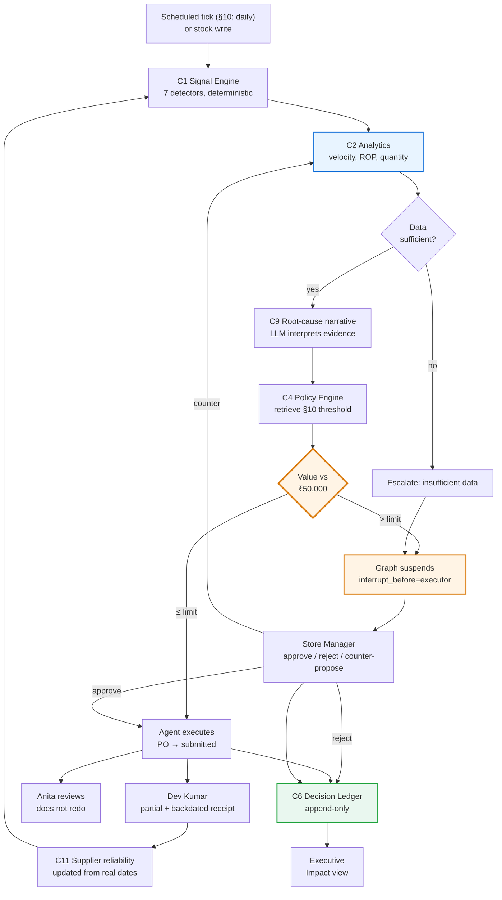

# 06 — Persona Journeys

> **Status:** Proposal. Nothing here is approved.
> **Purpose:** Walk the locked capabilities through the people who would actually use them, so [07-UX-ARCHITECTURE.md](07-UX-ARCHITECTURE.md) designs screens for jobs rather than for features.
> **Grounding rule:** three of the four personas are **named or defined in `src/rag/data/inventory_manual.md` §10**. The fourth is inferred and labelled as such. No persona is invented to justify a screen.

---

## 1. Where the personas come from

The manual does the casting for us. §10 ("Roles and Responsibilities") is the most useful section in the corpus for product design, because it assigns concrete duties to concrete people.

| Persona | Source | Manual authority |
|---|---|---|
| **Anita Singh — Procurement Officer** | **Named in §10** | Five numbered duties, lines 106–112 |
| **Store Manager** | **Defined in §10 line 113** | *"Purchase Orders with a total value above ₹50,000 require formal Store Manager approval prior to supplier submission."* |
| **Dev Kumar — Warehouse Staff** | **Named in §10 item 5** | *"Coordinating goods receipt with warehouse staff (Dev Kumar)."* |
| **Regional Head / Executive** | **INFERRED — not in the manual** | No manual basis. See §6 for why the persona is retained anyway and how the honesty is preserved. |

The `User.role` column already carries `manager` / `staff` values, so two of the four map onto roles that **already exist in the schema**. The RBAC matrix in [05-DIFFERENTIATING-CAPABILITIES.md](05-DIFFERENTIATING-CAPABILITIES.md) C5 §5 is therefore an implementation of §10, not a new access model.

---

## 2. Anita Singh — Procurement Officer

**The primary user. If Steward works for Anita, it works.**

### 2.1 What the manual actually asks of her

Verbatim from §10, lines 106–112:

| # | Duty | What it costs her today |
|---|---|---|
| 1 | *"Monitoring low_stock and out_of_stock alerts **daily**."* | A recurring polling task. The manual assigns a human the job of *noticing*. |
| 2 | *"Reviewing supplier catalogs for optimal pricing and delivery lead times."* | Manual comparison — and the current data model makes it **impossible**, since `Product.supplier_id` is a single FK with no price entity. |
| 3 | *"Raising POs within **24 hours** of a low_stock alert trigger."* | An SLA she is measured against with no tooling to help her meet it. |
| 4 | *"Confirming supplier acknowledgement and expected delivery dates."* | Chasing. And the `acknowledged` status she is meant to record **cannot be written by any code path**. |
| 5 | *"Coordinating goods receipt with warehouse staff (Dev Kumar)."* | Hand-offs. |

**Read that list again as a product brief.** Duties 1, 2, and 4 are *sensing and comparison* work — exactly what deterministic code does better than a person. Duty 3 is an SLA. Duty 5 is coordination. The manual has, without meaning to, written the specification for what to automate and what to leave alone.

### 2.2 Her day today

> 09:10 — Opens the React dashboard. Sees `low_stock_count: 2`. **Cannot click into it** — `stock_alerts` has no read endpoint, so the number is a dead end.
> 09:15 — Goes to the Stock tab, scans the table by eye, and works out which two products it means.
> 09:25 — Wants to know how fast the product is selling. There is no velocity anywhere in the UI. Opens the Streamlit app in another tab.
> 09:30 — Asks the agent. Gets a confident forecast. **It is fabricated** — `demand_forecaster` was handed a current stock snapshot with no sales history (`agents.py:194-262`), and there are only 3 sale movements in the entire database, all inside one calendar day.
> 09:35 — Asks the agent which supplier to use. Gets a quote. **The code overwrites the model's answer** at `agents.py:318`, because in 3/3 recorded runs the model invented `supplier_id: 101` and a price of ₹580.0 against a real ₹600.0, with a fabricated *"Bulk discount… Price valid for 30 days"* (`agents.py:389-406`).
> 09:45 — Goes back to the React app, because the Streamlit app **cannot create a purchase order**. Fills the PO modal by hand.
> 09:50 — The PO is created as `draft`. It will stay `draft` forever; `submitted` is never written by any code path.
> — Nowhere in this hour did the system tell her anything she could act on that she did not already know. And nothing recorded that any of it happened.

The failure is not that the tooling is bad. It is that **she is still the sensor**. The system waits to be asked.

### 2.3 Her day with Steward

> 09:10 — Opens the Control Tower. Overnight the scheduled tick has run (cadence grounded in §10 item 1 — *daily*). Three signals are waiting, ranked by severity, not by insertion order.
> — `SIG-000045` `projected_breach` on a product that is **still above its reorder point** — it will cross before a replacement can land, given measured velocity and a 5-day lead time. *No system she has used could see this.*
> — `SIG-000046` `po_overdue` — a delivery is 2 days late. *There is already such a PO in the live database and nothing has ever noticed it.*
> — `SIG-000047` `config_drift` — a reorder point set at 20 against measured demand implying 47.
> 09:12 — Two of the three have **already been handled**. `SIG-000045` is below the ₹50,000 policy limit, so the agent computed the quantity, chose a supplier from `supplier_products`, created the PO, and advanced it `draft → submitted` (§5 #2). The decision is in the ledger with its policy citation. She reads it; she does not redo it.
> 09:15 — `SIG-000047` is waiting for her because **reorder-point changes always escalate** — altering a threshold changes all future autonomous behaviour, a wider blast radius than any single order.
> 09:18 — `SIG-000046` needs a human of a different kind: someone must call the supplier. Steward surfaced it, scored the supplier's reliability from delivery history, and drafted the context. The phone call is hers.
> 09:25 — Her actual job for the day is three judgments, not three hours of looking.

### 2.4 Her jobs-to-be-done, and who does them

| Job | Today | With Steward | Why that split |
|---|---|---|---|
| Notice that something needs attention | Anita, by polling | **System** (C1) | A SQL comparison, run on a schedule. Never a human's job. |
| Know how fast it sells | Nobody — no velocity exists | **System** (C2) | Deterministic arithmetic over the ledger. |
| Decide *whether* to order | Anita | **System below the limit, Anita above it** (C3, C4) | The threshold is §10 line 113's, not ours. |
| Decide *how much* | LLM guess | **System** (C2) | §9 line 102's formula. |
| Decide *which supplier* | Impossible today | **System proposes, Anita approves non-cheapest** (C11) | §10 item 2 makes comparison her duty; §6 line 74 gives the criteria. Spending more for reliability is judgment. |
| Understand *why* it happened | Nobody | **System explains** (C9) | The one place an LLM genuinely earns its place. |
| Change a reorder point | **Impossible** — no update endpoint | **System proposes, Anita approves** (C10) | Config changes always escalate. |
| Chase a late delivery | Invisible today | **System detects, Anita acts** (C11) | §10 item 4. The relationship work stays human. |
| Prove the work happened | Impossible | **System records** (C6) | §4 line 47 asks for an audit log by name. |

**The pattern worth stating out loud:** everything taken from her is *sensing, arithmetic, and record-keeping*. Everything left with her is *judgment, relationships, and exceptions*. That is the correct division, and it is the answer to the "is this replacing people?" question — Anita's job stops being *noticing* and becomes *deciding*.

### 2.5 What she needs on screen

Signals inbox with severity ranking and time-against-SLA; a decision detail that leads with **what happens if you do nothing**; velocity and days-on-hand visible on every product; supplier comparison with reliability beside price; and one control to mute a signal type with a recorded reason.

### 2.6 Where Steward loses her trust

- A signal she cannot act on — the `stock_alerts` failure repeated. **Every signal needs a next action.**
- A number without provenance. She has been burned by a fabricated forecast; the first unexplained figure costs her confidence permanently.
- Noise. Three real signals beat thirty. Dedup and suppression are trust features, not optimisations.
- An agent that acts on thin data. `data_insufficient` escalating instead of guessing is what earns her the autonomous path.

---

## 3. Store Manager

**The approver. The persona the manual defines by a single sentence and a number.**

### 3.1 What the manual gives them

> §10, line 113: *"**PO Approval Threshold:** Purchase Orders with a total value above ₹50,000 require formal Store Manager approval prior to supplier submission."*

One sentence, and it is the single most valuable line in the corpus. It supplies an authority boundary, a currency, a monetary limit, a named role, and a timing constraint (*prior to supplier submission*). Steward's entire governance model is an implementation of it.

### 3.2 Their situation today

There is no approval workflow. Worse: the threshold is **unenforceable in either direction**. All 11 authenticated inventory routes are role-blind — the JWT mints a `role` claim that is never read, the only role check in the backend being `auth.py:234`. So a warehouse-staff account can create a purchase order of unlimited value, and the manager has no queue, no notification, and no veto.

The manager's authority exists in a document and nowhere in the software.

### 3.3 Their journey with Steward

> — A signal fires. C2 computes a quantity; the value comes to ₹68,400.
> — C4 retrieves the threshold from the policy collection and returns the **verbatim sentence with its section reference**. 68,400 > 50,000 → `requires_approval`.
> — The graph reaches `interrupt_before=["executor"]` and **genuinely suspends**. Checkpointed. It can sit for three days and resume at the same node with the same state.
> — The manager opens the Approval inbox. One item, with time-in-queue against §10 item 3's 24-hour language.
> — The detail screen, in this order: **what the agent wants to do** → **why** (C9's root-cause narrative) → **the policy it is obeying**, quoted → **expected impact** → **what happens if you do nothing**.
> — Three doors: approve, reject with a reason, or **counter-propose**. If they change 120 units to 60, the system **recomputes** — "60 covers 9 days against an 11-day lead time" — and re-derives the policy verdict rather than silently accepting the edit.
> — On approval the suspended run resumes at `executor`. The PO is created, advanced to `submitted`, the signal resolved (§4 line 47 places resolution at *submit* — which corrects today's resolve-then-reinsert behaviour), and an `approvals` row records who decided what, when, and why.

### 3.4 The moment that wins this persona

Not the approval. **The refusal.**

When the agent stops on its own and says *"this is ₹68,400; §10 of your operations manual requires Store Manager approval above ₹50,000; I have prepared the order and I am waiting"* — the product has demonstrated that it knows the limits of its own authority, and that it reads the manager's rulebook rather than a hardcoded constant.

`if value > 50000` gives the same behaviour and none of the meaning. A reviewer cannot audit a magic number and a manager cannot change one. Editing §10 of the manual changes Steward's behaviour with no redeploy — and *that* is the sentence that turns a demo into a product.

### 3.5 What they need on screen

An approval queue with SLA ageing; the quoted policy on the decision itself; the autonomy dial per category; blast-radius caps with current headroom; a kill switch that is always one click away; and an Impact view that answers "is this thing helping?" without an analyst.

### 3.6 Where Steward loses them

- An approval they cannot understand in fifteen seconds. Volume without comprehension is worse than no queue.
- An agent that never declines. A system with a 100% autonomy rate has not been governed, it has been unleashed — the refusal count is a *feature* of the Impact view.
- Any hint that the agent could approve its own escalation. The structural guarantee — the LLM cannot cause a PO to exist — must be visible, not merely true.

---

## 4. Dev Kumar — Warehouse Staff

**The persona most product teams forget, and the one who proves RBAC is real.**

### 4.1 What the manual gives him

> §10, item 5: *"Coordinating goods receipt with warehouse staff (**Dev Kumar**)."*
> §5, #4: *"**Received** — Warehouse staff marks the order as received. Stock is updated automatically."*

He is the only persona the manual gives a **write** duty to.

### 4.2 His situation today

He can record a receipt, and `receive_purchase_order` does the right things — creates `receipt` movements, updates `quantity_on_hand`, resolves alerts. But two hard-coded lines break it for reality:

- `inventory_service.py:137` — `po.received_date = date.today()`. **A receipt cannot be backdated.** A Friday delivery entered on Monday is recorded as Monday, which quietly corrupts every supplier-reliability calculation.
- `inventory_service.py:140` — `qty = item.quantity_received or item.quantity_ordered`. Since `quantity_received` is always `None` on arrival, the expression always yields `quantity_ordered`. **A supplier who ships 80 of 100 units cannot be recorded.**

And movements are attributed `recorded_by="system"` — so his work is anonymous in the ledger.

He also has more authority than he should: role-blindness means he can raise a purchase order of any value.

### 4.3 His journey with Steward

> — A delivery arrives against a PO the agent raised.
> — He opens Receiving. The PO is there in `submitted` or `acknowledged` state — statuses that are **reachable for the first time**, using the enum's existing five values with **no schema change**.
> — He records **80 of 100** units. Partial receipt is a first-class outcome: the PO stays open for the balance, and the shortfall becomes a supplier-reliability data point rather than silent data loss.
> — He **backdates** it to Friday, because that is when the truck came. Supplier scoring now reflects reality.
> — The movement is attributed to **him**, not to `system`.
> — He tries to raise a PO. He gets a real `403` with the policy reason attached — §10 assigns PO-raising to the Procurement Officer, and now the software agrees with the manual.

### 4.4 Why his 403 is a demo asset

*"Create a purchase order as the warehouse staff account"* is the **fastest way for a technical reviewer to disprove an RBAC claim** — it takes about fifteen seconds. Today it succeeds. Under C5 it fails with a reason, and the failure is recorded.

Volunteering that test before being asked is stronger than surviving it. It is also the cheapest credibility in the entire demo: one login, one click, one honest error.

### 4.5 What he needs on screen

A receiving queue of expected deliveries with dates; quantity entry that accepts a partial figure without ceremony; a date field that is not silently overwritten; and the kill switch — **staff can engage it**, because whoever is closest to the floor should be able to stop the machine.

---

## 5. Regional Head / Executive — INFERRED

### 5.1 The honest disclosure

**This persona has no basis in `inventory_manual.md`.** §10 names a Procurement Officer, a Store Manager, and warehouse staff. There is no executive, no regional head, no finance role. This persona is inferred from the presentation context — someone will ask *"what is the business impact?"* — and it is retained for that reason alone.

Recording that plainly matters. Every other persona's needs are traceable to a manual section; this one's are traceable to an assumption. Treating them differently is the difference between a grounded product and one that quietly invents its own requirements.

### 5.2 What they want, and what can honestly be shown

| They want | Can it be computed? | Basis |
|---|---|---|
| Decision latency vs. the 24h expectation | **Yes** | `signals.detected_at` → `decisions.executed_at`, against §10 item 3's own documented figure. **A documented baseline, not an invented one.** |
| Autonomy rate | **Yes** | Ledger arithmetic. |
| Signals caught that a human would have missed | **Yes** | Detector counts by class — including `po_overdue` and `config_drift`, previously undetectable. |
| Reorder points corrected | **Yes** | C10 accepted proposals. |
| Fabricated numbers eliminated | **Yes — 5 → 0** | The strongest metric available, because it is a claim about *method* and is verifiable by inspection. |
| Approval outcome mix, incl. **modified** rate | **Yes** | Measures whether the agent's proposals are actually good. |
| Refusal count | **Yes** | Evidence of governance. |
| **₹ revenue protected** | **No** | Needs per-SKU margin and observed lost-sale rates. |
| **FTE hours saved** | **No** | Needs time-and-motion data on the current process. |
| **Stockout reduction %** | **Only as a labelled simulation** | C13 replay on **disclosed synthetic** history. |

### 5.3 The design decision that follows

The Impact view **shows the empty boxes**. Where a ₹ or hours figure belongs, it displays the metric name, the formula, and *"requires client data: per-SKU margin and lost-sale rate"* — not an estimate.

This is counter-intuitive and it is the right call. An invented ROI number is the single fastest way to lose a room that contains anyone who has ever built a business case; they know the number is fabricated because they know the data does not exist. A visible, well-specified gap says *we know exactly what we would need to measure this, and we will not guess.* It converts a limitation into a proposal — and it is the direct application of the brief's own instruction not to invent unsupported figures.

### 5.4 Their journey

> — Opens Impact. Sees latency, autonomy rate, signal classes, corrections, refusals — all computed, all with provenance labels.
> — Sees the ₹ boxes empty, named, and specified.
> — Asks "so how much is it worth?" The answer: *"Here is the mechanism, here is what it does, here is exactly what data of yours we would need to price it, and here is the backtest we would run on your history."*
> — That is a better conversation than a fabricated percentage, and it is the one that leads somewhere.

---

## 6. The agent as a persona

Worth stating explicitly, because it clarifies the access model: **the agent is a principal with its own identity, not a privileged process.**

| Property | Value |
|---|---|
| Identity | Its own account — **not** the admin's |
| Can create a PO below the policy limit | Yes, when autonomy mode permits |
| Can create a PO above the limit | **No.** Structurally must escalate |
| Can approve anything | **No** — including its own escalations |
| Can change a reorder point | **No** — proposes only |
| Can set its own autonomy mode or caps | **No** |
| Can engage the kill switch | **No** — humans only |
| Is attributed in the ledger | Yes, on every action |
| Can be stopped instantly | Yes, by any human |

Least privilege applied to a non-human actor. It is also the honest answer to *"what stops it going wrong?"* — not the prompt, not the model's good behaviour, but the fact that **the LLM cannot cause a purchase order to exist**. It can only describe one that deterministic code has already found permissible. A hallucination of exactly the kind already recorded at `agents.py:389-406` cannot spend money.

---

## 7. Journey map

The loop closes twice, which is the property to notice. **C11 → C1**: a receipt updates supplier reliability, which changes future detection. **MGR → C2**: a counter-proposal re-enters computation rather than bypassing it. Neither edge exists today, and a system without them is a pipeline, not a loop.

---

## 8. Persona × capability matrix

● primary user · ○ secondary · — not applicable

| | Anita (Procurement) | Store Manager | Dev (Warehouse) | Executive |
|---|---|---|---|---|
| C1 Signal Engine | ● | ○ | ○ | — |
| C2 Analytics | ● | ○ | — | ○ |
| C3 Autonomy Loop | ● | ● | — | ○ |
| C4 Policy Engine | ○ | ● | — | ○ |
| C5 Approval Workspace | ○ | ● | ○ *(403 + kill switch)* | — |
| C6 Ledger & Impact | ○ | ● | — | ● |
| C7 Unified UI | ● | ● | ● | ● |
| C8 Simulation | — | ○ | — | — |
| C9 Root-Cause | ● | ● | — | — |
| C10 Reorder Auditor | ● | ● | — | ○ |
| C11 Supplier Intelligence | ● | ○ | ● | — |
| C12 Consolidation | ● | ○ | — | — |
| C13 Shadow / Backtest | ○ | ● | — | ● |
| C14 Co-pilot | ● | ○ | ○ | ○ |

**Anita is primary on nine of fourteen.** The UI's default landing state, information density, and keyboard path should be optimised for her, with the Store Manager's approval flow as the second-priority path and the Executive's Impact view as a deliberately sparse, read-only destination. Dev's receiving surface is narrow and should stay narrow — three fields, no dashboard.

---

## 9. What each persona says when it works

Not marketing copy — the specific sentence that indicates the product has done its job, and the capability that earns it.

| Persona | The sentence | Earned by |
|---|---|---|
| **Anita** | *"It already handled two of these, and it was right."* | C3 + C2 + C6 |
| **Store Manager** | *"It stopped and told me why, quoting my own manual."* | C4 + C5 |
| **Dev Kumar** | *"I could record what actually arrived, on the day it actually arrived."* | C8 + C11 |
| **Executive** | *"It told me what it can't measure yet."* | C6 §5.3 |

The Executive's sentence is the surprising one, and it is the most important. **Credibility comes from the boundary, not the number.**

---

**Next:** [07-UX-ARCHITECTURE.md](07-UX-ARCHITECTURE.md) turns these journeys into a navigation model, a screen inventory, and an interaction language.
