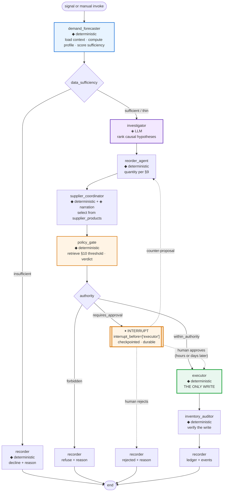

# 08 — Agentic Workflows

> **Status:** Proposal. Nothing here is approved.
> **Purpose:** Specify the graph topology, node contracts, state schema, durable interrupt, and failure behaviour that make the governed loop technically real — inside the constraints the graded tests actually impose.
> **Governing decision:** **AD-2** — deterministic code owns arithmetic and execution; the LLM owns interpretation and explanation. Every node below declares which side of that line it sits on.

---

## 1. The honest answer about "multi-agent"

The brief's earlier instruction was explicit: *"Do not add multi-agent architecture just because it sounds impressive. If one agent is better, say so."* So, plainly:

**This is not a multi-agent system, and it should not be described as one.**

What is proposed is a **governed pipeline** — eight stages, of which **two involve a language model at all**. The stages do not negotiate, do not hold independent goals, and do not choose each other. Control flow is decided by deterministic conditional edges on computed values. Calling these stages "agents" would be exactly the AI-for-AI's-sake framing the brief rejects.

The word "agent" is earned in precisely two places in this product:

1. **The Phase 3 ReAct executor**, where the model genuinely chooses which of 7 tools to call, in what order, and when to stop. Model-determined control flow. Real agency, already present, deliberately preserved (AD-11).
2. **The co-pilot** (C14), the same loop over the MCP toolset with context and memory.

The pipeline is not agentic. **The system is** — because it initiates, decides within bounded authority, acts, and accounts for itself without being asked. Agency is a property of the loop, not a count of LLM calls.

The four node names `demand_forecaster`, `reorder_agent`, `supplier_coordinator`, `inventory_auditor` are retained because `tests/phase5/test_routing.py` requires them. Their *implementations* change beyond recognition. Where the name overclaims, this document says so.

---

## 2. The constraint envelope, verified

Every constraint below was read from the test files, not inferred from documentation.

| Constraint | Verbatim assertion | Location | Consequence |
|---|---|---|---|
| Four node names must appear in the source of `build_inventory_graph` | `src = inspect.getsource(build_inventory_graph)` then `for n in [...]: assert n in src` | `tests/phase5/test_routing.py:37-42` | Names kept. **New nodes may be added freely** — the test checks presence, not exclusivity or count |
| Entry point | `assert "demand_forecaster" in src and ("set_entry_point" in src or "entry_point" in src.lower())` | `tests/phase5/test_routing.py:45-48` | See §2.1 |
| Message count | `assert len(result.get("messages", [])) >= 4` | `tests/phase5/test_e2e.py:78` | **Every terminal path** must yield ≥4 messages, including early declines |
| Terminal status | `assert result["analysis_status"] in ("complete", "reorder_required", "healthy", "analyzing")` | `tests/phase5/test_e2e.py:102` | Richer lifecycle needs a **second** field. See §4.2 |
| Low-stock status | `assert result["analysis_status"] in ("reorder_required", "complete")` | `tests/phase5/test_e2e.py:167` | Both acceptable on the reorder path |
| Executor tool count | `assert len(agent.tools) == 7` | `tests/phase3/test_phase3.py:15` | **Hard lock.** New tools go to MCP (AD-11) |
| MCP tool count | `>= 6` | Phase 4 tests | Extensible |

### 2.1 A note on the entry-point test, and why we are not gaming it

The entry-point assertion is a **source-inspection** test: it passes if the strings `"demand_forecaster"` and `"set_entry_point"` both appear anywhere in the function body. It does not verify that `demand_forecaster` *is* the entry point.

That looseness is not an invitation. Satisfying the letter of a test while violating its evident intent is the kind of thing a technical reviewer finds and remembers, and it would undercut every honesty claim in this package.

**So `demand_forecaster` is genuinely the entry point.** Which turns out to be the right design anyway: once a signal has been raised, computing the demand profile *is* the natural first step. The constraint and the correct architecture agree, which is convenient but not the reason.

---

## 3. Topology



◆ = deterministic code · ◈ = language model involved

**Eight nodes. Two touch an LLM.** `investigator` fully, `supplier_coordinator` partially (trade-off narration only). The other six are Python and SQL.

Three structural properties worth naming:

1. **One write node.** `executor` is the only node in the graph that mutates a business record. Everything upstream computes; everything downstream verifies and records. A reviewer can audit the entire mutation surface by reading one function.
2. **The interrupt sits immediately before the write.** Not before analysis, not after. The suspension point is exactly the moment before money is committed.
3. **Every terminal path passes through `recorder`.** There is no exit that leaves no trace — including refusals, rejections, and declines. This is what makes C6 complete rather than partial.

---

## 4. State

### 4.1 The `TypedDict`

Extends the existing state; existing keys are preserved for test compatibility.

```python
class InventoryState(TypedDict, total=False):
    # ---- existing, graded ----
    messages: Annotated[list, add_messages]
    analysis_status: str          # graded: 4 permitted values only
    product_id: int

    # ---- trigger ----
    signal_id: str | None         # SIG-000045
    trigger: str                  # "scheduled" | "event" | "manual" | "backtest"
    run_id: str                   # RUN-000078

    # ---- demand_forecaster output (deterministic) ----
    demand_profile: dict | None   # velocity, variance, window, sale_count
    data_sufficiency: str         # "sufficient" | "thin" | "insufficient"
    sufficiency_reason: str | None
    computed_reorder_point: float | None

    # ---- investigator output (LLM) ----
    hypotheses: list | None       # ranked, with evidence refs
    narrative: str | None         # may be None if LLM unavailable

    # ---- reorder_agent output (deterministic) ----
    reorder_quantity: int | None
    quantity_basis: dict | None   # the formula inputs, for display

    # ---- supplier_coordinator output (deterministic) ----
    supplier_options: list | None # from supplier_products
    selected_supplier_id: int | None
    selection_rationale: str | None   # LLM narration, no numbers
    order_value: float | None

    # ---- policy_gate output (deterministic) ----
    policy_limit: float | None
    policy_citation: str | None   # verbatim sentence
    policy_section: str | None    # "§10 PO Approval Threshold"
    authority: str                # within_authority | requires_approval | forbidden

    # ---- executor output ----
    idempotency_key: str
    po_id: int | None
    po_number: str | None         # PO-2026-0052

    # ---- lifecycle (the real one) ----
    decision_status: str          # the full lifecycle — see §4.2
    decision_id: str | None       # DEC-000123
    approval_id: str | None       # APR-000012
    actor: str                    # "agent" | user id
    refusal_reason: str | None
    error: str | None
```

### 4.2 Two status fields, and why

The graded `analysis_status` permits exactly four values. The real decision lifecycle from [05-DIFFERENTIATING-CAPABILITIES.md](05-DIFFERENTIATING-CAPABILITIES.md) C3 has twelve. Cramming twelve into four would either break the test or lose information.

So: **`analysis_status` stays graded and correct. `decision_status` carries the truth.** A deterministic projection maps one onto the other.

| `decision_status` | → `analysis_status` | Reasoning |
|---|---|---|
| `analysing` | `analyzing` | In flight |
| `healthy` | `healthy` | Evaluated, no action needed |
| `insufficient_data` | `complete` | The analysis **did** complete — it concluded it could not responsibly decide. Honest, not a fudge |
| `within_authority` | `reorder_required` | A reorder is required and permitted |
| `requires_approval` | `reorder_required` | A reorder is required, pending a human |
| `pending_approval` | `reorder_required` | Suspended at the interrupt |
| `executing` | `reorder_required` | Mid-write |
| `executed` | `complete` | Done |
| `rejected` | `complete` | Concluded by human decision |
| `expired` | `complete` | Concluded by SLA |
| `failed` | `complete` | Concluded with an error recorded in `error` |
| `closed` | `complete` | Monitoring finished |

Every projection lands inside the four permitted values, and `test_e2e.py:167`'s `("reorder_required", "complete")` is satisfied on the reorder path in both the pending and executed cases.

This is not test-gaming. It is a **graded public contract** plus an **internal domain model**, which is ordinary API-versioning discipline. It should be documented in the code, in a comment that says exactly this.

### 4.3 The ≥4 messages requirement on every path

`test_e2e.py:78` asserts `len(messages) >= 4`. The main path produces eight or more. **The early-decline path produces two nodes**, so it must be engineered to satisfy the floor.

The honest solution: `demand_forecaster` appends **three distinct messages**, because it performs three distinct steps.

```
1. "Loaded 90 days of movement history for SKU-1001: 47 sale events."
2. "Computed average daily demand 5.8 units/day (σ 1.9); reorder point 75.4."
3. "Data sufficiency: insufficient — 2 sale events in 90 days is below the
    minimum of 10 required for a defensible velocity."
```

Plus `recorder`'s message = 4. These are real steps, separately meaningful, and legible to a human reading the run. **No filler messages.** If a message would not help someone debugging the run, it does not get appended — and if that ever brings a path below four, the fix is to reconsider the path, not to pad it.

---

## 5. Node contracts

### 5.1 `demand_forecaster` — entry point · deterministic

**The most important rename-in-place in the project.** Today this node hands a language model a current stock snapshot with no sales history attached and asks for a forecast (`agents.py:194-262`). The model complies with confident, baseless numbers. It is the single largest credibility liability in the system.

Under this design it contains **no LLM call at all**.

| | |
|---|---|
| **Reads** | `stock_movements`, `stock_levels`, `products`, `suppliers.lead_time_days` |
| **Computes** | `average_daily_demand`, variance, `safety_stock = demand × safety_days`, `reorder_point = (demand × lead_time) + safety_stock`, `days_on_hand`, `data_sufficiency` |
| **Grounding** | §3 line 33 (reorder point); §3 line 35 (safety stock as days of demand); §13 line 139 (days on hand); §4 line 45 (*"based on historical consumption patterns"* — the manual's own authority for a consumption-derived suggestion) |
| **Writes** | Nothing. Optionally snapshots to `metric_snapshots` |
| **LLM** | **None** |
| **Emits** | 3 messages; `demand_profile`, `data_sufficiency`, `computed_reorder_point` |

The irony is worth using in the demo: *the node that used to invent the numbers is now the node that computes them.*

### 5.2 `investigator` — new · LLM

The one node where a language model is unambiguously the right tool.

| | |
|---|---|
| **Receives** | A structured evidence packet only — movement pattern, velocity vs trailing baseline, open PO status and lateness, configured vs computed reorder point, supplier reliability. **No raw DB access** |
| **Produces** | Ranked causal hypotheses with the evidence each rests on, plus a plain-language narrative |
| **LLM role** | Pattern interpretation across heterogeneous evidence, and explanation. Genuine judgment |
| **Hard constraints** | May reference **only** numbers present in the packet · must rank · must state confidence · must return *"insufficient evidence"* when the packet does not support a conclusion · **forbidden from emitting any new numeric value or identifier** |
| **Validation** | Output is checked for numeric tokens absent from the packet. A violation drops the narrative and records the violation. See §8.2 |
| **Failure** | On unavailability or violation, `narrative = None` and the run **continues**. The decision does not depend on it |

That last row is the architectural claim, enforced: the narrative is an *output*, never an *input*. Nothing downstream reads it.

The numeric-token check is a direct response to a recorded incident. At `agents.py:389-406` the model produced `supplier_id: 101`, a price of ₹580.0 against a real ₹600.0, and a fabricated *"Bulk discount… Price valid for 30 days"* — in 3 of 3 runs. A prompt instruction not to invent numbers is a request. A validator is a control.

### 5.3 `reorder_agent` — deterministic

| | |
|---|---|
| **Computes** | `reorder_quantity = average_daily_demand × (lead_time_days + safety_stock_days)`, rounded to pack size where defined |
| **Grounding** | §9 line 102 verbatim structure: `(5 × 7) + (5 × 14) = 35 + 70 = 105 units`. EOQ (§9 line 98) is computed and displayed as a **reference figure**, not used as the order quantity |
| **LLM** | **None** |
| **Emits** | `reorder_quantity`, `quantity_basis` — the formula inputs, so the UI can show the arithmetic |

**Why the practical rule and not EOQ.** §9 line 100 gives a practical lead-time rule alongside the EOQ formula, and the worked example at line 102 uses the practical rule. EOQ optimises total cost given a known annual demand, ordering cost, and holding cost — two of which are configured assumptions here, not measurements. Using it as the primary quantity would import two invented parameters into every order. It is shown as reference and named as assumption-dependent. Honest and grounded beats sophisticated and unfounded.

### 5.4 `supplier_coordinator` — deterministic + narration

The node that currently has nothing to coordinate. `Product.supplier_id` is a single FK and there is no supplier-price entity, so multi-supplier comparison is **structurally impossible** — which is why the code overwrites the model's output at `agents.py:318`.

`supplier_products` makes the node's name true for the first time.

| | |
|---|---|
| **Reads** | `supplier_products` (price, lead time, MOQ per supplier per product), delivery history for reliability |
| **Computes** | Reliability score — on-time rate, mean lateness, variance. Ranks options on price and reliability |
| **Grounding** | §6 line 74: *"price competitiveness, lead time reliability, quality compliance, and payment terms"* — the manual supplies the criteria. §10 item 2 makes catalog review a documented duty |
| **Precondition** | Supplier must be `active` — §6 line 74: *"Procurement staff must verify a supplier is active before raising a PO."* Enforced in code, not prompted |
| **LLM** | **Narration only** — articulating the trade-off when the cheapest option is not the most reliable. Zero numbers |
| **Escalation rule** | Selecting a **non-cheapest** supplier always escalates, regardless of value. Spending more for a qualitative reason is a human judgment |

**The model is never asked for a price again.** Prices come from a table. The hallucination class recorded in the codebase is eliminated structurally, not mitigated by prompting.

### 5.5 `policy_gate` — deterministic

Where governance becomes mechanical.

| | |
|---|---|
| **Retrieves** | The approval threshold from the policy collection — §10 line 113, returned with its verbatim sentence and section reference |
| **Reads** | `autonomy_policies` for mode, blast-radius caps, kill-switch state |
| **Computes** | `authority` ∈ {`within_authority`, `requires_approval`, `forbidden`} |
| **LLM** | Extracting a structured limit from retrieved prose. **Guarded** — unparseable extraction falls back to the most restrictive interpretation (`requires_approval`) and records that it did |
| **Emits** | `policy_limit`, `policy_citation`, `policy_section`, `authority` |

Verdict rules, in order — the first match wins:

| # | Condition | Verdict |
|---|---|---|
| 1 | Kill switch engaged | `forbidden` |
| 2 | Autonomy mode `off` | `forbidden` |
| 3 | Autonomy mode `shadow` | `forbidden` *(decide and record, never execute)* |
| 4 | `data_sufficiency == insufficient` | `requires_approval` — **regardless of value** |
| 5 | Blast-radius cap exceeded | `requires_approval` |
| 6 | Non-cheapest supplier selected | `requires_approval` |
| 7 | Reorder-point change proposed | `requires_approval` — always |
| 8 | `order_value > policy_limit` | `requires_approval` — §10 |
| 9 | Autonomy mode `assisted` | `requires_approval` |
| 10 | Otherwise | `within_authority` |

Rule 4 is the one that distinguishes this from a threshold check. **Low confidence escalates even for a ₹200 order.** A system that only escalates on value is governed by accountancy; one that also escalates on evidence quality is governed by judgment.

Rules 1–3 return `forbidden` rather than `requires_approval` deliberately — a halted system should not silently fill a manager's queue with work it was told to stop doing.

### 5.6 `executor` — deterministic · the only write

The interrupt target. **Every mutation in the graph is here.**

Preconditions, all re-checked at execution time — not trusted from upstream state, because on the approval path hours or days have passed:

1. Kill switch not engaged *(re-read)*
2. Autonomy mode still permits *(re-read)*
3. Supplier still `active` — §6 line 74 *(re-read)*
4. No in-flight PO already covering this SKU (AD-15)
5. Idempotency key not already consumed
6. Blast-radius caps still within limits *(re-read)*
7. On the approval path: a valid `approvals` row exists with an `approved` verdict by a `manager`

Re-checking is not paranoia. A durable interrupt means arbitrary time passes between the decision and the write; state that was true at decision time may be false at execution time. **A system that trusts stale preconditions across a multi-day suspension is not actually safe, however good its policy engine.**

Actions:

| Step | Detail |
|---|---|
| Create PO | Via the existing `inventory_service` function — reused, not duplicated |
| Advance status | `draft → submitted` (§5 #2). One of the three previously unreachable states, **with no schema change** |
| Resolve signal | §4 line 47 places resolution at PO **submitted** — which corrects today's resolve-then-reinsert behaviour |
| Attribute | `actor` = the agent's own identity, or the approving human |
| Publish | `ActionExecuted` on the in-process bus |

**LLM:** none. Structurally, the model cannot cause a purchase order to exist.

### 5.7 `inventory_auditor` — deterministic

Repurposed, and the new job justifies the name better than the old one did. Post-write verification:

| Check | Assertion |
|---|---|
| Ledger invariant | `sum(stock_movements.quantity) == stock_levels.quantity_on_hand` — the invariant the existing seeder's `verify(db)` already enforces |
| PO state | The order is in the expected status with the expected line items |
| Signal state | The originating signal is resolved and linked to this decision |
| Idempotency | The key is recorded exactly once |
| Caps | Post-action totals are still within blast radius |

A failed check sets `decision_status = failed`, records the specific assertion that failed, and — where the write was partial — flags for reconciliation. **A self-verifying write is what lets a reviewer trust the ledger without reading the code.**

### 5.8 `recorder` — deterministic · terminal on all paths

| | |
|---|---|
| **Writes** | One `decisions` row (`DEC-000123`) · one `agent_runs` row (`RUN-000078`) with node timings, token usage, errors · `metric_snapshots` where due |
| **Captures** | The triggering signal, every computed input, the policy citation **as it read at decision time**, the LLM narrative verbatim, the authority path, the human, the idempotency key, the outcome |
| **Append-only** | No update path. Corrections are new rows |
| **Grounding** | §4 line 47 names an *"audit log"* — this is that |

The snapshotted citation matters more than it looks. A later edit to the manual must not retroactively change what governed a past decision. Resolving the citation on read would silently rewrite history.

---

## 6. The durable interrupt — why LangGraph

**AD-6.** This is the single architectural justification for LangGraph in the entire project, and without it a plain function chain would be the better choice. It should be said that directly.

```python
graph = builder.compile(
    checkpointer=SqliteSaver.from_conn_string(CHECKPOINT_DB),
    interrupt_before=["executor"],
)
```

`thread_id` = the decision ID. The sequence:

```
09:14  policy_gate → requires_approval
       state checkpointed to SQLite
       graph returns; the process is free
       ── the run is suspended, not blocked. No thread, no memory, no timer ──

       (2 hours, or 3 days, or a server restart)

11:28  manager approves → approvals row written
       graph.invoke(None, config={"configurable": {"thread_id": "DEC-000123"}})
       resumes AT executor, with the identical state
       preconditions re-checked against present reality
       PO created and submitted
```

What this buys that a function chain cannot:

| Property | Why it matters |
|---|---|
| Survives process restart | An approval pending overnight still resumes. A blocked coroutine does not survive a deploy |
| No held resources | Twenty pending approvals cost twenty SQLite rows, not twenty threads |
| Resumes at the node, not the top | No recomputation, no risk of a different answer on resume, no double LLM spend |
| Auditable state | The exact state the decision was made on is on disk and inspectable |
| The right pause point | Suspension is immediately before the write, not before analysis |

**If the interrupt were removed, LangGraph should be removed with it.** Four sequential function calls do not need a graph library — which is precisely the criticism the current Phase 5 implementation deserves, where four nodes run in fixed serial order with one error-escape conditional edge and no node writes anything.

New dependency: **`langgraph-checkpoint-sqlite`**, verified absent from `requirements.txt`. `langgraph>=1.2.0` is already declared.

### 6.1 The counter-proposal edge

`HALT → reorder_agent` is the edge most such designs omit, and it is where the human/system relationship is actually defined.

A manager changing 240 to 120 does not get their number accepted verbatim. The run **re-enters `reorder_agent`** with an override, recomputes cover, re-derives the policy verdict — 120 × ₹285 = ₹34,200, now *below* the threshold — and re-states the consequence: *"120 units covers 10 days against an 11-day lead time; expect a second breach in ~10 days."*

They may still choose 120. That is their authority. But the objection was stated and **`recorder` stores that it was**, so "approved over a stated objection" is a materially different ledger entry from a plain approval. That distinction is the entire content of the word *governance*.

---

## 7. Triggers

**AD-8.** Three entry points into the loop, plus one that bypasses it.

| Trigger | Mechanism | Cadence | Grounding |
|---|---|---|---|
| **Scheduled tick** | APScheduler, **env-gated, default OFF** | Daily, plus a fast demo interval | §10 item 1: *"Monitoring low_stock and out_of_stock alerts **daily**"* |
| **Event** | Post-commit hook on any stock write → in-process bus → detect for that SKU | Immediate | Sub-second detection latency |
| **Manual** | An operator invokes evaluation for a product | On demand | Demo control and debugging |
| **Backtest** | Deterministic replay over 90 days, **no LLM** | On demand | C13. Fast, quota-free, reproducible |

Default-OFF scheduling is deliberate: a background loop that fires during a code review or a demo setup is a liability. It is turned on explicitly, and the Control Tower header shows the last tick so "is it running?" is answerable at a glance.

New dependency: **`apscheduler`**, verified absent from `requirements.txt`.

### 7.1 Rate limits are a design constraint, not an operational detail

Gemini's free tier is **15 requests/minute, 1,500/day**. With two LLM-touching nodes per run, a tick that evaluates 50 products would issue ~100 calls and be throttled mid-sweep.

Mitigations, in order of importance:

1. **Detection is LLM-free.** A full sweep of every product costs zero model calls. Only products that raise a signal proceed to a run.
2. **`investigator` is skipped** when `data_sufficiency == insufficient` — the decline path needs no narrative.
3. **A token-bucket limiter** in the LLM client, with the graph continuing narrative-free on exhaustion.
4. **Backtest is entirely LLM-free**, so the most call-hungry operation costs nothing.
5. **Narratives are cached** on the decision, never regenerated for display.

The reason this ordering matters: it means quota exhaustion degrades **explanation quality**, never **decision correctness**. A demo that hits the rate limit still detects, decides, governs, executes, and records — it just shows *"Narrative unavailable — the decision and its numbers are unaffected."* That failure mode is itself a demonstration of AD-2.

---

## 8. Failure and degradation

### 8.1 Failure matrix

| Failure | Behaviour | Rationale |
|---|---|---|
| LLM unavailable / rate-limited | `narrative = None`, run continues, decision unaffected | Explanation is an output, not an input |
| LLM emits an unknown number | Narrative dropped, violation recorded | Detects the recorded hallucination class |
| RAG retrieval fails | `policy_gate` → `requires_approval`, records "policy unresolved" | **Fail safe = escalate.** Never fail open |
| Threshold unparseable | Most restrictive interpretation, recorded | Same principle |
| Supplier inactive at execution | `failed`, reason recorded, signal stays open | §6 line 74 is a hard precondition |
| Idempotency key already consumed | Return the original result, no second write | Replay safety |
| In-flight PO exists for the SKU | `forbidden`, reason recorded | AD-15 |
| Blast-radius cap hit | `requires_approval` for the remainder | Degrade to human, do not stop silently |
| Ledger invariant violated post-write | `failed`, flagged for reconciliation | The invariant is non-negotiable |
| Checkpoint DB unavailable | Refuse to start a run needing an interrupt | Better to not decide than to decide un-resumably |
| Approval SLA breached | `expired`, recorded, signal re-raises | §10 item 3's 24h language |

**The single governing principle: every failure escalates to a human or refuses. No failure path executes.**

### 8.2 The numeric-token validator

Concretely, since this control is load-bearing:

1. Build the set of numeric tokens present in the evidence packet, plus derivations at display precision.
2. Extract numeric tokens from the LLM narrative.
3. Any token in the narrative but not in the permitted set → drop the narrative, record `llm_numeric_violation` with the offending token on the `agent_runs` row.

Not a perfect control — a model could still misattribute a legitimate number. But it catches the exact failure already recorded in this codebase (`580.0` where the real price is `600.0`; `supplier_id: 101` where no such supplier exists), and the violation rate becomes a **measurable quality signal** rather than an anecdote.

---

## 9. Tools

**AD-11.** Two tool surfaces, one frozen and one extensible.

| Surface | Count | Status | Contents |
|---|---|---|---|
| Phase 3 ReAct executor | **Exactly 7** | **FROZEN** — `assert len(agent.tools) == 7` (`tests/phase3/test_phase3.py:15`) | The existing 7, unchanged. Includes `rag_knowledge_base` beside live API tools — genuinely the best idea in the repository |
| MCP toolset | **≥ 6** | Extensible | The existing 6 plus new read tools for signals, decisions, supplier comparison, and reorder-point audit |

The co-pilot (C14) is built on MCP. The graph nodes call **service functions directly**, not tools — a deterministic node has no reason to route through a tool-calling abstraction.

The 7-tool lock is a genuine constraint and this is the clean way to live inside it: freeze the graded surface, extend the ungraded one, and say so in a comment at the freeze point.

---

## 10. Concurrency and idempotency

Small deployment, SQLite, but the guarantees still have to be real.

| Concern | Mechanism |
|---|---|
| Two ticks overlap | Advisory lock keyed on the detection scope; the second run is skipped and logs why |
| Two signals for one SKU | Dedup key collapses them into one open signal, updated not duplicated |
| Duplicate execution | Idempotency key = `hash(signal_id, product_id, quantity, supplier_id, decision_id)`. Consumed keys recorded; replay returns the original result |
| Concurrent approval and expiry | Approval write is conditional on `status == pending_approval` |
| SQLite writer contention | Single writer, WAL mode, short transactions. Detection reads outside a write transaction |
| Backtest vs live | Backtest runs against a separate DB path — it **never** writes production tables |

The idempotency key is what makes the durable interrupt safe. Suspend-and-resume creates a natural double-execution window — a network retry, a double-click on Approve, a resumed run after a crash. Without the key, governance would be the mechanism that caused duplicate orders.

---

## 11. What this changes about Phase 5

Side by side, since the delta is the argument.

| | Today | Proposed |
|---|---|---|
| Nodes | 4 | 8 |
| Nodes that write | **0** | 1 |
| Nodes using an LLM | 4 | **2** |
| Control flow | Fixed serial; one error-escape edge | 3 conditional branches + a durable interrupt |
| Numbers produced by an LLM | 5 fields | **0** |
| Human in the loop | None | Durable interrupt at the write boundary |
| Terminal output | Prose | A purchase order, or a recorded refusal |
| Record kept | None | `decisions` + `agent_runs`, append-only |
| Reason LangGraph is used | None a function chain wouldn't serve | The durable interrupt |
| Suppliers compared | Structurally impossible | Real, from `supplier_products` |
| Late deliveries seen | Never | `po_overdue` detector |

**Fewer LLM calls, more agency.** That inversion is the design thesis: agency comes from the loop closing, not from how many nodes talk to a model.

---

## 12. Open questions for implementation

Flagged rather than hidden, since they are the decisions an implementing instance will hit.

1. **Minimum sale-event count for `sufficient`.** The manual conditions suggestions on *"historical consumption patterns"* (§4 line 45) without quantifying it. Proposed: ≥10 sale events and ≥30 days span, **configurable and displayed**. Any number here is a judgment call and must be labelled as one, not presented as derived.
2. **`config_drift` tolerance.** Proposed 20% relative divergence, configurable. Same caveat.
3. **`ordering_cost` and `holding_cost_per_unit` for EOQ.** Not in the manual. Configured assumptions, labelled as assumptions wherever EOQ is displayed.
4. **Pack-size rounding.** Not modelled. Round to 10 by default and note it, or add a `pack_size` column — a new column on an existing table, which `create_all` will **not** add. See [12-DATA-AND-API-CHANGES.md](12-DATA-AND-API-CHANGES.md) §3 for the additive-only constraint.
5. **Approval SLA duration.** §10 item 3's 24 hours applies to *raising a PO*, not to approving one. Reusing it for approval ageing is an inference and should be labelled as such rather than cited as manual policy.

Item 5 is the kind of thing worth getting right. The manual says POs must be *raised* within 24 hours of a low-stock alert; it says nothing about how long a manager may sit on an approval. Presenting the 24-hour approval clock as a manual requirement would be a small, quiet overclaim — exactly the pattern this package exists to avoid.

---

**Next:** [09-BUSINESS-WORKFLOWS.md](09-BUSINESS-WORKFLOWS.md) traces four complete closed-loop business workflows end to end, from trigger to recorded outcome.
