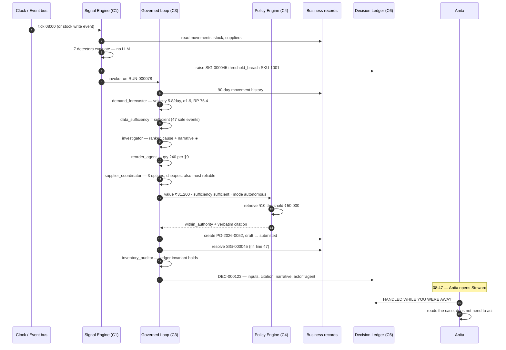
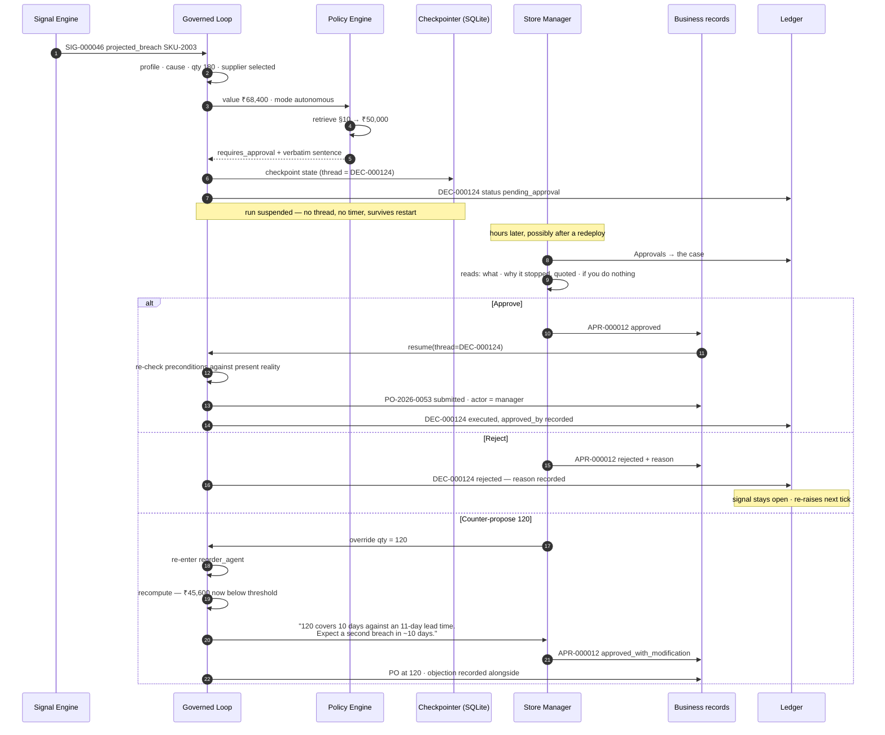
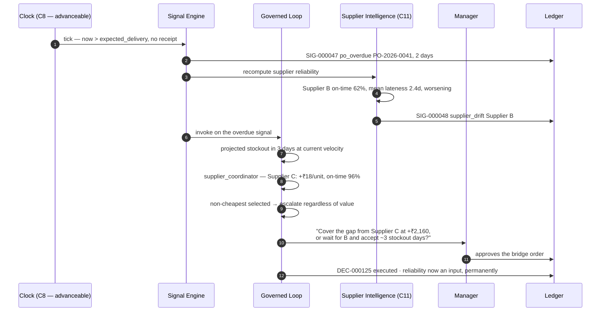
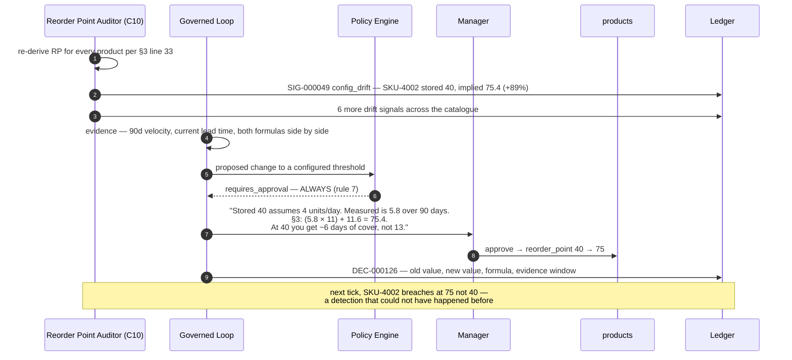
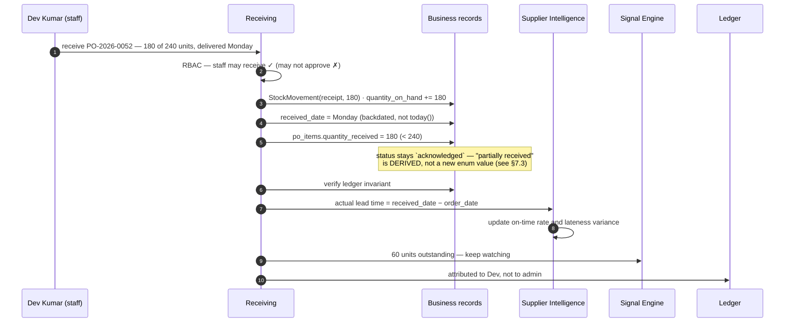
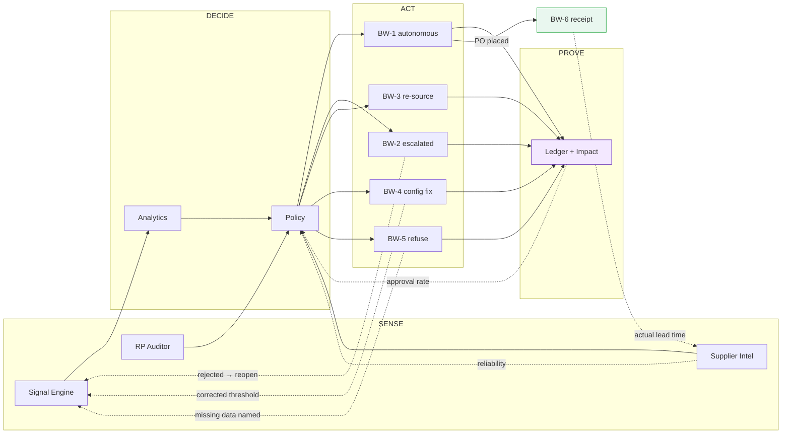

# 09 — Business Workflows

> **Status:** Proposal. Nothing here is approved.
> **Purpose:** Trace complete closed-loop business workflows from trigger to recorded outcome — including the feedback edges that make them loops rather than pipelines.
> **Test applied to every workflow below:** *does something in the business change, and does the system know whether it worked?* A workflow that ends in a recommendation is not in this document.

---

## 1. What "closed loop" means here, precisely

Four properties. A workflow missing any one of them is a pipeline wearing the word "loop".

| Property | Test |
|---|---|
| **Initiated without a human** | Something other than a click starts it |
| **Concludes in a state change** | A business record differs afterwards — or a refusal is recorded, which also counts |
| **Accounted for** | The decision, its inputs, its authority, and its outcome are retrievable later |
| **Feeds back** | The outcome changes future behaviour — a resolved signal, an updated reliability score, a corrected configuration |

**Today, zero of the system's workflows have any of the four.** Every flow begins with a human click, ends in prose, records nothing, and feeds back nowhere. That is the gap these six workflows close.

Six workflows follow. **BW-1 through BW-4 are MUST BUILD. BW-5 and BW-6 are HIGH VALUE.**

| ID | Workflow | Closes when | Capabilities |
|---|---|---|---|
| **BW-1** | Autonomous replenishment | PO submitted, signal resolved, decision recorded | C1 C2 C3 C4 C6 |
| **BW-2** | Escalated replenishment | Manager decides; either outcome recorded | C1 C2 C3 C4 C5 C6 |
| **BW-3** | Late delivery → re-source | Supplier score updated, follow-up action taken | C11 C1 C3 C6 |
| **BW-4** | Configuration correction | Reorder point changed with approval, or rejected | C10 C2 C4 C5 C6 |
| **BW-5** | Refusal on insufficient evidence | Decline recorded with the missing input named | C2 C6 |
| **BW-6** | Goods receipt closes the cycle | Stock updated, lead time measured, score updated | C11 C6 |

---

## 2. BW-1 — Autonomous replenishment

**The flagship.** The single workflow that, if only one thing were built, would be it.

**Business problem.** §10 item 1 requires Anita to check alerts *daily*; §10 item 3 requires a PO raised within *24 hours* of a low-stock alert. Between her checks, nothing watches. A breach at 09:15 on Friday is invisible until Monday. The system's own manual specifies a response time it provides no mechanism to meet.

### 2.1 Sequence



### 2.2 Step table

| # | Step | Actor | Deterministic / LLM | Record written |
|---|---|---|---|---|
| 1 | Tick or stock-write event | Scheduler / bus | Det | `agent_runs` opened |
| 2 | Seven detectors evaluate all SKUs | Signal Engine | **Det — no LLM** | — |
| 3 | Signal raised, deduped | Signal Engine | Det | `signals` |
| 4 | Run invoked with signal context | Loop | Det | `agent_runs` |
| 5 | Demand profile + sufficiency | `demand_forecaster` | **Det** | — |
| 6 | Causal hypotheses + narrative | `investigator` | **LLM ◈** | narrative on state |
| 7 | Quantity per §9 | `reorder_agent` | **Det** | — |
| 8 | Supplier options ranked | `supplier_coordinator` | Det + narration | — |
| 9 | Threshold retrieved and quoted | `policy_gate` | Det + guarded extraction | citation snapshotted |
| 10 | Authority verdict | `policy_gate` | **Det** | — |
| 11 | PO created, `draft → submitted` | `executor` | **Det** | `purchase_orders`, `po_items` |
| 12 | Signal resolved | `executor` | Det | `signals` |
| 13 | Write verified | `inventory_auditor` | Det | — |
| 14 | Decision recorded | `recorder` | Det | `decisions`, `agent_runs` |
| 15 | Anita reviews after the fact | Human | — | view event |

### 2.3 Closed-loop check

| Property | Satisfied by |
|---|---|
| Initiated without a human | Steps 1–3 — scheduler or event, no click |
| Concludes in a state change | Step 11 — a purchase order exists that did not exist |
| Accounted for | Step 14 — every input, the citation as it read, the authority path |
| Feeds back | Step 12 — the signal is resolved, so it stops re-firing; and the PO now becomes an input to BW-3's overdue detector and BW-6's lead-time measurement |

**Elapsed:** seconds. **Baseline:** up to 24 hours by the manual's own standard (§10 item 3), longer in practice since detection depends on a daily human check.

### 2.4 Three things this workflow proves

1. **`draft → submitted` is reached** — one of three PO states that are unreachable in the current code, achieved with no schema change.
2. **Zero LLM-produced numbers.** Every figure in the resulting PO traces to a formula with a manual citation. The narrative is the only model output, and nothing downstream reads it.
3. **The manual's 24-hour requirement becomes meetable** — the only baseline metric in this entire package that comes from the client's own documentation rather than an assumption.

---

## 3. BW-2 — Escalated replenishment

**The workflow that makes autonomy safe, and the one to demo.**

**Business problem.** §10 line 113 verbatim: *"Purchase Orders with a total value above ₹50,000 require formal Store Manager approval prior to supplier submission."* Today that sentence lives in a markdown file the code never reads. There is no approval entity, no approval endpoint, no approval UI. The policy is documented and unenforced — the most common enterprise failure mode there is.

### 3.1 Sequence



### 3.2 The three doors, and why they are equally weighted

| Outcome | What happens | What is recorded |
|---|---|---|
| **Approve** | Resume at `executor`, re-check preconditions, write | `approved`, actor, latency |
| **Reject** | No write. Signal stays open and re-raises | `rejected` + reason. **A first-class outcome, not an error** |
| **Counter-propose** | Re-enter `reorder_agent`, recompute, re-state the consequence | `approved_with_modification` + the system's stated objection |

Most approval UIs make Approve a large primary button and Reject a small grey one, which is a design opinion about what the user should do. Steward gives all three equal visual weight (see [07-UX-ARCHITECTURE.md](07-UX-ARCHITECTURE.md) §5.3), because **a governance surface that nudges toward approval is not a governance surface.**

The counter-proposal branch is the one that matters most. It is where the system stops being a request-approval form and becomes a colleague that can disagree respectfully and then comply.

### 3.3 Closed-loop check

| Property | Satisfied by |
|---|---|
| Initiated without a human | `projected_breach` fired before stock crossed the threshold |
| Concludes in a state change | A PO, or a recorded rejection that keeps the signal live |
| Accounted for | Decision + approval + actor + latency + any stated objection |
| Feeds back | Rejection re-opens the signal; approval outcomes accumulate into the approval-rate metric that informs autonomy settings |

### 3.4 What the rejection path proves that the approval path cannot

An approved decision demonstrates that the pipeline works. **A rejected decision demonstrates that authority is real** — that the human is a decision-maker and not a rubber stamp, and that the system's response to being overruled is to record it rather than route around it.

For the demo, the rejection is the more valuable of the two.

---

## 4. BW-3 — Late delivery detected → re-source

**The workflow that finds a problem nobody is looking for.**

**Business problem.** §5 #3 says an acknowledged PO carries an *"expected delivery date"*. Nothing in the system ever compares that date to today. Verified in the live database: **one PO arrived 2 days late against a promised 5-day lead time and no part of the system noticed, recorded, or reacted.** Supplier reliability is invisible, so §6 line 74's *"lead time reliability"* criterion is unusable in practice.

### 4.1 Sequence



### 4.2 Why this workflow is the strongest evidence of genuine sensing

BW-1 detects something a human is *already looking for* — it is faster, not smarter. BW-3 detects something **no human in the current system is assigned to look for at all.** §10 item 4 asks Anita to *"confirm supplier acknowledgement and expected delivery dates"* — a one-time confirmation at order time, not ongoing surveillance until arrival. The gap between "confirmed the date" and "noticed the date passed" is exactly where this workflow lives.

Note the escalation reason: the agent chose a **more expensive** supplier. Rule 6 in [08-AGENTIC-WORKFLOWS.md](08-AGENTIC-WORKFLOWS.md) §5.5 escalates every non-cheapest selection regardless of value, because spending more for a qualitative reason is a human judgment even when it is obviously correct. That rule existing is more persuasive than the value threshold, because it shows the escalation logic is about *judgment type*, not just amount.

### 4.3 Closed-loop check

| Property | Satisfied by |
|---|---|
| Initiated without a human | Nobody was watching this at all |
| Concludes in a state change | A bridge order, and a permanently changed supplier score |
| Accounted for | Both signals, the trade-off as presented, the human's choice |
| Feeds back | **The strongest feedback edge in the product.** Reliability updates change future supplier selection in BW-1 and BW-2 — a past delivery failure alters a future autonomous decision |

C8's controllable clock is what makes this demonstrable: advance the clock and the overdue signal fires on cue, no waiting.

---

## 5. BW-4 — Configuration correction

**The workflow where the agent improves the system rather than operating inside it.**

**Business problem.** §3 line 33 gives `reorder_point = (average daily demand × supplier lead time) + safety stock`. Products carry a **stored** `reorder_point` that nothing ever re-derives. If demand shifts or a supplier's lead time changes, the threshold silently becomes wrong — and every downstream alert inherits the error. **Every one of BW-1's detections is only as good as a number nobody has checked since it was seeded.**

### 5.1 Sequence



### 5.2 Why reorder-point changes always escalate

Rule 7 in the policy gate escalates **every** proposed reorder-point change, at any value, in any autonomy mode. Deliberate: a reorder point is not a transaction, it is a **standing instruction**. One bad threshold silently distorts every future decision for that SKU. The cost of a wrong threshold is unbounded in a way the cost of one wrong order is not.

This is also the clearest example of the distinction that runs through the whole design: **the agent may act freely within the rules; it may never change the rules on its own.**

### 5.3 Closed-loop check

| Property | Satisfied by |
|---|---|
| Initiated without a human | Nobody audits stored thresholds today |
| Concludes in a state change | `products.reorder_point` changed with attribution |
| Accounted for | Old value, new value, formula, evidence window, approver |
| Feeds back | **The tightest loop in the product.** The corrected threshold changes what BW-1 detects on the next tick. C10 → C1 is a real cycle, not a metaphor |

The demo moment: correct the threshold, advance the clock one tick, watch a signal fire that was structurally impossible sixty seconds earlier.

---

## 6. BW-5 — Refusal on insufficient evidence

**The workflow whose entire value is that it does nothing.**

**Business problem.** §4 line 45: *"The system may also suggest reorder quantities based on historical consumption patterns."* The manual conditions the suggestion on consumption history. Verified in the live database: **products 3 and 5 have zero stock movements, and all 13 existing movements fall inside a single calendar day** (`2026-08-23 08:50:18` to `15:56:44`). For those products there is no consumption pattern to base anything on.

Today's `demand_forecaster` produces a confident forecast anyway, because a language model asked for a number will supply one.

### 6.1 Sequence

```mermaid
sequenceDiagram
    autonumber
    participant SIG as Signal Engine
    participant G as Governed Loop
    participant LED as Ledger
    participant A as Anita

    SIG->>LED: SIG-000050 data_insufficient SKU-5001
    SIG->>G: invoke
    G->>G: demand_forecaster — 2 sale events in 90 days
    G->>G: data_sufficiency = insufficient
    Note over G: investigator SKIPPED — no narrative needed,<br/>no LLM call spent
    G->>LED: DEC-000127 declined
    G->>A: "I am not confident enough to order this.<br/>2 sale events in 90 days; I need at least 10.<br/>Here is what I do know. You decide."
    A->>LED: orders manually — her judgment, recorded as hers
```

### 6.2 The claim, and its limits

**The claim:** a system that declines is more trustworthy than one that always answers, because a confident answer on two data points is worse than no answer.

**The limit, stated honestly:** a refusal is only impressive if the system also *acts confidently elsewhere in the same demo*. A system that only ever refuses is broken, not careful. BW-5 is credible **because BW-1 executes autonomously in the same session.** The pair is the message; either alone is not.

This is also why the sufficiency threshold (≥10 sale events, ≥30-day span) is displayed and configurable rather than buried. It is a judgment call, and the product says so rather than presenting it as derived. See [08-AGENTIC-WORKFLOWS.md](08-AGENTIC-WORKFLOWS.md) §12 item 1.

### 6.3 Closed-loop check

| Property | Satisfied by |
|---|---|
| Initiated without a human | The detector fires on data quality, not stock level |
| Concludes in a state change | A recorded refusal — **an outcome, not an absence** |
| Accounted for | What was known, what was missing, the numeric shortfall |
| Feeds back | The named missing input becomes a data-quality work item; once movements accumulate, the same SKU becomes decidable |

---

## 7. BW-6 — Goods receipt closes the cycle

**The workflow that turns a promise into a measurement.**

**Business problem.** §5 #4: *"Warehouse staff marks the PO as received… stock is updated automatically."* Two verified defects break this. `inventory_service.py:137` hardcodes `received_date = date.today()`, so a Monday delivery recorded on Wednesday is stamped Wednesday — **destroying the lead-time data that supplier reliability depends on.** And `:140-141` (`qty = item.quantity_received or item.quantity_ordered`) treats any receipt as complete, so 80 of 100 units delivered is recorded as 100 and the ledger silently drifts from reality.

Dev Kumar, the warehouse staff persona named in §10 item 5, cannot do his job correctly because of two lines of code.

### 7.1 Sequence



### 7.2 Why this small workflow carries weight

| Fix | Consequence |
|---|---|
| Backdatable `received_date` | Lead-time measurement becomes true, which is the input BW-3's reliability score is built on |
| Partial receipt | The ledger stops lying, and the invariant `sum(movements) == quantity_on_hand` stays meaningful |
| Attribution to Dev | Every write traces to a person — C6 becomes complete rather than partial |
| RBAC enforced | Dev's 403 on approval is the 15-second proof that roles are real |

**The dependency chain is the point:** without a correct `received_date`, supplier reliability is fiction; without reliability, §6 line 74's *"lead time reliability"* criterion cannot be applied; without that criterion, `supplier_coordinator` has nothing to coordinate on but price. **Two lines of code upstream determine whether an entire capability is real or theatre.**

### 7.3 Partial receipt adds no enum value — verified constraint

`POStatus` (`models.py:49-54`) has exactly five members: `draft`, `submitted`, `acknowledged`, `received`, `cancelled`. **There is no `partially_received`, and one must not be added.**

SQLAlchemy renders `Column(Enum(POStatus))` on SQLite as `VARCHAR` plus a `CHECK` constraint enumerating the permitted values. `create_all` will not alter an existing table, so a sixth member would either be rejected by the CHECK constraint on any existing database or require the migration tooling this project deliberately does not have (AD-3).

So partial receipt is **derived, not stored**:

```
partially_received  ⟺  status ∈ {submitted, acknowledged}
                       AND ∃ item where 0 < quantity_received < quantity_ordered
```

`po_items.quantity_received` already exists as a nullable Integer (`models.py:161`), so the data is recordable today. Status advances to `received` only when every line is complete. The UI displays "Partially received — 180 of 240" from the derived predicate.

This is strictly better than a new enum value: no migration, no CHECK-constraint risk, and the derived form carries the actual quantities rather than just a label.

### 7.4 Lead time is measurable from existing columns

`purchase_orders` has `order_date`, `expected_delivery`, `received_date`, `created_at` — and **no `submitted_at`**. So actual lead time is:

```
actual_lead_time_days = received_date − order_date
lateness_days         = received_date − expected_delivery
```

Both computable from columns that already exist, **once `received_date` stops being `date.today()`.** That single fix is what turns supplier reliability from an aspiration into arithmetic — which is why it is scoped to one owner in an early wave.

### 7.5 Closed-loop check

| Property | Satisfied by |
|---|---|
| Initiated without a human | Partially — a receipt is inherently human-initiated. **This is the one workflow with a human trigger, and it is correct that it does** |
| Concludes in a state change | Stock, PO status, movement ledger |
| Accounted for | Attributed to Dev with true dates and true quantities |
| Feeds back | **This is the loop closing on BW-1.** The order the agent placed becomes the measurement that governs the next order it places |

---

## 8. The workflow map

Where the loops actually close. The dotted edges are the feedback; **none of them exists today.**



Six feedback edges. The two that matter most:

- **BW-6 → C11 → C4.** A delivery that arrived late changes which supplier the agent picks next time. This is the system learning from consequence — without a model, without training, just measurement feeding a decision rule.
- **BW-4 → C1.** A corrected threshold changes what the system is capable of noticing. The agent improving its own sensing apparatus.

---

## 9. Coverage against the six workflows

| Workflow | Human involvement | Elapsed | Baseline | Baseline source |
|---|---|---|---|---|
| BW-1 | **None** — reviewed after | Seconds | ≤24h documented, longer in practice | **§10 item 3 — the client's own manual** |
| BW-2 | Manager decides | Seconds to decide-ready | Undefined — no approval mechanism exists | Absence is the finding |
| BW-3 | Manager chooses a trade-off | Seconds | **Never** — verified: a 2-day-late PO went unnoticed | Live DB |
| BW-4 | Manager approves | Seconds | **Never** — no re-derivation exists | Code |
| BW-5 | Anita decides manually | Seconds | Today: a fabricated forecast is produced | `agents.py:194-262` |
| BW-6 | Staff records | Seconds | Broken — `today()` + full-receipt assumption | `inventory_service.py:137,140-141` |

Only BW-1 has a baseline drawn from the client's documentation. **Three of six have a baseline of "never"** — and a baseline of never is the most honest impact claim available without client data, because it is a statement about capability rather than an estimate of savings.

---

## 10. What is deliberately not a workflow

| Not built | Why |
|---|---|
| Supplier submission by email or portal | Outbound side effects to third parties in a POC. Status advances to `submitted`; no message leaves the building |
| Invoice matching / three-way match | No invoice entity, no grounding in the manual |
| Customer order fulfilment | §13 defines fill rate but no order entity exists. The metric is named as uncomputable in [10-IMPACT-METRICS.md](10-IMPACT-METRICS.md) rather than faked |
| Stock transfer between locations | Single-location model. Rejected in [04-OPPORTUNITY-SPACE.md](04-OPPORTUNITY-SPACE.md) §8.4 |
| Supplier onboarding | Administrative CRUD with no agency in it |
| Demand planning cycle | Requires forecasting rejected in §8.4 as false precision on synthetic data |

Each of these would add screens and tables without adding a closed loop. **Six loops that genuinely close beat twelve that end in a recommendation.**

---

**Next:** [10-IMPACT-METRICS.md](10-IMPACT-METRICS.md) defines what can be measured, what cannot, and why refusing to invent the second category is itself a product feature.
