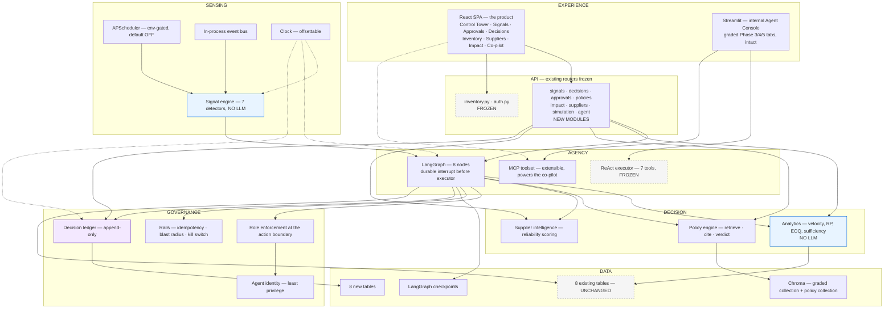

# 11 — Target Architecture

> **Status:** Proposal. Nothing here is approved.
> **Purpose:** Specify the system that produces the capabilities, workflows, and metrics in files 05, 09, and 10 — and answer the brief's direct question: *is the current architecture sufficient, or does it need significant change?*
> **Authority:** Architecture decisions **AD-1 … AD-15** are locked in [00-EXECUTIVE-SUMMARY.md](00-EXECUTIVE-SUMMARY.md) §4. This document expands them; where they conflict, the spine wins.

---

## 1. The direct answer

> **The stack is right. The shape is wrong.**

Not one technology choice in this codebase is a mistake. FastAPI, SQLAlchemy 2.0, Pydantic v2, SQLite, LangChain, LangGraph, ChromaDB, Gemini, structlog, React/Vite — every one is defensible for a system of this size, and replacing any of them would be churn dressed as progress.

What is missing is **seven entire layers**, and their absence is why the system can only advise:

| Missing layer | Consequence of its absence today |
|---|---|
| **Event / trigger** | Nothing initiates. Every action begins with a click |
| **Background runtime** | Nothing happens between clicks |
| **Analytics** | Numbers come from a language model. Five business-consequential fields are fabricated |
| **Policy** | §10's ₹50,000 threshold lives in markdown the code never reads |
| **Governance** | No approval entity, no RBAC enforcement at the action boundary, no agent identity |
| **Decision ledger** | Nothing is recorded. The system cannot say what it did or why |
| **Simulation** | 13 stock movements inside one calendar day. Nothing to reason about |

**"Add seven layers, change no technologies" is a significant architectural change.** It is not a rewrite, and the distinction matters for a 100-associate cohort: everyone can rebuild; almost nobody will *extend correctly under constraint*. The graded tests, the additive-only schema rule, and the frozen 7-tool executor are constraints. Working inside them and still producing an autonomous system is the harder and more impressive result.

**What is redesigned, replaced, combined, removed** — the brief asked explicitly:

| Verb | Target |
|---|---|
| **Redesign** | The LangGraph (4 advisory nodes → 8 governed nodes, one of which writes) · `demand_forecaster` (LLM → deterministic) · `App.jsx` (1,136-line monolith → feature modules) |
| **Replace** | The `stock_alerts` table as a *detection mechanism* → `signals` with 7 detectors (the table itself is left in place, unchanged) · the tab-state navigation → a real router |
| **Combine** | Two near-duplicate chat agents → one co-pilot at the product surface (both executors survive for the graders) |
| **Remove** | Streamlit **from the product path** (retained as the internal Agent Console) · the LLM from every arithmetic path · `service_auth`'s admin impersonation |
| **Keep untouched** | All 8 existing tables · `inventory.py` and `auth.py` routers · `build_agent_executor` · the graded RAG collection |

---

## 2. Layered view



Dashed = frozen. Blue = deterministic, no LLM. Purple = the accountability layer.

**Read the diagram for what is absent:** no message broker, no cache, no worker pool, no separate services. A single-node deployment with persisted run records. Anything more would be infrastructure for a scale that does not exist — rejected in [04-OPPORTUNITY-SPACE.md](04-OPPORTUNITY-SPACE.md) §8.4.

---

## 3. Module map

Directory ownership is the mechanism that makes parallel development safe. **One owner per directory; new files over edited files.**

```
src/
├── core/                              NEW — cross-cutting, WS-0, Wave 0
│   ├── clock.py                       NEW  now()/today()/offset (AD-9)
│   ├── events.py                      NEW  in-process bus (AD-8)
│   ├── ids.py                         NEW  SIG-/DEC-/APR-/RUN- generation
│   ├── vocab.py                       NEW  frozen status constants
│   └── errors.py                      NEW  InsufficientData, PolicyViolation
│
├── backend/
│   ├── models.py                      FROZEN — zero edits (AD-3)
│   ├── models_governance.py           NEW  signals decisions approvals autonomy_policies
│   ├── models_analytics.py            NEW  agent_runs metric_snapshots
│   ├── models_sourcing.py             NEW  supplier_products
│   ├── models_simulation.py           NEW  demo_scenarios
│   ├── models_registry.py             NEW  imports all four, so create_all sees them
│   ├── main.py                        INTEGRATION-OWNED — registration only (AD-5)
│   ├── routers/
│   │   ├── inventory.py  auth.py      FROZEN (AD-5)
│   │   ├── signals.py                 NEW
│   │   ├── decisions.py               NEW
│   │   ├── approvals.py               NEW
│   │   ├── policies.py                NEW
│   │   ├── impact.py                  NEW
│   │   ├── suppliers.py               NEW
│   │   ├── simulation.py              NEW
│   │   ├── receiving.py               NEW  WS-9 — goods receipt, backdatable
│   │   └── agent.py                   NEW  invoke · autonomy · kill switch
│   └── services/
│       ├── inventory_service.py       WS-9 SOLE OWNER — see §3.1
│       ├── po_service.py              NEW  WS-9 — consolidation, status advance
│       ├── analytics_service.py       NEW  C2 — no LLM
│       ├── signal_service.py          NEW  C1 — 7 detectors
│       ├── policy_service.py          NEW  C4
│       ├── decision_service.py        NEW  C3 lifecycle
│       ├── approval_service.py        NEW  C5
│       ├── supplier_service.py        NEW  C11
│       ├── impact_service.py          NEW  C6 metrics
│       └── simulation_service.py      NEW  C8
│
├── execution/                         NEW — WS-9, the only write path
│   ├── preconditions.py               NEW  the 7 checks, re-run at execution time
│   └── idempotency.py                 NEW  key derivation + consumption (AD-15)
│
├── agents/
│   ├── executor/                      FROZEN — 7 tools (AD-11)
│   ├── mcp/                           EXTEND — new read tools
│   └── multi_agent/
│       ├── graph.py                   REDESIGNED — 8 nodes, checkpointer
│       ├── state.py                   EXTENDED TypedDict
│       └── nodes/                     NEW  one file per node
│
├── rag/
│   ├── data/inventory_manual.md       FROZEN (AD-13)
│   └── policy/                        NEW  separate collection, section metadata
│
└── ui/
    ├── web_react/src/                 DECOMPOSED — see 07 §9
    └── streamlit/                     DEMOTED, intact
```

### 3.1 The one shared service file, and how it is handled

`inventory_service.py` (203 lines) is the only existing service file more than one workstream has a reason to touch. It gets **exactly one owner: WS-9, Executor & Inventory Extensions.** No other stream writes to it — a stream that needs a function there files an integration request instead.

> **Correction.** An earlier draft of this section assigned the defect fixes to **WS-4**. That was wrong on the principle it was meant to enforce. WS-4 is governance — decisions, approvals, the ledger — and has no business inside the inventory service. WS-9 is the stream whose subject matter this file *is*, and single ownership only works if the owner is the stream that would naturally be reading the file anyway. See [14-PARALLEL-WORKSTREAMS.md](14-PARALLEL-WORKSTREAMS.md) §2.2.

Three verified defects, all WS-9's:

| Line | Defect | Fix |
|---|---|---|
| `:133` | `if po.status == POStatus.cancelled:` — the **only** status guard on receipt, so a `draft` PO can be received | Guard on the set of receivable statuses |
| `:137` | `po.received_date = date.today()` — bypasses the clock entirely | `clock.now()`, with an optional explicit receipt date |
| `:140-141` | `qty = item.quantity_received or item.quantity_ordered` — a partial receipt is silently treated as complete | Honour the received quantity as recorded |

`:137` is the one that gates a demo. Until it accepts a supplied date, **no historical receipt can be seeded**, so WS-2's 90-day backfill cannot produce a late delivery, supplier reliability has nothing to measure, C11 has no input, and BW-3's late-delivery evidence cannot be reproduced. One line, four consequences — which is why WS-9 sits in Wave 2 rather than later.

The two other rules on this file, for WS-9's own discipline: **additive by preference** (new capability arrives as new functions, so the graded Phase 1 surface keeps working), and **every write must preserve `sum(stock_movements.quantity) == stock_levels.quantity_on_hand`** (M-16), which is the invariant the existing seeder's `verify(db)` already checks.

---

## 4. The four frameworks — what each actually contributes

The brief asked directly. Answers are specific, and where a framework is carrying less weight than its presence implies, that is stated.

### 4.1 LangGraph — earns its place through one feature

**Contribution: the durable human-in-the-loop interrupt. That is the entire justification, and it is sufficient.**

```python
graph.compile(
    checkpointer=SqliteSaver.from_conn_string(CHECKPOINT_DB),
    interrupt_before=["executor"],
)
```

An approval-gated autonomous system must suspend and resume across arbitrary time — hours, days, a redeploy. What LangGraph provides that a function chain cannot: state persisted to disk, resumption *at the node* rather than the top, no held thread or coroutine, and an inspectable record of the exact state the decision was made on.

**Honest caveat:** today's graph does not earn this. Four nodes in fixed serial order, one error-escape edge, no node writes anything. If the interrupt were removed from the proposal, **LangGraph should be removed with it** — and saying so is what makes the justification credible rather than decorative.

**Mandatory fallback (AD-6),** so no parallel developer ever blocks: if `langgraph-checkpoint-sqlite` proves fragile, serialise graph state as JSON on the `decisions` row and re-enter at `executor` on approval. Identical observable behaviour, no new dependency. **Specified in advance precisely so it is never an emergency decision.**

### 4.2 LangChain — tool abstraction and the ReAct loop, nothing more

**Contribution:** the `@tool` decorator and the ReAct agent loop, in exactly two places — the frozen 7-tool executor (AD-11) and the co-pilot on MCP.

**Where LangChain is deliberately *not* used:** the graph nodes. Six of eight are plain Python calling service functions directly. Routing a deterministic arithmetic step through a tool-calling abstraction adds indirection and buys nothing.

This is the honest scope. LangChain's value here is real but narrow: it is the reason the co-pilot can decide *which* tool to call and *when to stop*, which is genuine model-determined control flow. Claiming more for it would be inflation.

### 4.3 RAG — from a Q&A demo to a control-plane input

This is the largest change in how a framework is *used*, and the most differentiating.

| | Today | Proposed |
|---|---|---|
| Purpose | Answer questions about the manual | **Supply the operating rules the system is governed by** |
| Consumer | A chat tab | `policy_gate` — a node that gates execution |
| Output | Prose for a human | A structured limit + a verbatim citation stored on the decision |
| Consequence of retrieval failure | A worse answer | **Escalation to a human** — fail safe, never fail open |

The concrete claim: **the ₹50,000 approval threshold is not a constant in the code. It is retrieved from §10 line 113 at decision time and quoted verbatim in the approval request.** Edit the manual, restart, and the system's governance changes — with no code change. That is a live, three-second demonstration.

Why retrieval rather than a config value: a config value is a developer's transcription of a policy. A retrieved citation is *the policy*, with an audit trail back to the document a compliance officer signed. And the failure mode is right — an unresolvable policy escalates rather than defaults.

Two guards, because retrieval into a control path is a real risk:
- **AD-13:** policy documents go in a **separate Chroma collection** with section-level metadata. The graded corpus stays byte-identical.
- **Guarded extraction:** an unparseable limit falls back to the most restrictive interpretation (`requires_approval`) and records that it did.

### 4.4 MCP — the extensible tool surface, and an honest disclosure

**Contribution:** the toolset the co-pilot runs on, and the growth path that keeps the frozen executor frozen (AD-11). The executor is locked at exactly 7 tools by `tests/phase3/test_phase3.py:15`; MCP is asserted `>= 6`. **Every new tool goes to MCP.** That constraint produces the right architecture by accident, and then by design.

**Disclosure:** the MCP protocol is currently **never actually spoken.** FastMCP 3.4.7 is present and 6 tools are registered, but the consumer imports them in-process, bypassing stdio entirely. It is a tool registry wearing a protocol's name.

Two honest positions, and the recommendation:

- **C19 (OPTIONAL)** — make stdio real, ship a client config. Verifiable in one command, and it is the kind of thing a technical reviewer probes.
- **Otherwise** — say plainly that MCP is used as a tool-registration layer and the transport is in-process. **A stated limitation costs nothing; a discovered overclaim costs the whole session.**

Recommendation: build C19 if Wave 3 has room. It is a few hours and it converts a soft spot into a strength.

---

## 5. Cross-cutting mechanisms

### 5.1 Clock (AD-9) — a Wave-1 dependency for almost everything

`src/core/clock.py` exposes `now()` and `today()`, offsettable by env and an admin endpoint.

**Every date comparison in new code must use it.** Without this, `po_overdue` detection cannot be demonstrated without waiting real days — which would make BW-3, the most differentiating workflow, undemoable. A one-file abstraction gates an entire capability, which is why it lands in Wave 1 and why every workstream is told about it before writing a line.

### 5.2 Events (AD-8) — synchronous, in-process, persisted

`src/core/events.py`: named domain events, synchronous dispatch, subscribers registered at startup, **every consequential event persisted to `agent_runs`.**

| Event | Publisher | Subscriber |
|---|---|---|
| `StockChanged` | Post-commit hook | Signal engine |
| `SignalRaised` | Signal engine | Loop invoker |
| `DecisionPending` | Policy gate | Approval queue |
| `ApprovalGranted` | Approval service | Graph resumer |
| `ActionExecuted` | Executor | Ledger, impact |
| `TickCompleted` | Scheduler | Metric snapshotter |

**Why not a broker.** The deployment is single-node SQLite. A broker would add an operational dependency, a serialisation format, a delivery-guarantee discussion, and a second failure domain — to move messages between functions in one process. Traceability is the actual requirement, and persisted run records provide it. Kafka/Celery/Redis rejected in [04-OPPORTUNITY-SPACE.md](04-OPPORTUNITY-SPACE.md) §8.4.

### 5.3 Background runtime — env-gated, default OFF

APScheduler, one job: the tick. **Default OFF.**

Default-OFF is deliberate on three grounds: it must not perturb the Phase 1 test suite; a background writer firing during a code review or demo setup is a liability; and "it runs unattended" is a claim best made by turning it on deliberately and watching it fire. The Control Tower header shows the last tick, so *"is it running?"* is answerable at a glance.

### 5.4 Safety rails (AD-15) — non-negotiable once a process writes autonomously

| Rail | Mechanism | Failure it prevents |
|---|---|---|
| Idempotency | `hash(signal, product, qty, supplier, decision)`; consumed keys recorded | Duplicate PO on retry or double-click |
| In-flight guard | Refuse if an open PO already covers the SKU | Double-ordering the same shortage |
| Blast radius | Max POs/hour, max ₹/day | A detector bug becoming a spending event |
| Circuit breaker | Suspend autonomy after N consecutive failures | Repeated failure at machine speed |
| Kill switch | Global halt, reason recorded | Everything else |
| PO-number serialisation | `_next_sequence` is documented as **not** concurrency-safe — the executor serialises allocation | Colliding PO numbers |

Idempotency is what makes the durable interrupt safe rather than dangerous: suspend-and-resume creates a natural double-execution window. **Without the key, governance would be the mechanism that caused duplicate orders.**

### 5.5 Identity and RBAC (AD-12)

Today `src/service_auth.py` logs in as `admin@retail.com` / `admin` — so **every agent action runs with full manager privilege, attributed to "Admin".** The audit trail is wrong at the root.

Fix: a distinct `agent@retail.com` with role `agent`. `User.role` is a free-text column, so **zero migration.**

| Role | May | May not |
|---|---|---|
| `staff` | Receive goods, view | Approve, change policy |
| `manager` | Approve, reject, set autonomy, change thresholds | — |
| `agent` | Detect, decide, execute **within policy** | Approve its own decision, change policy, alter autonomy |

Enforced at the action boundary, not in the UI. Dev Kumar's 403 on approval is the 15-second proof that these rows are code and not documentation.

The most important cell in that table: **the agent cannot approve its own decision.** Without it, the entire approval mechanism is theatre.

---

## 6. Data architecture

**AD-3: zero migrations on existing tables.** `Base.metadata.create_all` is additive — new tables free, new columns not, and there is no Alembic. Every design choice below follows from that one fact.

| New table | Holds | Key relationships |
|---|---|---|
| `signals` | Detections, lifecycle, dedup key | → `products` |
| `decisions` | The ledger. Inputs, citation, narrative, authority, outcome | → `signals`, **holds `po_id`** |
| `approvals` | Requests and verdicts, actor, latency | → `decisions`, `users` |
| `autonomy_policies` | Mode, caps, kill switch, per scope | → `categories` |
| `supplier_products` | Price, lead time, MOQ per supplier per product | → `suppliers`, `products` |
| `agent_runs` | Run trace, node timings, tokens, violations | → `decisions` |
| `metric_snapshots` | Time series with tier + disclosure | — |
| `demo_scenarios` | Named deterministic starting states | — |

**Direction of reference is load-bearing.** `decisions` holds `po_id`; `purchase_orders` does **not** gain `decision_id`. New always points at old. This is what makes "zero changes to eight existing tables" achievable rather than aspirational — and it also means the governance layer could be deleted wholesale and the existing system would still run.

Approval attribution lives in `approvals`, not on `purchase_orders`, for the same reason.

The three unreachable `POStatus` values are reached by **new endpoints**, not schema change:

| Status | Reached by |
|---|---|
| `submitted` | `executor` (BW-1) and the approval path (BW-2) |
| `acknowledged` | A new supplier-acknowledgement endpoint (§5 #3) |
| `cancelled` | Remains deliberately unreachable — no workflow requires it |

Reducing unreachable states from 3 to 1, with no migration, is a concrete and checkable claim.

---

## 7. Observability

| Concern | Mechanism | Status |
|---|---|---|
| Structured logs | structlog JSON | Present |
| Run traces | `agent_runs` — node timings, tokens, errors, violations | New |
| Decision audit | `decisions`, append-only | New |
| Metric history | `metric_snapshots` | New |
| Spans | OpenTelemetry API/SDK present, **no exporter — spans are no-ops** | C20, OPTIONAL |
| LLM tracing | LangSmith declared, unconfigured | Optional |

`agent_runs` is the operational spine and it is worth more than the tracing gap it does not fill: a reviewer asking *"what did it do at 08:00?"* gets node-by-node timings, token counts, and any numeric violations from a SQL table. C20 activates dead instrumentation and is honest housekeeping, but it changes no capability.

---

## 8. Deployment and dependencies

Single node. FastAPI + uvicorn, SQLite (WAL, single writer, short transactions), Chroma on disk, React static build, Streamlit as a separate internal process. No containers required, no orchestration.

**AD-14 — all dependency changes, added by one owner in Wave 1 so `requirements.txt` and `package.json` are never merge conflicts:**

| Ecosystem | Add | Verified state |
|---|---|---|
| Python | `apscheduler` | **Absent** from `requirements.txt` |
| Python | `langgraph-checkpoint-sqlite` | **Absent** (`langgraph>=1.2.0` present) |
| JS | `react-router-dom` | Absent — **there is no router today** |
| JS | `@tanstack/react-query` | Absent |
| JS | `recharts` | Absent |

`package.json` declares exactly four runtime dependencies: `axios`, `lucide-react`, `react`, `react-dom`. Navigation is `useState('dashboard')` at `App.jsx:160`. **WS-6 must introduce routing, not reorganise it.**

Worth saying in the presentation: **an autonomous, governed, audited system with a rebuilt front end needs two new Python packages.** That is a statement about the quality of the existing foundation.

---

## 9. What was considered and rejected

| Rejected | Reason |
|---|---|
| Message broker (Kafka / RabbitMQ) | Cross-process delivery guarantees for in-process function calls |
| Celery / RQ workers | APScheduler in-process is sufficient for one job on one node |
| Redis | Nothing needs a distributed cache. SQLite reads are microseconds here |
| Postgres | Would justify itself at concurrency this system will not see, and costs the zero-setup property |
| Alembic | Genuinely tempting — but the additive-only design removes the need, and adding a migration tool mid-project invites schema churn across parallel streams |
| Microservices | One team, one node, one deployable |
| Replacing LangGraph with plain functions | Correct **if and only if** the interrupt is dropped. It is not |
| Rewriting the React app | The existing CRUD and auth work. Decompose and re-skin (AD-10) |
| Replacing Streamlit | It holds the graded Phase 3/4/5 tabs. Demote, do not delete |
| Extending `inventory_manual.md` | AD-13. Separate collection instead |
| A second frontend | One is being rebuilt already |

Alembic deserves the extra sentence. The instinct to add it is right in general and wrong here: introducing a migration tool while ~8 new tables land across parallel workstreams would create exactly the coordination problem the additive-only rule eliminates. The constraint is doing useful work, so it stays.

---

## 10. Architecture risks

| Risk | Likelihood | Impact | Mitigation |
|---|---|---|---|
| `langgraph-checkpoint-sqlite` fragile | Medium | High | **AD-6 fallback pre-specified.** JSON state on `decisions`, re-enter at `executor` |
| `App.jsx` decomposition blocks UI streams | **High** | High | WS-6 is a Wave-1 gate. Explicit serialisation point, not wished away |
| Gemini quota exhausted mid-demo | **High** | Low | AD-2. Loop completes without narrative. **Designed degradation** |
| Autonomous writer causes a bad write | Low | **High** | AD-15 rails; kill switch; every precondition re-checked at execution time |
| Parallel streams collide on `main.py` | Medium | Medium | AD-5. Integration owns registration exclusively |
| Graded tests break | Low | **Critical** | Every lock verified from the test files, not documentation. See [18-INTEGRATION-AND-TESTING.md](18-INTEGRATION-AND-TESTING.md) |
| Scope exceeds available time | **High** | Medium | Cut lines in [19-ROADMAP.md](19-ROADMAP.md). C12 named first to cut |
| SQLite write contention under the tick | Low | Medium | Single writer, WAL, short transactions, advisory lock on the tick |

The two Highs worth naming out loud: **`App.jsx` is the real schedule risk** — it is a genuine serialisation point in an otherwise highly parallel plan. And **scope** — this is an ambitious plan by instruction, so the cut lines have to be decided before the pressure arrives, not during it.

---

## 11. Why this architecture, in one paragraph

The existing system has a good foundation and no nervous system. It cannot perceive — nothing initiates. It cannot compute honestly — five business-consequential numbers come from a language model. It cannot be trusted to act — no authority model, no approval entity, no attribution. And it cannot account for itself — nothing is recorded. This architecture adds perception (signal engine, scheduler, events, clock), honest computation (analytics with the LLM structurally excluded), bounded authority (policy engine reading retrieved and cited rules), and accountability (an append-only ledger), while changing no technology, editing no existing table, and leaving every graded artifact intact. **The result is not a better demo of the same system. It is the same system with the capacity to act.**

---

**Next:** [12-DATA-AND-API-CHANGES.md](12-DATA-AND-API-CHANGES.md) specifies every table, column, endpoint, and contract in implementable detail.
