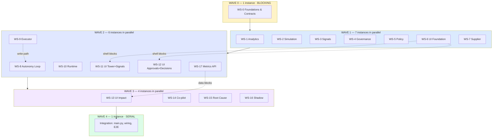

# 14 — Parallel Workstreams

> **Status:** Proposal. Nothing here is approved.
> **Purpose:** Divide the build into workstreams that multiple Claude Code instances can execute simultaneously without colliding, with exclusive file ownership, explicit interfaces, and per-stream test responsibility.
> **Governing constraint (verbatim from the brief):** *"Maximize parallelism where technically safe. Do not have multiple instances blindly modify the same core files."*

---

## 1. The actual problem

Parallel agent development fails for one reason far more often than any other: **two instances edit the same file and the second one's context does not contain the first one's change.** Not a merge conflict — a *silent* one, where both edits apply cleanly and the result is wrong.

This is worse with agents than with humans, because a human who opens a file sees the other person's work and stops. An agent that read the file two minutes ago and edits it now does not.

So the partition below is not organised by feature area, or by layer, or by convenience. It is organised by one rule:

> **Exactly one workstream may write to any given file. No exceptions, no "just one line".**

Everything else in this document — the wave structure, the contract freezing, the integration stream — exists to make that rule survivable.

### 1.1 The three collision classes and how each is eliminated

| Class | Example | Eliminated by |
|---|---|---|
| **Write collision** | Two streams both add a router to `main.py` | `main.py` is owned by **no** workstream. Integration only |
| **Contract collision** | WS-3 calls `compute_demand(sku)`; WS-1 ships `compute_demand(product_id, window)` | WS-0 freezes every cross-stream signature **before** Wave 1 starts |
| **Semantic collision** | Two streams both write `decisions` rows with different status vocabularies | The status vocabulary is a frozen constant in `src/core/`, owned by WS-0 |

The second class is the one people forget. It produces code that compiles, passes both streams' unit tests, and fails at integration — the most expensive failure mode available.

### 1.2 The dependency is the contract, not the implementation

This is the single decision that makes seven-way parallelism possible.

WS-3 (Signals) needs WS-1's (Analytics) demand calculation. Naively that serialises them. But WS-3 does not need WS-1's *code* — it needs to know the function's name, arguments, return type, and failure behaviour. If WS-0 freezes that, WS-3 can be written and unit-tested against a stub on day one and wired to the real implementation at integration.

Therefore:

- **WS-0 publishes signatures for everything that crosses a stream boundary.** Not implementations. Signatures, types, and semantics.
- **Every downstream stream builds against the frozen signature and tests against its own stub.**
- **Integration replaces stubs with real imports.** If the signature was honoured, this is a no-op.

The cost is that WS-0 must be right, and must be finished before anything else begins. That is why it is a wave of one. The benefit is that Wave 1 runs seven instances wide instead of two.

---

## 2. The current tree, classified

> **VERIFIED 2026-08-25.** Twenty-one Python modules, three React source files.

Every existing file falls into exactly one of three categories.

### 2.1 FROZEN — no workstream may modify these

| File | Lines | Why frozen |
|---|---|---|
| `src/backend/models.py` | — | AD-3. Zero migrations. New tables go in new modules |
| `src/backend/routers/inventory.py` | — | AD-5. Phase 1 graded surface |
| `src/backend/routers/auth.py` | — | AD-5. Phase 1 graded surface |
| `src/backend/schemas.py` | — | Existing request/response contracts are graded |
| `src/backend/seed_demo_data.py` | 351+ | Phase 1 seeder. WS-2 builds alongside, not inside |
| `src/agents/agent.py` | — | AD-11. `build_agent_executor` and the 7-tool count are graded |
| `src/agents/tools.py` | — | AD-11. `len(agent.tools) == 7` |
| `src/agents/prompts.py` | — | Coupled to the frozen executor |
| `src/agents/summarizer.py` | — | No reason to touch it |
| `src/rag/rag_chain.py` | — | Phase 2 graded. AD-13's policy collection is a **new** module |
| `src/rag/ingest.py` | — | Phase 2 graded: `>= 20` chunks, `<= 600` chars |
| `src/mcp_server/*.py` | — | Phase 4 graded: `>= 6` tools. C19 is a new module if built |
| `tests/phase1/` … `tests/phase5/` | — | **Graded. Read-only for every stream, including integration** |
| `src/ui/web_react/dist/` | — | Committed build artifact. Regenerated, never hand-edited |

**The graded tests are read-only.** A stream that cannot make its change without editing a graded test has found a design error, not a test error, and must escalate rather than edit. This rule is absolute because every honesty claim in the package depends on the graded surface being untouched.

### 2.2 SINGLE-OWNER EXISTING — one stream, named

| File | Lines | Owner | Change |
|---|---|---|---|
| `src/agents/multi_agent/graph.py` | 104 | **WS-8** | Rewritten to the 8-node topology (AD-7) |
| `src/agents/multi_agent/state.py` | 28 | **WS-8** | `InventoryState` extended |
| `src/agents/multi_agent/agents.py` | 537 | **WS-8** | Node functions replaced; **`agents.py:389-406`'s hallucination record preserved verbatim** |
| `src/agents/multi_agent/__init__.py` | 26 | **WS-8** | Exports |
| `src/backend/services/inventory_service.py` | 203 | **WS-9** | Defect fixes at `:133`/`:137`; partial-receipt support |
| `src/ui/web_react/src/App.jsx` | **1136** | **WS-6** | **Decomposed.** Sole owner, and the decomposition is its first task |
| `src/ui/web_react/src/main.jsx` | — | **WS-6** | Router mount |
| `src/ui/web_react/src/index.css` | — | **WS-6** | Replaced by the token layer |
| `src/ui/chat_streamlit/app.py` | — | **WS-14** | Demoted to Agent Console (AD-10) |
| `src/service_auth.py` | — | **WS-0** | AD-12's agent identity. One-line change, Wave 0 |
| `src/model_config.py` | — | **WS-0** | Shared LLM config. Wave 0 |

> **Correction to [11-TARGET-ARCHITECTURE.md](11-TARGET-ARCHITECTURE.md) §3.1.** That section scoped the two `inventory_service.py` defect fixes to WS-4. **They belong to WS-9.** WS-4 is governance — decisions, approvals, the ledger — and has no business in the inventory service. WS-9 is *Executor & Inventory Extensions*; it is the stream whose job that file is. One existing file, one owner, and the owner should be the stream the file's subject matter belongs to. File 11 will be amended.

### 2.3 INTEGRATION-ONLY — no workstream may touch these

| File | Why | Who |
|---|---|---|
| `src/backend/main.py` (197 lines) | Every stream wants to add a router at `:177`. **Guaranteed collision.** | Integration |
| `requirements.txt` | Every stream wants a dependency | **WS-0, once, all of them** (AD-14) |
| `src/ui/web_react/package.json` | Same | **WS-0, once, all of them** |
| `README.md`, top-level docs | Cosmetic conflicts | Integration |

`main.py` deserves the emphasis. It is only 197 lines, it imports routers at `:12`, includes them at `:177–178`, and calls `Base.metadata.create_all(bind=engine)` at `:84` inside the lifespan. It is the single highest-collision file in the repository, and eight workstreams have a legitimate reason to add two lines to it. **All eight are refused.**

Instead every backend stream exposes a module-level `router` object and does nothing else. Integration writes the import and the `include_router` call, in one pass, once.

### 2.4 WS-0's one sanctioned exception

The new model modules must be imported before `create_all` runs at `main.py:84`, or the eight new tables are never created.

WS-0 therefore makes **one** edit to `main.py`: adding `from src.backend import models_registry  # noqa: F401` to the import block. `models_registry.py` (new, WS-0-owned) imports every model module.

This is sanctioned because WS-0 is a wave of one — no other instance is running — and because every subsequent stream that adds a table adds it to `models_registry.py`, a WS-0-authored file that becomes append-only. The alternative (each stream editing `main.py`) is exactly the collision this document exists to prevent.

---

## 3. The eighteen workstreams

Each entry gives: responsibility, exclusive ownership, what it consumes, what it publishes, its test responsibility, and the specific collision it must avoid.

---

### WS-0 — Foundations & Contracts
**Wave 0 · Solo · Blocking · Must be short**

| | |
|---|---|
| **Responsibility** | Everything shared. Freeze it, then get out of the way |
| **Owns (new)** | `src/core/__init__.py`, `clock.py`, `events.py`, `errors.py`, `ids.py`, `vocab.py`<br>`src/backend/models_governance.py`, `models_analytics.py`, `models_sourcing.py`, `models_simulation.py`, `models_registry.py`<br>`src/backend/contracts/` — shared Pydantic schemas |
| **Owns (existing)** | `requirements.txt`, `package.json`, `src/service_auth.py`, `src/model_config.py`, **one line in `main.py`** (§2.4) |
| **Consumes** | Nothing |
| **Publishes** | The eight tables · `clock.now()` · the event bus · ID generators · the status vocabularies · **every cross-stream function signature** |
| **Tests** | `tests/core/` — clock determinism, event ordering, ID format, table creation on a fresh DB **and** on a copy of the existing `inventory.db` |
| **Must avoid** | Any business logic. WS-0 is plumbing. A WS-0 that starts computing reorder points has become WS-1 and blocked six streams |

**Non-negotiables WS-0 must establish, because six streams depend on each:**

1. **`clock.now()` and nothing else.** No `datetime.now()`, no `date.today()`, anywhere, in any stream. Grep-enforced in CI.
2. **Every status-like column on a new table is `String`, never `Enum`** (file 12 §1.2). The three existing enums cannot gain members; a new `Enum` would re-create the cage.
3. **Explicit timestamps on every new row.** `server_default=func.now()` is SQLite-evaluated and invisible to `clock.now()`. This is why the current database has ninety days of history compressed into one calendar day.
4. **`_next_sequence` must be concurrency-safe** (AD-15). Two streams will call it.
5. **The 12-value `decision_status` and 4-value `analysis_status` vocabularies**, plus the projection between them (file 08 §4.2). Two streams write these columns.

**The failure mode to state plainly:** if WS-0 ships a signature it later needs to change, six streams have already built on it. WS-0 gets one shot at each signature. This argues for WS-0 being deliberately narrow — plumbing and vocabulary, no cleverness.

---

### WS-1 — Analytics Core
**Wave 1 · Depends: WS-0 contracts**

| | |
|---|---|
| **Responsibility** | Every business number in the system. **The stream that makes M-14 true** |
| **Owns** | `src/analytics/` — `demand.py`, `reorder.py`, `sufficiency.py`, `eoq.py`, `valuation.py`, `leadtime.py` |
| **Consumes** | `src/core/clock`; read-only ORM access to `stock_movements`, `products`, `suppliers`, `purchase_orders` |
| **Publishes** | Pure functions. `compute_daily_demand`, `derive_reorder_point`, `score_sufficiency`, `compute_eoq`, `measured_lead_time`, `inventory_value` |
| **Tests** | `tests/analytics/` — **the manual's worked examples as literal assertions**: `(10 × 5) + (10 × 2) == 70` (§3 line 35) and `(5 × 7) + (5 × 14) == 105` (§9 line 102). Plus zero-history, single-observation, and negative-stock cases |
| **Must avoid** | **Writing to the database. At all.** WS-1 is pure. A single write turns it into a stream that must be serialised against WS-4 and WS-9 |

The two manual assertions are the most valuable tests in the build. They are the executable proof that the arithmetic matches the customer's own document, and they are cheap.

**Every function must return a sufficiency verdict alongside its number**, or return no number. `compute_daily_demand` on a SKU with zero sales returns `insufficient`, not `0.0`. Returning zero is how a system ends up ordering nothing for a product that is out of stock — and it is how D4's refusal becomes impossible.

---

### WS-2 — Simulation & Data Harness
**Wave 1 · Depends: WS-0 contracts · Highest early leverage**

| | |
|---|---|
| **Responsibility** | Make the database say something. Everything credible depends on this |
| **Owns** | `src/simulation/` — `seeder.py`, `backfill.py`, `scenarios.py`, `reset.py`<br>`src/backend/routers/simulation.py` |
| **Consumes** | `clock`, the new models |
| **Publishes** | `POST /api/simulation/*` · the four `demo_scenarios` rows from file 13 · a 90-day backfill |
| **Tests** | `tests/simulation/` — reset idempotency (load twice, verify twice), backfill produces ninety distinct dates, **`expected_signals` verification for all four scenarios** |
| **Must avoid** | Touching `seed_demo_data.py`. Build alongside it |

**Why this is Wave 1 and not later.** Today zero of five products have a computable daily demand (file 13 §2.5). Until WS-2 lands, WS-1 has nothing to compute, WS-3 has nothing to detect, and every screen is empty. WS-2 is the stream that turns the rest of the build from plausible into demonstrable, and it has no dependencies beyond WS-0.

**The single most important line WS-2 writes** is the explicit `recorded_at=clock.now() - timedelta(days=n)` on every backfilled movement. Omit it and ninety days of history collapses onto today — the exact defect visible in the current database.

---

### WS-3 — Signal Engine
**Wave 1 · Depends: WS-0 contracts, WS-1 signatures**

| | |
|---|---|
| **Responsibility** | The seven detectors. The system's senses |
| **Owns** | `src/signals/` — `engine.py`, `dedup.py`, `detectors/` (one module per type)<br>`src/backend/routers/signals.py` |
| **Consumes** | WS-1's analytics (**stubbed until integration**), `clock`, the event bus |
| **Publishes** | `signals` rows · `signal.raised` events · `GET /api/signals`, `/api/signals/:id` |
| **Tests** | `tests/signals/` — one test per detector proving it fires **and** one proving it does not fire on a healthy SKU; `dedup_key` collision behaviour; **`data_insufficient` fires on Colgate** |
| **Must avoid** | Writing `decisions` rows. WS-3 detects; WS-4 decides. The boundary is the whole point of the two tables |

Seven detectors, seven files, so a broken one is isolated. Five of the seven (`projected_breach`, `po_overdue`, `config_drift`, `supplier_drift`, `capital_drag`) detect classes with a **verified baseline of zero** — the strongest impact claims in file 10.

`dedup_key` matters more than it looks: a detector that re-raises the same signal every five minutes turns the signals inbox into the alert list it replaced.

---

### WS-4 — Governance Backend
**Wave 1 · Depends: WS-0 contracts**

| | |
|---|---|
| **Responsibility** | The decision ledger and the approval lifecycle. The accountability layer |
| **Owns** | `src/governance/` — `decisions.py`, `approvals.py`, `ledger.py`, `counter.py`<br>`src/backend/routers/decisions.py`, `routers/approvals.py` |
| **Consumes** | `clock`, ID generators, the status vocabularies |
| **Publishes** | `decisions` and `approvals` rows · `GET /api/decisions` (**no POST** — decisions are created by the pipeline, never by a client) · `POST /api/approvals/:id/approve|reject|counter` |
| **Tests** | `tests/governance/` — the twelve-status lifecycle; **the projection to the four graded `analysis_status` values**; `system_objection` persists on override; RBAC (staff → 403); **the agent cannot approve its own decision** |
| **Must avoid** | `inventory_service.py` (WS-9). Executing anything (WS-9). Deciding authority (WS-5) |

The `/counter` endpoint is where the governance claim is either real or theatre. It must recompute, record an objection when the counter-proposal is worse, and **persist that the human overrode it**. A counter-proposal flow that silently accepts the human's number produces a log of a system nobody ever disagreed with.

---

### WS-5 — Policy Engine
**Wave 1 · Depends: WS-0 contracts**

| | |
|---|---|
| **Responsibility** | The ten ordered authority rules. Pure evaluation |
| **Owns** | `src/policy/` — `rules.py`, `evaluator.py`, `blast_radius.py`, `killswitch.py`<br>`src/backend/routers/policies.py` |
| **Consumes** | `autonomy_policies` rows, `clock` |
| **Publishes** | `evaluate(decision_context) -> PolicyVerdict` · `GET/PATCH /api/policies` |
| **Tests** | `tests/policy/` — **one test per rule, in order**; kill switch beats everything; **₹50,001 escalates and ₹49,999 does not**; a reorder-point change escalates at *any* value |
| **Must avoid** | Executing. Writing decisions. **Reordering the rules** — the order is the semantics |

The ten rules are a table (file 08 §5.5), evaluated in order, first match wins. That structure is deliberate: an auditor should be able to read the policy as a list and predict the outcome. **A policy engine you cannot predict by reading is not a governance control.**

The ₹50,000 boundary tests are the ones to get exactly right — the threshold is quoted verbatim from the customer's manual (§10 line 113), and an off-by-one there is a governance failure, not a rounding issue.

---

### WS-6 — UI Foundation
**Wave 1 · Depends: WS-0's `package.json` · Blocks WS-11, 12, 13, 14**

| | |
|---|---|
| **Responsibility** | **Sole owner of the `App.jsx` decomposition.** The shell every UI stream builds inside |
| **Owns** | `src/ui/web_react/src/` — `main.jsx`, `App.jsx`, `routes.jsx`, `styles/tokens.css`, `layout/`, `components/` (primitives), `lib/api.js`, `lib/query.js`, `lib/provenance.jsx` |
| **Consumes** | Nothing at runtime. The API contract on paper |
| **Publishes** | Routing (17 routes, file 07 §3.2) · the token layer · primitives — `<Card>`, `<Table>`, `<SeverityDot>`, `<ProvenanceMark>`, `<EvidenceBlock>`, `<RefusalCard>`, `<EmptyState>` · the API client · the query layer |
| **Tests** | `tests/ui/` — every route renders; primitives snapshot; **`<SeverityDot>` carries shape + text label, never colour alone**; empty/loading/error/refusal states render for every primitive |
| **Must avoid** | Building any screen. WS-6 builds the *shell*. A WS-6 that builds the Control Tower has taken WS-11's file and blocked it |

**Task one is decomposing the 1136-line `App.jsx`, and nothing else starts in the UI until it is done.** Three streams (WS-11, 12, 13) plus WS-14 will write into `src/ui/web_react/src/screens/`. If that directory does not exist with a settled convention, all four collide on day one.

**Two verified facts shape this stream** (AD-14): `package.json` declares exactly four runtime dependencies — `axios`, `lucide-react`, `react`, `react-dom`. There is **no router, no charts library, and no server-state library.** The current app navigates with `const [activeTab, setActiveTab] = useState('dashboard')` at `App.jsx:160`. WS-6 *introduces* routing rather than reorganising it, and `react-router-dom`, `@tanstack/react-query`, and `recharts` are pre-declared by WS-0.

**The primitive that matters most is `<ProvenanceMark>`.** Three marks — computed / retrieved / generated (file 07 §7.1) — appearing beside every number in the product. If it is a shared primitive it is consistent; if each screen rolls its own, the product's central honesty claim is enforced by four separate implementations and will drift.

---

### WS-7 — Supplier Intelligence
**Wave 1 · Depends: WS-0 contracts, WS-1 signatures**

| | |
|---|---|
| **Responsibility** | Supplier selection, measured reliability, drift detection |
| **Owns** | `src/sourcing/` — `scorecard.py`, `selection.py`, `drift.py`<br>`src/backend/routers/suppliers.py` |
| **Consumes** | `supplier_products`, `purchase_orders`, WS-1's `measured_lead_time` |
| **Publishes** | `select_supplier(sku, qty) -> SupplierChoice` · `GET /api/suppliers/:id/scorecard` |
| **Tests** | `tests/sourcing/` — **`n = 1` is reported as `n = 1`, never as a reliability percentage**; `PO-2026-0001` yields +4 days vs contract; inactive suppliers are excluded (§6 line 74) |
| **Must avoid** | Raising POs (WS-9). Deciding whether a non-cheapest choice needs approval (WS-5) |

The `n = 1` test is the honesty test for this stream. The database contains exactly one completed PO. A scorecard that renders "80% on-time" from one observation is fabrication with a progress bar. **The scorecard must show the sample size with the same prominence as the score.**

WS-7's drift output is what makes D2 work, and its evidence needs no clock manipulation — `PO-2026-0001` is already four days over contract and nothing has ever looked.

---

### WS-8 — Autonomy Loop
**Wave 2 · Depends: WS-1, WS-3, WS-5, WS-9 signatures · Highest risk**

| | |
|---|---|
| **Responsibility** | The LangGraph 8-node topology and the durable interrupt |
| **Owns** | `src/agents/multi_agent/graph.py`, `state.py`, `agents.py`, `__init__.py`; new `nodes/` package |
| **Consumes** | WS-1, WS-3, WS-5, WS-7, WS-9 — all of them |
| **Publishes** | `build_inventory_graph()` · `run_pipeline(trigger)` · the resume entry point |
| **Tests** | `tests/autonomy/` — every path terminates at `recorder`; **interrupt suspends and resumes durably across a process restart**; **executor re-checks all seven preconditions**; declined path still produces ≥4 messages |
| **Must avoid** | **Breaking the five Phase 5 graded assertions.** Verify against `tests/phase5/` after every change |

This is the riskiest stream and should go to the most capable instance. Five graded assertions constrain it:

| Test | Assertion |
|---|---|
| `test_routing.py:37-42` | Four node names appear in `inspect.getsource(build_inventory_graph)` |
| `test_routing.py:45-48` | `"demand_forecaster"` present **and** an entry-point call |
| `test_e2e.py:78` | `len(result["messages"]) >= 4` |
| `test_e2e.py:102` | `analysis_status ∈ {complete, reorder_required, healthy, analyzing}` |
| `test_e2e.py:167` | `analysis_status ∈ {reorder_required, complete}` |

The entry-point test is source-inspection and technically gameable. **It is not gamed.** `demand_forecaster` is genuinely the entry point because deterministic computation genuinely comes first (file 08 §2.1). Gaming a loose test would undercut every honesty claim in the package.

**Two preservation requirements.** `agents.py:389-406`'s hallucination record — 3/3 runs inventing `supplier_id: 101` and a ₹580 price against a real ₹600 — is the repository's own evidence for AD-2 and must survive the rewrite verbatim, as a comment if nothing else. And the ≥4-messages requirement is met on the decline path by three genuine `demand_forecaster` messages plus the refusal. **No filler messages.**

---

### WS-9 — Executor & Inventory Extensions
**Wave 2 · Depends: WS-0, WS-5 · Sole owner of the only write path**

| | |
|---|---|
| **Responsibility** | The only code in the system that changes business state |
| **Owns** | `src/backend/services/inventory_service.py` (**sole owner**), `services/po_service.py` (new), `routers/receiving.py` (new), `src/execution/preconditions.py` |
| **Consumes** | WS-5's verdict, WS-7's supplier choice, `clock` |
| **Publishes** | `execute_decision(decision) -> ExecutionResult` · `POST /api/receiving/*` · the seven preconditions |
| **Tests** | `tests/execution/` — **`sum(movements) == quantity_on_hand` after every write** (M-16); idempotency key blocks a replay; duplicate-order guard blocks a second open PO for one SKU; partial receipt derives correctly; **the `:133`/`:137` defect fixes have regression tests** |
| **Must avoid** | Deciding anything. WS-9 executes a decision someone else authorised |

Three verified defects in `inventory_service.py`, now WS-9's:

| Line | Defect |
|---|---|
| `:133` | `if po.status == POStatus.cancelled:` — the *only* status guard on receipt. A `draft` PO can be received |
| `:137` | `po.received_date = date.today()` — bypasses the clock. Backdated receipt is impossible, and the 90-day backfill cannot produce a late delivery |
| `:140-141` | `qty = item.quantity_received or item.quantity_ordered` — a partial receipt is silently booked as complete |

`:137` is the one that blocks a demo scenario. Until it uses `clock.now()`, no historical receipt can be seeded, and BW-3's late-delivery evidence cannot be reproduced by the seeder.

**Partial receipt is a derived predicate, not a new status** (file 09 §7.3): `status ∈ {submitted, acknowledged} AND ∃ item : 0 < quantity_received < quantity_ordered`. `POStatus` renders as VARCHAR + CHECK on SQLite and cannot gain a sixth member. The predicate is strictly better anyway — it carries quantities rather than a label.

---

### WS-10 — Background Runtime
**Wave 2 · Depends: WS-0, WS-8 signature · Small**

| | |
|---|---|
| **Responsibility** | Make it run without being asked. The difference between a tool and a system |
| **Owns** | `src/runtime/` — `scheduler.py`, `triggers.py`, `bus_wiring.py`, `registry.py` |
| **Consumes** | WS-8's `run_pipeline`, the event bus, `clock` |
| **Publishes** | `register_runtime(app)` — **called by integration, not by WS-10** |
| **Tests** | `tests/runtime/` — scheduler **off by default**; the four triggers each fire the pipeline once; two concurrent triggers do not double-execute |
| **Must avoid** | Editing `main.py`. Publish `register_runtime(app)` and stop |

Small stream, disproportionate effect. "HANDLED WHILE YOU WERE AWAY" on the Control Tower is only true if something ran at 08:00 unprompted. Without WS-10 the product is a button that runs an agent — which is what every other POC in the room will have.

**Env-gated and off by default.** A scheduler that starts firing during another stream's test run is a debugging nightmare that surfaces as flakiness in an unrelated stream.

---

### WS-11 — UI Control Tower + Signals
**Wave 2 · Depends: WS-6 shell, WS-3 API**

| | |
|---|---|
| **Responsibility** | The landing screen and the signals inbox. Demo steps 1 and 3 |
| **Owns** | `src/ui/web_react/src/screens/tower/`, `screens/signals/` |
| **Consumes** | WS-6 primitives, `/api/signals`, `/api/decisions` |
| **Publishes** | `/tower`, `/signals`, `/signals/:id` |
| **Tests** | Control Tower renders **HANDLED WHILE YOU WERE AWAY** with real counts; the evidence block shows arithmetic **and** its §3 citation; every number carries a `<ProvenanceMark>` |
| **Must avoid** | WS-6's primitives directory. Need a new primitive → request it, do not add it |

The signal detail screen carries the most product-specific insight in the demo: one signal, two decisions, two different authority outcomes (file 13 §6.4). Getting that layout right is worth more than any other single screen.

---

### WS-12 — UI Approvals + Decisions
**Wave 2 · Depends: WS-6 shell, WS-4 API**

| | |
|---|---|
| **Responsibility** | The approval workspace and the decision ledger. Demo steps 2, 4, 5, 6 |
| **Owns** | `src/ui/web_react/src/screens/approvals/`, `screens/decisions/` |
| **Consumes** | WS-6 primitives, `/api/approvals`, `/api/decisions` |
| **Publishes** | `/approvals`, `/approvals/:id`, `/decisions`, `/decisions/:id` |
| **Tests** | Three doors are **equally weighted** — no visual bias toward approve; the quoted manual sentence renders verbatim; the counter-proposal recompute updates live; the system objection is visible **before** the override, not after |
| **Must avoid** | WS-6 primitives. WS-11's screens |

**"A governance surface that nudges toward approval is not a governance surface"** (file 09, BW-2). Approve, reject, and counter get identical visual weight. This is a design rule WS-12 must be told explicitly, because every UI convention in existence pushes toward a single prominent primary button.

WS-12 carries four of the eight demo steps. It is the highest-value UI stream.

---

### WS-13 — UI Impact + Executive
**Wave 3 · Depends: WS-6, WS-17**

| | |
|---|---|
| **Responsibility** | The Impact screen, including the section that makes the product credible |
| **Owns** | `src/ui/web_react/src/screens/impact/` |
| **Consumes** | WS-6 primitives, `/api/impact`, `/api/impact/gaps` |
| **Publishes** | `/impact` |
| **Tests** | Every metric renders its tier; **T3 metrics render as labelled empty boxes with formula and missing input**; synthetic figures carry the `data_disclosure` value from the API, **not a hardcoded caveat** |
| **Must avoid** | Computing anything. WS-17 computes; WS-13 renders |

**WHAT WE CANNOT MEASURE YET** is demo step 8 and probably the most differentiating single screen in the product. Its correctness requirement is unusual: the disclosure must come from the `data_disclosure` column, so a figure cannot be exported into a deck stripped of its caveat.

---

### WS-14 — Co-pilot & Agent Console
**Wave 3 · Depends: WS-6, WS-1, WS-4**

| | |
|---|---|
| **Responsibility** | The embedded co-pilot drawer, and demoting Streamlit to the Agent Console |
| **Owns** | `src/copilot/` (backend), `src/ui/web_react/src/screens/copilot/`, `src/ui/chat_streamlit/app.py` |
| **Consumes** | The frozen 7-tool executor via `build_agent_executor`, `/api/decisions` |
| **Publishes** | `POST /api/agent/chat` · the `⌘K` drawer |
| **Tests** | The drawer is context-aware (knows the current route's entity); **`build_agent_executor` is called, never modified**; `len(agent.tools) == 7` still passes |
| **Must avoid** | **`src/agents/agent.py` and `tools.py`. Frozen.** Consume the executor; do not reshape it |

AD-11 is blunt about this: *"do not touch `build_agent_executor`."* The seven-tool count is graded, and the co-pilot's value is being *in* the product rather than in a second application — not in having different tools.

---

### WS-15 — Root-Cause Analyst
**Wave 3 · Depends: WS-1, WS-3, WS-7**

| | |
|---|---|
| **Responsibility** | Why, not what. Correlating a breach to its cause |
| **Owns** | `src/analysis/rootcause.py`, `src/analysis/hypotheses.py` |
| **Consumes** | WS-1 analytics, WS-3 signals, WS-7 drift |
| **Publishes** | `analyse(signal) -> RootCause` with ranked hypotheses **and a stated confidence** |
| **Tests** | `tests/analysis/` — rice's cause resolves to config drift + supplier drift, **not** a demand spike; **competing hypotheses are returned unresolved when the evidence cannot separate them** |
| **Must avoid** | Deciding or acting. WS-15 explains |

The second test is the important one, and it is what D4's strongest sentence depends on: *"either sales are not being recorded, or the SKU is not selling — those have opposite remedies and I cannot distinguish them."* A root-cause analyst that always picks a winner is a root-cause guesser.

---

### WS-16 — Shadow Mode & Backtest
**Wave 3 · Depends: WS-8, WS-1, WS-2**

| | |
|---|---|
| **Responsibility** | Run the loop without acting. The answer to *"how would we trust this?"* |
| **Owns** | `src/shadow/` — `runner.py`, `backtest.py`, `comparison.py` |
| **Consumes** | WS-8's pipeline in `shadow` autonomy mode, WS-2's history |
| **Publishes** | `GET /api/shadow/comparison` — what the agent would have done vs what happened |
| **Tests** | `tests/shadow/` — **shadow mode writes zero business state**; replay over the backfill is deterministic |
| **Must avoid** | Any write outside its own tables. The entire premise is that it does not act |

Lowest priority, highest strategic value in a client conversation. "Run it in shadow for two weeks and compare" is the answer to the adoption objection, and it is a *product* answer rather than a reassurance.

---

### WS-17 — Metrics & Impact API
**Wave 2 · Depends: WS-0, WS-3, WS-4 · Blocks WS-13**

| | |
|---|---|
| **Responsibility** | Compute all 36 metrics with their tiers. Never fabricate |
| **Owns** | `src/metrics/` — `registry.py`, `computers/`, `snapshots.py`<br>`src/backend/routers/impact.py` |
| **Consumes** | `decisions`, `signals`, `approvals`, `agent_runs`, `stock_movements` |
| **Publishes** | `GET /api/impact`, `/api/impact/gaps` · `metric_snapshots` writes |
| **Tests** | `tests/metrics/` — every metric returns a tier; **every T3 metric returns `null` plus a formula and a named missing input, never a number**; `data_disclosure` is always populated; **M-14 computes to 0 after WS-1 lands** |
| **Must avoid** | Estimating a T3 metric. Ever. **One invented figure compromises every honest number beside it** |

The T3 test is the most important test in the entire build. A metrics endpoint that returns a plausible number for "revenue protected" destroys the product's central claim, and it will be tempting because the multiplication is arithmetically available (file 10 §3.1). **The fact that the multiplication is real does not make the answer true**, and the test is what enforces that distinction against a future well-meaning change.

---

## 4. Wave structure



| Wave | Streams | Instances | Gate to exit |
|---|---|---|---|
| **0** | WS-0 | **1** | Eight tables create on a **copy of the existing `inventory.db`**; contracts published; `tests/core/` green |
| **1** | WS-1, 2, 3, 4, 5, 6, 7 | **7** | Each stream's own tests green against stubs; **all five graded phases still green**; WS-6's `App.jsx` decomposed |
| **2** | WS-8, 9, 10, 11, 12, 17 | **6** | The loop closes: a signal produces a decision that executes and appears in the ledger |
| **3** | WS-13, 14, 15, 16 | **4** | Impact screen renders T1/T2/T3 correctly; co-pilot in-product |
| **4** | Integration | **1** | All four demo scenarios verify; the 8-step click path completes; graded phases green |

**Peak parallelism is seven.** That is bounded by Wave 1's genuinely independent streams, not by an arbitrary cap.

### 4.1 Reconciling with the spine's value order

The spine ([00-EXECUTIVE-SUMMARY.md](00-EXECUTIVE-SUMMARY.md) §8) lists eight steps in *value* order — what unlocks what. The waves above are *dependency* order. Both hold; they answer different questions.

| Spine step | Wave | What it unlocks |
|---|---|---|
| 1. WS-0 | 0 | Everything |
| 2. WS-2 + WS-1 | 1 | **Ends the fabricated-numbers problem.** M-14 |
| 3. WS-3, 4, 5, 6 | 1 | Sense, account, judge, and a shell |
| 4. WS-8, 9, 10 | 2 | **The loop closes. The product exists** |
| 5. WS-11, 12 | 2 | **The product is demonstrable** |
| 6. WS-7, 15 | 1 / 3 | Demo D2 |
| 7. WS-17, 13 | 2 / 3 | The closing frame |
| 8. WS-16, 14 | 3 | Depth |

The one divergence is WS-7: value-ordered sixth, dependency-ordered in Wave 1. It goes in Wave 1 because it *can* — it has no dependency beyond WS-0 and WS-1's signatures, and an idle instance is worth more than a tidy sequence.

### 4.2 The cut line

From the spine: **stop after Wave 2.** WS-0 through WS-12 plus WS-17 delivers D1 and D2, a working ledger, a real interrupt, and the Impact screen. That is a complete product and it beats the baseline decisively.

Wave 3 is depth. If time runs out mid-Wave-3, the demo is unaffected — which is the property you want in the last wave.

---

## 5. Collision register

Every file two or more streams might plausibly want, and its resolution.

| File | Wants it | Resolution |
|---|---|---|
| `src/backend/main.py` | 8 streams | **Integration only.** Streams publish `router`; integration wires |
| `requirements.txt` | 6 streams | **WS-0, once, all deps** (AD-14) |
| `package.json` | 4 streams | **WS-0, once, all deps** |
| `src/backend/models.py` | 5 streams | **FROZEN.** New tables in new modules |
| `models_registry.py` | Any stream adding a table | **Append-only.** One line each, no edits to others' lines |
| `App.jsx` | 4 UI streams | **WS-6 sole owner.** Others write only in `screens/` |
| `src/ui/.../components/` | 4 UI streams | **WS-6 sole owner.** Others *request* primitives |
| `inventory_service.py` | WS-4, WS-9 | **WS-9.** Corrects file 11 §3.1 |
| `multi_agent/*.py` | WS-8, WS-14 | **WS-8.** WS-14 consumes the executor, not the graph |
| `tests/phase1–5/` | Any stream that breaks one | **READ-ONLY for all.** Breaking one is a design error to escalate |
| `src/core/*` | Every stream | **WS-0 only.** Post-Wave-0 changes go through integration |
| `src/rag/*` | WS-3, WS-14 | **FROZEN.** AD-13's policy collection is a new module |

### 5.1 The two rules that prevent most of it

1. **A stream that needs a change in a file it does not own does not make the change.** It records the request. Integration applies it. This costs a wave boundary and saves a silent overwrite.
2. **A stream never adds a dependency.** Every dependency is pre-declared by WS-0 in Wave 0. If a stream discovers it needs one, that is an escalation — and usually a sign it is about to do something another stream owns.

---

## 6. The workstream brief template

What each Claude Code instance is actually handed. Every field exists because omitting it produces a specific failure.

```markdown
# Workstream WS-N — <name>

## Read first, in order
1. docs/implementation/15-SHARED-CONTRACTS.md   ← FROZEN. Never edit.
2. docs/implementation/14-PARALLEL-WORKSTREAMS.md § WS-N
3. <the 1–2 spec files for this stream>

## You own these files. Nothing else. Ever.
<explicit list, including files you will create>

## You must NOT modify
- Any file not in the list above
- tests/phase1..phase5/  ← GRADED, read-only
- src/backend/main.py, requirements.txt, package.json
- src/backend/models.py

## Contracts you consume (frozen — build against these, stub them)
<signatures, verbatim from file 15>

## Contracts you publish (other streams build against these)
<signatures. Changing one after Wave 1 starts breaks N streams.>

## Definition of done
1. Your own tests pass
2. `pytest tests/phase1 tests/phase2 tests/phase3 tests/phase4 tests/phase5` — ALL GREEN
3. `git diff --name-only` lists ONLY files you own
4. Every timestamp uses clock.now(). No datetime.now(). No date.today().
5. No new status column is a SQLAlchemy Enum.
6. You have not committed. You have not pushed.

## If you need something you do not own
STOP. Write the request to docs/implementation/integration-requests/WS-N.md
and continue with the rest of your scope.
```

Two fields carry most of the weight. **Definition-of-done item 3** — `git diff --name-only` lists only owned files — is a mechanical check that catches an out-of-scope edit before it reaches another instance's context. **The escalation clause** matters because the alternative is an agent that reasons its way into a "small necessary fix" in a file six other streams depend on.

Item 2 is non-negotiable and belongs in every brief: any stream can break a graded test, and the stream that broke it is the cheapest place to find out.

---

## 7. Testing responsibility

| Level | Owner | Scope |
|---|---|---|
| Unit | The stream | Its own modules, against stubs |
| Contract | The stream | Its published signatures match file 15 exactly |
| **Graded regression** | **Every stream, every time** | All five phases green before done |
| Cross-stream integration | Integration | Real implementations replace stubs |
| **Scenario verification** | Integration | All four `demo_scenarios` verify |
| Click-path E2E | Integration | The 8 steps of file 13 §9.1 |

The graded regression row is the one that must be in every brief rather than in a shared checklist. Eighteen streams each running five test phases is cheap; one stream discovering at integration that it broke Phase 5 in Wave 1 is not.

### 7.1 The stub discipline

Wave 1 streams test against stubs of each other. Two rules keep that from becoming a lie:

1. **A stub lives in the consuming stream's test directory**, never in `src/`. A stub that ships is a fake in production.
2. **A stub returns the contract's declared type, including its failure cases.** A stub for `compute_daily_demand` that always returns a float lets WS-3 forget the `insufficient` path — and the `insufficient` path is D4.

---

## 8. Parallelism, honestly assessed

| Measure | Value |
|---|---|
| Workstreams | 18 + integration |
| Peak concurrent instances | **7** (Wave 1) |
| Serial waves | 5 |
| Longest dependency chain | WS-0 → WS-6 → WS-13 → integration (**4 deep**) |
| Files with more than one owner | **0** |
| Existing files modified at all | **11 of 24** |
| Existing files frozen | **13 of 24** |

**What limits this is not the partition — it is Wave 0.** WS-0 is one instance doing work that eighteen depend on, and it must be right the first time. Every hour of extra care in Wave 0 is cheaper than a signature change in Wave 2.

The second constraint is WS-6. Four UI streams cannot start until the 1136-line `App.jsx` is decomposed, and that decomposition is one instance's serial work inside an otherwise seven-wide wave. It is the right serialisation — the alternative is four instances discovering the file's structure independently and disagreeing about it.

---

## 9. Risks specific to parallel execution

| Risk | Severity | Mitigation |
|---|---|---|
| WS-0 ships a wrong signature | **High** | Wave 0 is solo and gated. Contracts reviewed against files 08–12 before Wave 1 |
| A stream edits an unowned file "just once" | **High** | `git diff --name-only` in definition-of-done. Integration rejects out-of-scope diffs |
| Two streams add the same dependency differently | Medium | WS-0 pre-declares everything (AD-14) |
| A stream breaks a graded test unnoticed | **High** | All five phases in every definition-of-done |
| Stubs diverge from real implementations | Medium | Contract tests assert the signature, not the behaviour |
| WS-8 rewrites the graph and Phase 5 fails | **High** | Most capable instance; the five assertions are listed in its brief |
| Integration becomes a 2000-line merge | Medium | Integration touches only `main.py` and the wiring. Everything else is already isolated |
| An idle instance "helps" in another stream | **High** | Explicit prohibition. Idle is cheaper than a silent collision |

The last one is worth naming because it is the failure a capable agent is most likely to produce: an instance finishes early, notices a gap in an adjacent stream, and fixes it helpfully. **In a parallel build, a helpful unowned edit is indistinguishable from a bug.**

---

**Next:** [15-SHARED-CONTRACTS.md](15-SHARED-CONTRACTS.md) is the frozen interface document every workstream builds against — the file that has to be right before any of this starts.
