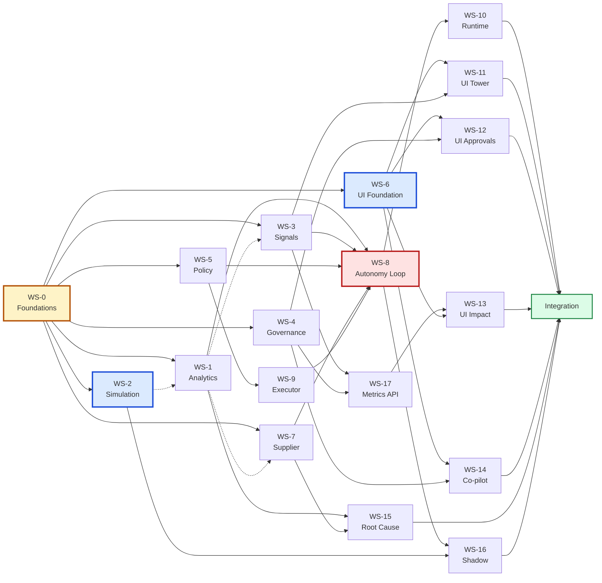

# 16 — Dependency Graph

> **Status:** Proposal. Nothing here is approved.
> **Purpose:** What blocks what, where the critical path actually runs, and what to do when a stream is late.

---

## 1. Two kinds of dependency, and why the distinction is the whole plan

| | Contract dependency | Implementation dependency |
|---|---|---|
| **Means** | Stream B needs to know A's signature | Stream B needs A's working code |
| **Satisfied by** | [15-SHARED-CONTRACTS.md](15-SHARED-CONTRACTS.md), published in Wave 0 | A being finished |
| **Blocks?** | Only until Wave 0 completes | Only at integration |
| **How B proceeds** | Stub the signature, unit-test against the stub | Wire the real import |

Nearly every arrow people draw between these streams is an *implementation* dependency, and implementation dependencies do not block **writing** — they block **integrating**. That is a wave boundary away, not a serialisation.

**Worked example.** WS-3 (Signals) needs WS-1's `compute_daily_demand`. Read naively, WS-1 must finish before WS-3 starts, and Wave 1 shrinks. But WS-3 needs the *signature* — name, arguments, the `Computed` return type, and the fact that `value is None` when sufficiency is insufficient. All of that is in file 15 §5. WS-3 stubs it, writes all seven detectors, tests each one against controlled stub returns, and finishes. Integration swaps the stub for the import. If the signature was honoured, that swap is a two-line diff.

This is why Wave 1 is seven instances wide instead of two, and it is the single highest-leverage decision in the plan. It is also the reason **WS-0 is gated and solo**: the plan trades a serial Wave 0 for a wide Wave 1, and that trade only pays if the contracts are right.

---

## 2. The graph



Solid arrows are hard blocks. **Dotted arrows are contract-only** — the downstream stream starts immediately and stubs.

Bordered nodes are the four that deserve the best instances: **WS-0** (everything depends on it), **WS-2** (nothing is credible without data), **WS-6** (four UI streams wait on it), **WS-8** (highest risk, graded surface).

---

## 3. Per-stream dependency table

| Stream | Contract-blocked by | Implementation-blocked by | Blocks | Wave |
|---|---|---|---|---|
| **WS-0** | — | — | **All 17** | 0 |
| WS-1 | WS-0 | WS-2 *(for meaningful test data only)* | WS-3, 7, 8, 15, 17 | 1 |
| WS-2 | WS-0 | — | WS-1, 16, all demos | 1 |
| WS-3 | WS-0 | WS-1 | WS-8, 11, 17 | 1 |
| WS-4 | WS-0 | — | WS-12, 14, 17 | 1 |
| WS-5 | WS-0 | — | WS-8, 9 | 1 |
| WS-6 | WS-0 | — | **WS-11, 12, 13, 14** | 1 |
| WS-7 | WS-0 | WS-1 | WS-8, 15 | 1 |
| WS-8 | WS-0, 1, 3, 5, 7, 9 | WS-1, 3, 5, 7, 9 | WS-10, 16 | 2 |
| WS-9 | WS-0, 5 | WS-5 | WS-8 | 2 |
| WS-10 | WS-0, 8 | WS-8 | — | 2 |
| WS-11 | WS-0, 3, 6 | **WS-6** | — | 2 |
| WS-12 | WS-0, 4, 6 | **WS-6** | — | 2 |
| WS-17 | WS-0, 3, 4 | WS-3, 4 | WS-13 | 2 |
| WS-13 | WS-0, 6, 17 | WS-6, 17 | — | 3 |
| WS-14 | WS-0, 4, 6 | WS-6 | — | 3 |
| WS-15 | WS-0, 1, 7 | WS-1, 7 | — | 3 |
| WS-16 | WS-0, 8 | WS-8, 2 | — | 3 |

**Two observations from the table.** WS-4 and WS-5 have zero implementation dependencies beyond WS-0 — they are pure, self-contained, and the safest streams to hand to a less capable instance. And WS-6 is the only Wave 1 stream that hard-blocks four others, which makes its *decomposition* task the most schedule-sensitive work in Wave 1.

---

## 4. The critical path

```
WS-0 → WS-2 → WS-1 → WS-3 → WS-8 → WS-16 → Integration
```

Six streams deep, and the longest chain in the graph.

But WS-16 (Shadow) is the lowest-priority stream in the package. Drop it and the path shortens:

```
WS-0 → WS-2 → WS-1 → WS-3 → WS-8 → Integration        (5 deep)
```

Cut to the recommended stop line — Wave 2 — and the path is:

```
WS-0 → WS-1 → WS-3 → WS-8 → Integration               (4 deep)
```

**The practical critical path is therefore WS-0 → WS-1 → WS-3 → WS-8.** These four streams, in that order, determine when the product works. Everything else has slack.

### 4.1 Slack, stated plainly

| Stream | Slack | What that buys |
|---|---|---|
| WS-4, WS-5 | High | Can finish late in Wave 1 without delaying anything until WS-9/WS-12 |
| WS-6 | **Low** | Four streams wait. Its decomposition is the schedule risk |
| WS-7 | Medium | Only WS-8 and WS-15 need it. WS-8 can stub supplier selection to "cheapest" |
| WS-10 | High | Small stream, one consumer, no consumers of its own |
| WS-13, 14, 15, 16 | **Total** | Wave 3. Droppable without touching the demo |
| WS-17 | Medium | Blocks only WS-13, which is itself droppable |

The useful read: **WS-0, WS-1, WS-2, WS-3, WS-6, WS-8 have little or no slack. The other twelve have plenty.** Assign instances accordingly — the four bordered nodes in §2 plus WS-1 and WS-3 get the strongest instances, and the rest can absorb a slower pass.

---

## 5. Why WS-2 sits on the critical path at all

It looks like tooling. It is not.

Today **zero of five products have a computable average daily demand** (file 15 §4.5): four have no sales at all, and the fifth has three sales sharing a single calendar day. So before WS-2 lands:

- WS-1's `compute_daily_demand` returns `insufficient` for every SKU in the catalogue. Correct, and useless.
- WS-3's `projected_breach`, `config_drift`, `capital_drag` and `supplier_drift` detectors have no input.
- WS-7's scorecards have one completed PO to reason from.
- Every screen renders an empty state, correctly.
- Three of four demo scenarios cannot be reproduced.

WS-2 is the stream that converts a system which is *right about having nothing to say* into one that has something to say. That is why it is Wave 1 and why it gets a strong instance despite looking like fixtures work.

**The one line in WS-2 that matters most** is the explicit timestamp on every backfilled movement:

```python
recorded_at = clock.now() - timedelta(days=n)   # never the column default
```

Omit it and ninety days of history collapses onto today — reproducing exactly the defect visible in the current database, and silently invalidating every downstream number.

---

## 6. Deadlock check

Three candidate cycles, all resolved by direction rather than by cleverness.

| Apparent cycle | Resolution |
|---|---|
| WS-1 ↔ WS-2 — analytics needs data, seeder needs to know what analytics expects | **WS-2 does not import WS-1.** It writes movements against the frozen schema. Its `verify()` asserts *expected signals*, not computed demand. One direction only |
| WS-3 ↔ WS-4 — signals create decisions, decisions resolve signals | **WS-3 never writes `decisions`; WS-4 never writes `signals`.** Resolution flows through the event bus (`decision.executed` → WS-3's handler) |
| WS-8 ↔ WS-9 — the graph calls the executor, the executor's preconditions read pipeline state | **WS-9 reads the `decisions` row, not graph state.** WS-9 has no import of WS-8 |

The pattern in all three: **the cycle disappears when one side reads persisted state instead of calling the other side.** That is worth stating as a design rule, because a stream under time pressure will be tempted to add the reverse import and it will work fine right up to integration.

---

## 7. What to do when a stream is late

The section usually missing from a parallel plan, and the one most likely to be needed.

| Late stream | Immediate effect | Mitigation | Demo impact if it never lands |
|---|---|---|---|
| **WS-0** | Nothing starts | **Stop and fix.** No workaround exists | Fatal |
| **WS-2** | Everything renders empty | Ship the 90-day backfill alone; scenarios can follow | Severe — 3 of 4 demos unreproducible |
| **WS-6** | Four UI streams idle | Ship `screens/` skeleton + routing first, primitives second | Severe |
| **WS-1** | WS-3 stays stubbed | Ship `compute_daily_demand` + `derive_reorder_point` first; the other six can wait | Severe — every number reverts to fabricated |
| WS-3 | WS-11 has an empty inbox | Ship `threshold_breach` + `config_drift` only — enough for D2 and D3 | Moderate |
| WS-5 | WS-9 cannot check authority | Hardcode the ₹50,000 rule; add the other nine later | Moderate — governance narrows to one rule |
| WS-8 | The loop does not close | **No mitigation. This is the product** | Fatal to D1 |
| WS-9 | Nothing executes | Shadow-only demo: propose and approve, do not execute | Severe — D1 loses its ending |
| WS-4 | No ledger | None. WS-12 has nothing to render | Severe |
| WS-7 | No supplier intelligence | WS-8 selects cheapest-active | Minor — D2 loses the drift finding |
| WS-10 | Nothing runs unprompted | Manual trigger button | **Moderate but strategically costly** — "HANDLED WHILE YOU WERE AWAY" becomes untrue |
| WS-17 | No metrics | Compute M-1/M-7/M-14 inline | Moderate — the closing frame weakens |
| WS-11 / WS-12 | Screens missing | None. These *are* the demo | Severe |
| WS-13 | No Impact screen | Present the gap analysis verbally | Moderate — loses the most differentiating screen |
| WS-14 / WS-15 / WS-16 | Depth missing | Drop silently | **None** |

Two entries deserve emphasis.

**WS-10 is the cheapest severe-consequence stream in the table.** It is small, it has one consumer, and it has total slack in dependency terms — but without it the Control Tower's central claim is false. A manual trigger button turns an autonomous system back into a tool someone runs. If WS-10 slips, it should be the first thing an idle Wave 2 instance picks up.

**WS-8 has no mitigation, and that is correct.** If the loop does not close, there is no product to demo — only components. This is the argument for giving WS-8 the strongest instance and for scheduling it at the front of Wave 2 rather than the back.

### 7.1 The reallocation rule

An instance that finishes early does **not** help in another stream's files (file 14 §9). It picks up, in order:

1. The highest-severity late stream from §7, **taking full ownership** of a scoped, named part of it
2. WS-10, if not yet done
3. Test coverage in its own owned files
4. Nothing

Option 4 is a legitimate outcome. **In a seven-wide parallel build, an idle instance costs less than an unowned edit** — the edit is silent, applies cleanly, and is found hours later by whoever owns the file.

---

## 8. The two-sentence version

WS-0 blocks everything and must be right the first time; WS-6 blocks the entire UI and its first task is decomposing a 1136-line file. Everything else is contract-decoupled, which is what makes seven-way parallelism safe — and the practical critical path is just **WS-0 → WS-1 → WS-3 → WS-8**.

---

**Next:** [17-CLAUDE-CODE-EXECUTION-PLAN.md](17-CLAUDE-CODE-EXECUTION-PLAN.md) turns this into the actual instructions handed to each instance.
