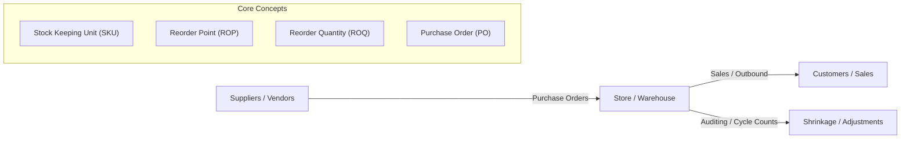
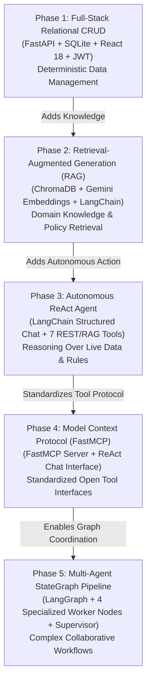
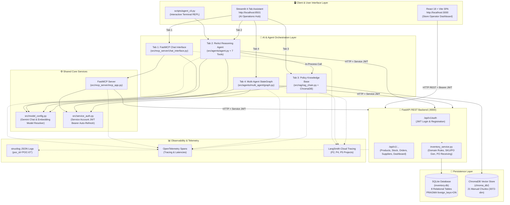

# 📘 01. Project Overview & Educational Guide
## Retail Inventory Management & Procurement System (POC-07)

---

## 🎯 1. High-Level System Purpose & Business Domain

### What is this project?
The **Retail Inventory Management & Procurement System (POC-07)** is an enterprise-grade retail operations platform engineered to manage inventory tracking, purchase order lifecycles, supplier catalogs, and autonomous replenishment workflows. 

It combines traditional **Full-Stack Enterprise CRUD** (FastAPI, SQLite, React 18) with a comprehensive progression of **Modern Agentic AI Paradigms** (Retrieval-Augmented Generation, ReAct Tool-Calling Agents, Model Context Protocol Tool Servers, and LangGraph Multi-Agent Workflows).

---

### The Business Domain: Retail Inventory & Procurement
To understand why the code is structured the way it is, you must first understand the fundamental business problems of running a retail store:



1. **Stock Keeping Unit (SKU)**:
   - A unique identifier assigned to every distinct product. In this project, SKUs follow a category-coded pattern: `SKU-{CATEGORY_PREFIX}-{SEQUENCE}`, such as `SKU-GRO-0001` (Grocery) or `SKU-ELC-0002` (Electronics).
2. **Stock Levels & The Working Stock Invariant**:
   - **Quantity On Hand ($Q_{on\_hand}$)**: The physical count of items physically present on warehouse shelves.
   - **Quantity Reserved ($Q_{reserved}$)**: Stock committed to pending customer orders or outgoing store transfers that has not yet left the building.
   - **Quantity Available ($Q_{avail}$)**: Working stock that can actually be sold:
     $$Q_{avail} = Q_{on\_hand} - Q_{reserved}$$
   - *Crucial Domain Rule*: If $Q_{avail}$ drops below zero (due to unrecorded shrinkage or over-allocation), the system **must keep negative numbers visible** to operators rather than masking them to `0`, allowing staff to investigate and execute corrective stock adjustments.
3. **Reorder Point (ROP) & Safety Stock**:
   - The inventory threshold that triggers a replenishment order. When $Q_{avail} \le \text{ROP}$, the system immediately triggers a `low_stock` alert. If $Q_{avail} \le 0$, an `out_of_stock` alert is raised.
4. **Purchase Orders (PO)**:
   - Formal procurement contracts issued to suppliers to purchase stock. A purchase order follows a strict lifecycle:
     $$\text{Draft} \longrightarrow \text{Submitted} \longrightarrow \text{Acknowledged} \longrightarrow \text{Received} \ (\text{or } \text{Cancelled})$$
   - Orders valued above **₹50,000** require authorization by a `manager` role.
5. **Stock Movement Ledger**:
   - A tamper-evident, append-only history recording every change in inventory with strict accounting sign conventions:
     - `receipt` ($> 0$): Inbound stock from PO delivery.
     - `sale` ($< 0$): Outbound stock sold to customers.
     - `adjustment` ($+ / -$): Corrections from physical cycle counts or damaged goods.
     - `transfer` ($+ / -$): Relocation between departments.
     - `return` ($> 0$): Returned customer items.

---

## 🏛️ 2. The 5 Evolutionary Phases as Concepts

This project was built in five progressive technical phases. Each phase was introduced to solve a specific architectural limitation of the previous phase:



### Phase 1: Core Full-Stack Application
- **The Concept**: Relational data modeling, transactional safety, RESTful API design, role-based JWT security, and interactive web UI.
- **The Problem Solved**: Without a transactional core, there is no inventory, no database, no authentication, and no live business data for AI models to interact with.
- **Key Technologies**: Python, FastAPI, SQLAlchemy 2.0, Pydantic v2, SQLite, React 18, Vite.
- **What it Introduced**: 8 relational database models, 12 authenticated REST endpoints, auto-generating SKU/PO sequences, and an operator SPA dashboard.

### Phase 2: Retrieval-Augmented Generation (RAG)
- **The Concept**: Vector embeddings, semantic similarity search, and grounding LLMs with private operational documentation.
- **The Problem Solved**: General-purpose LLMs (like Gemini) hallucinate or lack access to store-specific SOPs, manager approval thresholds (₹50,000), SKU schemes, and staffing roles.
- **Key Technologies**: Google Gemini Embeddings (`models/gemini-embedding-2`), ChromaDB Vector Store, LangChain `RetrievalQA`, `RecursiveCharacterTextSplitter`.
- **What it Introduced**: Ingestion of `inventory_manual.md` into 21 semantic vector chunks and an in-memory `ask_question()` RAG pipeline.

### Phase 3: Autonomous ReAct Agent & Tool Use
- **The Concept**: ReAct (Reasoning + Acting) loop where an LLM dynamically decides which tools to execute based on user goals.
- **The Problem Solved**: RAG can answer policy questions, and REST APIs can perform CRUD, but neither can autonomously decide: *"Check stock for SKU-GRO-0001, see if it is below reorder point, consult the manual for supplier terms, and create a draft purchase order if needed."*
- **Key Technologies**: LangChain Structured Chat ReAct Agent (`STRUCTURED_CHAT_ZERO_SHOT_REACT_DESCRIPTION`), LangChain `AgentExecutor`, Context Summarization Middleware.
- **What it Introduced**: 7 agent tools binding live REST endpoints and RAG search into an autonomous reasoning agent available via Streamlit and CLI.

### Phase 4: Model Context Protocol (MCP) & FastMCP
- **The Concept**: Open protocol standardizing how AI applications expose tools and resources across process and network boundaries.
- **The Problem Solved**: Proprietary tool calling formats bind tools to specific frameworks. MCP makes tools universally discoverable by any MCP-compliant client (Claude Desktop, Cursor, AI agents).
- **Key Technologies**: FastMCP framework, stdio transport, Service-to-Service JWT Bearer Auth cache (`src/service_auth.py`), LangChain ReAct chat interface.
- **What it Introduced**: A standalone FastMCP tool server (`"Inventory Management Server"`) exposing 6 core inventory actions and a conversational chat tab in Streamlit.

### Phase 5: Multi-Agent Systems & LangGraph Workflows
- **The Concept**: Directed cyclical state machines orchestrating multiple narrow, specialized AI agents collaborating on a shared TypedDict state.
- **The Problem Solved**: Single monolithic agents struggle with complex multi-step analysis (demand forecasting + reorder calculations + supplier quotation + executive audit synthesis), frequently getting lost in tool-calling loops or hallucinating prices.
- **Key Technologies**: LangGraph (`StateGraph`), TypedDict state schema (`InventoryAnalysisState`), Supervisor conditional routing (`should_skip_to_audit`), OpenTelemetry, LangSmith.
- **What it Introduced**: A 4-agent collaborative pipeline (`demand_forecaster` $\to$ `reorder_agent` $\to$ `supplier_coordinator` $\to$ `inventory_auditor`) with dynamic error short-circuiting.

---

## 🗺️ 3. Complete Master Architecture Diagram



---

## 🎓 4. Master Learning Path: How to Learn This Project

To master this codebase from fundamentals to advanced agentic workflows, follow this ordered 12-step path:

```text
Step 1: Domain & Fundamentals       Step 2: Relational Engine          Step 3: Client Interfaces
  ├── 01_PROJECT_OVERVIEW.md          ├── 03_BACKEND_ARCHITECTURE.md     ├── 04_FRONTEND_ARCHITECTURE.md
  └── 02_TECHNOLOGY_FUNDAMENTALS.md   └── 10_DATABASE_AND_API_FLOW.md    └── Inspect: App.jsx, app.py
             │                                   │                                    │
             ▼                                   ▼                                    ▼
Step 4: Knowledge Retrieval         Step 5: Autonomous ReAct           Step 6: MCP Tool Server
  ├── 05_RAG_AND_LANGCHAIN.md         ├── 06_AGENTS_AND_TOOL_USE.md       ├── 07_MCP_AND_FASTMCP.md
  └── Inspect: ingest.py, rag_chain   └── Inspect: agent.py, tools.py     └── Inspect: mcp_app, chat_interface
             │                                   │                                    │
             ▼                                   ▼                                    ▼
Step 7: Multi-Agent Graph           Step 8: Cross-Cutting & Security   Step 9: Real-World Tracing
  ├── 08_LANGGRAPH_MULTI_AGENT.md     ├── 09_AI_DATA_AND_WORKFLOWS.md    └── 12_PROJECT_WALKTHROUGH.md
  └── Inspect: state.py, graph.py     └── 11_OBSERVABILITY_AND_SECURITY.md
```

| Step | Topic | Read This Doc | Inspect These Source Files Afterward | Why This Order? |
|:---:|---|---|---|---|
| **1** | Business Domain & Core Python | `01_PROJECT_OVERVIEW.md`<br>`02_TECHNOLOGY_FUNDAMENTALS.md` | `requirements.txt`<br>`src/model_config.py` | Understand retail terminology and Python/Pydantic fundamentals before reading business code. |
| **2** | Database & Domain Logic | `10_DATABASE_AND_API_FLOW.md` | `src/backend/database.py`<br>`src/backend/models.py`<br>`src/backend/services/inventory_service.py` | The database schema dictates all business constraints and entity relationships. |
| **3** | REST API & Security | `03_BACKEND_ARCHITECTURE.md` | `src/backend/schemas.py`<br>`src/backend/routers/auth.py`<br>`src/backend/routers/inventory.py`<br>`src/backend/main.py` | Understand how HTTP endpoints validate requests, enforce JWT tokens, and trigger domain services. |
| **4** | Dual Web Frontends | `04_FRONTEND_ARCHITECTURE.md` | `src/ui/web_react/src/App.jsx`<br>`src/ui/chat_streamlit/app.py` | See how human operators interact with the system via React SPA and Streamlit AI tabs. |
| **5** | RAG & Vector Embeddings | `05_RAG_AND_LANGCHAIN.md` | `src/rag/data/inventory_manual.md`<br>`src/rag/ingest.py`<br>`src/rag/rag_chain.py` | Learn how static policies are converted into semantic embeddings and retrieved by LLMs. |
| **6** | ReAct Agents & Tool Use | `06_AGENTS_AND_TOOL_USE.md` | `src/agents/prompts.py`<br>`src/agents/summarizer.py`<br>`src/agents/tools.py`<br>`src/agents/agent.py` | Understand how an LLM uses tools to interact dynamically with the live REST API and RAG. |
| **7** | Model Context Protocol | `07_MCP_AND_FASTMCP.md` | `src/service_auth.py`<br>`src/mcp_server/mcp_app.py`<br>`src/mcp_server/chat_interface.py` | Learn how standardized tool exposure decouples AI clients from backend services. |
| **8** | LangGraph Multi-Agent | `08_LANGGRAPH_MULTI_AGENT.md` | `src/agents/multi_agent/state.py`<br>`src/agents/multi_agent/agents.py`<br>`src/agents/multi_agent/graph.py` | Master stateful, graph-based coordination across specialized autonomous agents. |
| **9** | Unified AI Workflows | `09_AI_DATA_AND_WORKFLOWS.md` | Compare all AI modules | Gain a comparative understanding of when to use RAG vs ReAct vs FastMCP vs LangGraph. |
| **10** | Security & Observability | `11_OBSERVABILITY_AND_SECURITY.md` | `src/backend/logging_config.py`<br>`src/service_auth.py` | Understand structured logging, OpenTelemetry distributed tracing, and LangSmith. |
| **11** | End-to-End Walkthroughs | `12_PROJECT_WALKTHROUGH.md` | Follow 5 practical scenarios | Trace complete workflows from user click to database write, and review the master glossary. |
