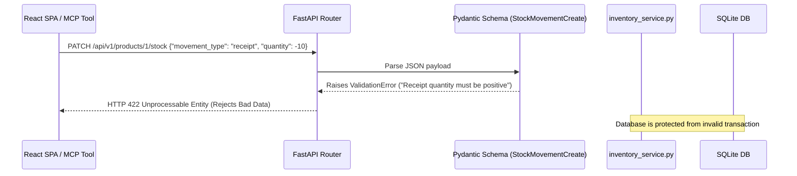

# 📘 02. Technology Fundamentals & Core Tools
## Retail Inventory Management & Procurement System (POC-07)

---

## 📌 Document Overview
Before exploring backend APIs or AI agent graphs, you must understand the core foundational technologies that power this codebase: **Python 3.11–3.14**, **Pydantic v2**, **Docker / Docker Compose**, and **Pytest**.

This document breaks down each foundational technology using the **10-Point Pedagogical Framework**:
1. What is it?
2. Why does it exist?
3. What problem does it solve?
4. How does it normally work?
5. Important concepts & terminology
6. How it differs from related technologies
7. Why it is useful in THIS project
8. Where exactly it is used in THIS codebase
9. Project-specific code example
10. Complete execution flow

---

## 🐍 1. Modern Python Architecture

### 1. What is it?
Python is a high-level, dynamically-typed programming language. In this project, modern Python (versions 3.11 through 3.14) is used with strict type hinting, modern structural typing (`TypedDict`), functional context managers, and generator patterns.

### 2. Why does it exist?
Python provides a massive ecosystem for web backends (FastAPI), database ORMs (SQLAlchemy), and the entirety of modern AI engineering (LangChain, LangGraph, Google GenAI SDK, ChromaDB).

### 3. What problem does it solve?
Traditional enterprise languages (Java, C++) require heavy boilerplate and slow iteration cycles for AI prototyping. Older Python (2.x / early 3.x) lacked static type safety, making large refactors dangerous. Modern Python bridges rapid AI prototyping with compile-time type validation via type annotations.

### 4. How does it normally work?
Python compiles source code (`.py`) into bytecode (`.pyc`) executed by the CPython virtual machine. Type annotations (`def func(x: int) -> str`) are not enforced at runtime by default, but are leveraged by static type checkers (Mypy) and runtime validation libraries (Pydantic).

### 5. Important Concepts & Terminology
- **Type Annotations**: Syntax like `product_id: int` or `Optional[str]` indicating expected types.
- **`TypedDict`**: A dictionary type that specifies fixed key names and value types for JSON-like state dictionaries without runtime validation overhead.
- **Generators (`yield`)**: Functions that produce a sequence of values lazily, pausing execution until the next value is requested.
- **Decorators (`@tool`, `@mcp.tool()`, `@traceable`)**: Higher-order functions that modify or wrap the behavior of other functions.
- **Thread Safety & Locks (`threading.Lock`)**: Synchronization primitives ensuring multiple threads don't corrupt shared memory.

### 6. How is it different from related technologies?
- **Python vs JavaScript/Node.js**: Python is the lingua franca of AI/ML libraries and numerical computing; JavaScript is the foundation of browser UIs.
- **`TypedDict` vs `Pydantic BaseModel`**: `TypedDict` is purely for type annotations of plain Python dictionaries without performance penalty; `BaseModel` actively parses, coerces, and validates incoming data at runtime.

### 7. Why is it useful in this project?
The entire backend, RAG pipeline, MCP server, and multi-agent graph are written in Python, sharing data structures seamlessly across all five project phases.

### 8. Where exactly is it used in THIS codebase?
- **Type Hints**: Throughout all files in `src/`.
- **`TypedDict`**: State schema in [`src/agents/multi_agent/state.py`](file:///c:/Users/2mrmi/OneDrive/Documents/github-clone/Agentic-AI-Readiness-Program/src/agents/multi_agent/state.py).
- **Generators / Context Managers**: Database session yielding in [`src/backend/database.py:39-44`](file:///c:/Users/2mrmi/OneDrive/Documents/github-clone/Agentic-AI-Readiness-Program/src/backend/database.py#L39-L44).
- **Decorators**: Tool definitions in [`src/agents/tools.py`](file:///c:/Users/2mrmi/OneDrive/Documents/github-clone/Agentic-AI-Readiness-Program/src/agents/tools.py) and [`src/mcp_server/mcp_app.py`](file:///c:/Users/2mrmi/OneDrive/Documents/github-clone/Agentic-AI-Readiness-Program/src/mcp_server/mcp_app.py).
- **Thread Locks**: Service account token caching in [`src/service_auth.py:46`](file:///c:/Users/2mrmi/OneDrive/Documents/github-clone/Agentic-AI-Readiness-Program/src/service_auth.py#L46).

### 9. Project-Specific Example
From [`src/agents/multi_agent/state.py:4-13`](file:///c:/Users/2mrmi/OneDrive/Documents/github-clone/Agentic-AI-Readiness-Program/src/agents/multi_agent/state.py#L4-L13):
```python
from typing import TypedDict, Dict, Any, List

class InventoryAnalysisState(TypedDict):
    product_id: int
    product_data: Dict[str, Any]
    demand_forecast: Dict[str, Any]
    reorder_recommendation: Dict[str, Any]
    supplier_quote: Dict[str, Any]
    audit_report: str
    analysis_status: str
    errors: List[str]
    messages: List[str]
```

### 10. Complete Execution Flow
When the LangGraph multi-agent pipeline runs:
1. Python executes `initial_state(product_id=1)`.
2. Python instantiates a standard dictionary conforming to `InventoryAnalysisState`.
3. Worker functions receive the dictionary, read keys with auto-complete type support in IDEs, and return modified dictionary copies without validation overhead.

---

## 🛡️ 2. Data Validation & Modeling with Pydantic v2

### 1. What is it?
Pydantic is the most widely used data validation and parsing library for Python. This project uses **Pydantic v2**, written in Rust for high-speed schema enforcement.

### 2. Why does it exist?
Web APIs receive untrusted JSON strings from clients over HTTP. If an API accepts `{ "quantity": "invalid_number" }` or `{ "quantity": -50 }` for a stock receipt, the database will become corrupted.

### 3. What problem does it solve?
Instead of manually writing dozens of `if not isinstance(qty, int): raise ...` checks in every controller, Pydantic declaratively enforces types, limits, email formats, and cross-field domain rules at the HTTP boundary.

### 4. How does it normally work?
You define a class inheriting from `pydantic.BaseModel`. When JSON is passed into it, Pydantic:
1. Coerces compatible data types (e.g. converting `"10"` string into integer `10`).
2. Validates field constraints (e.g. `gt=0`, `max_length=200`).
3. Executes custom `@model_validator` methods.
4. Serializes Python objects back to JSON for responses.

### 5. Important Concepts & Terminology
- **`BaseModel`**: The base class for all validation schemas.
- **`Field(..., ge=0)`**: Declares metadata and validation rules (e.g., greater-than-or-equal-to 0).
- **`ConfigDict(from_attributes=True)`**: Allows Pydantic to read data directly from SQLAlchemy ORM model objects rather than only dictionaries.
- **`@model_validator(mode="after")`**: A validation function that runs after all individual fields have been validated to check cross-field relationships.
- **`ValidationError`**: The exception raised when input data fails validation, automatically converted by FastAPI into HTTP 422 Unprocessable Entity responses.

### 6. How is it different from related technologies?
- **Pydantic vs SQLAlchemy Models**: SQLAlchemy defines database tables and queries; Pydantic defines network request/response contracts and data validation.
- **Pydantic vs Marshmallow/Cerberus**: Pydantic v2 is 5–20x faster due to its Rust core (`pydantic-core`) and uses standard Python type annotations.

### 7. Why is it useful in this project?
In a retail system, recording an invalid stock movement (such as a negative receipt quantity) breaks accounting invariants. Pydantic guarantees that only valid business data reaches the database.

### 8. Where exactly is it used in THIS codebase?
All schemas are centralized in [`src/backend/schemas.py`](file:///c:/Users/2mrmi/OneDrive/Documents/github-clone/Agentic-AI-Readiness-Program/src/backend/schemas.py).

### 9. Project-Specific Example
From [`src/backend/schemas.py:91-118`](file:///c:/Users/2mrmi/OneDrive/Documents/github-clone/Agentic-AI-Readiness-Program/src/backend/schemas.py#L91-L118):
```python
from pydantic import BaseModel, Field, model_validator
from src.backend.models import MovementType

class StockMovementCreate(BaseModel):
    movement_type: MovementType
    quantity: int = Field(..., description="Quantity delta. Must be positive for receipts, negative for sales.")
    reference_number: str | None = Field(None, max_length=50)
    notes: str | None = Field(None, max_length=500)

    @model_validator(mode="after")
    def check_quantity_sign(self) -> "StockMovementCreate":
        if self.quantity == 0:
            raise ValueError("Quantity cannot be 0")
        if self.movement_type == MovementType.receipt and self.quantity < 0:
            raise ValueError("Receipt quantity must be positive")
        if self.movement_type == MovementType.sale and self.quantity > 0:
            raise ValueError("Sale quantity must be negative")
        return self
```

### 10. Complete Execution Flow


---

## 🐳 3. Containerization with Docker & Docker Compose

### 1. What is it?
Docker is an open-source platform that packages applications and their exact dependencies into isolated containers. Docker Compose is a tool for defining and running multi-container Docker applications via YAML configuration.

### 2. Why does it exist?
"It worked on my machine, but failed on the server." Variations in operating systems (Windows vs Linux vs macOS), Python versions, Node.js runtimes, and local environment variables cause unpredictable deployment failures.

### 3. What problem does it solve?
Docker guarantees that the FastAPI backend, SQLite database, ChromaDB vector store, React frontend, and Streamlit dashboard run in an identical, immutable Linux container environment anywhere in the world.

### 4. How does it normally work?
1. **Dockerfile**: Instructions to build a container image (e.g., install Linux packages, install Python `requirements.txt`, build React assets, configure port exposures).
2. **Docker Image**: A frozen, read-only snapshot containing the OS, libraries, and application code.
3. **Docker Container**: A running, stateful instance of an image.
4. **Docker Compose**: Orchestrates multi-container networking, volume mounts, and service dependencies (`depends_on`).

### 5. Important Concepts & Terminology
- **Multi-Stage Build**: A Docker build technique that uses temporary stages (e.g. Node.js builder for React) to compile assets, then copies only the minified output into a lightweight production stage (Python), keeping image sizes small.
- **Port Mapping (`8000:8000`)**: Exposing an internal container port to the host machine.
- **Volume Mounts**: Persisting database files (`inventory.db`) and vector stores (`chroma_db/`) on the host disk so data survives container restarts.
- **Environment Variables**: Injecting secrets (`GOOGLE_API_KEY`, `SECRET_KEY`) dynamically without hardcoding them in images.

### 6. How is it different from related technologies?
- **Docker vs Virtual Machines (VMs)**: VMs run a full guest operating system with heavy hypervisor overhead; Docker containers share the host OS kernel, booting in seconds with minimal memory footprint.
- **Docker vs Python Virtualenv (`.venv`)**: Virtualenv isolates only Python packages; Docker isolates Python packages, system C-libraries, Node.js runtimes, SQLite engines, and filesystem permissions.

### 7. Why is it useful in this project?
This project has 3 distinct runtime services:
- FastAPI backend on port `8000`
- React Vite SPA on port `3000`
- Streamlit AI Assistant on port `8501`
Docker and Docker Compose allow running the entire 5-phase application with a single command: `docker compose up --build`.

### 8. Where exactly is it used in THIS codebase?
- **[`Dockerfile`](file:///c:/Users/2mrmi/OneDrive/Documents/github-clone/Agentic-AI-Readiness-Program/Dockerfile)**: Multi-stage build (Node.js stage for React SPA + Python 3.11 stage for backend/Streamlit).
- **[`docker-compose.yml`](file:///c:/Users/2mrmi/OneDrive/Documents/github-clone/Agentic-AI-Readiness-Program/docker-compose.yml)**: Service definitions, port mappings, and volume mounts.

### 9. Project-Specific Example
From [`Dockerfile`](file:///c:/Users/2mrmi/OneDrive/Documents/github-clone/Agentic-AI-Readiness-Program/Dockerfile):
```dockerfile
# Stage 1: Build React Frontend
FROM node:18-alpine AS frontend-builder
WORKDIR /app/frontend
COPY src/ui/web_react/package*.json ./
RUN npm install
COPY src/ui/web_react/ ./
RUN npm run build

# Stage 2: Python Application Runtime
FROM python:3.11-slim
WORKDIR /app
COPY requirements.txt .
RUN pip install --no-cache-dir -r requirements.txt
COPY . .
COPY --from=frontend-builder /app/frontend/dist ./src/ui/web_react/dist

EXPOSE 8000 8501 3000
CMD ["python", "start_app.py", "--seed", "--ingest"]
```

---

## 🧪 4. Automated Testing with Pytest

### 1. What is it?
Pytest is the leading testing framework for Python. It simplifies writing concise, expressive unit, integration, and end-to-end tests.

### 2. Why does it exist?
Manual testing of 12 REST endpoints, 7 ReAct tools, 6 FastMCP tools, and 4 multi-agent nodes across 5 phases takes hours and misses subtle regression bugs.

### 3. What problem does it solve?
Pytest automates test execution, provides test isolation through fixtures, isolates database state between tests using in-memory databases, mocks network calls to prevent LLM quota drainage, and computes code coverage metrics.

### 4. How does it normally work?
1. Pytest discovers files named `test_*.py`.
2. Sets up fixtures declared with `@pytest.fixture`.
3. Runs test functions asserting behavior using simple Python `assert` statements.
4. Cleans up fixture state after each test.

### 5. Important Concepts & Terminology
- **Fixtures (`@pytest.fixture`)**: Reusable setup/teardown functions that provide test data, in-memory databases, or authenticated client sessions.
- **Monkeypatching (`monkeypatch.setattr`)**: Dynamically replacing live functions or API calls with mock stubs during testing (e.g. mocking Google Gemini API calls).
- **StaticPool SQLite (`sqlite:///:memory:`)**: An in-memory SQLite database connection shared across threads during a test run that disappears when the test completes.
- **Importlib Mode (`--import-mode=importlib`)**: Configured in `pytest.ini` to prevent module naming collisions when test files share names across phase directories.

### 6. How is it different from related technologies?
- **Pytest vs `unittest`**: `unittest` requires verbose object-oriented boilerplate (`class TestFoo(unittest.TestCase)` and `self.assertEqual()`); Pytest uses plain Python functions and simple `assert` statements.

### 7. Why is it useful in this project?
The project features **234 automated tests** across all 5 phases. The test suite guarantees:
- All 12 REST endpoints reject unauthorized calls.
- Negative stock levels remain visible.
- The RAG pipeline splits documents into 21 chunks.
- Multi-agent supervisor short-circuits on errors.

### 8. Where exactly is it used in THIS codebase?
- **Root Configuration**: [`pytest.ini`](file:///c:/Users/2mrmi/OneDrive/Documents/github-clone/Agentic-AI-Readiness-Program/pytest.ini)
- **Phase 1 Backend Tests (85 tests)**: [`tests/phase1/`](file:///c:/Users/2mrmi/OneDrive/Documents/github-clone/Agentic-AI-Readiness-Program/tests/phase1/)
- **Phase 2 RAG Tests (34 tests)**: [`tests/phase2/`](file:///c:/Users/2mrmi/OneDrive/Documents/github-clone/Agentic-AI-Readiness-Program/tests/phase2/)
- **Phase 3 ReAct Agent Tests (42 tests)**: [`tests/phase3/`](file:///c:/Users/2mrmi/OneDrive/Documents/github-clone/Agentic-AI-Readiness-Program/tests/phase3/)
- **Phase 4 FastMCP Tests (33 tests)**: [`tests/phase4/`](file:///c:/Users/2mrmi/OneDrive/Documents/github-clone/Agentic-AI-Readiness-Program/tests/phase4/)
- **Phase 5 Multi-Agent Tests (40 tests)**: [`tests/phase5/`](file:///c:/Users/2mrmi/OneDrive/Documents/github-clone/Agentic-AI-Readiness-Program/tests/phase5/)

### 9. Project-Specific Example
From [`tests/phase1/conftest.py`](file:///c:/Users/2mrmi/OneDrive/Documents/github-clone/Agentic-AI-Readiness-Program/tests/phase1/conftest.py):
```python
import pytest
from sqlalchemy import create_engine
from sqlalchemy.pool import StaticPool
from fastapi.testclient import TestClient
from src.backend.main import app
from src.backend.database import Base, get_db

@pytest.fixture
def db_session():
    """Create a completely isolated in-memory SQLite database for each test."""
    engine = create_engine(
        "sqlite:///:memory:",
        connect_args={"check_same_thread": False},
        poolclass=StaticPool,
    )
    Base.metadata.create_all(bind=engine)
    TestingSessionLocal = sessionmaker(bind=engine)
    session = TestingSessionLocal()
    try:
        yield session
    finally:
        session.close()

@pytest.fixture
def client(db_session):
    """Provide a FastAPI TestClient bound to the isolated in-memory DB."""
    app.dependency_overrides[get_db] = lambda: db_session
    with TestClient(app) as test_client:
        yield test_client
    app.dependency_overrides.clear()
```

---

## 🔍 5. What Sounds Fancy vs What Is Actually Happening

| Concept | What It Sounds Like | What Is Actually Happening in Code |
|---|---|---|
| **"Runtime Schema Inference"** | Complex dynamic AI-driven data typing. | Pydantic classes with predefined field types (`int`, `str`) validating dictionaries in milliseconds via Rust. |
| **"Microservice Containerization"** | Dozens of distributed cloud clusters communicating over complex service meshes. | A single `docker-compose.yml` spinning up local containers with port mappings to `8000`, `3000`, and `8501`. |
| **"Hermetic Test Sandbox"** | Elaborate cloud virtualization infrastructure. | An in-memory SQLite database (`sqlite:///:memory:`) created in RAM for the duration of a pytest function and discarded instantly. |

---

## 📖 6. Recommended Reading Order

To master the technology fundamentals of this project, read the files in this sequence:

1. **[`requirements.txt`](file:///c:/Users/2mrmi/OneDrive/Documents/github-clone/Agentic-AI-Readiness-Program/requirements.txt)**:
   - *Why*: See all pinned third-party libraries and framework versions.
2. **[`src/model_config.py`](file:///c:/Users/2mrmi/OneDrive/Documents/github-clone/Agentic-AI-Readiness-Program/src/model_config.py)**:
   - *Why*: Learn how environment variables and model strings are resolved across Python modules.
3. **[`src/backend/schemas.py`](file:///c:/Users/2mrmi/OneDrive/Documents/github-clone/Agentic-AI-Readiness-Program/src/backend/schemas.py)**:
   - *Why*: Understand how Pydantic v2 models define the data contracts for products, purchase orders, and stock movements.
4. **[`tests/conftest.py`](file:///c:/Users/2mrmi/OneDrive/Documents/github-clone/Agentic-AI-Readiness-Program/tests/conftest.py)** & **[`tests/phase1/conftest.py`](file:///c:/Users/2mrmi/OneDrive/Documents/github-clone/Agentic-AI-Readiness-Program/tests/phase1/conftest.py)**:
   - *Why*: Learn how Pytest fixtures construct isolated test databases and mock authentication tokens.
