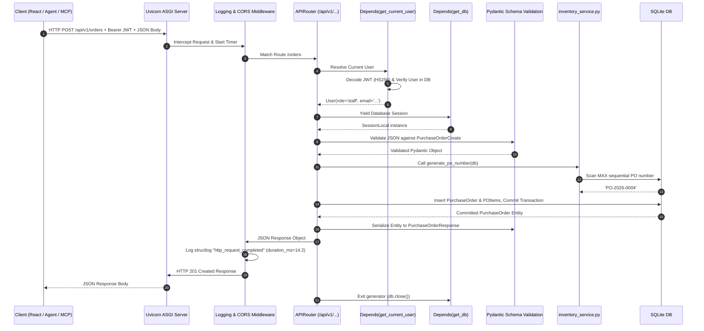
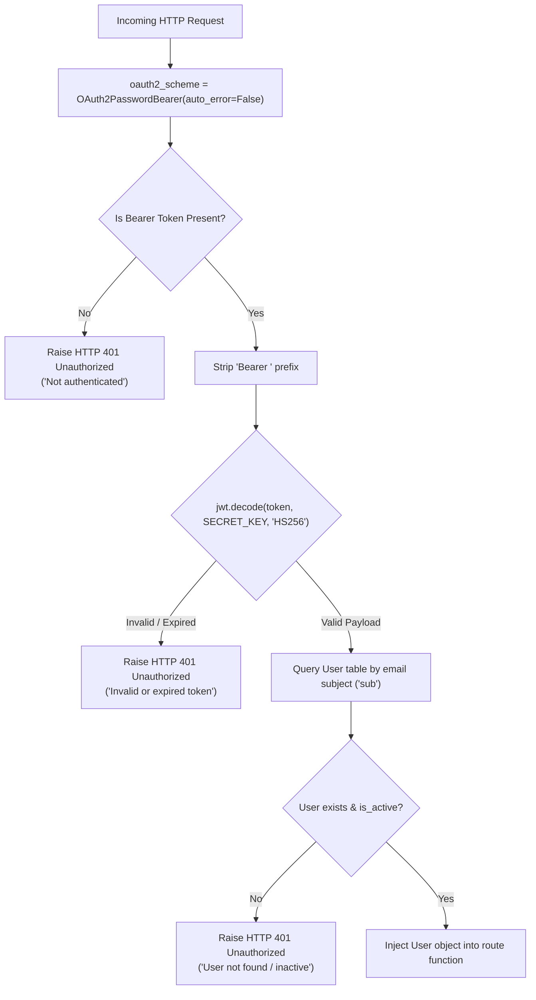

# 📘 03. Backend Architecture & REST API Design
## Retail Inventory Management & Procurement System (POC-07)

---

## 📌 Document Overview
The backend is the core operational engine of the application. Every user action in the React UI, every tool call executed by the ReAct agent, every FastMCP tool invocation, and every LangGraph multi-agent analysis ultimately flows into the **FastAPI REST API**.

This document breaks down the backend architecture using the **10-Point Pedagogical Framework**:
1. What is it?
2. Why does it exist?
3. What problem does it solve?
4. How does it normally work?
5. Important concepts & terminology
6. How it differs from related technologies
7. Why it is useful in THIS project
8. Where exactly it is used in THIS codebase
9. Project-specific code example
10. Complete execution flow

---

## 🚀 1. FastAPI & Modern REST Architecture

### 1. What is it?
**FastAPI** is a high-performance, asynchronous web framework for building APIs with Python based on standard Python type hints and the **ASGI (Asynchronous Server Gateway Interface)** specification.

### 2. Why does it exist?
Traditional Python web frameworks (like Flask or Django) were designed in the WSGI synchronous era. Building modern APIs in Flask required piecing together multiple external libraries for routing, request validation (Marshmallow), and OpenAPI documentation (Flasgger), leading to fragmented, brittle code.

### 3. What problem does it solve?
FastAPI unifies routing, request parsing, automatic JSON Schema / OpenAPI documentation generation (`/docs`), dependency injection, and data validation into a single coherent framework with near-zero boilerplate.

### 4. How does it normally work?
1. An incoming HTTP request is received by the ASGI web server (**Uvicorn**).
2. Uvicorn passes the request context to FastAPI.
3. FastAPI matches the HTTP method and path against registered `APIRouter` routes.
4. It resolves all dependencies declared via `Depends()` (e.g. database sessions, authentication credentials).
5. It parses the request body against the route's Pydantic schema.
6. The controller function executes business logic and returns a model/dict.
7. FastAPI serializes the output against the `response_model` schema and returns JSON to the client.

### 5. Important Concepts & Terminology
- **ASGI**: Asynchronous Server Gateway Interface, the modern standard for Python asynchronous web servers.
- **Dependency Injection (`Depends`)**: A design pattern where a function's dependencies (e.g., database session `get_db`, authenticated user `get_current_user`) are automatically provided by the framework rather than manually instantiated.
- **Lifespan Context Manager (`@asynccontextmanager`)**: Replaces deprecated startup/shutdown events to manage application lifecycle (e.g. creating tables and seeding bootstrap admin on boot).
- **Middleware**: Code that runs before and after every single HTTP request (e.g. CORS headers, request duration logging).
- **OAuth2PasswordBearer**: FastAPI security dependency that parses the `Authorization: Bearer <token>` HTTP header.

### 6. How is it different from related technologies?
- **FastAPI vs Flask**: FastAPI provides native async support, automated OpenAPI docs, and built-in Pydantic v2 validation out of the box; Flask requires manual plugins.
- **FastAPI vs Django REST Framework (DRF)**: DRF is coupled to Django's ORM and monolithic architecture; FastAPI is lightweight, modular, and unopinionated about database ORMs.

### 7. Why is it useful in this project?
FastAPI provides the single source of truth for all business operations (Products, Stock, Orders, Suppliers). Because FastAPI auto-generates OpenAPI JSON specifications, AI agents and MCP servers can easily introspect backend capabilities.

### 8. Where exactly is it used in THIS codebase?
- **App Entrypoint & Lifespan**: [`src/backend/main.py`](file:///c:/Users/2mrmi/OneDrive/Documents/github-clone/Agentic-AI-Readiness-Program/src/backend/main.py)
- **Authentication Router**: [`src/backend/routers/auth.py`](file:///c:/Users/2mrmi/OneDrive/Documents/github-clone/Agentic-AI-Readiness-Program/src/backend/routers/auth.py)
- **Inventory & Orders Router**: [`src/backend/routers/inventory.py`](file:///c:/Users/2mrmi/OneDrive/Documents/github-clone/Agentic-AI-Readiness-Program/src/backend/routers/inventory.py)
- **Business Services**: [`src/backend/services/inventory_service.py`](file:///c:/Users/2mrmi/OneDrive/Documents/github-clone/Agentic-AI-Readiness-Program/src/backend/services/inventory_service.py)

---

## 🔄 2. Complete HTTP Request Lifecycle



---

## 🔐 3. Authentication & Dependency Injection Architecture

### The Dual Role Security Hierarchy
The system defines two discrete user roles:
1. **`manager`**: Privileged administrator account capable of approving large purchase orders (> ₹50,000) and creating other manager accounts. Bootstrap admin: `admin@retail.com`.
2. **`staff`**: Warehouse operator account capable of recording stock movements, creating draft purchase orders, and querying catalogs.

### Dependency Injection Pipeline (`src/backend/routers/auth.py`)



#### Code Implementation: `get_current_user`
From [`src/backend/routers/auth.py:96-186`](file:///c:/Users/2mrmi/OneDrive/Documents/github-clone/Agentic-AI-Readiness-Program/src/backend/routers/auth.py#L96-L186):
```python
def get_current_user(token: Optional[str] = Depends(oauth2_scheme), db: Session = Depends(get_db)) -> User:
    if not token:
        logger.warning("auth_missing_token", poc_id="POC-07", phase="P1")
        raise HTTPException(
            status_code=status.HTTP_401_UNAUTHORIZED,
            detail="Not authenticated",
            headers={"WWW-Authenticate": "Bearer"},
        )
    if token.startswith("Bearer "):
        token = token.split(" ", 1)[1]
    try:
        payload = jwt.decode(token, SECRET_KEY, algorithms=[ALGORITHM])
        email: str = payload.get("sub")
        if email is None:
            raise HTTPException(status_code=401, detail="Invalid token: missing subject")
    except JWTError:
        raise HTTPException(status_code=401, detail="Invalid or expired token")

    user = db.query(User).filter(User.email == email).first()
    if user is None:
        raise HTTPException(status_code=401, detail="User not found")
    if not user.is_active:
        raise HTTPException(status_code=401, detail="User account is inactive")
    return user
```

---

## ⚙️ 4. Business Services Layer (`inventory_service.py`)

To prevent controllers from becoming bloated ("Fat Controllers"), all critical business logic and multi-table transactions are encapsulated in [`src/backend/services/inventory_service.py`](file:///c:/Users/2mrmi/OneDrive/Documents/github-clone/Agentic-AI-Readiness-Program/src/backend/services/inventory_service.py).

### 1. Collision-Free Identifier Sequencing (`_next_sequence`)
* **The Problem**: Naive sequential generation uses `count() + 1`. If an organization creates 5 products, deletes product 3, and creates another, `count() + 1` evaluates to 5, colliding with existing product 5 and throwing an unhandled database unique constraint crash.
* **The Solution**: `_next_sequence()` scans the database for the *actual maximum integer suffix* and selects the next available integer slot:
```python
def _next_sequence(existing_codes: Iterable[str], prefix: str, width: int = 4) -> str:
    highest = 0
    pattern = re.compile(rf"^{re.escape(prefix)}(\d+)$")
    for code in existing_codes:
        match = pattern.match(code)
        if match:
            highest = max(highest, int(match.group(1)))
    return f"{prefix}{highest + 1:0{width}d}"
```

### 2. Purchase Order Receiving Transaction (`receive_purchase_order`)
When a delivery truck arrives at the warehouse, receiving a purchase order involves an atomic multi-step state change:
1. Validates that the purchase order status is not already `received` or `cancelled`.
2. Updates `PurchaseOrder.status = POStatus.received` and stamps `received_date = date.today()`.
3. For each line item (`POItem`), increments `StockLevel.quantity_on_hand`.
4. Writes an immutable audit ledger row to `StockMovement` (type: `receipt`, quantity: `+qty`, reference: `po_number`).
5. Re-evaluates stock levels via `check_stock_alerts()`, automatically resolving active low-stock alerts if inventory recovered above the reorder point.
6. Commits all operations atomically.

---

## 🔍 5. What Sounds Fancy vs What Is Actually Happening

| Architectural Claim | What It Sounds Like | What Is Actually Happening in Code |
|---|---|---|
| **"Microservice Event Bus"** | Kafka / RabbitMQ event brokers broadcasting asynchronous domain messages. | Direct synchronous Python function calls within the same FastAPI process (`check_stock_alerts(product, stock, db)`). |
| **"Distributed Access Control Layer"** | OAuth2 OpenID Connect identity provider cluster with public key certificates. | A local HMAC-SHA256 symmetric signature (`SECRET_KEY`) encoded and decoded in RAM by `python-jose`. |
| **"Dynamic Inventory Auto-Scaler"** | Machine learning engine autonomously adjusting warehouse shelving. | Deterministic if-conditions comparing `stock.quantity_available <= product.reorder_point`. |

---

## 📖 6. Recommended Reading Order

To deeply understand the backend, read the code in this exact sequence:

1. **[`src/backend/database.py`](file:///c:/Users/2mrmi/OneDrive/Documents/github-clone/Agentic-AI-Readiness-Program/src/backend/database.py)**:
   - *Why*: Learn how SQLite engine, PRAGMA foreign keys, and database session lifecycles (`get_db`) are created.
2. **[`src/backend/models.py`](file:///c:/Users/2mrmi/OneDrive/Documents/github-clone/Agentic-AI-Readiness-Program/src/backend/models.py)**:
   - *Why*: Understand the 8 relational database tables and relationship cascades.
3. **[`src/backend/schemas.py`](file:///c:/Users/2mrmi/OneDrive/Documents/github-clone/Agentic-AI-Readiness-Program/src/backend/schemas.py)**:
   - *Why*: Learn the input validation rules and output serialization models.
4. **[`src/backend/services/inventory_service.py`](file:///c:/Users/2mrmi/OneDrive/Documents/github-clone/Agentic-AI-Readiness-Program/src/backend/services/inventory_service.py)**:
   - *Why*: See the domain business rules (SKU generation, PO receiving, stock alerting).
5. **[`src/backend/routers/auth.py`](file:///c:/Users/2mrmi/OneDrive/Documents/github-clone/Agentic-AI-Readiness-Program/src/backend/routers/auth.py)**:
   - *Why*: Master JWT creation, password hashing, and the `get_current_user` security gate.
6. **[`src/backend/routers/inventory.py`](file:///c:/Users/2mrmi/OneDrive/Documents/github-clone/Agentic-AI-Readiness-Program/src/backend/routers/inventory.py)**:
   - *Why*: See how all 12 REST endpoints tie database, schemas, and services together.
7. **[`src/backend/main.py`](file:///c:/Users/2mrmi/OneDrive/Documents/github-clone/Agentic-AI-Readiness-Program/src/backend/main.py)**:
   - *Why*: Understand application startup, CORS, and request logging middleware.
