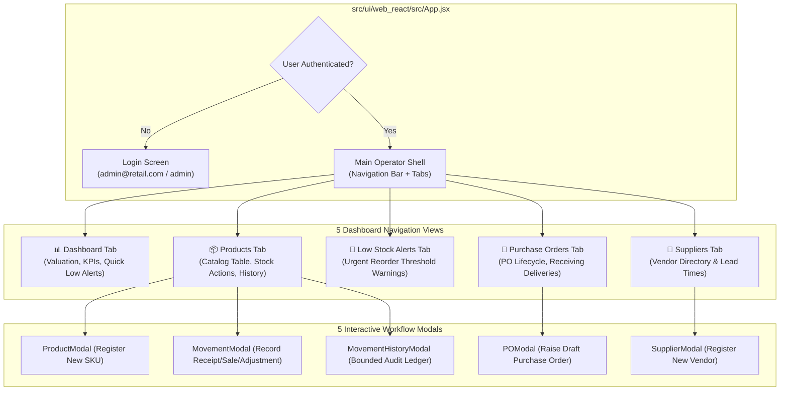
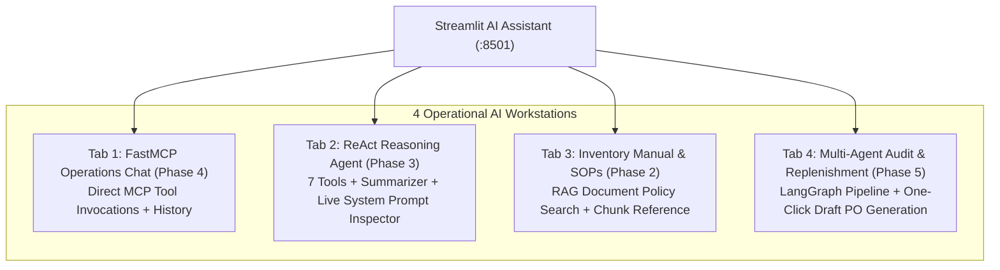

# 📘 04. Frontend Architecture & Dual User Interfaces
## Retail Inventory Management & Procurement System (POC-07)

---

## 📌 Document Overview
User interfaces are the operational surfaces through which human operators interact with the retail system. This application implements a **Dual UI Architecture**:
1. **React 18 + Vite SPA** (`http://localhost:3000`): A responsive, high-performance web dashboard for day-to-day warehouse operations, product catalog management, purchase order tracking, and stock movement auditing.
2. **Streamlit Multi-Tab AI Assistant** (`http://localhost:8501`): An AI operations workbench allowing operators to interact with FastMCP tools, autonomous ReAct agents, RAG policy retrieval, and multi-agent replenishment audits.

This document breaks down the frontend architecture using the **10-Point Pedagogical Framework**:
1. What is it?
2. Why does it exist?
3. What problem does it solve?
4. How does it normally work?
5. Important concepts & terminology
6. How it differs from related technologies
7. Why it is useful in THIS project
8. Where exactly it is used in THIS codebase
9. Project-specific code example
10. Complete execution flow

---

## ⚛️ 1. React 18 & Vite SPA Architecture

### 1. What is it?
**React 18** is a declarative, component-based JavaScript library for building user interfaces. **Vite** is a next-generation frontend build tool that provides instant Hot Module Replacement (HMR) and optimized Rollup production bundling.

### 2. Why does it exist?
Traditional server-rendered web applications (e.g. standard Django or PHP templates) trigger a full page reload on every user click, destroying local UI state and causing jarring screen flashes during high-frequency warehouse barcode scanning and stock entries.

### 3. What problem does it solve?
A Single Page Application (SPA) downloads the HTML, CSS, and JavaScript bundle once. When the user navigates tabs or submits a stock movement, React updates only the specific changed DOM elements in memory without reloading the page.

### 4. How does it normally work?
1. The browser loads `index.html` and executes `main.jsx`.
2. React mounts the root component (`App.jsx`) into the DOM.
3. Functional components manage local state via React Hooks (`useState`).
4. Asynchronous lifecycle side-effects (like fetching product lists from the backend via Axios) are managed with `useEffect`.
5. When state changes, React computes the diff between the Virtual DOM and the real DOM, efficiently updating only the modified nodes.

### 5. Important Concepts & Terminology
- **Single Page Application (SPA)**: A web app that dynamically rewrites the current page rather than loading entire new pages from the server.
- **Hooks (`useState`, `useEffect`)**: Functions that let functional components preserve state and execute lifecycle side effects.
- **Virtual DOM**: An in-memory lightweight representation of the real browser DOM used by React to compute minimal UI updates.
- **Axios Interceptors**: Global middleware that intercepts HTTP requests (to attach Bearer tokens) and responses (to handle 401 unauthorized errors).
- **Pessimistic UI Updates**: Waiting for the backend API response to succeed before updating the UI state, guaranteeing UI-database parity.

### 6. How is it different from related technologies?
- **React vs Angular/Vue**: React focuses strictly on the view layer with functional components and JSX; Angular is a heavyweight, opinionated all-in-one framework.
- **Vite vs Webpack**: Webpack bundles the entire dependency graph before starting the dev server (taking 20–60 seconds); Vite leverages native browser ES Modules (ESM) to start dev servers in under 300 milliseconds.

### 7. Why is it useful in this project?
Warehouse staff need rapid, tab-based navigation between stock alerts, purchase orders, and movement histories. React delivers instantaneous table filtering, responsive modal dialogues, and seamless JWT authentication workflows.

### 8. Where exactly is it used in THIS codebase?
- **Configuration & Root**: [`src/ui/web_react/vite.config.js`](file:///c:/Users/2mrmi/OneDrive/Documents/github-clone/Agentic-AI-Readiness-Program/src/ui/web_react/vite.config.js), [`src/ui/web_react/src/main.jsx`](file:///c:/Users/2mrmi/OneDrive/Documents/github-clone/Agentic-AI-Readiness-Program/src/ui/web_react/src/main.jsx)
- **Main Application & Modals**: [`src/ui/web_react/src/App.jsx`](file:///c:/Users/2mrmi/OneDrive/Documents/github-clone/Agentic-AI-Readiness-Program/src/ui/web_react/src/App.jsx)
- **Styling Design System**: [`src/ui/web_react/src/index.css`](file:///c:/Users/2mrmi/OneDrive/Documents/github-clone/Agentic-AI-Readiness-Program/src/ui/web_react/src/index.css)

---

## 🖥️ 2. React SPA Component & Modal Structure

The entire operator dashboard is contained within [`src/ui/web_react/src/App.jsx`](file:///c:/Users/2mrmi/OneDrive/Documents/github-clone/Agentic-AI-Readiness-Program/src/ui/web_react/src/App.jsx), organized into distinct stateful views and operational modals:



### Error Handling & Pydantic Validation Parsing (`describeApiError`)
A common pitfall in web SPAs is rendering raw backend validation arrays, causing browser alerts to display meaningless `[object Object]` strings. `App.jsx` implements a clean parsing utility:
```javascript
const describeApiError = (err, fallback) => {
  const detail = err?.response?.data?.detail;
  if (!detail) return fallback || err.message || "An unknown error occurred.";
  if (typeof detail === "string") return detail;
  if (Array.isArray(detail)) {
    return detail.map((e) => `${e.loc?.join(".") || "field"}: ${e.msg}`).join("; ");
  }
  return JSON.stringify(detail);
};
```

---

## 🎈 3. Streamlit Multi-Tab AI Assistant (`src/ui/chat_streamlit/app.py`)

### 1. What is Streamlit?
**Streamlit** is an open-source Python framework that turns Python data scripts into interactive web applications without writing HTML, CSS, or JavaScript.

### 2. Why does it exist alongside React?
While React is ideal for standard tabular enterprise CRUD, building conversational AI interfaces with chat streams, graph executions, and session caching in React requires complex Redux state, WebSockets, and UI scaffolding. Streamlit enables pure-Python UI orchestration directly bound to AI agent runtimes.

### 3. The 4-Tab AI Operations Hub
[`src/ui/chat_streamlit/app.py`](file:///c:/Users/2mrmi/OneDrive/Documents/github-clone/Agentic-AI-Readiness-Program/src/ui/chat_streamlit/app.py) organizes the AI capabilities of Phases 2, 3, 4, and 5 into 4 dedicated tabs:



### 4. Agent Executor Caching in Streamlit
Streamlit re-executes the entire Python script from top to bottom on every user keystroke. If the AI agent executor was re-instantiated on every rerun, the app would re-initialize LLM clients, re-fetch tool schemas, and destroy conversation history. 

`app.py` caches agent instances in `st.session_state`:
```python
if "p3_executor" not in st.session_state:
    try:
        st.session_state["p3_executor"] = build_agent_executor()
        st.session_state["p3_executor_error"] = None
    except Exception as exc:
        st.session_state["p3_executor"] = None
        st.session_state["p3_executor_error"] = str(exc)
```

---

## 📊 4. React SPA vs Streamlit AI Assistant Comparison

| Dimension | React 18 + Vite SPA (`src/ui/web_react/`) | Streamlit AI Assistant (`src/ui/chat_streamlit/`) |
|---|---|---|
| **Primary Audience** | Store Operators, Warehouse Staff, Store Managers | Operations Managers, Procurement Analysts, AI Evaluators |
| **Core Use Cases** | CRUD operations, stock movement entry, supplier creation, PO receiving | Natural language queries, policy retrieval, multi-agent audits |
| **Language & Stack** | JavaScript / JSX, React 18, Vite, Axios, Tailwind-like CSS | Python 3, Streamlit, LangChain, LangGraph |
| **State Paradigm** | Browser-local `useState`, `useEffect`, `localStorage` | Server-side Python `st.session_state` |
| **API Communication** | REST HTTP calls with client-managed JWT Bearer headers | Direct in-process Python calls + Service Account HTTP calls |
| **Port** | `http://localhost:3000` | `http://localhost:8501` |

---

## 🔍 5. What Sounds Fancy vs What Is Actually Happening

| Feature | What It Sounds Like | What Is Actually Happening in Code |
|---|---|---|
| **"Real-Time Reactive Ledger"** | Continuous bi-directional WebSocket streaming with push notifications. | Standard HTTP GET requests fetched asynchronously after every modal submission (`fetchData()`). |
| **"Multi-Turn AI Memory Engine"** | Persistent vector memory graph indexing user conversation history in cloud. | A standard Python list `st.session_state["p3_messages"]` appended after each query and rendered in a loop. |
| **"Universal Authentication Shield"** | Biometric single-sign-on enterprise IAM provider. | A JWT string stored in browser `localStorage` and attached to `axios.defaults.headers.common.Authorization`. |

---

## 📖 6. Recommended Reading Order

To deeply understand the frontend architecture:

1. **[`src/ui/web_react/src/App.jsx`](file:///c:/Users/2mrmi/OneDrive/Documents/github-clone/Agentic-AI-Readiness-Program/src/ui/web_react/src/App.jsx)**:
   - *Why*: Learn how the complete React SPA operates, manages JWT authentication, renders tables, and controls modal forms.
2. **[`src/ui/chat_streamlit/app.py`](file:///c:/Users/2mrmi/OneDrive/Documents/github-clone/Agentic-AI-Readiness-Program/src/ui/chat_streamlit/app.py)**:
   - *Why*: Study how Streamlit organizes the 4 AI tabs, caches agent executors, and triggers LangGraph multi-agent runs.
