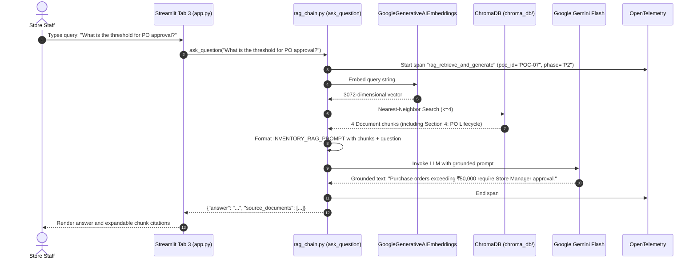

# 📘 05. Retrieval-Augmented Generation (RAG) & LangChain
## Retail Inventory Management & Procurement System (POC-07)

---

## 📌 Document Overview
General-purpose Large Language Models (LLMs) like Google Gemini are exceptionally capable at reasoning, writing code, and summarizing text, but they have a fundamental limitation: **they do not know your company's private operational policies, store formulas, staffing responsibilities, or procurement thresholds**.

This document breaks down the theory, architecture, and code implementation of **Retrieval-Augmented Generation (RAG)** and **LangChain** using the **10-Point Pedagogical Framework**:
1. What is it?
2. Why does it exist?
3. What problem does it solve?
4. How does it normally work?
5. Important concepts & terminology
6. How it differs from related technologies
7. Why it is useful in THIS project
8. Where exactly it is used in THIS codebase
9. Project-specific code example
10. Complete execution flow

---

## 🧠 1. The 10-Point Pedagogical Breakdown of RAG & LangChain

### 1. What is RAG & LangChain?
* **RAG (Retrieval-Augmented Generation)**: An AI architectural pattern that retrieves relevant factual text chunks from an external knowledge base and injects them directly into the LLM's prompt context at query time.
* **LangChain**: An orchestration framework that provides standard abstractions (`Document`, `TextSplitter`, `Embeddings`, `VectorStore`, `Retriever`, `PromptTemplate`, `Chain`) to assemble RAG pipelines without writing low-level vector math.

### 2. Why does it exist?
Pre-trained foundation models have fixed knowledge cutoffs and were trained only on public internet data. They do not possess private enterprise knowledge (such as the 15 SOP policy sections in `src/rag/data/inventory_manual.md`).

### 3. What problem does it solve?
* **Hallucination Elimination**: Without RAG, an LLM invents plausible-sounding answers (e.g. guessing that PO approval requires $10,000). With RAG, the LLM is constrained to answer strictly based on retrieved text chunks (stating the exact **₹50,000** rule).
* **Cost & Speed**: Fine-tuning an LLM costs significant compute and time; RAG provides instant document updates by simply indexing text into a vector store.

### 4. How does it normally work?
RAG operates in two distinct lifecycles:
1. **Ingestion Lifecycle (Offline/Batch)**:
   $$\text{Raw Document} \xrightarrow{\text{Splitter}} \text{Chunks} \xrightarrow{\text{Embedding Model}} \text{Vectors} \xrightarrow{\text{Insert}} \text{Vector DB (ChromaDB)}$$
2. **Query Lifecycle (Runtime)**:
   $$\text{User Query} \xrightarrow{\text{Embed}} \text{Query Vector} \xrightarrow{\text{Cosine/HNSW Search}} \text{Top-}k\text{ Chunks} \xrightarrow{\text{Inject Prompt}} \text{LLM} \xrightarrow{\text{Generate}} \text{Grounded Answer}$$

### 5. Important Concepts & Terminology
* **Embedding**: A translation of text into an array of floating-point numbers in a semantic coordinate space. In this project, `models/gemini-embedding-2` produces **3,072-dimensional vectors**.
* **Vector Database (ChromaDB)**: A specialized database that stores embeddings and performs fast similarity searches using **HNSW (Hierarchical Navigable Small World)** graphs.
* **Text Chunking**: Splitting documents into small, coherent segments (`RecursiveCharacterTextSplitter`, `chunk_size=600`, `chunk_overlap=50`, yielding **21 chunks**).
* **Retriever**: A LangChain component that accepts a query string and returns a list of matching `Document` objects ($k=4$).
* **Chain / RetrievalQA**: A LangChain execution pipeline combining a Retriever, a `PromptTemplate`, and an LLM (`gemini-3.1-flash-lite`).
* **`chain_type="stuff"`**: A LangChain strategy that "stuffs" all retrieved context chunks directly into the prompt template's `{context}` variable.

### 6. How is it different from related technologies?
* **RAG vs Fine-Tuning**: Fine-tuning modifies model weights for tone and style; RAG provides dynamic factual memory without touching model weights.
* **RAG vs ReAct Agent**: RAG is a deterministic one-shot retrieval chain (Query $\to$ Retrieve $\to$ Answer); a ReAct agent is an iterative multi-step reasoning loop that can choose *whether* to call RAG or other API tools.
* **ChromaDB vs SQLite**: SQLite stores structured tabular rows queried with exact SQL; ChromaDB stores unstructured text vectors queried with semantic similarity math.

### 7. Why is it useful in this project?
The retail inventory operations manual (`inventory_manual.md`) defines store SOPs: SKU patterns (`SKU-GRO-NNNN`), safety stock formulas ($Z \times \sigma_L$), the 5 stock movement types, FIFO valuation rules, and the ₹50,000 Store Manager approval rule. RAG enables natural language querying of these rules across the Streamlit UI and the ReAct agent.

### 8. Where exactly is it used in THIS codebase?
* **Ground-Truth Policy Document**: [`src/rag/data/inventory_manual.md`](file:///c:/Users/2mrmi/OneDrive/Documents/github-clone/Agentic-AI-Readiness-Program/src/rag/data/inventory_manual.md)
* **Ingestion & Vector Indexing**: [`src/rag/ingest.py`](file:///c:/Users/2mrmi/OneDrive/Documents/github-clone/Agentic-AI-Readiness-Program/src/rag/ingest.py) (`load_documents`, `split_documents`, `get_embeddings`, `drop_collection`, `build_vectorstore`)
* **Query Pipeline & Tracing**: [`src/rag/rag_chain.py`](file:///c:/Users/2mrmi/OneDrive/Documents/github-clone/Agentic-AI-Readiness-Program/src/rag/rag_chain.py) (`build_rag_chain`, `ask_question`, `get_vectorstore`, `INVENTORY_RAG_PROMPT`)
* **Agent Tool Integration**: [`src/agents/tools.py:254-262`](file:///c:/Users/2mrmi/OneDrive/Documents/github-clone/Agentic-AI-Readiness-Program/src/agents/tools.py#L254-L262) (`rag_knowledge_base` tool)
* **UI Workstation**: [`src/ui/chat_streamlit/app.py`](file:///c:/Users/2mrmi/OneDrive/Documents/github-clone/Agentic-AI-Readiness-Program/src/ui/chat_streamlit/app.py) (Tab 3: "Inventory Manual & SOPs")
* **Verification Smoke Test**: [`scripts/verify_rag.py`](file:///c:/Users/2mrmi/OneDrive/Documents/github-clone/Agentic-AI-Readiness-Program/scripts/verify_rag.py)

### 9. Project-Specific Code Example
From [`src/rag/rag_chain.py:100-117`](file:///c:/Users/2mrmi/OneDrive/Documents/github-clone/Agentic-AI-Readiness-Program/src/rag/rag_chain.py#L100-L117):
```python
def build_rag_chain(persist_dir: str = str(CHROMA_PERSIST_DIR), collection_name: str = COLLECTION_NAME):
    """Construct the LangChain RetrievalQA pipeline over ChromaDB."""
    vectorstore = get_vectorstore(persist_dir=persist_dir, collection_name=collection_name)
    retriever = vectorstore.as_retriever(search_kwargs={"k": 4})
    
    llm = ChatGoogleGenerativeAI(
        model=chat_model(),
        temperature=0.2,
        google_api_key=api_key()
    )
    
    return RetrievalQA.from_chain_type(
        llm=llm,
        chain_type="stuff",
        retriever=retriever,
        return_source_documents=True,
        chain_type_kwargs={"prompt": INVENTORY_RAG_PROMPT}
    )
```

### 10. Complete Execution Flow


---

## ⚠️ 2. The HNSW Duplicate Vector Bug & Idempotency Fix

* **The Issue**: Standard `Chroma.from_documents()` appends to existing collections on disk. Repeated runs of `python -m src.rag.ingest` accumulated 1,323 vectors across 21 chunks.
* **The Root Cause**: Duplicate identical vectors collapsed the HNSW graph into a dense clique, distorting distance metrics and returning identical redundant neighbors.
* **The Fix**: [`src/rag/ingest.py:46-55`](file:///c:/Users/2mrmi/OneDrive/Documents/github-clone/Agentic-AI-Readiness-Program/src/rag/ingest.py#L46-L55) implements `drop_collection()`, deleting the collection prior to re-indexing to ensure an exact, idempotent 21-chunk collection.

---

## 🔍 3. What Sounds Fancy vs What Is Actually Happening

| Concept | What It Sounds Like | What Is Actually Happening in Code |
|---|---|---|
| **"Cognitive Vector Memory Graph"** | A conscious neural memory cluster. | Local files in `chroma_db/` holding 21 lists of 3,072 floating-point numbers. |
| **"Dynamic Semantic Fusion"** | Neural real-time data synthesis. | Inserting 4 paragraphs of text into a `{context}` template string in Python. |
| **"Contextual Hallucination Shield"** | An AI reprogrammed to never make mistakes. | A prompt rule: *"If the information is not available, say: 'I don't have that information in the inventory manual.'"* |

---

## 📖 4. Recommended Reading Order

1. **[`src/model_config.py`](file:///c:/Users/2mrmi/OneDrive/Documents/github-clone/Agentic-AI-Readiness-Program/src/model_config.py)**: See model and API key resolution.
2. **[`src/rag/data/inventory_manual.md`](file:///c:/Users/2mrmi/OneDrive/Documents/github-clone/Agentic-AI-Readiness-Program/src/rag/data/inventory_manual.md)**: Read the ground-truth 15 policy sections.
3. **[`src/rag/ingest.py`](file:///c:/Users/2mrmi/OneDrive/Documents/github-clone/Agentic-AI-Readiness-Program/src/rag/ingest.py)**: Understand markdown splitting, embedding, and idempotent vector persistence.
4. **[`src/rag/rag_chain.py`](file:///c:/Users/2mrmi/OneDrive/Documents/github-clone/Agentic-AI-Readiness-Program/src/rag/rag_chain.py)**: Study `RetrievalQA` pipeline construction, prompts, and OpenTelemetry spans.
5. **[`scripts/verify_rag.py`](file:///c:/Users/2mrmi/OneDrive/Documents/github-clone/Agentic-AI-Readiness-Program/scripts/verify_rag.py)**: See smoke-test verification of in-scope vs out-of-scope queries.
