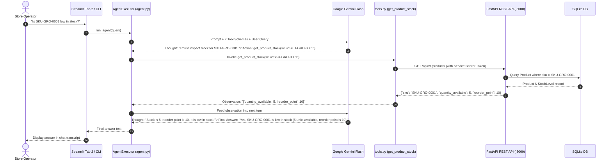

# 📘 06. Autonomous ReAct Agents & Tool Use
## Retail Inventory Management & Procurement System (POC-07)

---

## 📌 Document Overview
While a RAG pipeline (Phase 2) can answer static policy questions, it cannot take action or dynamically reason across multiple live systems. 

**Phase 3** introduces an **Autonomous ReAct Agent** capable of inspecting live product stock, checking supplier lead times, evaluating store policies in the RAG manual, and automatically issuing purchase orders.

This document breaks down the agent architecture using the **10-Point Pedagogical Framework**:
1. What is it?
2. Why does it exist?
3. What problem does it solve?
4. How does it normally work?
5. Important concepts & terminology
6. How it differs from related technologies
7. Why it is useful in THIS project
8. Where exactly it is used in THIS codebase
9. Project-specific code example
10. Complete execution flow

---

## 🤖 1. The 10-Point Pedagogical Breakdown of ReAct Agents & Tools

### 1. What is an Agent & ReAct?
* **Agent**: An AI system where the LLM is given an open-ended goal and a set of callable tools, deciding for itself which tools to invoke and in what order.
* **ReAct (Reasoning + Acting)**: A prompting paradigm where the LLM interleaves verbal reasoning traces (*"Thought: I need to look up the product SKU first"*) with action execution (*"Action: get_product_stock(sku='...')*), reads the tool's output (*"Observation"*), and iterates until it reaches a final answer.

### 2. Why does it exist?
Traditional software requires hardcoded if-else logic for every possible workflow. When a store manager asks an unpredictable, multi-step question (*"Check if our grocery items are low in stock, see who delivers them quickest, and draft an order"*), a static chain cannot adapt dynamically.

### 3. What problem does it solve?
An agent dynamically bridges **live transactional APIs** (FastAPI/SQLite) with **unstructured knowledge bases** (ChromaDB RAG) and **business actions** (raising Purchase Orders) based purely on human language intent.

### 4. How does it normally work?
1. The user provides a goal or query.
2. The agent prompt includes tool names, argument descriptions, and formatting guidelines.
3. The LLM produces a reasoning step (**Thought**) and emits a structured tool call (**Action** with JSON arguments).
4. The execution runtime intercepts the action, runs the real Python function, and returns the result (**Observation**).
5. The observation is appended to the prompt history, and the LLM produces the next thought or the **Final Answer**.

### 5. Important Concepts & Terminology
* **Tool (`@tool`)**: A Python function annotated with metadata and typed arguments that an LLM can invoke.
* **Tool Calling / Function Calling**: The mechanism by which an LLM outputs structured JSON specifying a function name and arguments instead of unstructured prose.
* **`AgentExecutor`**: LangChain's runtime loop that handles calling the LLM, parsing actions, invoking tools, catching exceptions, and enforcing `max_iterations=10`.
* **Structured Chat Agent (`STRUCTURED_CHAT_ZERO_SHOT_REACT_DESCRIPTION`)**: A ReAct variant capable of handling multi-argument tools and complex nested JSON schemas.
* **Context Summarization Middleware (`_summarize_if_long`)**: Intercepts tool outputs exceeding 5 items and compresses them via a LangChain `load_summarize_chain` to prevent LLM context window saturation.

### 6. How is it different from related technologies?
* **Agent vs Chain**: A chain runs a fixed, immutable sequence (A $\to$ B $\to$ C); an agent decides whether to call tool A, tool B, both, or neither.
* **Agent Tool vs Normal Python Function**: A normal function requires programmatic invocation in code; an agent tool is described to an LLM via docstrings and JSON schema so the AI can decide when to run it.
* **ReAct Agent vs Multi-Agent Graph**: A single ReAct agent handles general ad-hoc queries; a multi-agent graph (Phase 5) coordinates multiple specialized agents across a structured state machine.

### 7. Why is it useful in this project?
Store operators can execute complex operations through natural language without navigating multiple UI menus (e.g. checking stock, verifying supplier terms, and raising purchase orders in a single conversation).

### 8. Where exactly is it used in THIS codebase?
* **System Prompt & Tool Documentation**: [`src/agents/prompts.py`](file:///c:/Users/2mrmi/OneDrive/Documents/github-clone/Agentic-AI-Readiness-Program/src/agents/prompts.py) (`INVENTORY_AGENT_SYSTEM_PROMPT`)
* **The 7 Agent Tools**: [`src/agents/tools.py`](file:///c:/Users/2mrmi/OneDrive/Documents/github-clone/Agentic-AI-Readiness-Program/src/agents/tools.py) (`get_product_stock`, `get_low_stock_alerts`, `create_purchase_order`, `get_supplier_info`, `get_supplier_catalog`, `get_dashboard_stats`, `rag_knowledge_base`)
* **Context Summarizer Middleware**: [`src/agents/summarizer.py`](file:///c:/Users/2mrmi/OneDrive/Documents/github-clone/Agentic-AI-Readiness-Program/src/agents/summarizer.py) (`_summarize_if_long`)
* **Agent Engine & Runner**: [`src/agents/agent.py`](file:///c:/Users/2mrmi/OneDrive/Documents/github-clone/Agentic-AI-Readiness-Program/src/agents/agent.py) (`build_agent_executor`, `run_agent`, `AGENT_ERROR_PREFIX`)
* **Streamlit UI Workstation**: [`src/ui/chat_streamlit/app.py`](file:///c:/Users/2mrmi/OneDrive/Documents/github-clone/Agentic-AI-Readiness-Program/src/ui/chat_streamlit/app.py) (Tab 2: "ReAct Reasoning Agent")
* **Interactive Terminal REPL**: [`scripts/agent_cli.py`](file:///c:/Users/2mrmi/OneDrive/Documents/github-clone/Agentic-AI-Readiness-Program/scripts/agent_cli.py)

### 9. Project-Specific Code Example
From [`src/agents/agent.py:40-71`](file:///c:/Users/2mrmi/OneDrive/Documents/github-clone/Agentic-AI-Readiness-Program/src/agents/agent.py#L40-L71):
```python
def build_agent_executor(tools=None, llm=None) -> AgentExecutor:
    """Construct the LangChain Structured Chat ReAct Agent."""
    if tools is None:
        tools = [
            get_product_stock,
            get_low_stock_alerts,
            create_purchase_order,
            get_supplier_info,
            get_supplier_catalog,
            get_dashboard_stats,
            rag_knowledge_base
        ]
    if llm is None:
        llm = get_llm()
    
    return initialize_agent(
        tools=tools,
        llm=llm,
        agent=AgentType.STRUCTURED_CHAT_ZERO_SHOT_REACT_DESCRIPTION,
        verbose=True,
        handle_parsing_errors=True,
        max_iterations=10,
        agent_kwargs={"prefix": INVENTORY_AGENT_SYSTEM_PROMPT}
    )
```

### 10. Complete Execution Flow


---

## 🛠️ 2. Comprehensive Breakdown of the 7 Tools

| Tool Name | Decorated Function | Target Endpoint / Action | Key Safeguards & Features |
|---|---|---|---|
| **`get_product_stock`** | `@tool` | `GET /api/v1/products` | Looks up product details by SKU; returns clean not-found message if SKU does not exist. |
| **`get_low_stock_alerts`** | `@tool` | `GET /api/v1/stock/low-alerts` | Automatically routes lists $> 5$ items to `_summarize_if_long` to prevent LLM context saturation. |
| **`create_purchase_order`** | `@tool` | `POST /api/v1/orders` | Resolves supplier codes to IDs, calculates line items, and posts draft purchase order. |
| **`get_supplier_info`** | `@tool` | `GET /api/v1/suppliers` | Retrieves supplier contact email, payment terms, and lead time in days. |
| **`get_supplier_catalog`** | `@tool` | `GET /api/v1/suppliers/{id}/catalog` | Accepts either vendor code (`SUP-0001`) or integer ID (`1`), formatting a clean catalog list. |
| **`get_dashboard_stats`** | `@tool` | `GET /api/v1/dashboard` | Aggregates store valuation, low stock counts, and open PO counts formatted in Indian Rupees (₹). |
| **`rag_knowledge_base`** | `@tool` | In-process Phase 2 `ask_question()` | Queries ChromaDB policy manual; catches quota errors without crashing agent loop. |

---

## 🔍 3. What Sounds Fancy vs What Is Actually Happening

| Concept | What It Sounds Like | What Is Actually Happening in Code |
|---|---|---|
| **"Autonomous Digital Employee"** | A sentient AI employee making executive retail decisions. | A `while` loop in LangChain that passes strings to Gemini, parses JSON `{ "action": "...", "action_input": {...} }`, executes the Python function, and loops back. |
| **"Neural Context Compressor"** | Deep neural pruning of working memory tensors. | An `if len(data) > 5:` check in `_summarize_if_long()` that runs a basic summarizer chain. |
| **"Multi-Tool Telemetry Mesh"** | Distributed microservice service mesh. | A Python context manager `_tool_span(tool_name)` that starts an OpenTelemetry span and emits a `structlog` JSON line. |

---

## 📖 4. Recommended Reading Order

1. **[`src/agents/prompts.py`](file:///c:/Users/2mrmi/OneDrive/Documents/github-clone/Agentic-AI-Readiness-Program/src/agents/prompts.py)**: Read the ReAct system prompt and formatting instructions.
2. **[`src/agents/summarizer.py`](file:///c:/Users/2mrmi/OneDrive/Documents/github-clone/Agentic-AI-Readiness-Program/src/agents/summarizer.py)**: Study output payload summarization and fallback truncation.
3. **[`src/agents/tools.py`](file:///c:/Users/2mrmi/OneDrive/Documents/github-clone/Agentic-AI-Readiness-Program/src/agents/tools.py)**: Inspect all 7 tools, HTTP service auth integration, and OpenTelemetry spans.
4. **[`src/agents/agent.py`](file:///c:/Users/2mrmi/OneDrive/Documents/github-clone/Agentic-AI-Readiness-Program/src/agents/agent.py)**: Learn how `AgentExecutor` and error handlers are initialized.
5. **[`scripts/agent_cli.py`](file:///c:/Users/2mrmi/OneDrive/Documents/github-clone/Agentic-AI-Readiness-Program/scripts/agent_cli.py)**: Run the interactive terminal REPL for hands-on experimentation.
