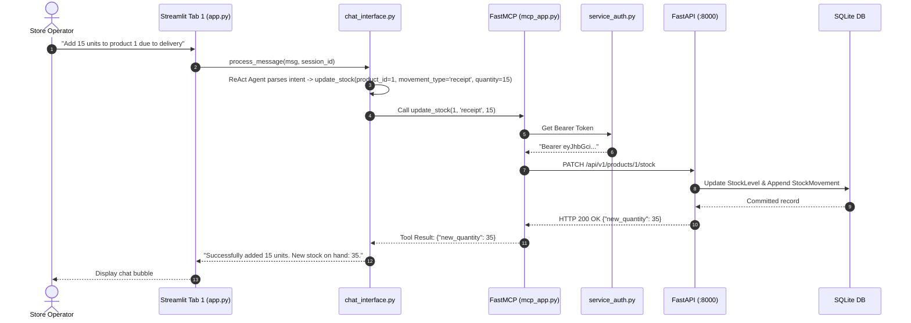

# 📘 07. Model Context Protocol (MCP) & FastMCP
## Retail Inventory Management & Procurement System (POC-07)

---

## 📌 Document Overview
In Phase 3, tools were bound directly inside Python code using LangChain's `@tool` decorator. While functional, this tightly coupled the tools to the LangChain framework.

**Phase 4** introduces the **Model Context Protocol (MCP)** via **FastMCP**, establishing an open standard interface that allows AI models and external developer tools (Claude Desktop, Cursor IDE, Antigravity) to discover and execute inventory operations over standardized communication transports.

This document breaks down MCP and FastMCP using the **10-Point Pedagogical Framework**:
1. What is it?
2. Why does it exist?
3. What problem does it solve?
4. How does it normally work?
5. Important concepts & terminology
6. How it differs from related technologies
7. Why it is useful in THIS project
8. Where exactly it is used in THIS codebase
9. Project-specific code example
10. Complete execution flow

---

## 🌐 1. The 10-Point Pedagogical Breakdown of MCP & FastMCP

### 1. What is MCP & FastMCP?
* **Model Context Protocol (MCP)**: An open-source protocol developed by Anthropic that standardizes how applications expose tools, prompts, and resources to AI models over structured communication transports.
* **FastMCP**: A high-level Python library designed to build MCP servers with minimal boilerplate using Python decorators (`@mcp.tool()`), analogous to FastAPI for web APIs.

### 2. Why does it exist?
Before MCP, every AI framework had its own incompatible way of defining tools (OpenAI function calling, LangChain tools, CrewAI actions). If you built an inventory tool, you had to rewrite it for every AI platform. MCP acts as the **"USB-C standard for AI applications"**.

### 3. What problem does it solve?
MCP completely decouples **tool providers** (the inventory backend) from **tool consumers** (Claude Desktop, Cursor, Streamlit chat, autonomous agents). An MCP tool written once is universally discoverable by any MCP-compliant client without modifying backend code.

### 4. How does it normally work?
1. An **MCP Server** runs and listens on a transport stream (Standard I/O `stdio` or Server-Sent Events `SSE`).
2. An **MCP Client** connects and exchanges a JSON-RPC 2.0 initialization handshake.
3. The server publishes a catalog of available tools with their JSON Schema parameters.
4. When a user asks a question, the client's LLM outputs a tool call.
5. The client transmits a JSON-RPC `tools/call` message; the server executes the tool and sends back the result over the stream.

### 5. Important Concepts & Terminology
* **Transport**: The communication channel between client and server (`stdio` for local process communication, `SSE` for HTTP streaming).
* **Tools (`@mcp.tool()`)**: Executable functions exposed to the LLM that take actions or query data.
* **Resources & Prompts**: Optional MCP primitives for exposing raw data files (`@mcp.resource`) and reusable prompt templates (`@mcp.prompt`). *(Note: This project focuses exclusively on MCP Tools).*
* **JSON-RPC 2.0**: The lightweight remote procedure call specification used for MCP message passing.
* **Service-to-Service Authentication**: Automatic JWT Bearer token generation and caching in [`src/service_auth.py`](file:///c:/Users/2mrmi/OneDrive/Documents/github-clone/Agentic-AI-Readiness-Program/src/service_auth.py) so MCP tools can authenticate with FastAPI.

### 6. How is it different from related technologies?
* **FastAPI vs FastMCP**: FastAPI exposes HTTP REST endpoints for human browsers and web SPAs; FastMCP exposes semantic tool definitions over JSON-RPC for AI models.
* **MCP Tool vs Python Function**: A Python function is tightly bound to in-memory process execution; an MCP tool is published across process boundaries with standardized schema discovery.
* **Phase 3 `@tool` vs Phase 4 `@mcp.tool()`**: Phase 3 tools are proprietary to LangChain; Phase 4 FastMCP tools are open-standard and usable in Claude Desktop, Cursor, or LangChain.

### 7. Why is it useful in this project?
It allows external AI developer tools (Claude Desktop, Cursor, Antigravity) and internal chat interfaces to manage store stock, retrieve supplier catalogs, and raise purchase orders through a standardized protocol.

### 8. Where exactly is it used in THIS codebase?
* **FastMCP Server Definition & 6 Tools**: [`src/mcp_server/mcp_app.py`](file:///c:/Users/2mrmi/OneDrive/Documents/github-clone/Agentic-AI-Readiness-Program/src/mcp_server/mcp_app.py)
* **Standalone Server Entrypoint**: [`src/mcp_server/server.py`](file:///c:/Users/2mrmi/OneDrive/Documents/github-clone/Agentic-AI-Readiness-Program/src/mcp_server/server.py)
* **Service Account Token Manager**: [`src/service_auth.py`](file:///c:/Users/2mrmi/OneDrive/Documents/github-clone/Agentic-AI-Readiness-Program/src/service_auth.py)
* **Chat Interface & Session Manager**: [`src/mcp_server/chat_interface.py`](file:///c:/Users/2mrmi/OneDrive/Documents/github-clone/Agentic-AI-Readiness-Program/src/mcp_server/chat_interface.py)
* **Streamlit UI Workstation**: [`src/ui/chat_streamlit/app.py`](file:///c:/Users/2mrmi/OneDrive/Documents/github-clone/Agentic-AI-Readiness-Program/src/ui/chat_streamlit/app.py) (Tab 1: "FastMCP Operations Chat")

### 9. Project-Specific Code Example
From [`src/mcp_server/mcp_app.py:28, 110-144`](file:///c:/Users/2mrmi/OneDrive/Documents/github-clone/Agentic-AI-Readiness-Program/src/mcp_server/mcp_app.py#L28):
```python
from fastmcp import FastMCP
from src.service_auth import auth_headers

mcp = FastMCP("Inventory Management Server")

@mcp.tool()
def update_stock(product_id: int, movement_type: str, quantity: int, reference_number: str = None, notes: str = None) -> dict:
    """Record stock adjustments (receipt, sale, adjustment) and recompute alerts."""
    with tracer.start_as_current_span("mcp.tool.update_stock"):
        payload = {
            "movement_type": movement_type,
            "quantity": int(quantity),
            "reference_number": reference_number,
            "notes": notes
        }
        resp = _patch(f"/products/{product_id}/stock", json=payload)
        return resp
```

### 10. Complete Execution Flow


---

## ⚡ 2. The 6 Registered FastMCP Tools

| Tool Name | Decorated Function | Target Endpoint | Description |
|---|---|---|---|
| **`update_stock`** | `@mcp.tool()` | `PATCH /products/{id}/stock` | Record stock movement (receipt, sale, adjustment) and recompute alerts. |
| **`create_purchase_order`** | `@mcp.tool()` | `POST /orders` | Create a draft purchase order with vendor and line items. |
| **`get_low_stock_products`** | `@mcp.tool()` | `GET /stock/low-alerts` | List all items at or below reorder threshold. |
| **`get_supplier_catalog`** | `@mcp.tool()` | `GET /suppliers/{id}/catalog` | List all products provided by a specific supplier. |
| **`get_purchase_orders`** | `@mcp.tool()` | `GET /orders` | Filter and list purchase orders by status or supplier. |
| **`get_inventory_dashboard`** | `@mcp.tool()` | `GET /dashboard` | Aggregate store KPIs, total valuation, and alert counts. |

---

## 🔐 3. Service-to-Service Authentication (`src/service_auth.py`)

When the FastMCP server or AI agent tools make HTTP requests to the FastAPI backend, they cannot rely on a browser cookie or manual login screen.

[`src/service_auth.py`](file:///c:/Users/2mrmi/OneDrive/Documents/github-clone/Agentic-AI-Readiness-Program/src/service_auth.py) implements a **Thread-Safe Service Account Token Manager**:
1. **Bootstrap Login**: Calls `POST /api/v1/auth/login` using service account credentials (`admin@retail.com` / `admin`).
2. **Token Caching**: Caches the 24-hour JWT token in memory protected by a `threading.Lock()`.
3. **Automatic Re-Authentication**: If an API call returns `HTTP 401 Unauthorized` (e.g. token expired or server rebooted), `invalidate()` is called to flush the cache and immediately re-authenticate before retrying the operation.

---

## 🔍 4. What Sounds Fancy vs What Is Actually Happening

| Feature | What It Sounds Like | What Is Actually Happening in Code |
|---|---|---|
| **"Universal AI Protocol Bus"** | An enterprise distributed messaging backbone spanning multi-cloud clusters. | A Python script communicating over standard input/output (`sys.stdin` / `sys.stdout`) formatted in JSON-RPC 2.0. |
| **"Autonomous Self-Healing Token Cache"** | Cryptographic key rollover engine. | A simple `threading.Lock()` wrapped around a string variable that calls `/auth/login` if a 401 is received. |
| **"Multi-Turn Context Engine"** | Recursive memory summarization tensor. | A Python list `self.history[-10:]` maintaining the last 10 strings in memory. |

---

## 📖 5. Recommended Reading Order

1. **[`src/service_auth.py`](file:///c:/Users/2mrmi/OneDrive/Documents/github-clone/Agentic-AI-Readiness-Program/src/service_auth.py)**: Understand inter-service authentication and automatic token refresh.
2. **[`src/mcp_server/mcp_app.py`](file:///c:/Users/2mrmi/OneDrive/Documents/github-clone/Agentic-AI-Readiness-Program/src/mcp_server/mcp_app.py)**: Study the 6 FastMCP tool implementations, parameter sanitization (`_parse_id`), and OpenTelemetry tracing.
3. **[`src/mcp_server/server.py`](file:///c:/Users/2mrmi/OneDrive/Documents/github-clone/Agentic-AI-Readiness-Program/src/mcp_server/server.py)**: See the standalone server entrypoint and `get_server_status()` metadata.
4. **[`src/mcp_server/chat_interface.py`](file:///c:/Users/2mrmi/OneDrive/Documents/github-clone/Agentic-AI-Readiness-Program/src/mcp_server/chat_interface.py)**: Learn how FastMCP tools are converted to LangChain `StructuredTool`s and executed inside conversational sessions.
