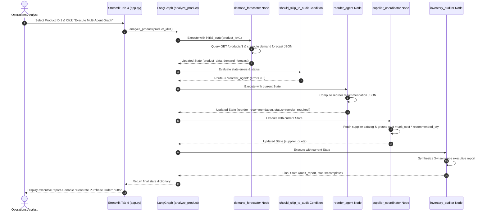
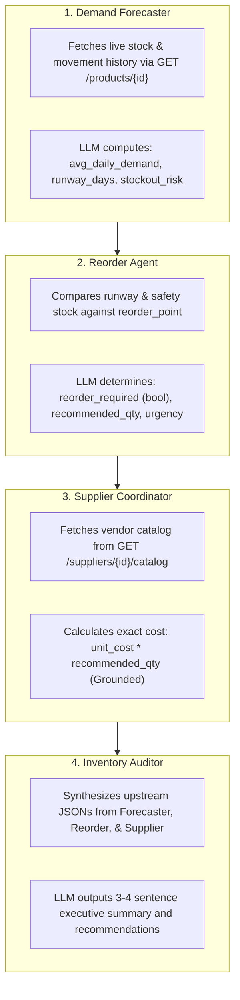

# 📘 08. LangGraph & Multi-Agent StateGraph Workflows
## Retail Inventory Management & Procurement System (POC-07)

---

## 📌 Document Overview
A single monolithic AI agent with 15 tools easily becomes overwhelmed when executing complex, multi-stage analytical tasks. It struggles to balance forecasting math, procurement rules, supplier negotiations, and executive reporting in a single reasoning prompt.

**Phase 5** introduces a **Multi-Agent System** powered by **LangGraph**, decomposing inventory auditing into 4 specialized, autonomous worker agents coordinated by a shared state graph with dynamic supervisor routing.

This document breaks down LangGraph and the multi-agent architecture using the **10-Point Pedagogical Framework**:
1. What is it?
2. Why does it exist?
3. What problem does it solve?
4. How does it normally work?
5. Important concepts & terminology
6. How it differs from related technologies
7. Why it is useful in THIS project
8. Where exactly it is used in THIS codebase
9. Project-specific code example
10. Complete execution flow

---

## 🕸️ 1. The 10-Point Pedagogical Breakdown of LangGraph & Multi-Agent Systems

### 1. What is LangGraph & a Multi-Agent System?
* **Multi-Agent System**: An AI architecture where multiple narrow, role-specialized AI agents collaborate to solve complex multi-step problems.
* **LangGraph**: An orchestration framework by LangChain for building stateful, multi-actor applications as cyclical computation graphs (**StateGraph**), providing fine-grained control over state, transitions, and conditional branching.

### 2. Why does it exist?
Monolithic ReAct agents (like in Phase 3) tend to lose their objective during long, multi-step workflows. They suffer from context window saturation, tool hallucination, and inability to handle branched error paths cleanly.

### 3. What problem does it solve?
It breaks complex retail replenishment analysis into 4 discrete, auditable stages:
1. **Demand Forecaster**: Analyzes sales velocity and stockout risks.
2. **Reorder Agent**: Calculates required replenishment quantities.
3. **Supplier Coordinator**: Gathers grounded vendor quotes.
4. **Inventory Auditor**: Synthesizes executive summaries and generates draft purchase orders.

### 4. How does it normally work?
1. Define a shared state schema (`InventoryAnalysisState` TypedDict).
2. Register agent functions as **Nodes** on a `StateGraph`.
3. Connect nodes with standard sequential **Edges** or conditional routing **Conditional Edges**.
4. Set an **Entry Point** and compile the graph (`graph.compile()`).
5. Invoke the compiled graph with initial state; LangGraph transitions state from node to node until reaching `END`.

### 5. Important Concepts & Terminology
* **StateGraph**: The graph container managing nodes and state schema.
* **State (`InventoryAnalysisState`)**: The shared TypedDict passed immutably between nodes.
* **Node**: A Python function representing an agent step (`demand_forecaster`, `reorder_agent`, `supplier_coordinator`, `inventory_auditor`).
* **Edge**: A deterministic directed link from one node to the next.
* **Conditional Edge / Supervisor Routing**: A dynamic routing function (`should_skip_to_audit`) that inspects state at runtime to choose the next branch.
* **Fact-Grounding Defense**: Overriding LLM hallucinations by calculating prices and supplier codes directly from database records.
* **Structured Output Extraction (`_safe_json`)**: Parsing LLM text responses into typed Python dictionaries by stripping markdown fences.

### 6. How is it different from related technologies?
* **LangGraph vs LangChain Chains**: Chains are linear and unidirectional (A $\to$ B $\to$ C); LangGraph supports arbitrary directed state machines with cycles and conditional branching.
* **Multi-Agent Graph vs Single ReAct Agent**: A ReAct agent is one LLM looping over many tools; a Multi-Agent Graph is multiple specialized LLMs executing structured roles over a shared state dictionary.

### 7. Why is it useful in this project?
Auditing an inventory SKU requires numerical calculation, stock ledger inspection, supplier catalog matching, and executive writing. Dividing this across 4 specialized nodes ensures high accuracy and clean error recovery.

### 8. Where exactly is it used in THIS codebase?
* **State Schema & Factory**: [`src/agents/multi_agent/state.py`](file:///c:/Users/2mrmi/OneDrive/Documents/github-clone/Agentic-AI-Readiness-Program/src/agents/multi_agent/state.py)
* **4 Worker Agents & Helper Logic**: [`src/agents/multi_agent/agents.py`](file:///c:/Users/2mrmi/OneDrive/Documents/github-clone/Agentic-AI-Readiness-Program/src/agents/multi_agent/agents.py)
* **StateGraph Assembly & Supervisor Routing**: [`src/agents/multi_agent/graph.py`](file:///c:/Users/2mrmi/OneDrive/Documents/github-clone/Agentic-AI-Readiness-Program/src/agents/multi_agent/graph.py)
* **Streamlit UI Workstation**: [`src/ui/chat_streamlit/app.py:410-480`](file:///c:/Users/2mrmi/OneDrive/Documents/github-clone/Agentic-AI-Readiness-Program/src/ui/chat_streamlit/app.py#L410-L480) (Tab 4: "Multi-Agent Audit & Replenishment")

### 9. Project-Specific Code Example
From [`src/agents/multi_agent/graph.py:47-75`](file:///c:/Users/2mrmi/OneDrive/Documents/github-clone/Agentic-AI-Readiness-Program/src/agents/multi_agent/graph.py#L47-L75):
```python
def build_inventory_graph():
    """Assemble and compile the Phase 5 LangGraph StateGraph."""
    graph = StateGraph(InventoryAnalysisState)
    
    # Register Nodes
    graph.add_node("demand_forecaster", demand_forecaster)
    graph.add_node("reorder_agent", reorder_agent)
    graph.add_node("supplier_coordinator", supplier_coordinator)
    graph.add_node("inventory_auditor", inventory_auditor)
    
    # Entry Point & Conditional Supervisor Routing
    graph.set_entry_point("demand_forecaster")
    graph.add_conditional_edges(
        "demand_forecaster",
        should_skip_to_audit,
        {
            "reorder_agent": "reorder_agent",
            "inventory_auditor": "inventory_auditor"
        }
    )
    
    # Linear Edges
    graph.add_edge("reorder_agent", "supplier_coordinator")
    graph.add_edge("supplier_coordinator", "inventory_auditor")
    graph.add_edge("inventory_auditor", END)
    
    return graph.compile()
```

### 10. Complete Execution Flow


---

## 📐 2. State Schema & Immutability (`src/agents/multi_agent/state.py`)

All agents in the graph read from and write to a single, structured TypedDict state:

```python
class InventoryAnalysisState(TypedDict):
    product_id: int
    product_data: Dict[str, Any]           # Live DB product & stock details
    demand_forecast: Dict[str, Any]        # Forecasted velocity, runway, stockout risk
    reorder_recommendation: Dict[str, Any] # Quantities, urgency, reason
    supplier_quote: Dict[str, Any]         # Grounded vendor catalog & cost
    audit_report: str                      # Executive Markdown summary
    analysis_status: str                   # 'analyzing' | 'reorder_required' | 'complete' | 'error'
    errors: List[str]                      # Accumulated error messages
    messages: List[str]                    # Human-readable audit log trail
```

* **Functional Immutability**: Nodes do not mutate state in place. Each node receives the current `state`, makes a shallow copy `{**state, ...}`, modifies only its assigned fields, and returns the updated dictionary.

---

## 🤖 3. The 4 Specialized Worker Agents & Grounding



### Fact-Grounding Defense Against Hallucinations
A critical failure in naive multi-agent architectures is the "telephone game" where LLMs invent supplier IDs or change prices. 
`src/agents/multi_agent/agents.py` explicitly **overrides LLM hallucinated data with verified database facts**:
```python
actual_supplier = _fetch_supplier(supplier_id)
actual_cost = round(float(cost_price) * float(recommended_qty), 2)
quote["supplier_id"] = actual_supplier.get("id")
quote["supplier_code"] = actual_supplier.get("supplier_code")
quote["total_cost"] = actual_cost
```

---

## 🚦 4. Supervisor Routing & Error Short-Circuiting

The supervisor condition `should_skip_to_audit` inspects the state after the `demand_forecaster` node. If 3 or more errors have occurred (e.g. backend offline or database corrupt), the pipeline **bypasses the Reorder and Supplier agents entirely** and routes immediately to the `inventory_auditor` to generate an incident report:

```python
def should_skip_to_audit(state: InventoryAnalysisState) -> str:
    """Supervisor routing decision logic."""
    errors = state.get("errors") or []
    status = state.get("analysis_status", "analyzing")
    
    if len(errors) >= 3 or status == "error":
        logger.info("supervisor_routed", route="inventory_auditor", reason="error_threshold_reached")
        return "inventory_auditor"
    
    logger.info("supervisor_routed", route="reorder_agent", reason="normal_flow")
    return "reorder_agent"
```

---

## 🔍 5. What Sounds Fancy vs What Is Actually Happening

| Concept | What It Sounds Like | What Is Actually Happening in Code |
|---|---|---|
| **"Autonomous Agent Society"** | Free-thinking AI agents conversing in natural language and bargaining prices. | Four Python functions executing sequentially, passing a Python dictionary from one to the next. |
| **"AI Executive Supervisor"** | A meta-cognition LLM watching the agents work in real-time. | A 15-line deterministic Python `if-else` condition checking `len(state['errors']) >= 3`. |
| **"Structured Schema Extraction"** | Deep neural JSON parsing. | A regex function `_safe_json()` that strips ` ```json ` markdown fences and calls standard `json.loads()`. |

---

## 📖 6. Recommended Reading Order

1. **[`src/agents/multi_agent/state.py`](file:///c:/Users/2mrmi/OneDrive/Documents/github-clone/Agentic-AI-Readiness-Program/src/agents/multi_agent/state.py)**: Study the 9-field TypedDict schema and default state factory.
2. **[`src/agents/multi_agent/agents.py`](file:///c:/Users/2mrmi/OneDrive/Documents/github-clone/Agentic-AI-Readiness-Program/src/agents/multi_agent/agents.py)**: Inspect each of the 4 worker agent node functions, JSON sanitizers, and database grounding logic.
3. **[`src/agents/multi_agent/graph.py`](file:///c:/Users/2mrmi/OneDrive/Documents/github-clone/Agentic-AI-Readiness-Program/src/agents/multi_agent/graph.py)**: Learn how `StateGraph` is assembled, conditional edges are attached, and the pipeline is compiled and invoked.
4. **[`src/ui/chat_streamlit/app.py:410-480`](file:///c:/Users/2mrmi/OneDrive/Documents/github-clone/Agentic-AI-Readiness-Program/src/ui/chat_streamlit/app.py#L410-L480)**: See how Streamlit Tab 4 executes the graph and renders the audit results with one-click purchase order generation.
