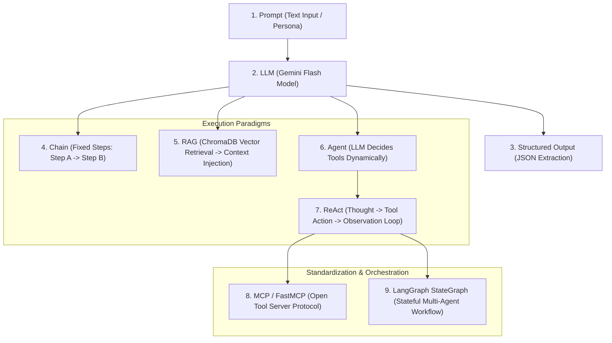
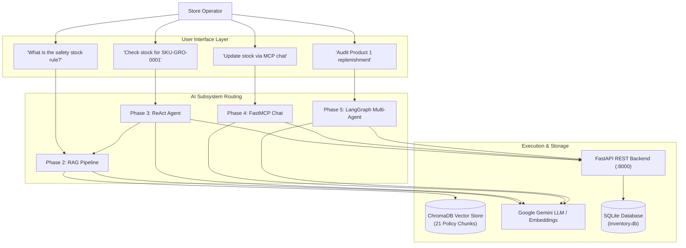

# 📘 09. AI Data Flows & Architectural Comparison
## Retail Inventory Management & Procurement System (POC-07)

---

## 📌 Document Overview
This application integrates four distinct AI paradigms across Phases 2 through 5. Each paradigm serves a specific operational purpose, uses a different execution model, and handles memory and data flow differently.

This document unifies and compares the AI subsystems, providing a taxonomy of AI concepts and mapping data flows across the entire architecture.

---

## 🗺️ 1. Side-by-Side Comparison of the 4 AI Subsystems

| Dimension | Phase 2: RAG Pipeline (`src/rag/`) | Phase 3: ReAct Agent (`src/agents/`) | Phase 4: FastMCP Chat (`src/mcp_server/`) | Phase 5: Multi-Agent Graph (`src/agents/multi_agent/`) |
|---|---|---|---|---|
| **Primary Purpose** | Operational manual & policy lookup | Autonomous multi-step goal reasoning | Standardized tool interaction over open protocol | Complex multi-stage replenishment audit |
| **Execution Model** | Deterministic 1-shot chain (`RetrievalQA`) | Dynamic iterative loop (Reason $\to$ Act $\to$ Observe) | ReAct agent over FastMCP tool registry | Stateful directed graph (`StateGraph`) with conditional edges |
| **Data Source** | ChromaDB Vector Store (`inventory_manual.md`) | Live FastAPI REST API + ChromaDB RAG | Live FastAPI REST API via FastMCP tools | Live FastAPI REST API + Supplier Catalogs |
| **Agent Count** | 0 (Pure retrieval chain) | 1 Monolithic Agent | 1 Chat Agent | 4 Specialized Worker Agents + 1 Supervisor |
| **State / Memory** | Stateless per query | Stateless per query (UI tracks display history) | Sliding window of last 10 messages (`ChatSession`) | Structured TypedDict state (`InventoryAnalysisState`) |
| **Failure Mode** | Returns fallback message | Returns `Error executing query: ...` | Returns clean error dictionary | Short-circuits to Auditor on $\ge 3$ errors |
| **Observability** | OTel span + LangSmith `AI-Readiness-POC-07-P2` | OTel tool spans + structlog `tool_called` | OTel spans + LangSmith `AI-Readiness-POC-07-P4` | OTel spans + LangSmith `AI-Readiness-POC-07-P5` |
| **User Surface** | Streamlit Tab 3 | Streamlit Tab 2 & CLI (`scripts/agent_cli.py`) | Streamlit Tab 1 | Streamlit Tab 4 & Python `analyze_product()` |

---

## 🧩 2. Master Taxonomy of AI Concepts

To understand modern AI systems, you must understand how these core terms relate to each other:

### Definitions in the Context of THIS Codebase:
1. **Prompt**: The instruction string passed to the LLM (e.g. `INVENTORY_AGENT_SYSTEM_PROMPT` or `INVENTORY_RAG_PROMPT`).
2. **LLM**: The core generative model (`gemini-3.1-flash-lite`) resolving embeddings or text tokens.
3. **Tool**: A Python function decorated with `@tool` or `@mcp.tool()` that the LLM can call with JSON arguments (e.g. `get_product_stock`).
4. **Chain**: A hardcoded sequence of operations without autonomous branching (e.g. `RetrievalQA` in `src/rag/rag_chain.py`).
5. **RAG**: Grounding an LLM with external vector embeddings from ChromaDB.
6. **Agent**: An LLM given a goal and a set of tools, allowed to reason and pick tools autonomously.
7. **ReAct**: The specific reasoning loop: *Thought $\to$ Action $\to$ Observation*.
8. **MCP (Model Context Protocol)**: An open standard protocol exposing backend tools to LLMs over stdio/JSON-RPC.
9. **LangGraph / StateGraph**: A stateful graph orchestrating multiple specialized agents working on a shared data dictionary (`InventoryAnalysisState`).

---

## 🔄 3. Complete End-to-End Data Flow Map

---

## 📖 4. When to Use Which Subsystem?

* **Use Phase 2 (RAG)** when the question is purely about **rules, SOPs, roles, or thresholds** (e.g. *"Who is authorized to approve purchase orders over ₹50,000?"*).
* **Use Phase 3 (ReAct Agent)** when a human asks an **ad-hoc operational question** that requires chaining live stock checks with policy manual rules (e.g. *"Is SKU-ELC-0002 below reorder point, and if so, who supplies it?"*).
* **Use Phase 4 (FastMCP)** when connecting **external AI developer tools or standardized clients** (Cursor, Claude Desktop) to perform inventory operations.
* **Use Phase 5 (LangGraph Multi-Agent)** when executing a **structured, mission-critical business workflow** (like end-to-end inventory auditing, demand forecasting, quotation matching, and purchase order drafting).
