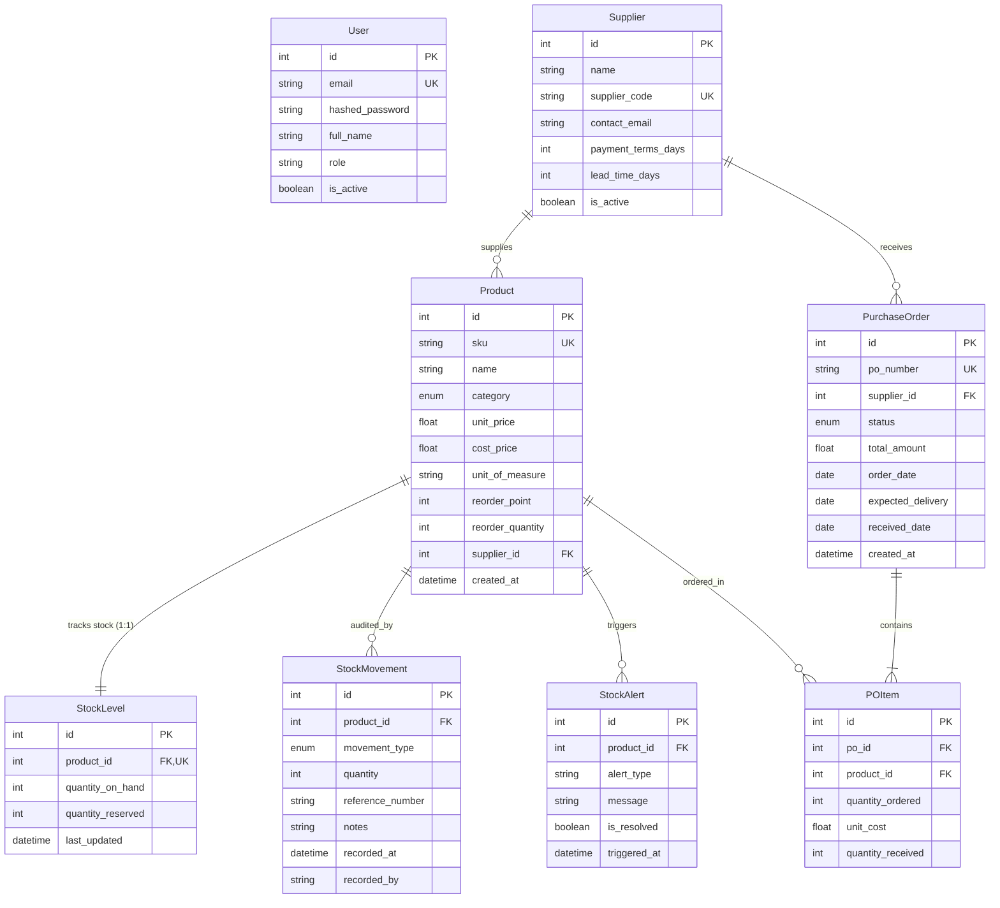

# 📘 10. Database Schema, Invariants & API Flow
## Retail Inventory Management & Procurement System (POC-07)

---

## 📌 Document Overview
The relational persistence layer is the ultimate source of truth for the entire application. Whether an operator records a stock adjustment via the React UI or an AI agent raises a purchase order, the integrity of the store's inventory depends on **SQLAlchemy 2.0 ORM**, **SQLite 3**, and strict **Domain Invariants**.

This document breaks down the database architecture using the **10-Point Pedagogical Framework**:
1. What is it?
2. Why does it exist?
3. What problem does it solve?
4. How does it normally work?
5. Important concepts & terminology
6. How it differs from related technologies
7. Why it is useful in THIS project
8. Where exactly it is used in THIS codebase
9. Project-specific code example
10. Complete execution flow

---

## 🗄️ 1. SQLAlchemy 2.0 & Relational Data Modeling

### 1. What is it?
**SQLAlchemy 2.0** is the standard Python Object Relational Mapper (ORM) and SQL toolkit. It maps Python classes to relational database tables and Python class instances to database rows.

### 2. Why does it exist?
Writing raw SQL strings (`SELECT * FROM products WHERE ...`) scattered across dozens of API routes is error-prone, vulnerable to SQL injection attacks, lacks type safety, and makes schema migrations difficult.

### 3. What problem does it solve?
SQLAlchemy provides an object-oriented Python abstraction over SQL. It manages connection pooling, relationship cascades, unit-of-work transactions, and dialect abstraction (allowing SQLite for local development and PostgreSQL for production).

### 4. How does it normally work?
1. Classes inherit from `DeclarativeBase` ([`src/backend/database.py:35`](file:///c:/Users/2mrmi/OneDrive/Documents/github-clone/Agentic-AI-Readiness-Program/src/backend/database.py#L35)).
2. Attributes are defined using `Column(Integer, ...)` or `mapped_column()`.
3. Relationships (`relationship()`) link tables via foreign keys (`ForeignKey`).
4. Database queries are executed through an active `Session` object (`db.query(Product).filter(...)`).
5. Changes are committed atomically with `db.commit()`.

---

## 🗺️ 2. The 8 Relational Database Tables (ER Diagram)

### Table Relationships & Cascades:
* **Product $\longleftrightarrow$ StockLevel**: Strict **1-to-1** relationship (`product_id` is unique on `stock_levels`).
* **Cascade Rules**: Parent aggregates use `cascade="all, delete-orphan"`. Deleting a Product automatically cleans up its associated `StockLevel`, `StockMovement` history, and active `StockAlert` records.
* **SQLite PRAGMA Enforcement**: SQLite disables foreign key checks by default. [`src/backend/database.py:25-30`](file:///c:/Users/2mrmi/OneDrive/Documents/github-clone/Agentic-AI-Readiness-Program/src/backend/database.py#L25-L30) registers an engine connect listener that automatically executes `PRAGMA foreign_keys=ON`.

---

## ⚖️ 3. Critical Domain Invariants & Business Logic

### Invariant 1: The Negative Stock Invariant
* **Definition**: In [`src/backend/models.py:108-122`](file:///c:/Users/2mrmi/OneDrive/Documents/github-clone/Agentic-AI-Readiness-Program/src/backend/models.py#L108-L122), working stock availability is defined as:
  $$\text{quantity\_available} = \text{quantity\_on\_hand} - \text{quantity\_reserved}$$
* **The Invariant**: This subtraction is **deliberately NOT clamped at zero** (`max(0, ...)` is explicitly avoided).
* **Why?** Section 15 of `inventory_manual.md` defines negative stock as a real, recoverable physical warehouse state (caused by theft, unrecorded shrinkage, or over-allocation). If negative stock is clamped to `0`, the warehouse operator cannot see the discrepancy, and total inventory monetary valuation silently goes negative without explanation.

### Invariant 2: Stock Movement Accounting Sign Conventions
All changes to physical inventory must pass through `StockMovement` with strictly enforced signs:
* `receipt` ($> 0$): Deliveries from suppliers.
* `sale` ($< 0$): Customer sales.
* `adjustment` ($+ / -$): Physical cycle count corrections.
* `transfer` ($+ / -$): Store relocations.
* `return` ($> 0$): Customer item returns.
* *Enforcement*: Pydantic validator `StockMovementCreate.check_quantity_sign` rejects zero quantities or mismatched signs with HTTP 422 before touching the database.

### Invariant 3: Collision-Free Identifier Sequencing (`_next_sequence`)
* SKUs follow format `SKU-{PREFIX}-{NNNN}` (e.g. `SKU-GRO-0001`).
* Purchase Orders follow format `PO-{YEAR}-{NNNN}` (e.g. `PO-2026-0001`).
* Rather than using `count() + 1` (which collides if rows are deleted), `_next_sequence()` scans the actual maximum integer suffix present in the database and assigns the next highest slot.

### Invariant 4: Purchase Order Receiving Atomicity (`receive_purchase_order`)
When a delivery is received:
1. PO status is updated to `received` with today's date.
2. For every line item, `StockLevel.quantity_on_hand` is incremented.
3. A `StockMovement` row (type: `receipt`) is appended with reference number set to the PO number.
4. `check_stock_alerts()` is executed. If stock recovered above `reorder_point`, existing unresolved alerts are marked `is_resolved = True`.
5. All operations are committed in a single atomic database transaction.

---

## 🔄 4. Relational Database vs Vector Database Comparison

| Dimension | Relational Database (SQLite / `inventory.db`) | Vector Database (ChromaDB / `chroma_db/`) |
|---|---|---|
| **Data Structure** | Structured tabular rows, columns, foreign keys | Unstructured text chunks + 3072-dimensional embedding arrays |
| **Primary Query Type** | Exact match SQL (`WHERE sku = 'SKU-GRO-0001'`) | Approximate Nearest Neighbor vector search (Cosine / HNSW) |
| **Data Managed** | Live operational records (Products, Stock, POs, Users) | Policy manuals, SOP guidelines, staffing procedures |
| **Transactions** | ACID transactional safety (`commit()`, `rollback()`) | Read-heavy, batch-indexed collection querying |
| **Integrity** | Foreign keys, unique constraints, check constraints | Vector distance thresholds |

---

## 🔍 5. What Sounds Fancy vs What Is Actually Happening

| Concept | What It Sounds Like | What Is Actually Happening in Code |
|---|---|---|
| **"Enterprise Master Data Warehouse"** | Multi-terabyte distributed Oracle or Snowflake cluster. | A single local file `inventory.db` on disk managed by SQLite 3. |
| **"Automated Ledger Settlement Engine"** | Financial double-entry blockchain ledger. | An `INSERT INTO stock_movements ...` statement executed in Python. |
| **"Self-Healing Reorder Sentinel"** | Autonomous background daemon monitoring store shelves. | A synchronous Python function `check_stock_alerts()` executed whenever stock updates. |

---

## 📖 6. Recommended Reading Order

To master the database architecture and API data flow:

1. **[`src/backend/database.py`](file:///c:/Users/2mrmi/OneDrive/Documents/github-clone/Agentic-AI-Readiness-Program/src/backend/database.py)**:
   - *Why*: Study the SQLite engine configuration, absolute path resolution, and `PRAGMA foreign_keys=ON` event hook.
2. **[`src/backend/models.py`](file:///c:/Users/2mrmi/OneDrive/Documents/github-clone/Agentic-AI-Readiness-Program/src/backend/models.py)**:
   - *Why*: Read the complete definitions of the 8 ORM models, relationships, and the `quantity_available` unclamped property.
3. **[`src/backend/services/inventory_service.py`](file:///c:/Users/2mrmi/OneDrive/Documents/github-clone/Agentic-AI-Readiness-Program/src/backend/services/inventory_service.py)**:
   - *Why*: Master the core domain rules (`generate_sku`, `generate_po_number`, `receive_purchase_order`, `check_stock_alerts`).
4. **[`src/backend/routers/inventory.py`](file:///c:/Users/2mrmi/OneDrive/Documents/github-clone/Agentic-AI-Readiness-Program/src/backend/routers/inventory.py)**:
   - *Why*: See how every REST route interacts with SQLAlchemy sessions and inventory services.
