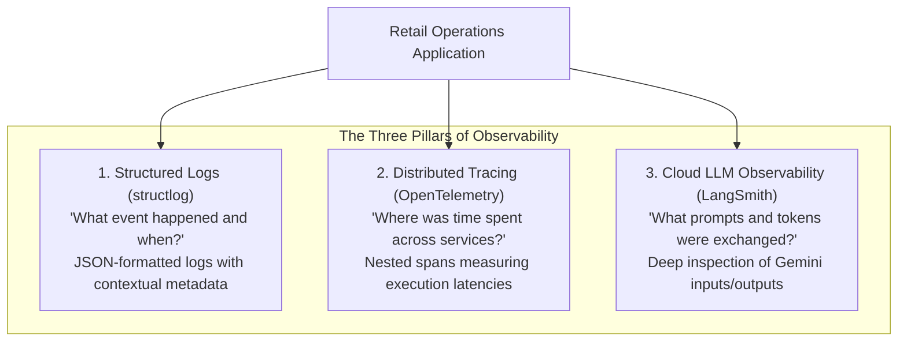

# 📘 11. Observability, Telemetry & Application Security
## Retail Inventory Management & Procurement System (POC-07)

---

## 📌 Document Overview
Production enterprise systems require deep visibility into performance, errors, and security events. When an AI agent executes a multi-step purchase order or a RAG query takes 4 seconds, operators need to know **where time was spent, which tool was invoked, and whether security boundaries were respected**.

This application implements three complementary pillars of **Observability** alongside strict **Application Security**:
1. **Structured JSON Logging** with `structlog`
2. **Distributed Tracing** with `OpenTelemetry`
3. **LLM Chain Monitoring** with `LangSmith`
4. **Role-Based Access Control & Service Auth** with JWT (`HS256`)

This document breaks down observability and security using the **10-Point Pedagogical Framework**:
1. What is it?
2. Why does it exist?
3. What problem does it solve?
4. How does it normally work?
5. Important concepts & terminology
6. How it differs from related technologies
7. Why it is useful in THIS project
8. Where exactly it is used in THIS codebase
9. Project-specific code example
10. Complete execution flow

---

## 📊 1. The Three Pillars of Observability



### Comparative Observability Matrix

| Tool | Primary Purpose | Key Metadata Logged | Output Location | Configuration File |
|---|---|---|---|---|
| **`structlog`** | Structured JSON log events | `poc_id="POC-07"`, `phase="P1".."P5"`, `user_email`, `duration_ms` | `stdout` / Container console | [`src/backend/logging_config.py`](file:///c:/Users/2mrmi/OneDrive/Documents/github-clone/Agentic-AI-Readiness-Program/src/backend/logging_config.py) |
| **`OpenTelemetry`** | Latency profiling & span tracking | `tool_<name>`, `rag_retrieve_and_generate`, `mcp.tool.<name>`, `graph.execute` | In-memory spans / OTel collectors | `src/agents/tools.py`, `src/rag/rag_chain.py`, `src/mcp_server/mcp_app.py`, `src/agents/multi_agent/graph.py` |
| **`LangSmith`** | LLM prompt/token cloud tracing | Projects: `AI-Readiness-POC-07-P2`, `AI-Readiness-POC-07-P4`, `AI-Readiness-POC-07-P5` | LangSmith Cloud Dashboard | Activated via `LANGCHAIN_API_KEY` in `.env` |

---

## 📝 2. Structured Logging with Structlog (`src/backend/logging_config.py`)

### What is Structured Logging?
Unstructured logging writes plain text strings (`print("User logged in")`). Searching millions of plain-text lines in production is slow and impossible to index by field. 

**Structured logging** writes every log entry as a standardized JSON object with key-value fields:
```json
{
  "event": "http_request_completed",
  "poc_id": "POC-07",
  "phase": "P1",
  "method": "POST",
  "path": "/api/v1/orders",
  "status_code": 201,
  "duration_ms": 18.4,
  "timestamp": "2026-08-23T17:15:30.123456Z"
}
```

### Logging Configuration in Code:
```python
structlog.configure(
    processors=[
        structlog.contextvars.merge_contextvars,
        structlog.stdlib.add_logger_name,
        structlog.stdlib.add_log_level,
        structlog.processors.TimeStamper(fmt="iso"),
        structlog.processors.JSONRenderer(sort_keys=True)
    ],
    logger_factory=structlog.stdlib.LoggerFactory(),
)
```

---

## ⏱️ 3. Distributed Tracing with OpenTelemetry

OpenTelemetry (OTel) allows measuring the precise elapsed duration of individual steps inside an agentic pipeline.

### OTel Spans in This Project:
1. **Phase 2 (RAG)**: `rag_retrieve_and_generate` span measures the ~4-second duration of ChromaDB vector search + Gemini generation.
2. **Phase 3 (ReAct Tools)**: `_tool_span(tool_name)` wraps every tool execution, tagging `poc_id="POC-07"`, `phase="P3"`, and `tool=tool_name`.
3. **Phase 4 (FastMCP)**: Spans `mcp.tool.update_stock`, `mcp.tool.create_purchase_order`, etc.
4. **Phase 5 (LangGraph)**: Spans `graph.execute`, `supervisor.route`, and `agent.{name}.activate` across worker nodes.

---

## 🔐 4. Application Security Architecture

### 1. JSON Web Tokens (JWT HS256)
* Every request to `/api/v1/*` (except public health checks) requires an `Authorization: Bearer <token>` header.
* Tokens are signed using HMAC-SHA256 with `SECRET_KEY`.
* Payload contains: `sub` (user email), `role` (`manager` or `staff`), and `exp` (24-hour expiry).

### 2. Password Hashing (Passlib & PBKDF2)
* Passwords are never stored in plain text.
* [`src/backend/routers/auth.py:36`](file:///c:/Users/2mrmi/OneDrive/Documents/github-clone/Agentic-AI-Readiness-Program/src/backend/routers/auth.py#L36) uses `CryptContext(schemes=["pbkdf2_sha256", "bcrypt"], deprecated="auto")`.
* A legacy fallback (`LegacyPasswordHasher`) ensures backward compatibility with HMAC-SHA256 hashes.

### 3. Role-Based Access Control (RBAC)
* `/api/v1/auth/register` restricts self-registration to `role="staff"`.
* Creating a `manager` account requires an active `manager` bearer token, preventing unauthorized privilege escalation.

### 4. Service Account Token Cache (`src/service_auth.py`)
* AI tools and FastMCP servers authenticate using service account credentials.
* Tokens are cached in-memory with automatic refresh on HTTP 401.

---

## ⚠️ 5. Critical Security & Credential Hygiene Notices

> [!WARNING]
> **Change Default Passwords and Secrets in Production**
> The values `SECRET_KEY="secret-key-poc-07-inventory-management-2026"`, `DEFAULT_ADMIN_PASSWORD="admin"`, and `SERVICE_ACCOUNT_PASSWORD="admin"` are built-in defaults intended **only for local development**. In any production deployment, you **must** set strong secrets via environment variables.

> [!CAUTION]
> **Historical Git Credential Advisory**
> During earlier historical development phases, API keys were present in tracked `.env` files. While all live keys have been completely removed from the current working tree, **removing files from the current working tree does not invalidate historical Git commits**.
> 
> **Action Required**: The administrator should revoke and rotate all historical API keys in Google AI Studio and SonarQube.

---

## 🔍 6. What Sounds Fancy vs What Is Actually Happening

| Concept | What It Sounds Like | What Is Actually Happening in Code |
|---|---|---|
| **"Unified Observability Mesh"** | An enterprise distributed Datadog/Dynatrace cluster. | A JSON logger (`structlog`) printing to the console and Python context managers creating OpenTelemetry span objects in RAM. |
| **"Zero-Trust Service Boundary"** | Service mesh with mutual TLS (mTLS) and hardware security modules (HSM). | Python `requests.get()` sending `Authorization: Bearer <jwt>` generated from a shared local password. |
| **"Cryptographic Tamper-Proof Audit Vault"** | Blockchain ledger recording inventory state. | A standard SQLite table `stock_movements` with `INSERT` permissions and no `UPDATE` routes exposed in the API. |

---

## 📖 7. Recommended Reading Order

To master observability and security in this codebase:

1. **[`src/backend/logging_config.py`](file:///c:/Users/2mrmi/OneDrive/Documents/github-clone/Agentic-AI-Readiness-Program/src/backend/logging_config.py)**:
   - *Why*: Study the structlog JSON processor pipeline.
2. **[`src/backend/routers/auth.py`](file:///c:/Users/2mrmi/OneDrive/Documents/github-clone/Agentic-AI-Readiness-Program/src/backend/routers/auth.py)**:
   - *Why*: Master password hashing, JWT creation, and the `get_current_user` dependency.
3. **[`src/service_auth.py`](file:///c:/Users/2mrmi/OneDrive/Documents/github-clone/Agentic-AI-Readiness-Program/src/service_auth.py)**:
   - *Why*: Learn how backend tools authenticate over HTTP with thread-safe token caching.
4. **[`docs/program/OBSERVABILITY_GUIDE.md`](file:///c:/Users/2mrmi/OneDrive/Documents/github-clone/Agentic-AI-Readiness-Program/docs/program/OBSERVABILITY_GUIDE.md)**:
   - *Why*: Read the original program specification for telemetry attributes and test cases.
