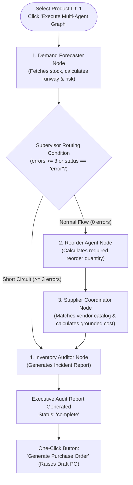

# 📘 12. Project Walkthrough, Master Glossary & Reality Check
## Retail Inventory Management & Procurement System (POC-07)

---

## 📌 Document Overview
This final document ties together every concept, technology, and architectural layer in the project. It provides:
1. **5 End-to-End Practical Workflow Traces** (following a request from human input to database write to UI display).
2. **Comprehensive Master Glossary** (defining 30+ technical terms simply and in the context of this project).
3. **"What is Actually Happening vs What Sounds Fancy" Master Reality Check Matrix**.

---

## 🚶 1. End-to-End Practical Workflow Traces

### Workflow A: ReAct Agent Low Stock Query ("Which products are low in stock?")

```mermaid
sequenceDiagram
    autonumber
    actor User as Warehouse Operator
    participant UI as Streamlit Tab 2 (app.py)
    participant Agent as AgentExecutor (agent.py)
    participant LLM as Google Gemini Flash
    participant Tool as get_low_stock_alerts (tools.py)
    participant Auth as service_auth.py
    participant API as FastAPI GET /stock/low-alerts
    participant DB as SQLite DB

    User->>UI: Types query: "Which products are low in stock?"
    UI->>Agent: run_agent(query, agent_executor)
    Agent->>LLM: Prompt + 7 Tool Schemas + User Query
    LLM-->>Agent: Action: get_low_stock_alerts()
    Agent->>Tool: Execute get_low_stock_alerts()
    Tool->>Auth: Get Bearer Token
    Auth-->>Tool: "Bearer eyJhbGciOi..."
    Tool->>API: HTTP GET /api/v1/stock/low-alerts
    API->>DB: Query Product joined with StockLevel WHERE available <= reorder_point
    DB-->>API: 2 Records: [SKU-GRO-0001 (5 left), SKU-ELC-0002 (2 left)]
    API-->>Tool: JSON ProductListResponse Array
    Tool-->>Agent: Observation String: "SKU-GRO-0001: 5 left; SKU-ELC-0002: 2 left"
    Agent->>LLM: Feed Observation into next ReAct turn
    LLM-->>Agent: Final Answer: "There are 2 products low in stock..."
    Agent-->>UI: Output string
    UI-->>User: Render formatted markdown response in chat transcript
```

1. **Where request starts**: User types the natural language prompt into Streamlit Tab 2 input box.
2. **Component receiving it**: `src/ui/chat_streamlit/app.py` passes the query to `src/agents/agent.py:run_agent()`.
3. **LLM involvement**: Yes. `gemini-3.1-flash-lite` parses the prompt against `INVENTORY_AGENT_SYSTEM_PROMPT`.
4. **Agent reasoning**: The model recognizes it needs live inventory data, choosing `get_low_stock_alerts`.
5. **Tool selected**: `src/agents/tools.py:get_low_stock_alerts()`.
6. **API called**: `_send()` executes `GET /api/v1/stock/low-alerts` with `Authorization: Bearer <service_token>`.
7. **Database queried**: `src/backend/routers/inventory.py` queries `Product` and `StockLevel` in SQLite.
8. **What comes back**: JSON array of products where `quantity_available <= reorder_point`.
9. **Final answer generation**: Gemini receives the tool observation and synthesizes a friendly markdown list with INR values.
10. **Where displayed**: Streamlit Tab 2 displays the response and logs the interaction to session history.

---

### Workflow B: Recording a Stock Movement via React SPA

1. **Operator Action**: In the React SPA ([`http://localhost:3000`](http://localhost:3000)), the operator clicks "Record Stock Movement" on Product 1 and submits:
   ```json
   { "movement_type": "receipt", "quantity": 25, "reference_number": "DEL-9921", "notes": "Morning Delivery" }
   ```
2. **Client Dispatch**: `src/ui/web_react/src/App.jsx` sends `PATCH /api/v1/products/1/stock` with the user's JWT Bearer token in the header.
3. **Pydantic Validation**: `src/backend/schemas.py:StockMovementCreate` verifies that `quantity == 25 > 0` for `movement_type == "receipt"`.
4. **Database Transaction**:
   - `src/backend/routers/inventory.py` loads `Product(id=1)` and associated `StockLevel`.
   - `StockLevel.quantity_on_hand` is incremented by `+25`.
   - A new `StockMovement` row is inserted with `recorded_by=current_user.full_name`.
5. **Alert Evaluation**: `check_stock_alerts()` evaluates new working stock. If stock is now above `reorder_point`, existing unresolved alerts for this SKU are marked `is_resolved = True`.
6. **Logging & Response**: `structlog` emits `stock_updated` event, and the API returns `HTTP 200 OK` with `StockMovementResponse`.
7. **UI Refresh**: React receives the response, closes the modal, and executes `fetchData()` to refresh the dashboard counters and product tables.

---

### Workflow C: Policy Manual Retrieval via RAG (Streamlit Tab 3)

1. **Operator Query**: *"What happens if a purchase order exceeds ₹50,000?"*
2. **Execution**: `src/rag/rag_chain.py:ask_question(query)` is invoked.
3. **Vector Embedding**: Google Generative AI Embeddings (`models/gemini-embedding-2`) converts the question into a 3072-dimensional query vector.
4. **ChromaDB Search**: ChromaDB performs cosine similarity search against the 21 chunks in the `inventory_manual` collection, retrieving top-$k=4$ chunks (specifically Section 4: Purchase Order Lifecycle and Approval Limits).
5. **Prompt Assembly**: The 4 chunks are injected into `{context}` in `INVENTORY_RAG_PROMPT`.
6. **LLM Generation**: Gemini Flash reads the grounded context and responds: *"Purchase orders exceeding ₹50,000 require explicit authorization by the Store Manager before being submitted to suppliers."*
7. **UI Presentation**: Streamlit Tab 3 renders the grounded answer along with expandable citation blocks showing the exact source text chunks retrieved from `inventory_manual.md`.

---

### Workflow D: FastMCP Stock Adjustment via Chat (Streamlit Tab 1)

1. **User Message**: *"Add 10 units to product 2 because of a return."*
2. **Chat Agent**: `src/mcp_server/chat_interface.py` receives the turn in `ChatSession`.
3. **MCP Tool Execution**: ReAct agent identifies the action and calls `mcp_app.py:update_stock(product_id=2, movement_type='return', quantity=10)`.
4. **ID Sanitization**: `_parse_id(2)` validates and normalizes the product ID.
5. **API Invocation**: `mcp_app.py` calls `PATCH /api/v1/products/2/stock` using service authentication headers.
6. **Backend Processing**: FastAPI records the return movement and commits to SQLite.
7. **Agent Observation**: Tool returns `{"movement_id": 14, "product_id": 2, "new_quantity": 42}`.
8. **Chat Output**: Agent responds: *"Successfully recorded a return of 10 units for product 2. The new stock on hand is 42 units."*

---

### Workflow E: Multi-Agent Replenishment Pipeline (Streamlit Tab 4)



---

## 📚 2. Master Glossary of Technical Terminology

| Term | Simple Definition (General) | Project-Specific Meaning (POC-07) |
|---|---|---|
| **Agent** | An autonomous AI program that uses tools to achieve a goal. | A LangChain or FastMCP ReAct executor reasoning over inventory APIs. |
| **API** | An Application Programming Interface for system communication. | The FastAPI backend exposing 12 REST endpoints on port 8000. |
| **ASGI** | Modern asynchronous Python web server specification. | The interface powering FastAPI and Uvicorn. |
| **Authentication** | Verifying the identity of a user or service. | JWT (`HS256`) bearer tokens signed with `SECRET_KEY`. |
| **Chain** | A hardcoded sequence of LLM steps without dynamic tool choice. | LangChain `RetrievalQA` pipeline querying ChromaDB in Phase 2. |
| **ChromaDB** | An open-source vector database for embeddings. | The local database storing 21 chunks of `inventory_manual.md`. |
| **Conditional Edge** | A branch in a state graph that decides the next node at runtime. | `should_skip_to_audit` routing to `reorder_agent` or `inventory_auditor`. |
| **Context Window** | The maximum token capacity an LLM can process in one prompt. | Gemini Flash's token limit, protected by `_summarize_if_long`. |
| **Embedding** | A mathematical array of numbers capturing semantic meaning. | 3072-dimensional vectors generated by `gemini-embedding-2`. |
| **FastMCP** | A lightweight Python framework for Model Context Protocol servers. | The server in `src/mcp_server/mcp_app.py` exposing 6 inventory tools. |
| **Hallucination** | When an LLM invents false facts with high confidence. | Prevented by fact-grounding supplier costs directly against SQLite records. |
| **HNSW** | Hierarchical Navigable Small World vector search graph. | ChromaDB's indexing algorithm for logarithmic-time vector similarity search. |
| **Idempotency** | An operation that produces the same result if executed multiple times. | Maintained in RAG by calling `drop_collection()` before indexing. |
| **JWT** | JSON Web Token, a signed, compact URL-safe credential format. | Bearer tokens containing `{ "sub": "admin@retail.com", "role": "manager" }`. |
| **LangChain** | A popular framework for composing LLM pipelines and tools. | Used for `RetrievalQA`, `StructuredChat`, and `AgentExecutor`. |
| **LangGraph** | A framework for building stateful, multi-agent cyclical graphs. | The state machine in `src/agents/multi_agent/` coordinating 4 worker nodes. |
| **LangSmith** | A cloud platform for tracing and debugging LLM prompt pipelines. | Cloud tracing under projects `AI-Readiness-POC-07-P{2,4,5}`. |
| **MCP** | Model Context Protocol, an open standard for AI tools. | Standardized protocol allowing Claude Desktop or Cursor to manage store stock. |
| **Node** | A single execution step or agent function in a LangGraph graph. | `demand_forecaster`, `reorder_agent`, `supplier_coordinator`, `inventory_auditor`. |
| **OpenTelemetry** | An open standard for distributed tracing and performance metrics. | Spans measuring tool execution times (`tool_<name>`) and RAG latencies. |
| **ORM** | Object-Relational Mapping (translating database rows to Python objects). | SQLAlchemy 2.0 mapping `Product`, `StockLevel`, and `PurchaseOrder`. |
| **Pydantic** | A data parsing and validation library powered by Rust. | Pydantic v2 schemas in `src/backend/schemas.py`. |
| **RAG** | Retrieval-Augmented Generation (retrieving facts to ground LLMs). | Injecting `inventory_manual.md` chunks into Gemini prompts. |
| **ReAct** | Reasoning + Acting loop (Thought $\to$ Tool Action $\to$ Observation). | The decision loop driving Phase 3 and Phase 4 chat agents. |
| **Retriever** | A component that accepts a query string and returns relevant documents. | ChromaDB retriever configured with `k=4`. |
| **SKU** | Stock Keeping Unit, a unique product code. | Formatted as `SKU-{PREFIX}-{NNNN}` (e.g. `SKU-GRO-0001`). |
| **SPA** | Single Page Application (web UI running in browser). | React 18 + Vite frontend running on port 3000. |
| **Span** | A single timed segment of execution in a distributed trace. | An OpenTelemetry span measuring a single tool call duration. |
| **StateGraph** | A state machine graph representation in LangGraph. | `graph = StateGraph(InventoryAnalysisState)` in `graph.py`. |
| **Structlog** | A Python library for structured JSON logging. | JSON event logger tagging `poc_id="POC-07"` and `phase="P1".."P5"`. |
| **Supervisor** | A routing controller deciding the path through an agent graph. | `should_skip_to_audit()` routing based on accumulated state errors. |
| **Tool** | A function exposed to an LLM with a typed JSON input schema. | Functions like `get_product_stock` and `update_stock`. |
| **TypedDict** | A Python dictionary type hint with fixed, typed keys. | `InventoryAnalysisState` in `src/agents/multi_agent/state.py`. |
| **Vector Store** | A database specialized for storing and searching vector embeddings. | ChromaDB instance persisted at `chroma_db/`. |

---

## 🔍 3. Reality Check: What Is Actually Happening vs What Sounds Fancy

| Buzzword / Fancy Phrase | What People Imagine It Does | What It ACTUALLY Does in This Codebase |
|---|---|---|
| **"Autonomous AI Agent Society"** | Self-aware digital entities debating inventory strategy. | 4 Python functions executed in sequence, passing a Python dictionary from one to the next. |
| **"Cognitive Vector Memory Neural Mesh"** | A brain-like persistent memory cluster. | 21 text chunks and float arrays saved in local files under `chroma_db/`. |
| **"Self-Healing Reorder Sentinel"** | Machine learning daemons watching store cameras. | A standard `if quantity_available <= reorder_point:` check in Python. |
| **"Enterprise AI Supervisor"** | An executive meta-LLM constantly watching workers. | A 15-line deterministic Python function `should_skip_to_audit()` checking `len(state['errors']) >= 3`. |
| **"Zero-Trust Cloud Mesh"** | Multi-region mutual TLS certificate authority. | A local JWT string signed with `SECRET_KEY` validated by FastAPI. |

---

## 🎓 4. Summary: You Now Understand the Entire Codebase

You now have a complete, conceptual, and architectural understanding of:
1. **The Retail Domain**: SKUs, stock movement accounting signs, negative stock invariants, and PO approvals.
2. **The Backend**: FastAPI routing, dependency injection (`get_db`, `get_current_user`), Pydantic validation, and SQLite persistence.
3. **The Frontends**: React 18 SPA operator dashboard and Streamlit 4-tab AI assistant.
4. **The AI Spectrum**:
   - RAG (Phase 2): Grounded policy retrieval over ChromaDB.
   - ReAct Agent (Phase 3): Autonomous reasoning over live REST APIs and RAG.
   - FastMCP (Phase 4): Standardized open tool interfaces with service authentication.
   - LangGraph (Phase 5): Multi-agent state machines with supervisor short-circuiting.
5. **Observability & Security**: Structured JSON logging (`structlog`), distributed tracing (`OpenTelemetry`), cloud monitoring (`LangSmith`), and JWT RBAC.

You are now fully equipped to read, modify, and extend any module in this repository with confidence!
