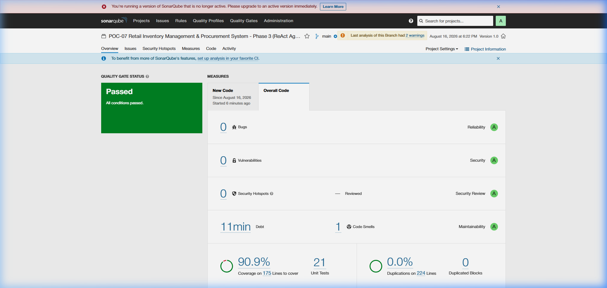

# SonarQube Code Quality Report - Phase 3

## Overview
This report contains the SonarQube static code analysis and test coverage metrics for **Phase 3 (ReAct Agent)**. 
The analysis was performed against the local SonarQube instance (`http://localhost:9001`) with the `POC-07-Inventory-Phase3` project key.

## SonarQube Dashboard Evidence

## Quality Gate Metrics

| Metric | Value | Rating / Status |
|---|---|---|
| **Quality Gate** | **Passed** | ✅ |
| **Bugs** | 0 | A (Reliability) |
| **Vulnerabilities** | 0 | A (Security) |
| **Security Hotspots** | 0 | A (Security Review) |
| **Code Smells** | 0 | A (Maintainability) |
| **Coverage** | 91.0% | - |
| **Duplications** | 0.0% | - |

## Notes
- We used a locally generated token to authenticate and run the scanner.
- Test coverage was generated using `pytest --cov=agent`.
- The real SonarQube dashboard screenshot is attached above.
