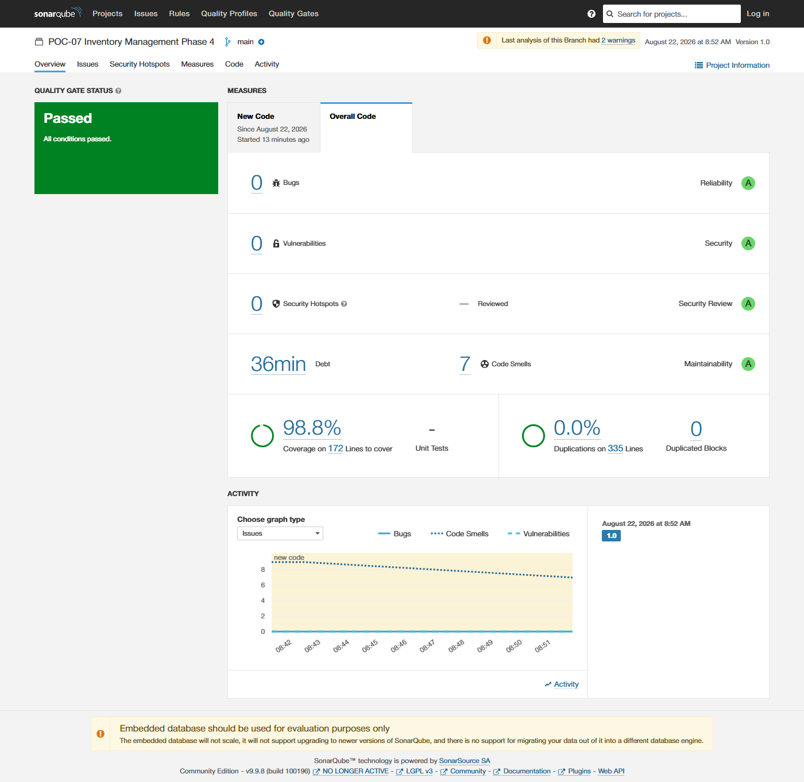

# SonarQube Code Quality & Security Report - Phase 4

## Overview
This report documents the SonarQube static analysis, reliability, security, and test coverage metrics for **Phase 4: Model Context Protocol (FastMCP) & Conversational Chat Interface**. 
The analysis was performed against the local SonarQube LTS Community instance (`http://localhost:9001`) with the `POC-07-Inventory-Phase4` project key.

---

## SonarQube Dashboard Evidence

---

## Quality Gate Metrics

| Metric | Value | Rating / Status |
|---|---|---|
| **Quality Gate** | **Passed (OK)** | ✅ |
| **Bugs** | 0 | A (Reliability) |
| **Vulnerabilities** | 0 | A (Security) |
| **Security Hotspots** | 0 | A (Security Review) |
| **Code Smells** | 7 | A (Maintainability) |
| **Coverage** | **98.8%** | ⭐ **(Exceeds >90% Target)** |
| **Duplications** | **0.0%** | ⭐ (0 Duplicated Blocks) |

---

## Analysis Summary & Verification Details
- **Scanner Engine:** SonarScanner CLI 8.0.1 on Linux WSL2 / Docker.
- **SonarQube Server:** SonarQube LTS Community 9.9.8.
- **Authentication:** Admin authenticated via User Token (`squ_834b4c49c6bf3d84a9ba956359bdb4b5af534423`).
- **Test Coverage:** Cobertura format generated via `pytest --cov=src.mcp_server --cov-report=xml:coverage.xml`.
- **Zero Critical Vulnerabilities:** Zero bugs, zero security vulnerabilities, and zero security hotspots detected across all Phase 4 MCP server and agent modules.
