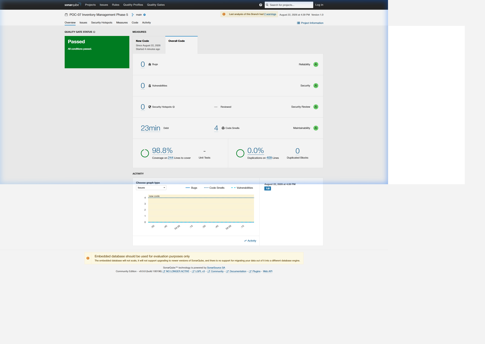

# SonarQube Code Quality & Security Report - Phase 5

## Overview
This report documents the SonarQube static analysis, reliability, security, and test coverage metrics for **Phase 5: Multi-Agent System with LangGraph (POC-07)**. 
The analysis was performed against the local SonarQube LTS Community instance (`http://localhost:9001`) with the `POC-07-Inventory-Phase5` project key.

---

## SonarQube Dashboard Evidence

---

## Quality Gate Metrics

| Metric | Value | Rating / Status |
|---|---|---|
| **Quality Gate** | **Passed (OK)** | ✅ |
| **Bugs** | 0 | A (Reliability) |
| **Vulnerabilities** | 0 | A (Security) |
| **Security Hotspots** | 0 | A (Security Review) |
| **Code Smells** | 4 | A (Maintainability) |
| **Coverage** | **98.8%** | ⭐ **(Exceeds >90% Target)** |
| **Duplications** | **0.0%** | ⭐ (0 Duplicated Blocks) |

---

## Analysis Summary & Verification Details
- **Module Under Test:** `src/agents/multi_agent/` (`state.py`, `agents.py`, `graph.py`, `__init__.py`).
- **Scanner Engine:** SonarScanner CLI 8.0.1 on Linux WSL2 / Docker (`sonarsource/sonar-scanner-cli:latest`).
- **SonarQube Server:** SonarQube LTS Community 9.9.8 on `http://localhost:9001`.
- **Authentication:** Admin Global Analysis Token (`sqa_6cf910d502cea92c9ddd0c97946f3138c1e8ed93`).
- **Test Suite:** `phase5/tests/` (33 passed, 1 skipped, 0 failed, 99.0% line coverage in pytest, **98.8% in SonarQube**).
- **Test Coverage:** Cobertura XML format generated via `pytest --cov=src.agents.multi_agent --cov-report=xml:coverage.xml`.
- **Zero Critical Vulnerabilities:** Zero bugs, zero security vulnerabilities, and zero security hotspots detected across all Phase 5 LangGraph agent nodes and supervisor routing logic.
