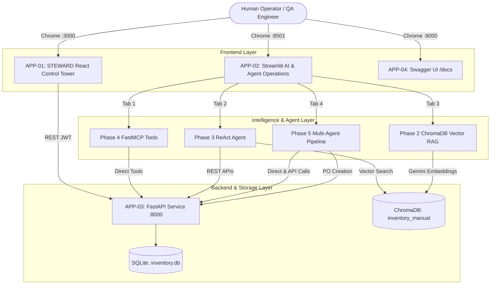

# STEWARD / POC-07 — Complete Repository Application Inventory

> **Inventory Date:** 2026-08-30  
> **Repository:** `Agentic-AI-Readiness-Program` (POC-07 Retail Inventory Management & Autonomous Replenishment Platform)  
> **Environment:** Windows 11 / Node 22 / Python 3.12 / Google Chrome  

---

## 1. Executive Summary of Discovered Applications

A comprehensive repository-wide audit was conducted across all files, configuration files, directories, Docker Compose definitions, launcher scripts, package manifests, and test suites.

The repository contains **3 primary running application services**, **1 interactive API interface**, and **2 supporting backend/CLI tools**:

| App ID | Application Name | Category | Primary Port | URL | Framework / Technology |
|:---|:---|:---:|:---:|:---:|:---|
| **APP-01** | STEWARD Operator SPA (Control Tower) | User-Facing Web App | `3000` | `http://localhost:3000` | React 18, Vite, React Router 6, Vanilla CSS |
| **APP-02** | Retail AI & Agent Operations Platform | User-Facing AI App | `8501` | `http://localhost:8501` | Streamlit, LangChain, FastMCP, LangGraph |
| **APP-03** | FastAPI REST Backend Service | Backend & API UI | `8000` | `http://localhost:8000` | FastAPI, Uvicorn, SQLite (`inventory.db`) |
| **APP-04** | FastAPI Interactive API Docs (Swagger / ReDoc) | Developer / Admin UI | `8000` | `http://localhost:8000/docs` | OpenAPI 3.0, Swagger UI, ReDoc |
| **TOOL-01** | FastMCP Protocol Server | Standalone Backend Tool | `stdio` | `mcp://local` | Python FastMCP, SQLite Tools |
| **TOOL-02** | ReAct Agent Command-Line Interface | Internal Utility CLI | CLI | Terminal | Python `scripts/agent_cli.py` |

---

## 2. Detailed Application Records

### APP-01: STEWARD Operator Single Page Application (Control Tower & Operations)
- **APPLICATION ID:** `APP-01`
- **APPLICATION NAME:** STEWARD Operator Web UI
- **PURPOSE:** Primary enterprise operator console for autonomous retail inventory replenishment, anomaly signal monitoring, three-door approval governance, catalog browsing, supplier evaluation, physical goods dock intake, decision audit lineage, value proof metrics, and simulation scenario testing.
- **FRAMEWORK:** React 18, Vite, React Router v6, Lucide Icons, Custom Design Tokens CSS.
- **ENTRY POINT:** `src/ui/web_react/src/App.jsx`
- **START COMMAND:** `npm run dev` in `src/ui/web_react` (or `python start_app.py`)
- **PORT:** `3000`
- **URL:** `http://localhost:3000`
- **DEPENDENCIES:** Node.js, React 18, Vite, `inventory.db` via FastAPI.
- **AUTHENTICATION:** JWT Bearer token via `POST /api/v1/auth/login` (Supported roles: `manager`, `staff`).
- **TARGET USERS:** Retail Store Managers, Inventory Operators, Supply Chain Analysts, Procurement Officers.
- **KNOWN ROUTES:**
  - `/login`: Authentication screen.
  - `/tower`: Flagship Autonomous Control Tower, Horizon Flow, Railway Track.
  - `/signals`: Signals Anomaly Inbox.
  - `/signals/:signalId`: Deep Signal Investigation with ProvenanceMark & EvidenceBlock.
  - `/approvals`: Governance Approvals Queue.
  - `/approvals/:approvalId`: Three Doors Approval Panel (§10 quote, counter-proposal, rejection modal).
  - `/inventory`: Master Inventory Catalog & Stock Adjustment.
  - `/inventory/:sku`: Product Detail, Stock Movement Ledger, Velocity metrics.
  - `/suppliers`: Suppliers Directory & Performance Scorecards.
  - `/suppliers/:supplierId`: Detailed Supplier Scorecard & Catalog.
  - `/receiving`: Dock Receiving Queue.
  - `/receiving/:poNumber`: PO Receipt Entry with backdating & partial intake.
  - `/decisions`: Immutable Decision Governance Ledger.
  - `/decisions/:decisionId`: Decision Audit Trail, Policy Citations, Run Telemetry.
  - `/impact`: Value Proof, Capital Efficiency & Operational Metrics.
  - `/settings/autonomy`: Autonomy Dial & Financial Threshold Guardrails.
  - `/settings/scenarios`: Operational Simulation Harness (Scenarios 01–06).
- **KNOWN WORKFLOWS:**
  - Emergency STOP kill switch activation.
  - 3-door approval action: Direct Approval, Counter-Proposal adjustment, Rejection with rationale.
  - Stock receipt recording with supplier lead-time drift updates.
  - Live autonomy mode switching (`autonomous`, `assisted`, `shadow`, `off`).
- **BACKEND DEPENDENCIES:** `http://localhost:8000/api/v1`
- **STATUS:** Active, Tested, Operational.

---

### APP-02: Retail AI & Agent Operations Platform (Streamlit Conversational & Multi-Agent Dashboard)
- **APPLICATION ID:** `APP-02`
- **APPLICATION NAME:** Retail AI Operations & Multi-Agent Platform
- **PURPOSE:** Conversational AI, standard operating procedure document retrieval (RAG), ReAct reasoning agent loop, and LangGraph 4-agent autonomous replenishment pipeline with purchase order creation.
- **FRAMEWORK:** Streamlit, LangChain, Google GenAI SDK (Gemini 2.0 Flash / 2.5 Flash Lite), ChromaDB, FastMCP, LangGraph.
- **ENTRY POINT:** `src/ui/chat_streamlit/app.py`
- **START COMMAND:** `streamlit run src/ui/chat_streamlit/app.py --server.port 8501` (or `python start_app.py`)
- **PORT:** `8501`
- **URL:** `http://localhost:8501`
- **DEPENDENCIES:** Python 3.12, Streamlit, LangChain, ChromaDB (`chroma_db/inventory_manual`), FastMCP, FastAPI backend (`http://localhost:8000`).
- **AUTHENTICATION:** Service Account authentication against FastAPI (`SERVICE_ACCOUNT_EMAIL=admin@retail.com`).
- **TARGET USERS:** Procurement Planners, Operations Managers, Supply Chain AI Specialists.
- **KNOWN TABS & MODULES:**
  - **Tab 1: 🤖 Operations Chat Agent (Phase 4 FastMCP):** Conversational database querying, low stock alert detection, supplier catalog lookups, and draft purchase order generation using 6 FastMCP tools.
  - **Tab 2: 🧠 Reasoning Agent (Phase 3 ReAct):** Multi-step ReAct agent combining 6 live REST database tools with vector search over the inventory manual.
  - **Tab 3: 📖 Inventory Manual & SOPs (Phase 2 RAG):** ChromaDB vector retrieval using Gemini embeddings to answer standard operating procedures and inventory manual questions with chunk citations.
  - **Tab 4: 🕸️ Multi-Agent Orchestrator (Phase 5 LangGraph):** End-to-end 4-agent pipeline (Demand Forecaster, Reorder Agent, Supplier Coordinator, Inventory Auditor) that audits products, estimates stockout risk, quotes vendors, generates executive audit reports, and features an interactive **"Act on this recommendation"** button to dispatch real Purchase Orders directly to `inventory.db`.
- **KNOWN WORKFLOWS:**
  - Preset quick action triggers ("Health Dashboard", "Low Stock Alerts", "Open POs", "Supplier 1 Catalog").
  - Policy cross-referencing ("Check a SKU against policy", "Total inventory value").
  - Multi-agent product audit execution and draft PO creation.
  - Session state reset.
- **BACKEND DEPENDENCIES:** `http://localhost:8000/api/v1`, `chroma_db/`, Gemini API / LLM provider.
- **STATUS:** Active, Running on Port 8501.

---

### APP-03: FastAPI REST Backend Engine
- **APPLICATION ID:** `APP-03`
- **APPLICATION NAME:** Retail Inventory REST Backend Engine
- **PURPOSE:** Core transactional data engine providing business logic, database persistence (`inventory.db`), authentication, simulation runner, autonomy policies, and telemetry.
- **FRAMEWORK:** FastAPI, Uvicorn, SQLAlchemy, SQLite, Pydantic v2.
- **ENTRY POINT:** `src/backend/main.py`
- **START COMMAND:** `python -m uvicorn src.backend.main:app --host 0.0.0.0 --port 8000` (or `python start_app.py`)
- **PORT:** `8000`
- **URL:** `http://localhost:8000`
- **DEPENDENCIES:** Python 3.12, SQLite (`inventory.db`), Structlog.
- **AUTHENTICATION:** OAuth2 Password Bearer (`/api/v1/auth/login`), JWT access tokens.
- **TARGET USERS:** Machine Clients, Frontend SPAs, Streamlit Dashboard, MCP Client.
- **KNOWN API MODULES:**
  - `/health`: System health probe.
  - `/api/v1/auth`: Token issuance & validation.
  - `/api/v1/products`: Product catalog & stock levels.
  - `/api/v1/stock`: Stock movement adjustments & PO intake receipt.
  - `/api/v1/orders`: Purchase order generation, listing, details.
  - `/api/v1/suppliers`: Supplier directory, ratings, and catalogs.
  - `/api/v1/dashboard`: High-level operational metrics.
  - `/api/signals`: Signal detection and anomaly records.
  - `/api/approvals`: Approval queue, approval/rejection mutations.
  - `/api/decisions`: Governance audit log & telemetry.
  - `/api/autonomy`: Autonomy mode & threshold policies.
  - `/api/simulation`: Scenario injector & synthetic time clock.
- **BACKEND DEPENDENCIES:** `inventory.db`
- **STATUS:** Active, Running on Port 8000.

---

### APP-04: FastAPI Interactive Documentation (Swagger UI & ReDoc)
- **APPLICATION ID:** `APP-04`
- **APPLICATION NAME:** FastAPI Swagger & ReDoc UI
- **PURPOSE:** Interactive browser-based API testing and exploration console for developers, administrators, and testing agents.
- **FRAMEWORK:** OpenAPI 3.0, Swagger UI, ReDoc.
- **ENTRY POINT:** Auto-generated by FastAPI at `/docs` and `/redoc`.
- **START COMMAND:** Included with APP-03.
- **PORT:** `8000`
- **URL:** `http://localhost:8000/docs` | `http://localhost:8000/redoc`
- **DEPENDENCIES:** FastAPI backend.
- **AUTHENTICATION:** Authorize modal accepting Bearer token.
- **TARGET USERS:** Developers, QA Engineers, System Administrators.
- **STATUS:** Active, Accessible via Chrome.

---

## 3. Supporting Tools & CLI Utilities (Internal / Non-Browser)

| Tool ID | Name | Path | Execution Model | Browser QA Suitability | Reason |
|:---|:---|:---|:---:|:---:|:---|
| **TOOL-01** | FastMCP stdio Server | `src/mcp_server/server.py` | CLI / stdio Protocol | **Excluded from Browser QA** | Headless stdio JSON-RPC server designed for external MCP clients (Cursor, Claude Desktop); its capabilities are surfaced in APP-02 (Streamlit Tab 1). |
| **TOOL-02** | ReAct Agent CLI | `scripts/agent_cli.py` | Terminal CLI | **Excluded from Browser QA** | Terminal-only interactive REPL; its identical underlying agent engine (`src/agents/agent.py`) is surfaced in APP-02 (Streamlit Tab 2). |
| **TOOL-03** | Runtime Audit Runner | `scripts/runtime_audit_runner.py` | Batch Python Script | **Excluded from Browser QA** | Headless automated verification script. |
| **TOOL-04** | SonarQube Scanner | `sonar-project.properties` | Docker / CI Profile | **Excluded from Browser QA** | Developer code quality scanner profile; not an application feature. |

---

## 4. Cross-Application Topology & Boundary Flows

