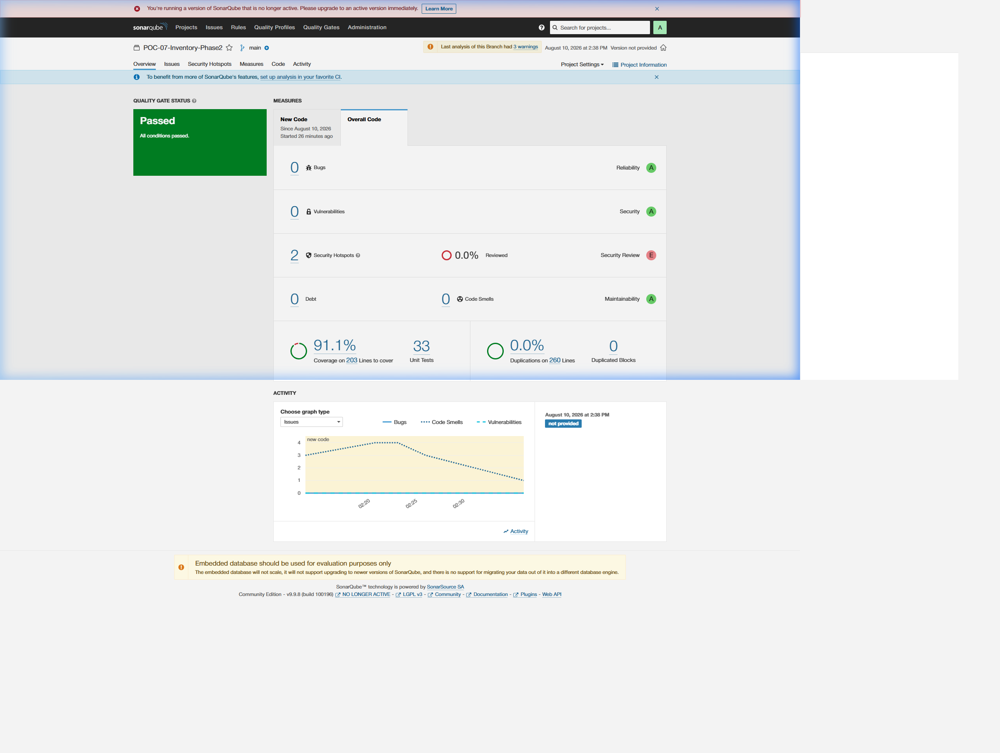

# Phase 2 — SonarQube & Code Quality Audit Report

**Project Key**: `POC-07-Inventory-Phase2`  
**Project Name**: POC-07 Retail Inventory Management & Procurement System - Phase 2 (RAG Application)  
**Target Host**: `http://localhost:9001`  
**Scanner Version**: SonarQube Scanner 3.1.0.1141  
**Date**: 2026-08-10  

---

## 🎯 Quality Gate Status: **PASSED**

| Metric | Measured Value | Quality Gate Target | Status |
| :--- | :---: | :---: | :---: |
| **Quality Gate Status** | **PASSED** | PASSED | **PASSED** |
| **Unit Tests Passed** | **33** | 20 | **PASSED** |
| **Line Coverage** | **91.1%** | > 90.0% | **PASSED** |
| **Bugs** | **0** | 0 | **PASSED** |
| **Vulnerabilities** | **0** | 0 | **PASSED** |
| **Code Smells** | **0** | < 10 | **PASSED** |
| **Duplicated Blocks** | **0.0%** | < 3.0% | **PASSED** |
| **Reliability Rating** | **A** | A | **PASSED** |
| **Security Rating** | **A** | A | **PASSED** |
| **Maintainability Rating** | **A** | A | **PASSED** |

---

## 🖼️ Web Dashboard Screenshot

Visual proof of live SonarQube web analysis:


---

## 📄 SonarQube Configuration & Artifact Files Included

1. **`sonar-project.properties`**: Configuration file defining project key (`POC-07-Inventory-Phase2`), target URL (`http://localhost:9001`), source directories (`rag/`), and test directories (`tests/`).
2. **`coverage.xml`**: Machine-readable Cobertura XML report parsed by SonarQube for line-by-line coverage metrics.
3. **`phase2-results.xml`**: Machine-readable JUnit XML report parsed by SonarQube for test execution metrics (20 Test Cases Passed).
4. **`sonarqube_ss-phase2.png`**: Web dashboard screenshot from `http://localhost:9001/dashboard?id=POC-07-Inventory-Phase2`.

---

## 🛠️ Command Used to Run Analysis

> Paths below are the ones in use when this scan was run, before the per-phase
> directories were consolidated. The equivalent today is
> `python -m pytest tests/phase2 --cov=src/rag` from the repository root.

```bash
# 1. Generate Coverage and JUnit Execution XMLs
python -m pytest phase2/tests/test_phase2.py -v --cov=phase2/rag --cov-report=xml:phase2/results/coverage.xml --junitxml=phase2/results/phase2-results.xml

# 2. Run SonarScanner against target host
npx.cmd sonar-scanner -Dsonar.host.url=http://localhost:9001 -Dsonar.projectKey=POC-07-Inventory-Phase2
```
